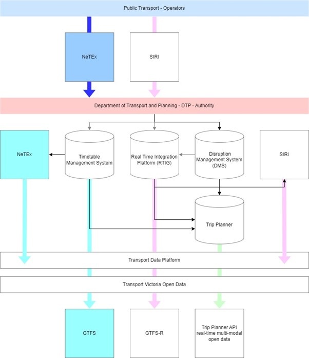

## Use cases

The Department of Transport and Planning, located in the state of Victoria, Australia, is working on implementing NeTEx/GTFS for static data and SIRI/GTFS-R for real-time data. Currently, efforts are focused on obtaining endorsement for the technical specification documents related to NeTEx, GTFS, SIRI, and GTFS-R.

In addition, the process of formalizing data change notifications to operators for each of these standards is underway, and the data information requirements document is being finalized. This document will define the high-level roles and responsibilities between operators and the State.

### Description

The state of Victoria has several modes of public transport which include train, tram and bus. They run in metropolitan areas of the city of Melbourne. Also, in regional towns in the state of Victoria.

To date, a vast majority of contracts that have been entered into between the Victoria State Government either are missing data exchange clauses or are limited in their application and are only suitable for single use cases. This has resulted in limited and inconsistent quality of data.

To ensure the Victoria State Government has an endorsed position relating to Public Transport (PT) data exchange standards governing how data is exchanged across the public transport eco-system.

### Architecture

#### Future state

The diagram below is the planned target architecture for static and real-time public transport data. 

### Implementation

The State Government are working with Operators to embed these data standards into the contractual agreements for modes such as train, tram and bus.

The Department has managed to export NeTEx files from their development environments using the current timetable management system.

GTFS data is currently being published out to third party apps like Google maps, and to the open data market. The Department are currently adding new data configurations based on MobilityData’s framework.

With SIRI and GTFS-R data they are currently being developed in a Proof of Concept (PoC).

### Outcome

The expected results are a richer, consistent, and more accurate quality of public transport data.
