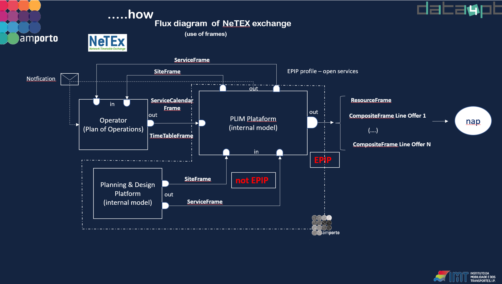

## Overview in the National Level

In Portugal, AMP (Metropolitan Area of Porto) is working with native NeTEx, and it is anticipated that other PTAs will soon adopt and use it as well. AMP has extensively utilized the validator, while TML (Metropolitan Transport of Lisbon) and Carris (one of the largest PTOs in Portugal) have also employed it to validate some NeTEx information.

Regarding the use of the NAP, the number of users has been growing considerably, and the available information is highly diverse. It encompasses public transportation (both roadway and railway), electric charging points, Zones of Conditional Automobile Access (UVAR), loading and unloading zones, scooter parks, parking lots, taxi ranks, bus lanes, passenger drop-off and pick-up zones, bicycle parking, motorcycle parks, cycle paths, and other related information.

## Use cases

### Description

The Metropolitan Area of Porto covers 2,041 km², with a population of 1.76 million, including 76,000 university students, which represents 20% of Portugal's university population. As a Transport Authority, responsibilities include overseeing bus services operated by private companies, which covers:

  - Planning (routes, interconnections, frequencies, coverage, etc.)
  - Establishing ticketing, fees, pricing, and regulations
  - Managing contracts
  - Handling payments related to contractual obligations (bonuses/penalties)
  - Providing public information (indirectly, to other public or private entities that are better positioned to integrate the information)

To meet these requirements, the exchange of detailed information is essential. NeTEx has been chosen for data exchange between stakeholders due to its advantages:

  - Comprehensive coverage of all transport system areas
  - Object-oriented data model
  - Version control mechanisms
  - Supports transmission as both payload and file
  - Compliant with the Portuguese NAP standard (IMT)
  - A fully recognized European standard since 2006

### Architecture

The platform is designed as a collection of microservices, with information exchange between specialized applications managed through NeTEx. This architecture allows for the replacement of any application with a commercial, internal, or open-source solution, provided that it supports exporting or importing data in the NeTEx format. 

### Use cases

PLIM is the name of the platform where all internal information is communicated using NeTEx. It produces NeTEx, GTFS, SIRI, and GTFS-feed formats for dissemination to National Access Points (NAP).

### Outcome

Netex will be seen as the base for information sharing as long as it covers all the aspects of the organisation needs. Potential extensions might be considered.

In the future, it is hoped that comprehensive transport information will be available through NeTEx and SIRI via collaborative sharing. This information will enable companies and individual projects to develop applications that address global needs or specific interests.
