*You can check the online version or download the pdf version [TUTORIAL-Part1-3: 2016](../../docs/assets/files/TUTORIAL-Part1-3-v0.2-1.pdf). Note that the pdf includes also other two tutorials also available in online version ([Public Transport Network EN12896 – 2](https://mockuptm.itforpt.be/index.php/network-description-tutorial/) and  [Timing Information and Vehicle Scheduling EN12896 – 3](https://mockuptm.itforpt.be/index.php/timing-information-tutorial/)).*

# Tutorial: Common concepts

## Versions

How is the evolution of data taken into account?

The concept of VERSION is used for this. A VERSION is a group of operational data instances which share the same VALIDITY CONDITIONs. A version belongs to a unique VERSION FRAME and is characterised by a unique TYPE OF VERSION (which is a classification of VERSIONs.  E.g shareability of ENTITies between several versions).

A VERSION FRAME is a set of VERSIONS referring to a same DATA SOURCE and belonging to the same TYPE OF FRAME. A FRAME may be restricted by VALIDITY CONDITIONs.

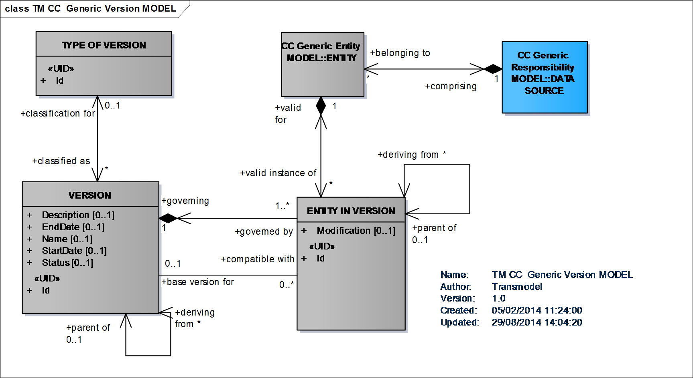

Generic Version Model 

What granularity of evolution is represented?

VERSIONS refer to data instances, as an ENTITY is defined as any data instance to be managed in an operational Version Management System. When several data sources coexist (multimodality and/or interoperability), an ENTITY has to be related to a given DATA SOURCE in which it is defined.

However, records of attribute changes may also be managed as shown in the diagram below, where DELTA is a  record of the detailed changes of a given ENTITY IN VERSION from one VERSION to the next one.  A DELTA contains pairs of attributes’ old values – new values.

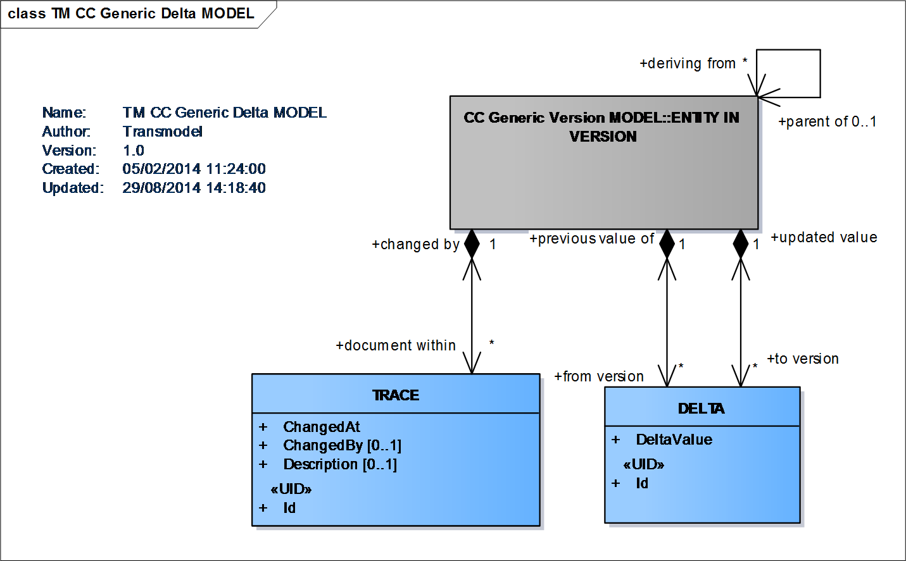

Generic Delta Model 

## Validity Conditions

What types of validity conditions are modelled?

A VALIDITY CONDITION  is a condition used in order to characterise a given VERSION of a VERSION FRAME. A VALIDITY CONDITION consists of a parameter (an ENTITY e.g. date, or a VALIDITY TRIGGER i.e. a triggering event, etc.) and its type of application (expressed in the VALIDITY RULE PARAMETER e.g. for,  from,  until, etc.).

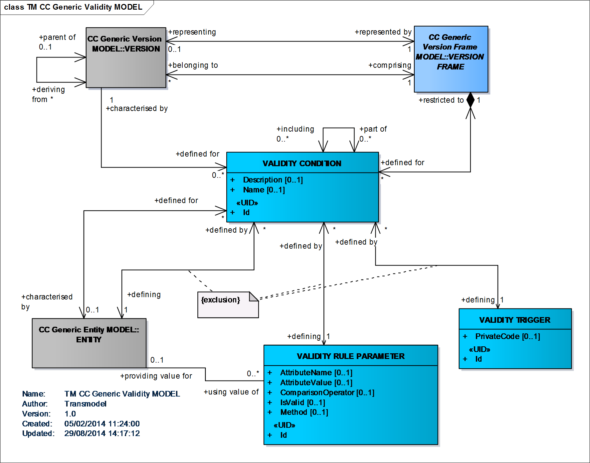

Generic Validity Model 

An  AVAILABILITY CONDITION is a VALIDITY CONDITION expressed in terms of temporal parameters and referring to DAY TYPEs.

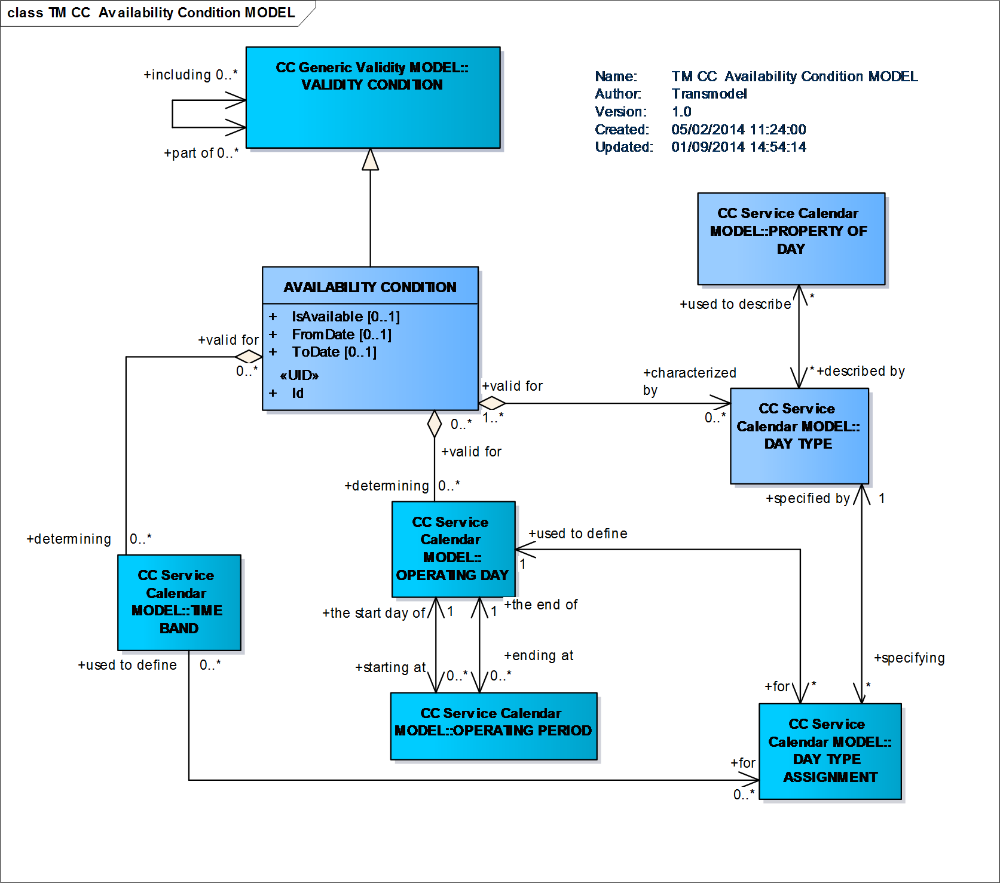

Availability Condition Model

## Responsability

How do I represent the organisational aspects of the data system?

Transmodel data will be used in different environments that can have a complex organisational structure. For instance, information is planned, revised, forwarded, enriched, combined with other plans and forwarded again to the final user at some time. This process often involves several organisations or departments.

As different aspects of public transport could be handled by different organisation parts, and sometimes are subcontracted to third parties, it is often useful to describe who is responsible for a specific role, within the delivered data. Examples of RESPONSIBILITY ROLEs are: Data Origination, Data Augmentation, Data Aggregation, Planning, Operation, Control Centre (directive pt-management centre), Monitor Centre (only receiving and collecting data), Data IPR Ownership, Entity Legal Ownership, Scheduler, StopPointManager,, RoadManager, RoadDisplayManager, SubContractor, Travel Information ServiceProvider, etc.(Generic Organisation Model, Responsibility Role Model).

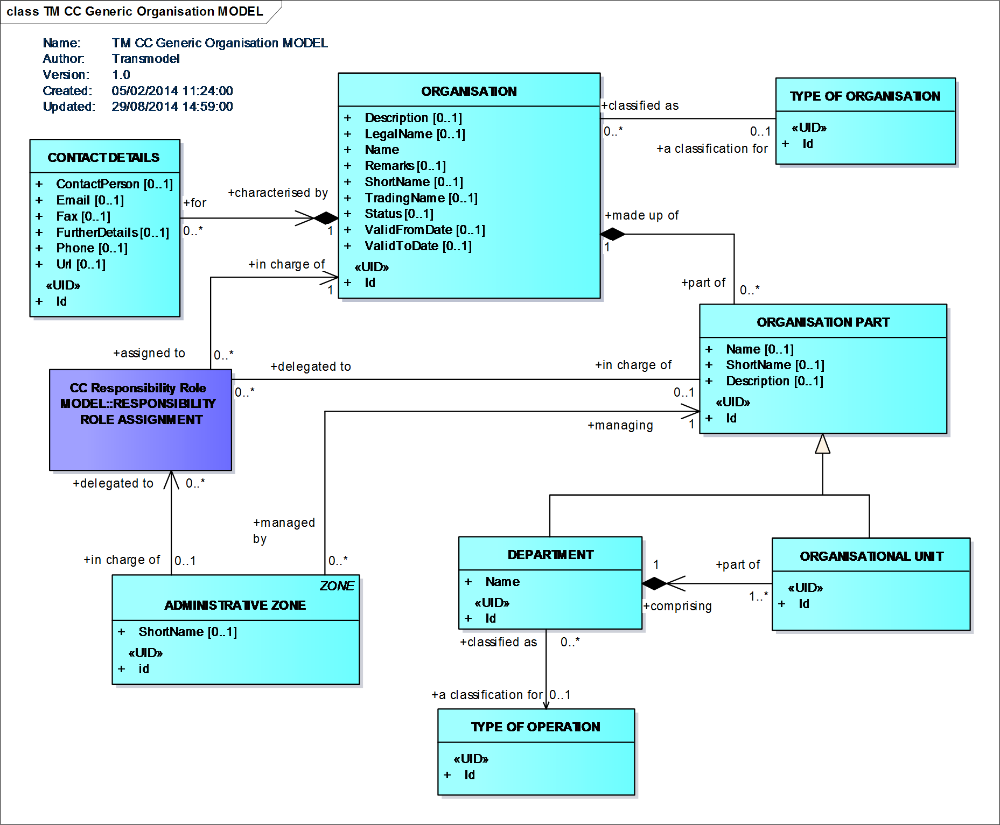

Generic Organisation Model

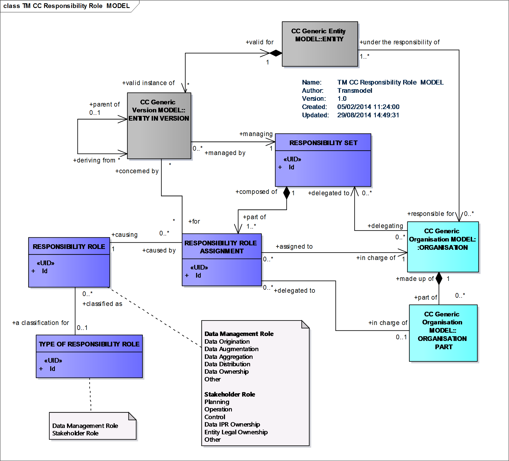

Responsibility Role Model

What types if responsibility on data are taken into account?

A RESPONSIBILITY SET is a list of possible responsibilities over one or more ENTITies (IN VERSION), resulting from the process of the assignment of RESPONSIBILITY ROLEs (such as data origination, ownership, etc) on specific data (instances) to ORGANISATIONs or ORGANISATION PARTs. Each RESPONSIBILITY SET can contain one or more RESPONSIBILITY ROLE ASSIGNMENTs that allocate different types of RESPONSIBILITY ROLE to an ORGANISATION or a specific ORGANISATION PART.

RESPONSIBILITY SETs may be used at different levels of aggregation. It is possible to specify a different set for each different ENTITY.

Responsibility Role Model

What types of organisations are taken into account?

The Generic ORGANISATION Model defines abstract ORGANISATION elements that can be used wherever there is a need to describe an organisation. It is extended with AUTHORITY, OPERATOR and other concrete organisation definitions specifically relevant for the transport domain.

An ORGANISATION PART of an ORGANISATION acts as an ORGANISATIONAL UNIT responsible for the determination of the PT Services, that need to be delivered in an OPERATIONAL CONTEXT often defined or limited to one TRANSPORT MODE or even to one VEHICLE MODE or SUBMODE of one of its DEPARTMENTs. This defines the actual involved OPERATING DEPARTMENT that will act as the serving OPERATOR directly in charge of operations, and, when a contractual link to an AUTHORITY exists, for the ordered services by the public transport AUTHORITY. The serving OPERATORs can be combined for executing this service in a GROUP OF OPERATORS (Generic Organisation Model, Transport Organisations Model).

Responsibility Role Model

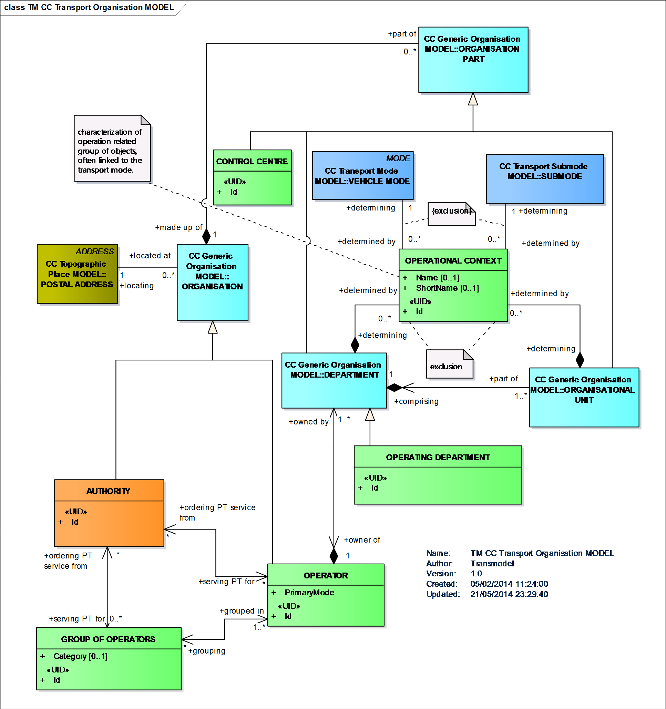

Transport Organisations Model

## Generic Framework

### Points and Links

What are the basic concepts for network description?

Topological descriptions of the spatial structure of a public transport network are generally built with points. Thus, an entity POINT is defined as the most basic entity of the network model. A POINT represents a 0-dimension node of the network. It marks the location of bus stops, parking places or other types of POINTs.

Between two POINTs of any type, a LINK may be defined to store spatial information (e.g. the distance a vehicle will cover crossing this link). LINKs represent 1-dimensional connections between POINTs. There must be no LINKs without one limiting POINT at each end. Two relationships between the POINT and the LINK entity specify the limiting POINTs of a LINK. A LINK is oriented from its start POINT to its end POINT.

Transmodel makes it possible to represent the network either as a graph of points or of arcs.

An ordered set of POINTs or LINKs is called a LINK SEQUENCE. These are the generic building blocks of the Public Transport network model. Their specialisations represent concrete special Public Transport objects, like scheduled stop points, routes, service links, etc.

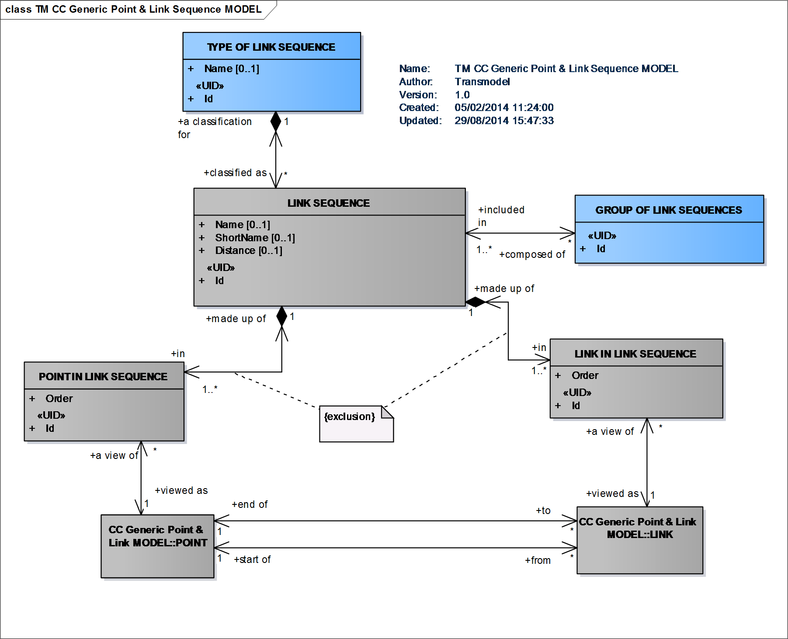

Generic Point and Link Sequence Model

How to reference network – related objects in space?

The LOCATION provides a representation of the basic coordinates of those entities that are located in space, for example, POINTs and LINKs and ZONEs. The location is dependent on the LOCATING SYSTEM used. Given a LOCATING SYSTEM, every POINT may be located in this system by a LOCATION. Transmodel uses a subset of the Open Geospatial Consortium’s Geographic Mark-up Language (OGC GML) schema to define coordinates (Location Model).

Topological ENTITIES used for describing a transport network can be grouped into different LAYERs i.e. user-defined GROUPs OF ENTITies, specified for a particular functional purpose, associating data referring to one particular LOCATING SYSTEM (Generic Layer Model).

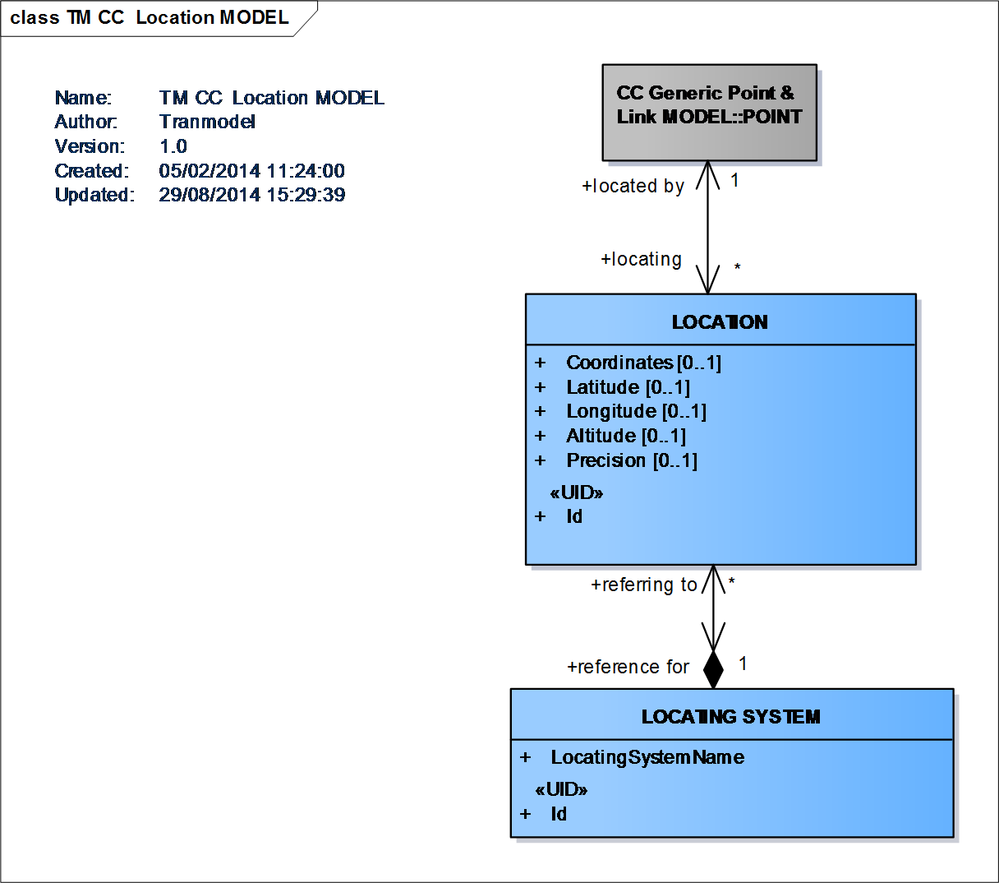

Location Model

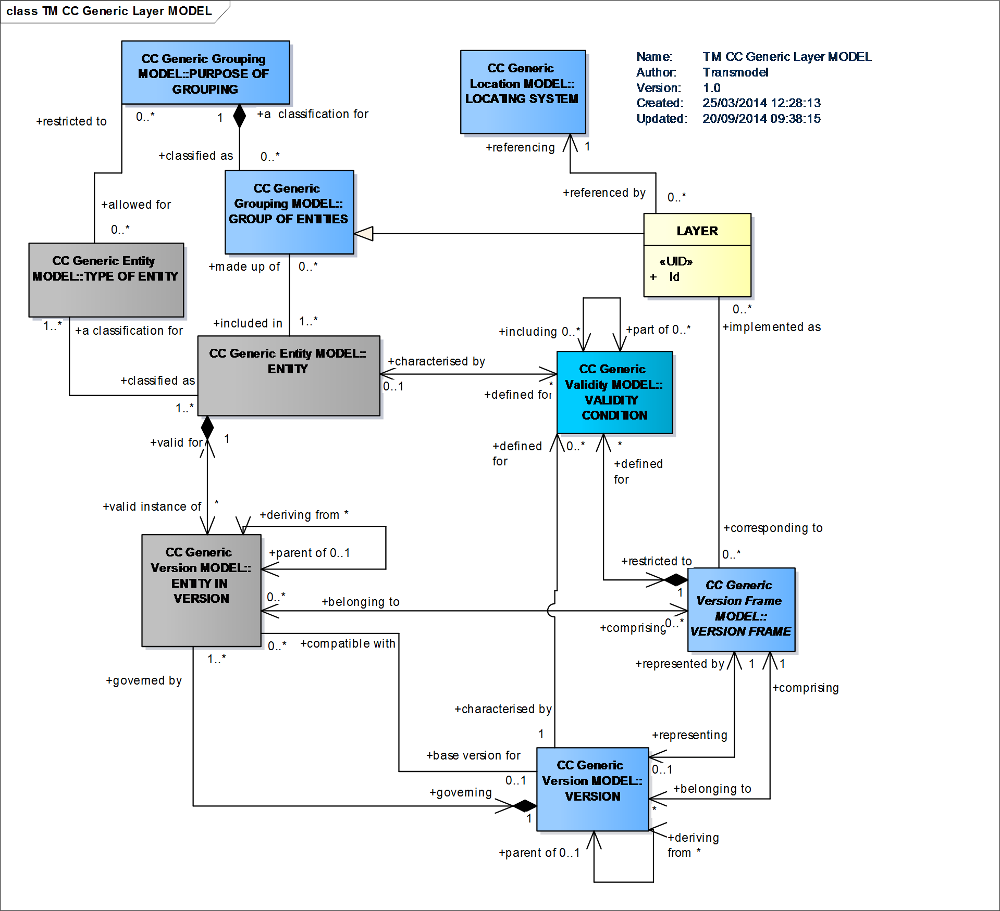

Generic Layer Model

How is the network evolution taken into account?

Network data are submitted to VERSIONs and may be grouped to form coherent sets of data using the VERSION FRAME mechanism. VERSION FRAMEs allow data to be managed and exchanged as a coherent version, that is a set of instances (ENTITies IN VERSION) of different entity types that are consistent and correct as to referential integrity and other business semantics and so are suitable for use without extensive consistency checking, for example, by an importing application (Generic Version Model & Generic Version Frame Model).

Generic Version Model

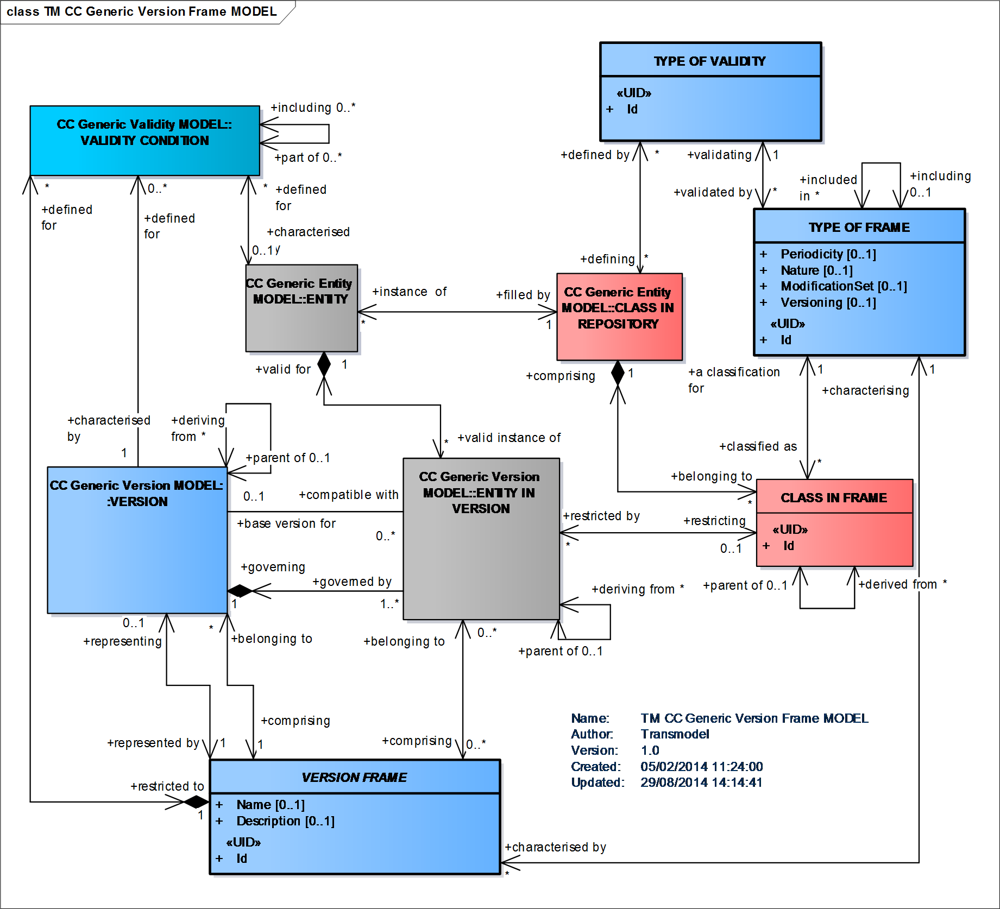

Generic Version Frame Model

### Link Sequences

How to represent the different paths through the network?

The LINK SEQUENCE Model defines a set of POINTs and/or LINKs making up a path through a network.

It allows a path to be described as a sequence of points, a sequence of links, or both; both views are relevant for different use cases. Specialisations of LINK SEQUENCEs are for example ROUTE, JOURNEY PATTERN, TIMING PATTERN etc. and represent concrete Public Transport paths (Point and Link Sequenece Model).

Point and Link Sequence Model

### Groupings

What is the use of groupings of objects in Transmodel?

Transmodel defines a generic GROUP OF ENTITIES as a set of ENTITies, grouped together according to a functional purpose (PURPOSE OF GROUPING).

A concrete example of a use of such grouping is a STOP AREA, that is a grouping of stops known to the public by a common name (Generic Grouping Model).

Other types of sets of entities than groupings are FRAMEs (Generic Version Frame Model) or LAYERs (Generic Layer Model).

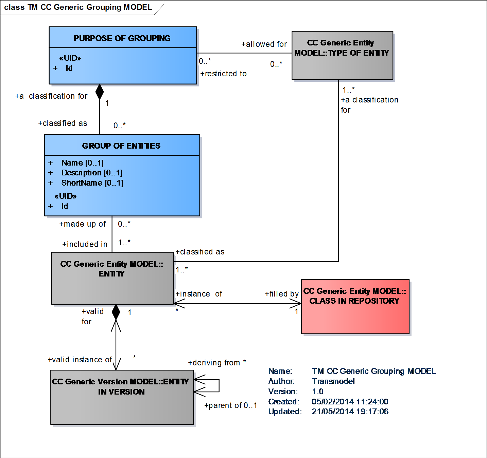

Generic Grouping Model

Generic Layer Model

What groupings of topological objects are defined in Transmodel?

GROUPs OF POINTs, LINKs or LINK SEQUENCEs have a particular importance. A GROUP OF POINTS may be used to describe a central or complex station, consisting of all stops serving the whole area of this station, or any important interchange area. In such a case, the PURPOSE OF GROUPING of the GROUP OF POINTS will limit the grouped POINTs to a certain TYPE OF POINT. This allows one to use classical stop areas to describe limited sets of stops (e.g. a couple of bus stops close to the station). A GROUP OF POINTS may also be used to describe operational clusters, consisting of  POINTs of different types, e.g. located close to each other and/or operationally belonging to an object known by a particular name (e.g. train station, from the operational point of view).

A GROUP OF LINKs may be all LINKs in a tunnel, all LINKs in an urban area, etc.

A concrete GROUP OF LINK SEQUENCEs may be a LINE, i.e. a grouping of ROUTEs that is generally known to the public by a similar name or number (Explicit Grouping Possibilities Model).

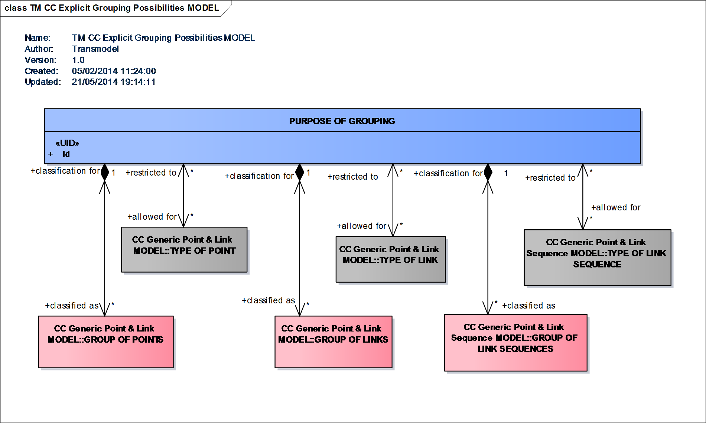

Explicit Grouping Possibilities Model

### Zones

How are zones taken into account?

A ZONE is a two-dimension object used in the network description (e.g. administrative area, tariff zone, flexible transport zone). ZONEs are classified according to a TYPE OF ZONE.

A ZONE may be defined by a GROUP OF POINTS belonging to the ZONE. For instance, a TARIFF ZONE used to define a zonal fare structure in a zone-counting or zone-matrix system may be composed of a set of stop points.A ZONE may also be defined as a geometric area, bordered by a LINK SEQUENCE (a polygon). In such a case, this LINK SEQUENCE has to be a closed one (i.e. the first and last POINTs IN LINK SEQUENCE must be a view of the same POINT). A ZONE may be recursive, and include other smaller ZONEs (Generic Zone Model).

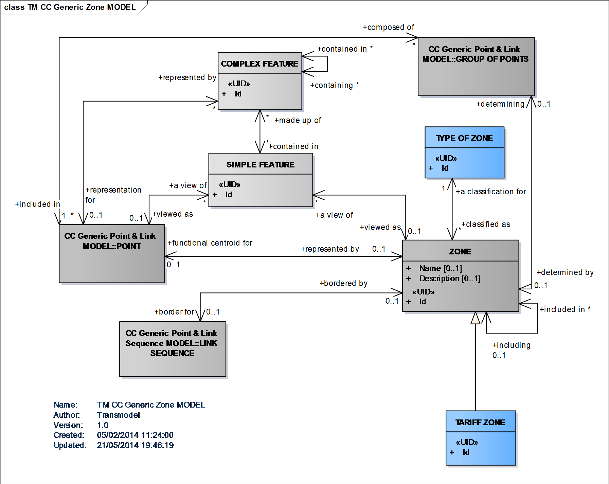

Generic Zone Model

### Point and Link Types

What different types of points taken into account ?

A TYPE OF POINT is defined as an entity to describe common roles played by a number of POINTs. Each POINT is functionally classified as being of one or more types, according to the specific information needs of a particular functional domain. Certain TYPEs of POINTs are regarded as important enough to be additionally represented by a separate concept. The most important of these are: the SCHEDULED STOP POINT, TIMING POINT, ROUTE POINT.

Other explicitly defined types are specialisations of the TIMING POINT: RELIEF POINT, PARKING POINT, GARAGE POINT (Vehicle & Crew Point Model) or points specifically dedicated to operations control: TRAFFIC CONTROL POINT, ACTIVATION POINT, BEACON POINT (Activation Model).

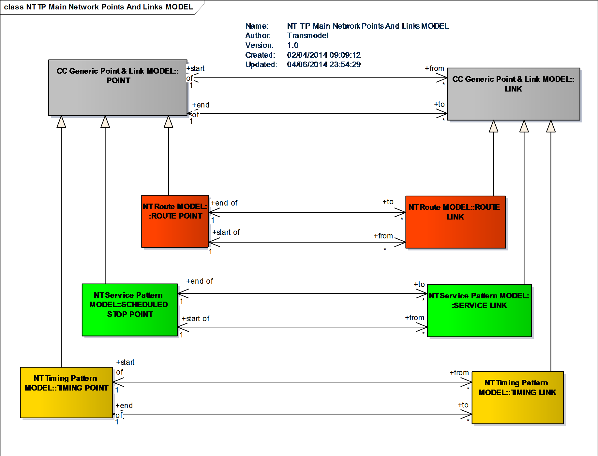

Main Network Points and Links Model

Vehicle & Crew Point Model

Activation Model

What is the difference between a timing point and a scheduled stop point?

A SCHEDULED STOP POINT is a POINT where passengers can board or alight from vehicles.

A TIMING POINT is a POINT against which the timing information necessary to build schedules may be recorded.

Some operators may want to define run times between any pair of SCHEDULED STOP POINTs (related by a SERVICE LINK). In such a case, probably all SCHEDULED STOP POINTs of the network will also be classified as TIMING POINTs. Other companies will define run times only for a selection of SCHEDULED STOP POINTs: only these will be at the same time TIMING POINTs and SCHEDULED STOP POINTs.  The times related to the rest of the stops would then be derived by processing (e.g. interpolation). Some POINTs, such as garage entry or exit points that are TIMING POINTs only.

Are points for operations monitoring and control present?

Transmodel defines three particular types of POINTs dedicated to Operations Monitoring and Control, namely: ACTIVATION POINT(a POINT where a control process is activated when a vehicle passes it), TRAFFIC CONTROL POINT (a POINT where the traffic flow can be influenced, e.g. where  traffic lights (lanterns), barriers, etc are present) and BEACON POINT (ACTIVATION POINT where a beacon or similar device to support the automatic detection of vehicles passing by is located). ACTIVATION POINTs may be start/end of an ACTIVATION LINK.  (Activation Model). 

 Activation Links Model

### Complex Objects

How are complex objects represented?

It is often necessary to define a group of objects of different types in a simpler representation, omitting the details. For instance, a train station composed of tracks, platforms, vending machines, etc., or a depot composed of halls, parking areas, lanes, maintenance facilities, etc., are viewed in some layers as single POINTs. This is described by the entity COMPLEX FEATURE (named by analogy with the GDF standard and usual GIS wording).A COMPLEX FEATURE is composed of one or more SIMPLE FEATUREs. A SIMPLE FEATURE is identical to an instance of either a POINT, a LINK, or a ZONE.

A COMPLEX FEATURE usually combines elements of different kinds such as POINTs, LINKs, ZONEs (each of them not necessarily of the same type), and even other COMPLEX FEATUREs. It should not be mixed up with a group of elements (e.g. GROUP OF POINTS), combining elements of one single type only, for example one GROUP OF LINKs may be all LINKs in a tunnel, which is not a COMPLEX FEATURE (Generic Feature Model).

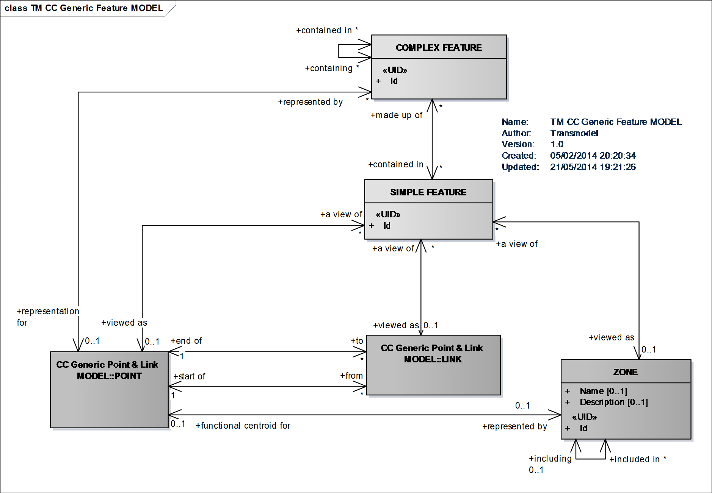

Generic Feature Model

### Layers and Projections

How to define network topology in a coherent way?

Topological ENTITIES used for describing a transport network can be grouped into different LAYERs. Each LAYER is associated with a one and only one LOCATING SYSTEM, and the entities belonging to the LAYER have a position within this LOCATING SYSTEM. Examples of layers include:

Infrastructure layer: describes road or rail network.  
Route layer: describes route topology.  
Service layer: describes network of stops served by routes.  
Timing layer: describes location of timing points and times between them.

Generic Layer Model

What are projections?

The mechanism for relating ENTITIES of one LAYER to ENTITIES of another LAYER is called projection. Projection can happen implicitly by transforming the entity position from the source LOCATION SYSTEM to the destination LOCATION SYSTEM. However, there are cases where such automatic transformation is not possible or practical, e.g. if a route needs to be displayed on a schematic map, there is no way of calculating the positions from the spatial coordinates. Transmodel therefore contains a mechanism for explicitly projecting (spatial) entities of one layer to another layer (Generic Projection Model).

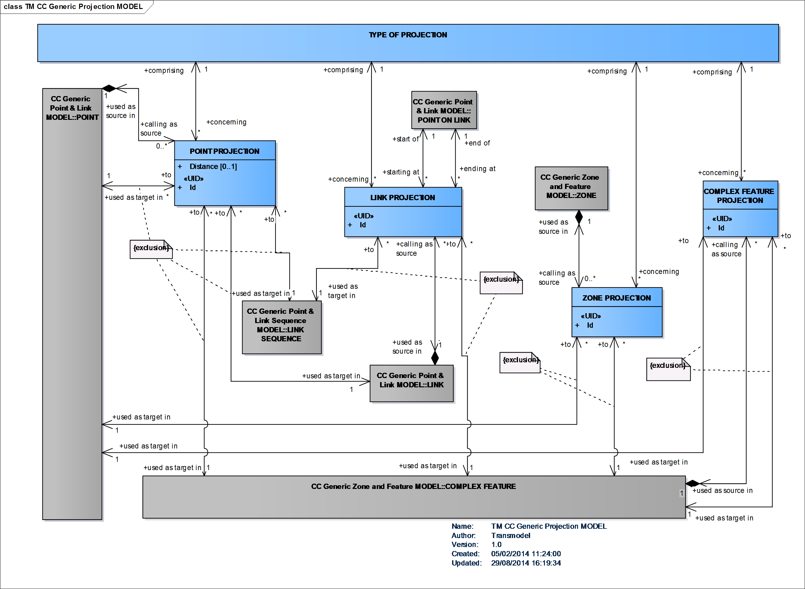

Generic Projection Model

How to relate topological objects defined by different departments in my company?

The functional views of the network are described as layers. A projection is a mechanism enabling the description of the correspondence between the different layers. This mapping between the layers is particularly useful when spatial data from different environments (sources, functional domains) have to be combined. An example of such a situation is the mapping of the public transport network on the road network or any other correspondence between coherent sets of topological objects often defined by different deparments of a company.

What type of projections are taken into account?

The POINT PROJECTION is used to project a point of a source layer to an ENTITY of the target layer. The target ENTITY can be a POINT or LINK, but not a ZONE. If the target of POINT PROJECTION is a link, the distance from the start of the link is set in POINT PROJECTION.

The LINK PROJECTION is used to project a LINK on one or more LINKs of another layer. As a precondition, the destination link must have one or more POINT ON LINK entities associated with it. The start and end point of the source link are projected on POINT ON LINK of the destination LINKs. An example of LINK projection might be the projection of a LINK between two stops to the LINKs of the road (or rail).

A ZONE PROJECTION involves a ZONE as source. The projected ZONE may be targeting either one POINT or one COMPLEX FEATURE.

The ZONE PROJECTION targeting a POINT expresses that the source ZONE is represented by a POINT in the target layer.The ZONE PROJECTION targeting a COMPLEX FEATURE means that the source ZONE belongs to the COMPLEX FEATURE described in the target layer.

A COMPLEX FEATURE PROJECTION involves a COMPLEX FEATURE as source. The projected COMPLEX FEATURE can be targeting another COMPLEX FEATURE or a POINT (Generic Projection Model).

Generic Projection Model

### Accessibility

How to represent accessibility of spatial objects?

The accessibility of a site is described using an ACCESSIBILITY ASSESSMENT: this allows to express the accessibility either in terms of suitability for specific USER NEEDs – for example wheelchair, hearing impaired, vision impaired, lift-averse, etc. – using a SUITABILITY element, or in terms of ACCESSIBILITY LIMITATIONs, i.e. description of the limitations of a site to support a specific need, for example Wheelchair, Step free, Escalator free, Lift free or both.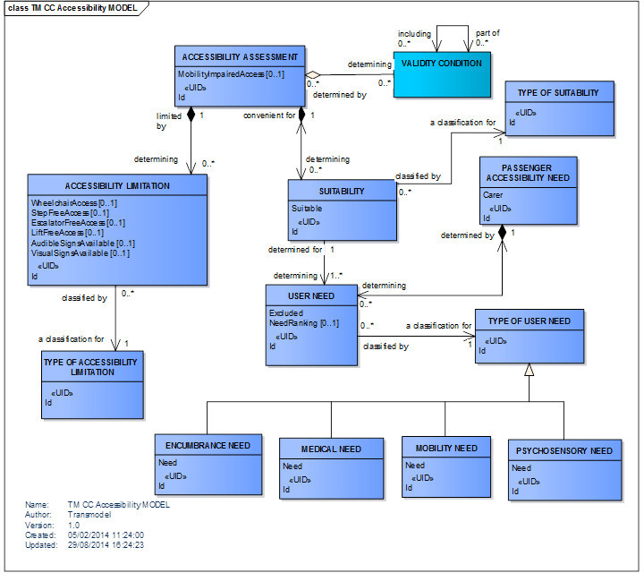

Accessibility Model 

### Places

What elements are defined to represent the origin/destination of a passenger trip?

A PLACE is defined as a geographic place of any type which may be specified as the origin or destination of a trip. A PLACE may be of dimension 0 (a POINT), 1 (a road section) or 2 (a ZONE).

The PLACE model defines topographically significant places that a transport model may wish to describe.

It also allows the description of the possibility of connecting between them. ACCESS  indicates the physical (spatial) possibility for a passenger to access or leave the public transport system. This link may be used during a trip for:- the walking movement of a passenger from a PLACE (origin of the trip) to a SCHEDULED STOP POINT (origin of the PT TRIP), or- the walking movement from a SCHEDULED STOP POINT (destination of the PT TRIP) to a PLACE (destination of the trip) (Generic Place Model).

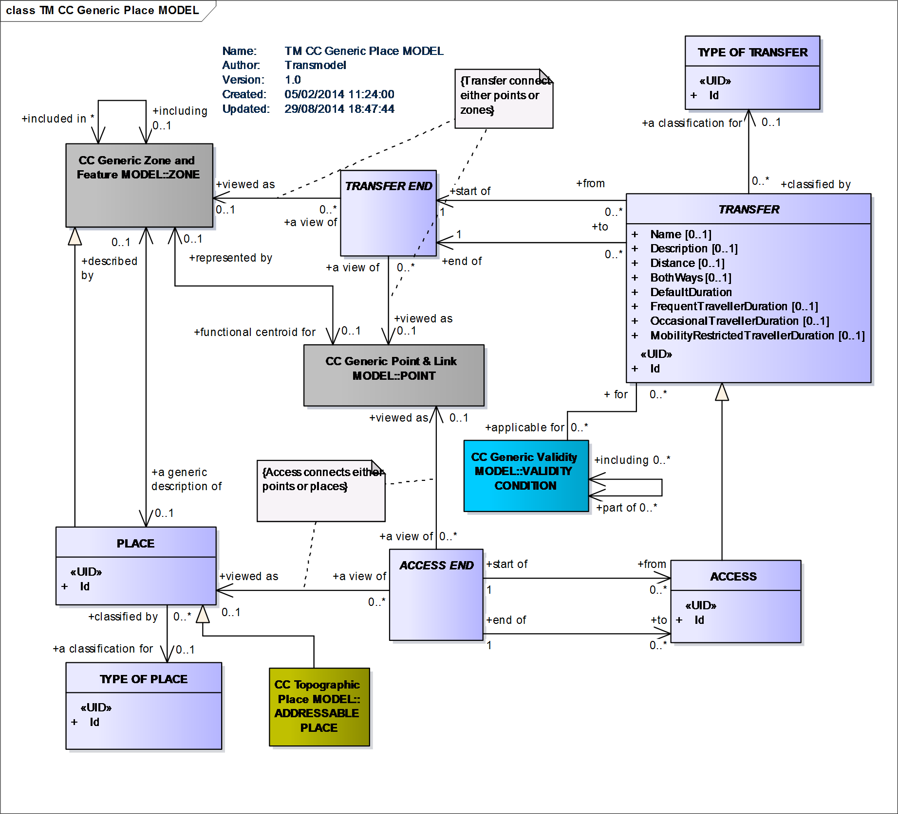

Generic Place Model

## Reusable Components

### Modes

What types of modes are taken into account?

Transmodel takes into account a variety of Public Transport MODEs (characterisation of the public transport operation according to the means of transport (bus, tram, metro, train, ferry, ship)). A distinction is made  between VEHICLE MODE and ACCESS MODE. The concept of MODE is refined into SUBMODE, a variant of a MODE, as for instance international or domestic rail (rail being the MODE).

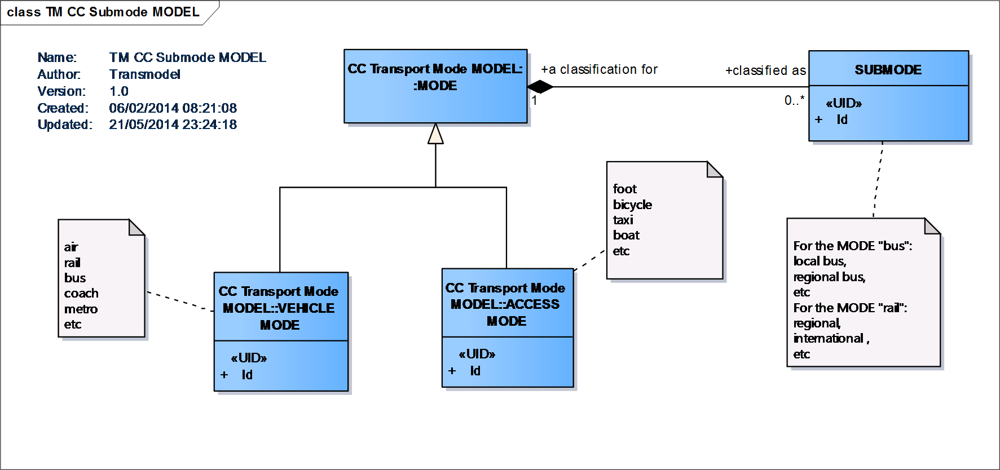

Submode Model

### Calendars

How are the calendars represented?

In Transmodel, a DAY TYPE is defined as a combination of various different properties a day may have, and which will influence the transport demand and the running conditions (e.g. traffic flow for buses).

Any single condition that is relevant to the demand will be recorded as a particular PROPERTY OF DAY. For example, “workday”, “Sunday”, “school holiday”, “market day” would each be a PROPERTY OF DAY. A workday during school holidays, which is a market day, would be a DAY TYPE, formed with the combination of those three PROPERTies OF DAY.

The day of operation, considered from the point of view of the transportation process control, is described by the entity OPERATING DAY.The time limits of an OPERATING DAY will often deviate from the official date. One day of operation covers for instance the period from 2.00 a.m. to 1.59 a.m. the day after, the period from 0.00 to 1.59 on the second day being assigned to the operational day which started the day before.

The production planning requires that a DAY TYPE is assigned to each OPERATING DAY, which is frequently referred as a “transportation calendar” or – in The Conceptual Model – as a SERVICE CALENDAR

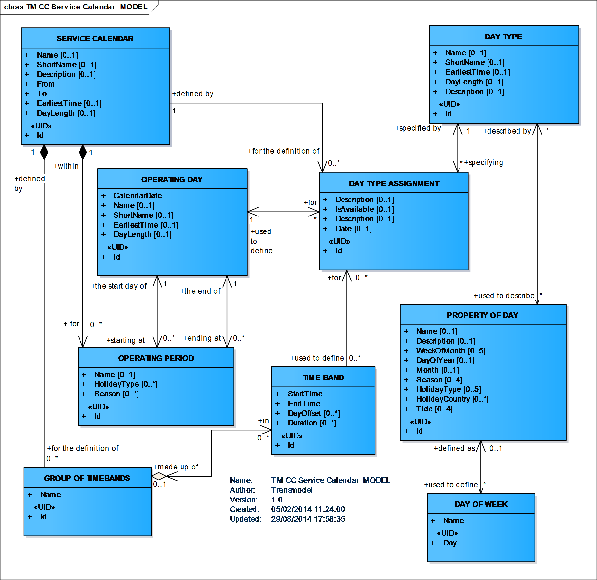

Service Calendar Model

What types of time-related validities are modelled?

The Validity Model allows conditions to be attached to elements as to when they are current or the circumstances in which they should be used. VALIDITY CONDITIONs can be attached to specific elements and also, through version frames, to whole sets of objects so that it is possible to be explicit about the exact conditions governing the coherence and relevance of data.

AVAILABILITY CONDITION is a specialization of VALIDITY CONDITION to specify precise temporal conditions. For example, an access to a station may be valid (it exists) but not available for some of the time (it is closed between 9 pm and 6 am). An AVAILABILITY CONDITION can be defined by specific DAY TYPEs and/or OPERATING DAYs. It may be further qualified by one or more of TIME BANDs.

### Addresses

How can I represent topographic features, like addresses?

A TOPOGRAPHIC PLACE is a type of PLACE providing the topographical context when searching for or presenting travel information, for example as the origin or destination of a trip. It may be of any size (e.g. County,City, Town, Village) and of different specificity (e.g. Greater London, London, West End, Westminster, St James’s). A TOPOGRAPHIC PLACE may be located within one or more COUNTRies. TOPOGRAPHIC PLACEs may overlap. They may also be contained inside another TOPOGRAPHIC PLACE.

ADDRESS is the descriptive data associated with a PLACE that can be used to describe the unique geographical context of a PLACE for the purposes of identifying it. May be refined as either a ROAD ADDRESS, a POSTAL ADDRESS or both (Topographic Place Model).

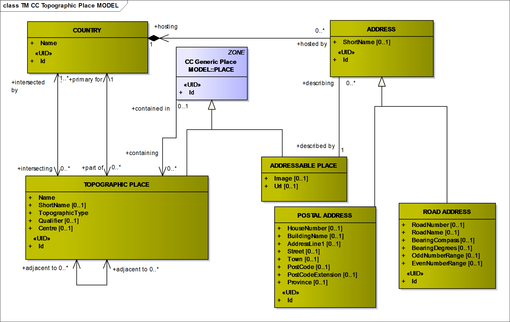

Topographic Place Model

### Equipment and Facility

What type of equipment is taken into account?

Transmodel defines a generic concept EQUIPMENT that specialises into  
INSTALLED EQUIPMENT, an item of equipment either fixed (PLACE EQUIPMENT) or on board i.e. associated with vehicles (ACTUAL VEHICLE EQUIPMENT). PASSENGER EQUIPMENT may be either fixed or on-board. INSTALLED EQUIPMENT is materialised as opposed to a service (LOCAL SERVICE) considered as an immaterial equipment.  
PLACE EQUIPMENT is described in a very detailed way through a range of concrete classes (cf. Part 2: Waiting & Luggage Equipment, Passenger Service Equipment, Ticketing Equipment, Access Equipment, Sign Equipment Models)

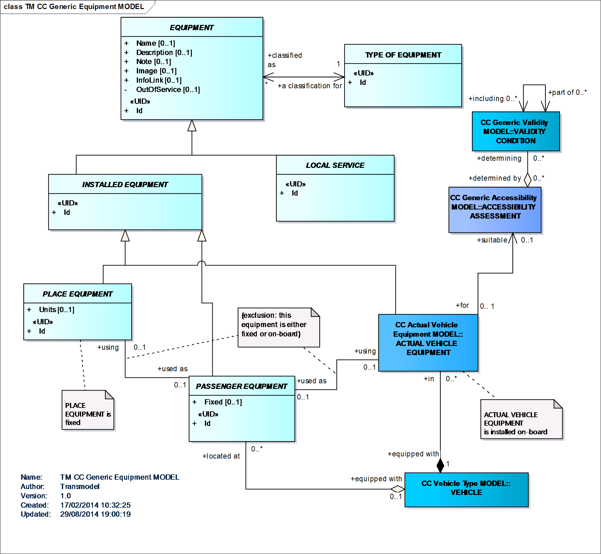

Generic Equipment Model

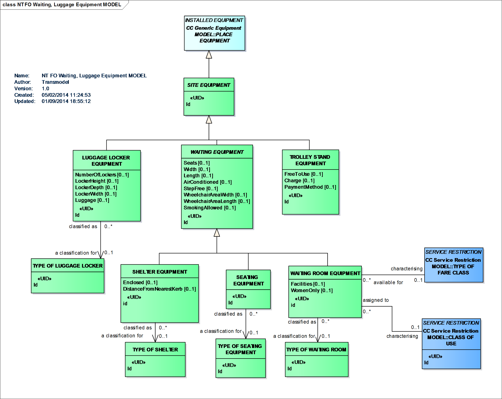

Waiting & Luggage Equipment Model

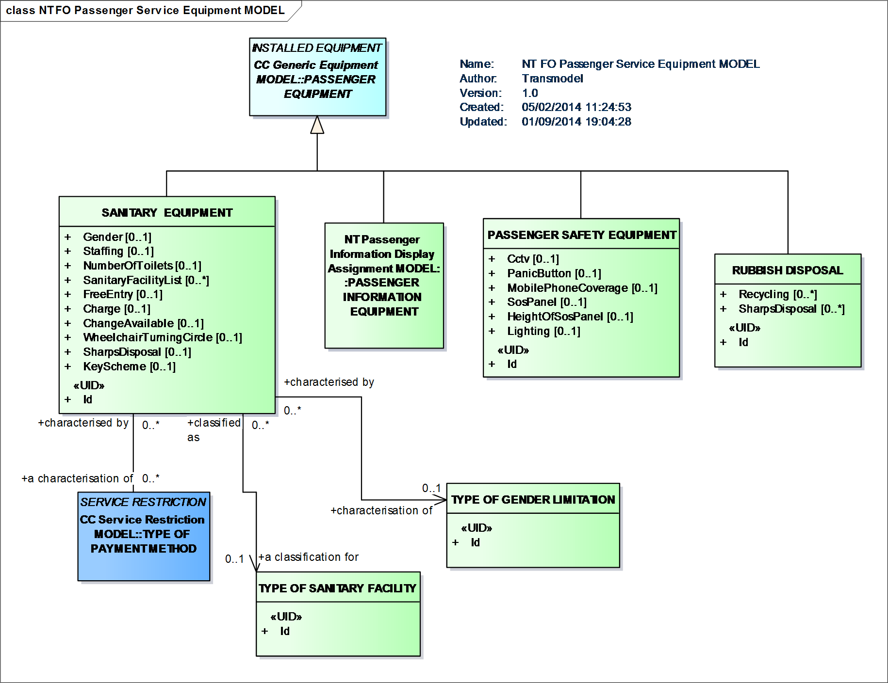

Passenger Service Equipment Model

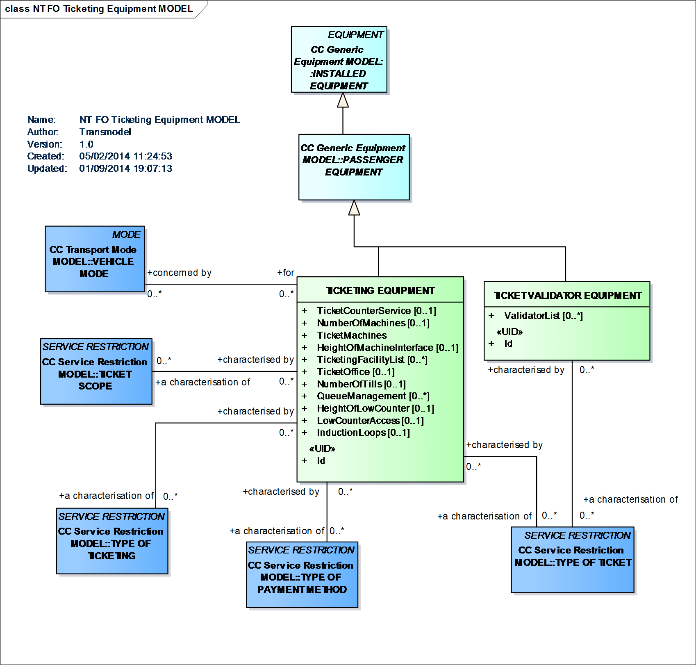

Ticketing Equipment Model

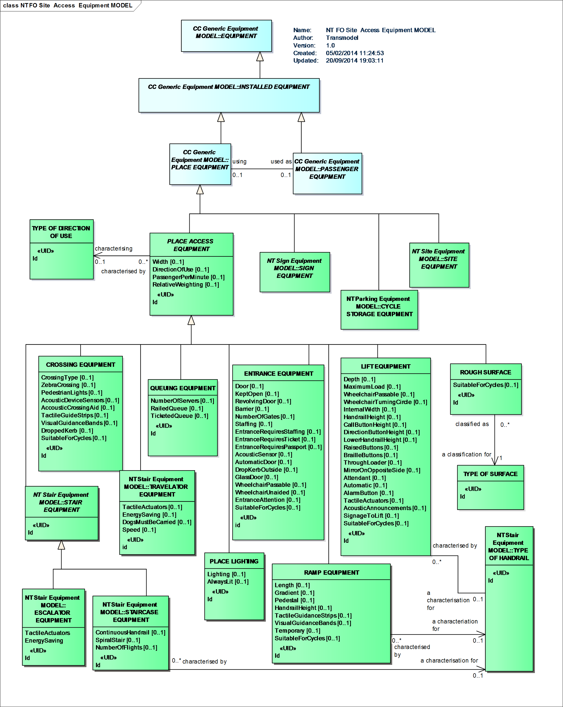

Access Equipment Model

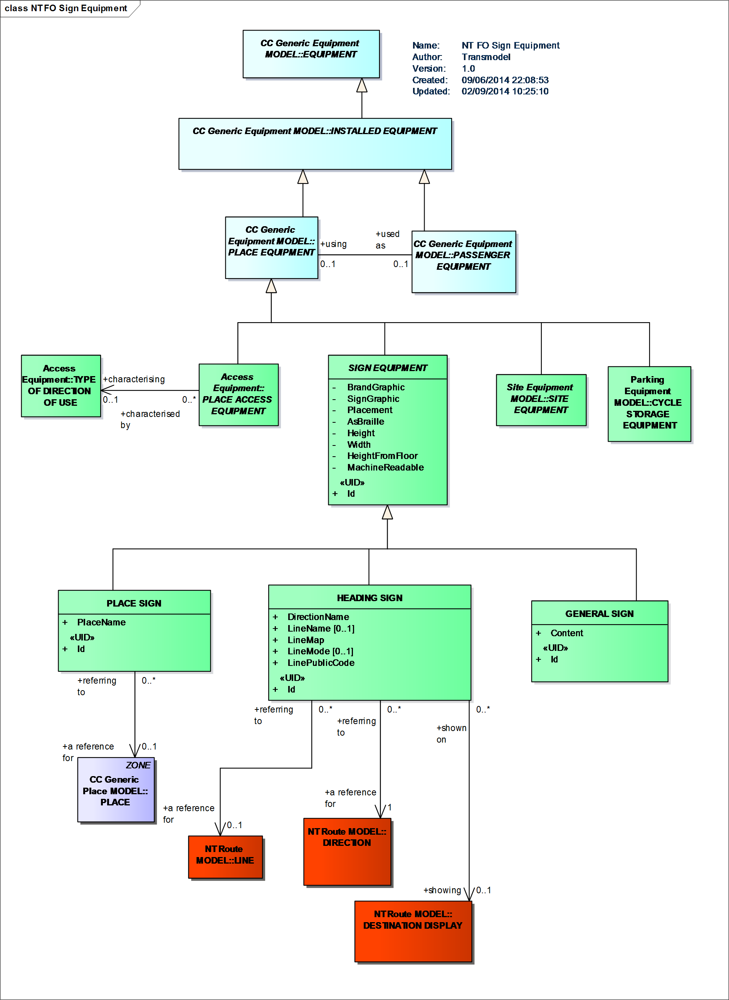

Sign Equipment Model

How is vehicle equipment taken into account?

Vehicle equipment is defined through the entity ACTUAL VEHICLE EQUIPMENT. Two types are particulary important for accessibility VEHICLE ACCESS EQUIPMENT and WHEELCHAIR VEHICLE EQUIPMENT.

Specialisations of (on(board) PASSENGER EQUIPMENT are described: ticketing equipment (e.g. TICKET VALIDATOR EQUIPMENT, TICKETING EQUIPMENT) and passenger service equipment  (e.g. RUBBISH DISPOSAL, PASSENGER SAFETY EQUIPMENT, SANITARY EQUIPMENT or PASSENGER INFORMATION EQUIPMENT).

What is a facility vs. equipment?

EQUIPMENT is an item of equipment installed either fixed (PLACE EQUIPMENT)  or on-board vehicles (VEHICLE EQUIPMENT). A service (LOCAL SERVICE such as LEFT LUGGAGE, TICKETING SERVICE) is considered as immaterial equipment as well (Generic Equipment Model).

A named amenity available to the public at a SITE or on a SERVICE. A facility has no further properties other than a name. An EQUIPMENT or LOCAL SERVICE is used to describe the further properties provided as part of particular facility (Facility Model).

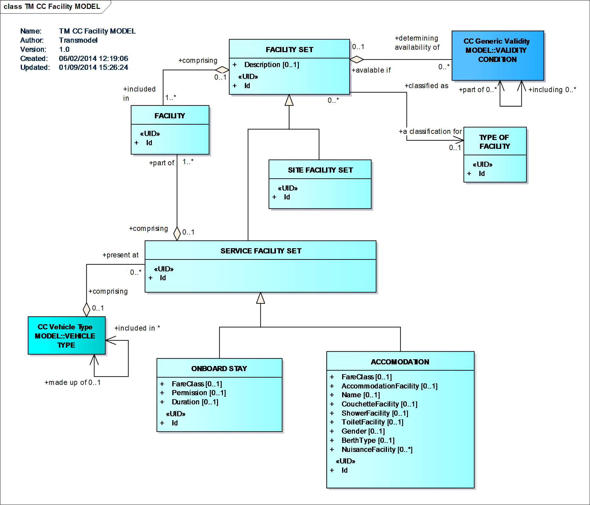

Facility Model

### Vehicle Type and Train

What is a vehicle vs vehicle type?

The VEHICLE entity is used to describe the physical public transport vehicles available for short-term planning of operations and daily assignment (in contrast to logical vehicles considered for resource planning). Each VEHICLE must be classified as of a particular VEHICLE TYPE.

The VEHICLE TYPE Model represents a description of VEHICLES through their properties.

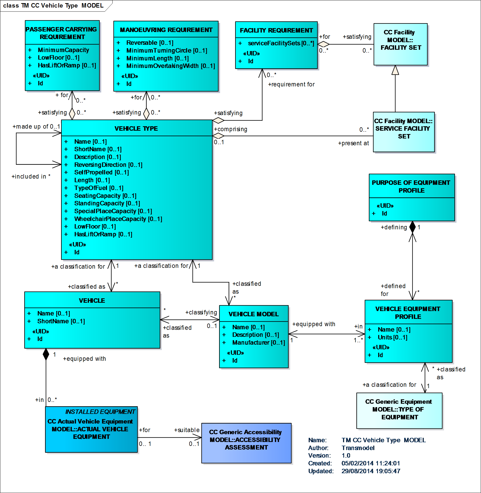

Vehicle type Model

How to represent a train?

A TRAIN is a VEHICLE TYPE composed of TRAIN ELEMENTs in a certain order, i.e. of wagons assembled together and propelled by a locomotive or one of the wagons.

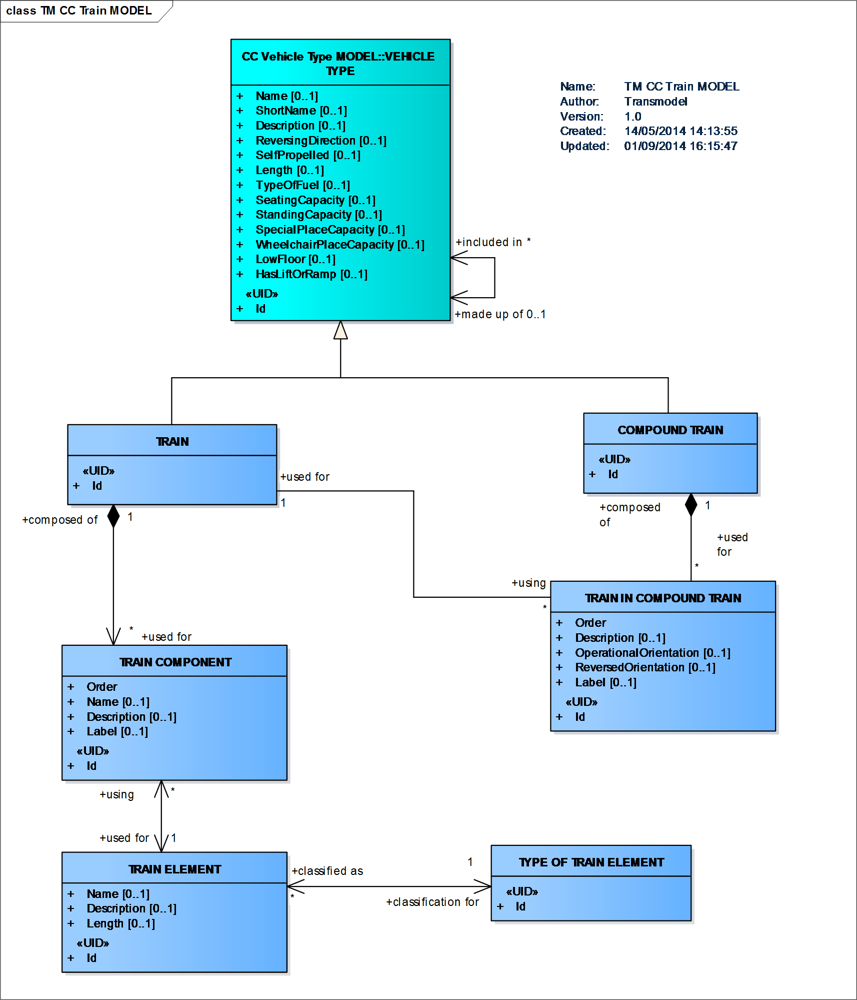

Train Model

What type of information is provided by the Vehicle type model?

VEHICLE TYPE is a classification of public transport VEHICLEs according to the vehicle scheduling requirements: in mode and capacity (PASSENGER CARRYING REQUIREMENT, e.g. standard bus, double-deck, …), and/or as regards maneuvering capabilities (MANOEVRING REQUIREMENT), and/or according to the facilities available on the vehicle (FACILITY REQUIREMENT).

Vehicle type Model
