*You can check the online version or download the pdf* [*TUTORIAL\_Part7.*](../../docs/assets/files/TUTORIAL_Part7_v2.1-1.pdf)

# Driver Management EN12896 – 7

This part of the reference data model describes all the information that is necessary to schedule (logical) drivers to work the blocks and duties necessary to provide the defined service offer to the passengers.

The process of ordering driver duties into sequences in order to obtain a balanced work share among the driving personnel over the planning period, and to keep the resulting work time in harmonization with legal regulations and internal agreements between drivers and the company management, is known as rostering. The reference data model offers a model part covering the information needs associated with some classical rostering methods, widely used in European countries. There may, however, be other (particularly more advanced, dynamic) methods applied in some cases, which would probably need additional or other entities than described in the rostering part of the reference data model.

The personnel disposition domain of the reference data model covers the data needs of the relevant driver management functions with respect to the two major tasks of

  -   -   - Assigning physical drivers to the logical drivers identified in the scheduled duty plan;
          - Recording the performance of drivers on the actual day of operation.

The assignment of drivers for the actual operating day to the duty plan set up for the whole planning period is usually done in a staged procedure. The assignment will mostly start from default assignments for the whole period in question, which can be continuously overridden by changes and adjustments due to regular absences of drivers from work, changes initiated by drivers according to their preferences or by the control staff according to operational needs. Short-term adjustments may become necessary to balance unplanned absences and other circumstances principally not known in advance.

Records to document the actual driver activities are usually taken to control the driver performance and compare it with the original plan, and to prepare these data in a suitable way for wage accounting. This mainly refers to the specification of the time worked by each driver on the individual day for each type of activity, and some additional classifications, which may result in appropriate modifications of the amount to be paid for the recorded activity in question.

# Physical drivers, logical drivers and driver duties

Introduction

In the first stages of the planning process there are no direct references to the physical drivers that shall actually perform the duties, but rather to a theoretically available driver resource for an OPERATING DAY, foreseen to be monitored and called LOGICAL DRIVER.  
The DRIVER entity describes a physical driver, who is an EMPLOYEE of the public transport company whose usual work is to drive a public transport vehicle.  
  
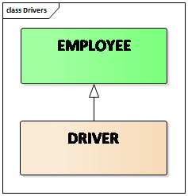  
An overview on the different concepts related to the description of the work of the drivers are presented in the figure below:  
  
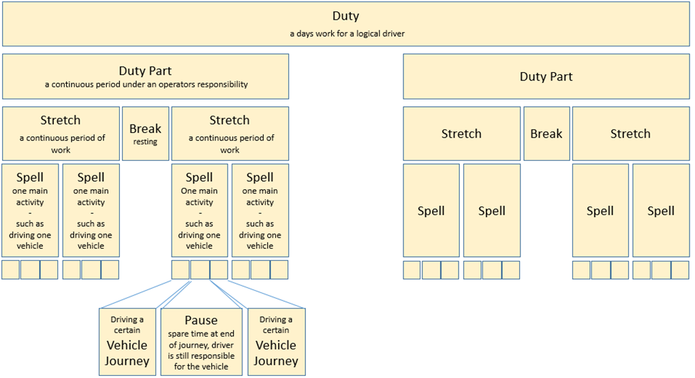  
  
Driver DUTies and their components: DUTY PART, STRETCH, BREAK, SPELL, PAUSE will be defined in the following pages.

Duties and main duty components

To cover the scheduled SERVICE JOURNEYs at minimum cost driver DUTIEs are determined and this process is called driver scheduling. Driver scheduling concerns LOGICAL DRIVERs. Many parameters have to be taken into account during this process (e.g. the maximum length of driving time allowed without a break) in order to give drivers fair workloads, which comply with the law and with the agreements made between the operators and driver unions.  
A DUTY describes the work to be performed by a driver on a particular DAY TYPE.  
It may require specific TYPEs OF QUALIFICATION. A DUTY may be a SPARE DUTY, in which case no specific work has yet been assigned to it, or an ASSIGNED DUTY, which is composed of a hierarchy of components.

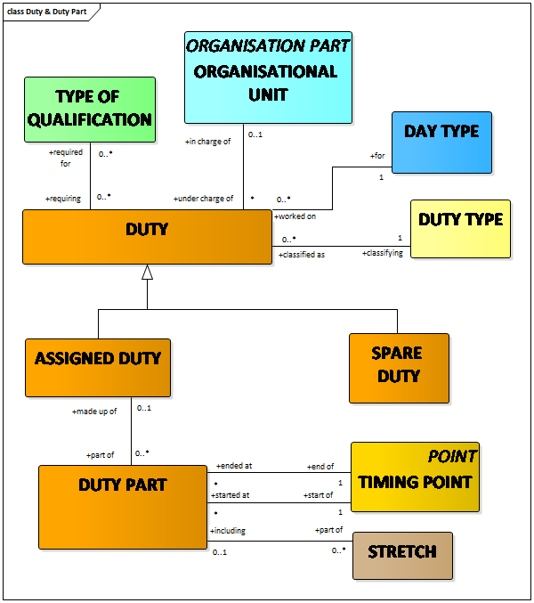

Components of duty parts

A DUTY PART is a continuous part of a driver DUTY during which the driver is under the management of the company and may include BREAKs.  
A BREAK is a period of time within a DUTY PART during which the driver is not responsible for a vehicle and can rest, usually at a BREAK FACILITY.

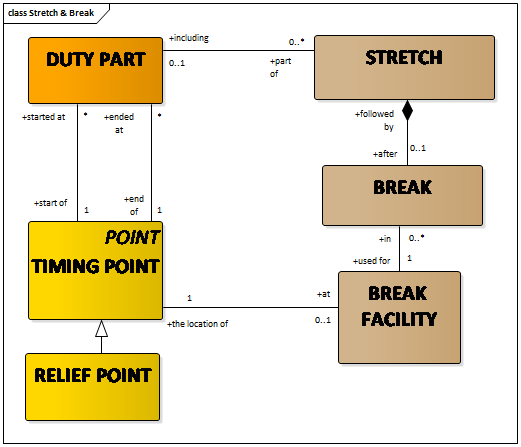  
A STRETCH is a period of a driver’s DUTY during which the driver is continuously working without a BREAK but that may include PAUSEs during which the driver remains responsible for the vehicle.

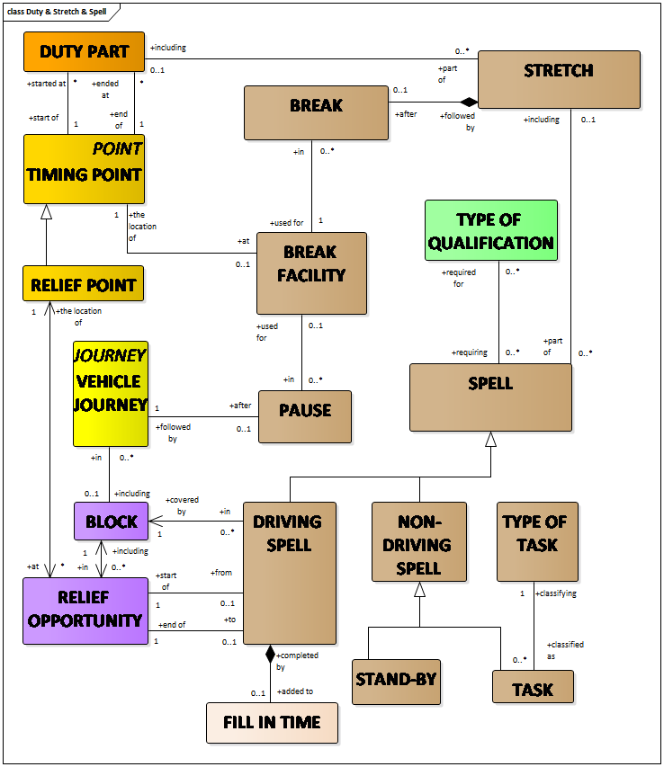  
A SPELL is a continuous period in a STRETCH, when a driver is on duty on one vehicle or performing one other type of work.  
A DRIVING SPELL is a SPELL that is performed continuously on the same vehicle (i.e. the same BLOCK). A DRIVING SPELL is bordered by two actual reliefs, which are organised on appropriate RELIEF OPPORTUNITies (see EN12896-3). These RELIEF OPPORTUNITies are points in time and space (at RELIEF POINTs , see EN12896-2) in the same particular BLOCK.  
NON-DRIVING SPELLs are either STAND-BYs (tactical reserve) or TASKs, such as taking buses through a wash, training session, social activity etc.

Duty Types

DUTies are of a particular DUTY TYPE.  
A CONTINUOUS DUTY is a classification of a DUTY, in terms of working hours within the day comprising a single period of paid work.  
A SPLIT DUTY is a classification of a DUTY, in terms of working hours comprising several time bands separated in different DUTY PARTs by periods of unpaid time.

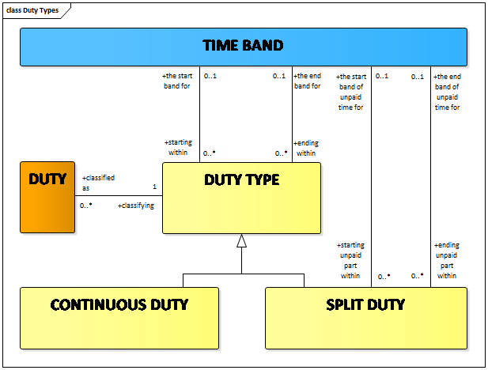  
The DUTY TYPE indicates the time profile of the DUTies for rostering purposes.

Times related to driver work

At the beginning or at the end of a DUTY, a DUTY PART, a STRETCH or a SPELL, a fixed time may be allowed to perform certain activities to prepare for, or to complete the work regularly assigned to this element. These activities may include signing on or off, controlling the vehicle condition, cleaning or refuelling the vehicle, controlling the amount of cash, etc.  
A TIME ALLOWANCE is a fixed paid time allowed to perform certain activities to prepare for or to complete the work assigned either to a BLOCK, a DUTY , a DUTY PART, a STRETCH or a SPELL.

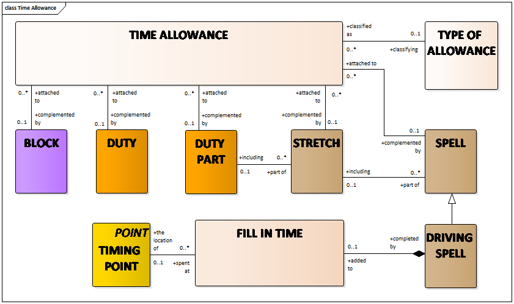  
The driver scheduling process takes also into account the times necessary for drivers to get to the starting point and to return from the finishing point of their spells of work.  
A DRIVER TRIP (which may be associated with a TRIP PATTERN, see EN12896-6) is a planned non-driving movement of a driver within a DUTY PART between two TIMING POINTs that may include using one or several VEHICLE JOURNEYs on vehicles driven by other drivers.  
A DRIVER TRIP TIME is the time allowed for a driver to cover a particular DRIVER TRIP during a specified TIME BAND.

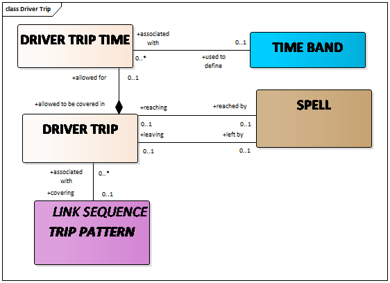

Driver schedule

A coherent set of DUTies to which the same set of VALIDITY CONDITIONs have been assigned builds a DRIVER SCHEDULE FRAME.  
A DRIVER SCHEDULE FRAME represents the theoretical work of a group of LOGICAL DRIVERs.

# Driver rostering

Rostering methods and roster matrix example

Duty plans are often presented in form of a cyclic matrix, where LOGICAL DRIVERs are assigned in turn to each DUTY of a cycle (hence the term “rostering”).  
There are numerous different rostering methods applied in companies over European countries.  
The rostering part of the conceptual data model has to be considered as a reference basis for companies working with one of the conventional rostering methods that have been taken into account in the model design.  
Two main families of methods for this task are described in detail in EN12896-7 (based on the concepts of either ROSTER CYCLE or ROSTER DESIGN, see Roster Cycle Model and Roster Design Model).  
A ROSTER MATRIX is a table showing the duty plan for a certain period of time and for a number of LOGICAL DRIVERs, into which the relevant DUTies to be worked will be entered.  
A REST is a representation of a day off for a driver.  
An example of a ROSTER MATRIX is represented in the figure below

Roster matrix, roster element and driver assignment

The most classical rostering practice is to first assign a DUTY TYPE or a REST day to each theoretical day in the components of a ROSTER MATRIX.

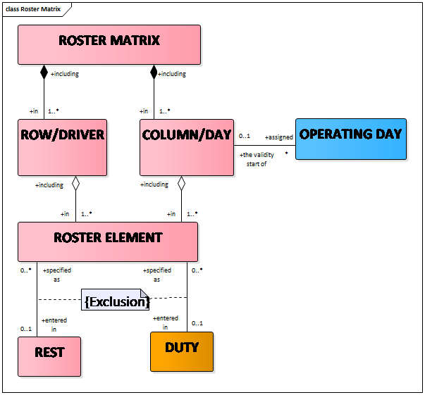  
After a decision has been made on how to structure the input for the rostering process (i.e. the DUTies, differentiated by their type), either by means of a ROSTER CYCLE or by ROSTER DESIGNs, and after the design of ROSTER MATRIces, the assignment of DUTies will be made. This assignment is aimed at obtaining a satisfying pattern of DUTies for each driver, during the planning period covered by the matrix.

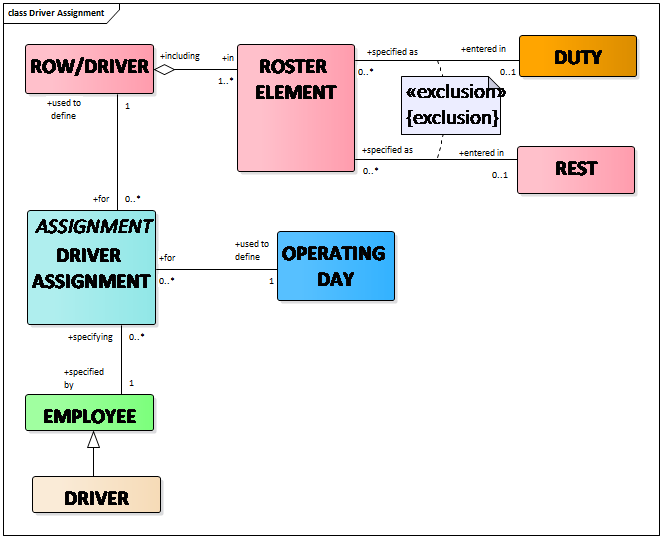  
DRIVER ASSIGNMENT is defined as an assignment of an EMPLOYEE to a ROW/DRIVER in a ROSTER MATRIX for a specified OPERATING DAY.

Roster Matrix Model

As a summary, the Roster Matrix Model provides the different entities contributing to the design of a ROSTER MATRIX.

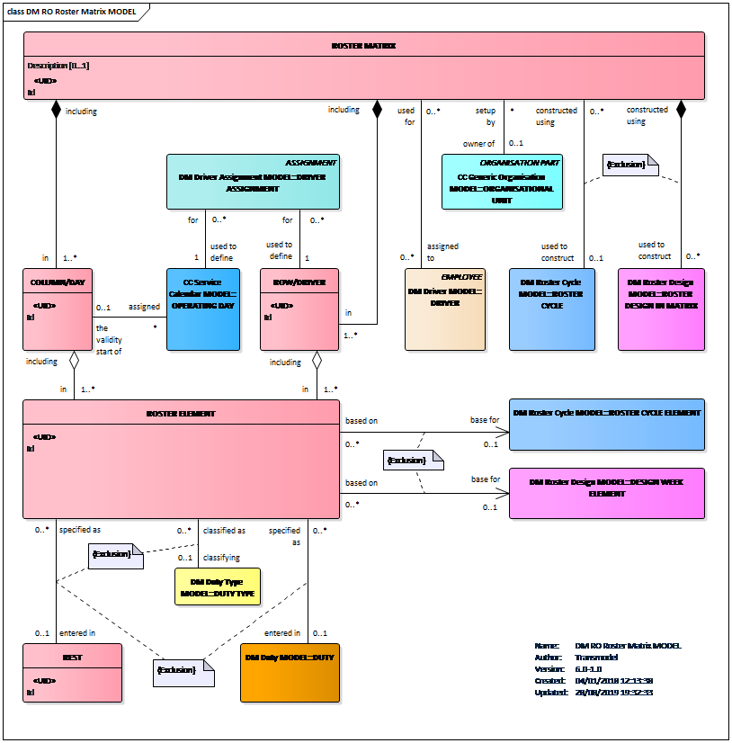  
DESIGN WEEK ELEMENT and ROSTER CYCLE ELEMENT refer to the 2 rostering methods (relying on either ROSTER CYCLE or on ROSTER DESIGNs) taken into account in the reference data model and described in more detail in EN 12896-7.

# Driver work accounting

DUTY and DRIVER data are extensively used as input for accounting functions within a company so that the correct DRIVER payments can be calculated and attributed to relevant COST CENTREs. DRIVER activity log can be used to prepare information on the DRIVERs’ work time. An account is created for each EMPLOYEE (e.g. DRIVER), which will include the sum of time worked during a defined ACCOUNTING PERIOD. This account consists of ACCOUNT ENTRies for each OPERATING DAY. An ACCOUNT ENTRY sums up the actual time worked by one EMPLOYEE during one OPERATING DAYfor a specified COST CENTRE.

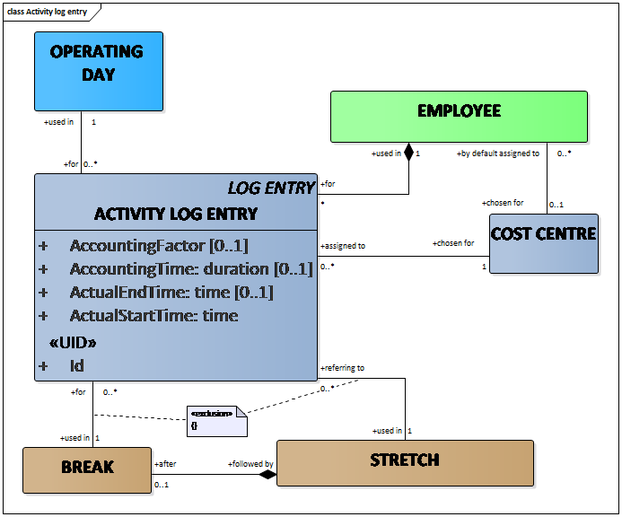 An ACCOUNT ENTRY is a record of aggregated ACTIVITY LOG ENTRY data per TYPE OF WAGE, EMPLOYEE and COST CENTRE for one OPERATING DAY that is used to transfer information on duties actually worked by drivers to an external accounting system. A WAGE INCREASE for special aggravations having occurred during the work may be assigned to an ACCOUNT ENTRY.

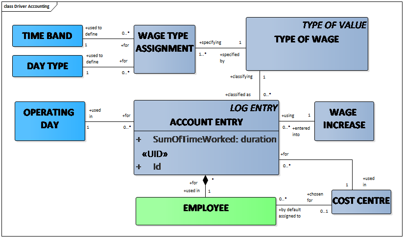

# Driver control actions

CONTROL ACTIONs are actions resulting from a decision taken by the controller causing an amendment of the operation planned in the PRODUCTION PLAN (reference version of daily activity). PRODUCTION PLAN and CONTROL ACTIONs are introduced in EN12896-4. In particular VEHICLE CONTROL ACTIONs, i.e. control actions affecting the LOGICAL VEHICLE are discussed there in detail.

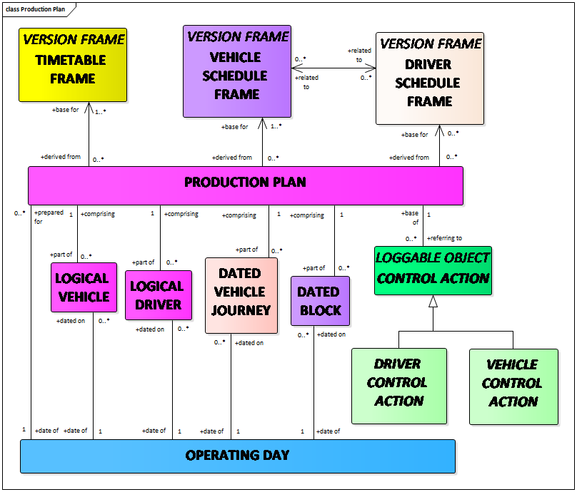

CONTROL ACTIONs that directly affect the drivers are DRIVER CONTROL ACTION. They are affecting a LOGICAL DRIVER.

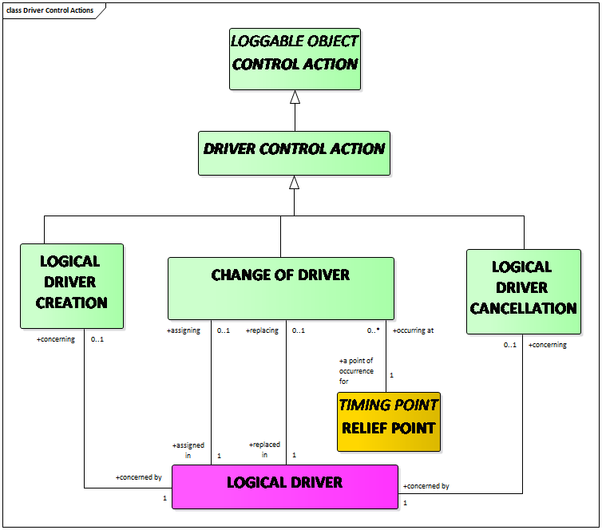  
LOGICAL DRIVER CREATION action consists of creating a completely new LOGICAL DRIVER (e.g. reserve resource) and possibly assigning a work plan to this LOGICAL DRIVER.  
A LOGICAL DRIVER CANCELLATION action consists of removing a LOGICAL DRIVER from the PRODUCTION PLAN. The work assigned to it may remain unassigned for a while.  
A CHANGE OF DRIVER action consists of removing, at a certain point in time and space (in principle, at a RELIEF POINT), all work assigned to a LOGICAL DRIVER and of assigning it to another LOGICAL DRIVER.ù
