*You can check the online version or download the pdf *[*TUTORIAL\_Part5.*](../../docs/assets/files/TUTORIAL_Part5_v2.3-1.pdf)

# Fare Management EN12896 – 5

The fare management data model aims at a generic description of the data objects and elements needed to support functions such as defining of the tarif structures, fare products and their parameters; operating sales, validating the consumption and charging customers. Tariff structures and products can be complex and there are differences in how these functions and their underlying data structures are handled in different European countries, and even between the public transport operators within one country – it is notable that historically there have been little attempt to standards fares across all modes.

Faced by such a degree of complexity and diversity in the concepts to be taken into account, in order define a single fare management data model capable of covering as many existing solutions and practices as possible, a careful separation of concerns is required, together with some novel modelling abstractions. The resulting fare management data model concentrates on the abstract, generic concepts that form the core of any fare system, independently of how these abstract concepts are implemented by a set of concrete fare products (e.g. tickets or passes) offered for sale to the public.

The starting point for the description of these fundamental concepts is the definition of theoretical access rights, based on use of network and temporal elements. These can be combined to form immaterial fare products, which are linked to travel documents in order to form sales packages to be sold to passengers. Controls may be applied to these travel documents to validate the utilisation of the public transport system. Price components are linked to the access rights, fare products and sales packages: they are used to calculate the price to be paid by a customer for a specific consumption (e.g. sale on a vending machine, debiting a value card, post-payment).

# Overview

Fare model in the overall context of transportation

The Fare Management model covers mainly the planning and operational stages of use:

  - definition of the fare offers, information on fares and prices in the planning stage
  - operational processes, such as sales, control and validation of access rights.

Transport usage information through the registration of fare-related data is also modelled.  
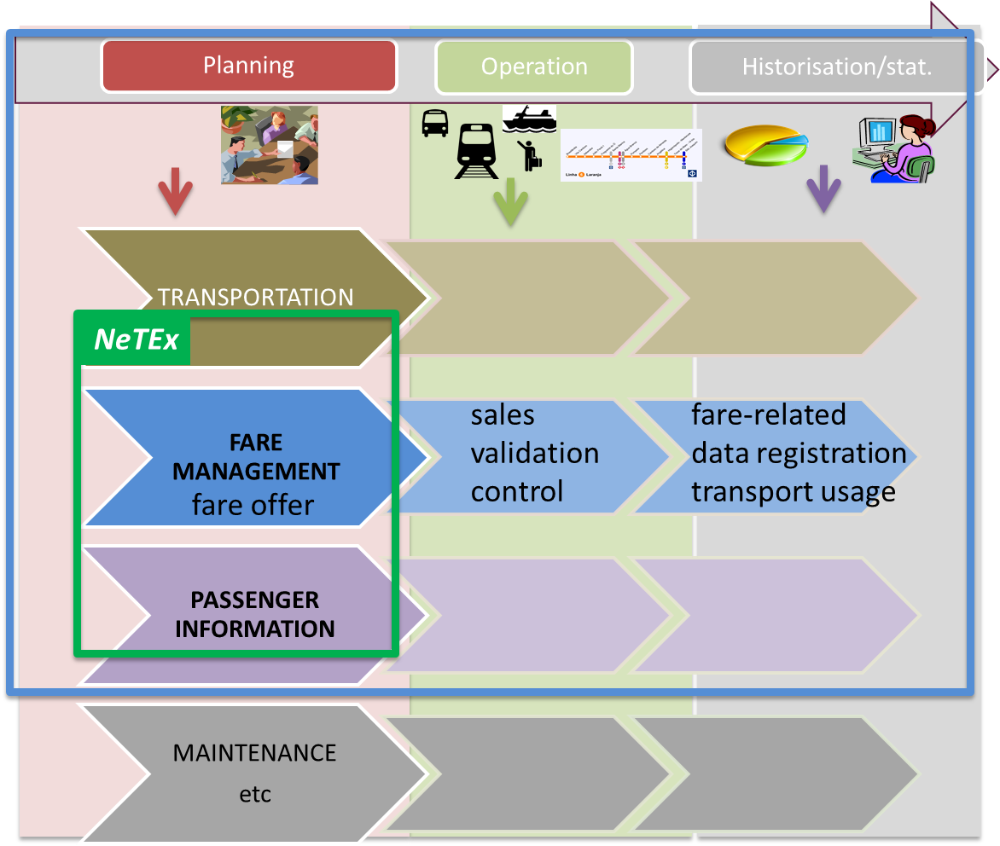  
However, not all the functional aspects of the planning and operational stage are taken into account in the reference model. Data requirements for the following domains are only partly covered:  
Sales organisation:

  - Management of the sales network (not covered, some basic retail and distribution elements relevant for passenger information are included).
  - Sales operations, including fulfilment (partly covered).
  - Management of customers (partly covered).
  - Collecting funds or accounting (not covered).

Pricing:

  - Pricing parameters specification (partly covered).
  - Exact price calculation (not covered).

Consumption control:

  - Access right validation & control (covered).
  - Fraud management and revenue protection measures (partly covered).
  - Collection and aggregation of consumption data (partly covered).

The implementation of Transmodel as an XML schema within the Technical Specification NeTEx (TS 16614-3) covers the planned fares offer including information on fare offers and prices, i.e. concerns the planning stage.

What data domains are part of the Fares Model?

The data model for the Fare Management domain incorporates the following data packages:

  - Fare Structure Description
  - Access Rights Description
  - Pricing
  - Sales Description
  - Customer & Sales Transaction
  - Fare Roles
  - Validation and Control
  - Explicit Frames

As in all other domains the model represents the data needed for the different processes; in this case, it is concerned with functional domains such as sales, distribution, retail, traveller information on available fare products, control of access rights and validation.  
In other words, the modelling addresses **what** information elements are needed and **not how** the information is processed.

The fare offer data domain splits further into sub-domains corresponding to well identified data packages as described above: Fare Structure Description, Access Rights Description (Access Rights Rules & Fare Products), Pricing and Sales Offer Description.

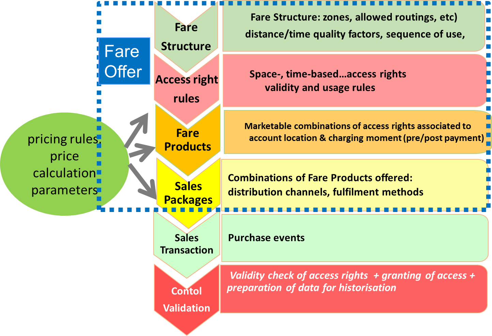

General nature of the approach, through an example

Often there is a simple one-to one correspondence between the network, the fare structure, the access rights, and the products offered. For example, a product giving use of a zone or zones in a zonal system, or to go between an origin and destination in a point-to-point tariff system. Such fare structures are relatively trivial to describe. Here we consider a slightly more complex example that serves to illustrate the distinctions between network elements, access rights and products.  
The following example considers a number of different **access rights** to use different elements of Public Transport that could be combined within one or more fare products:

1.  The operator of a Public Transport system offers travel on public transport services within a zonal fare system covering a city. The same set of tariff zones apply to both bus and metro but there are slightly different constraints on travelling by each separate mode:
      - The bus trip allows travel between any bus stop within the named zones, with unlimited transfers between different bus lines during a specified time interval.
      - The metro trip allows travel through a specified number of zones.
      - A bus trip may be followed by a metro trip (in that order only).
2.  Parking stakeholders (with their own fare structure) may define an access right:
      - parking for up to 3 hours.
3.  A joint Public Transport + Parking product might offer the following access rights:
      - parking up to 3 hours followed by a bus/metro 2-zones trip.

This requires the product definition to impose *a sequence of use of the access rights* and furthermore, to place usage limitations on this sequence (that is, a passenger must use the access rights in a particular order and may not be allowed to use certain rights without previously having consuming another).  
A **fare product**, called in this example ***Ticket t+++***, could combine the right to use all the above access rights.

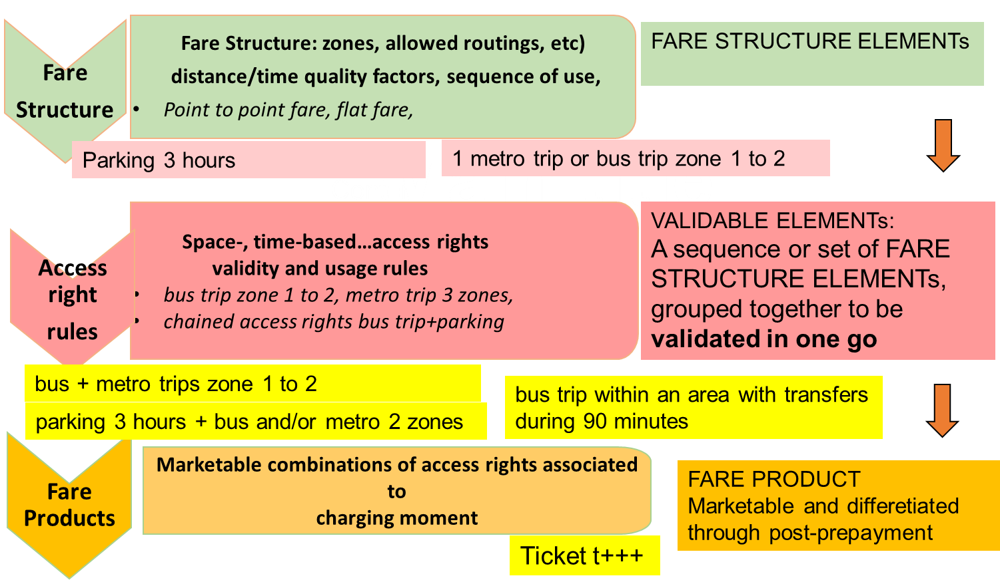  
For this example, we assume that Ticket t+++ is prepaid before use. However, the same access rights may be used in several FARE PRODUCTs, e.g. pre-paid (materialised on a paper ticket and paid before use), post-paid (materialised on a smartcard) and post-paid using a debit card or bank credit card and charged to account).  
A FARE PRODUCT is defined in Transmodel as an immaterial marketable element (access rights, discount rights, etc.), *specific to a CHARGING MOMENT*, which provides a classification of FARE PRODUCTs according to the payment method and the account location (and thus having different contractual terms for the passenger as to obligations and financial risk). For example, pre-payment with cancellation (throw-away), pre-payment with debit on a value card, pre-payment without consumption registration (pass), post-payment etc.

Travel documents

A distinction is also made in Transmodel between

  - the access right to a service,
  - the corresponding products offered to the public (e.g. pre-paid or post-paid fare products) and
  - the materialisation of a fare product *on **a medium*** when sold to the public.

A SALE OFFER PACKAGE is used to describe **the materialisation** of one or more FARE PRODUCT(s) on a specific media or TYPE OF TRAVEL DOCUMENT.  
The same product may be used in different offers with differentiated pricing for different media and distribution channels. Thus our prepaid Ticket t+++ described in the example above, might be offered both as a paper ticket *“Ticket t+++ classic”* and as an app *“Ticket t+++ mobile”* and on a smartcard *“eTicket t+++”.*

# Fare Structures and Tariffs

What are the main types of tariff structures?

As a general classification, the following broad types of tariff structures are commonly found in public transportation:

  - Space-related fares: these may be flat or progressive, and may be zonal or interval-based, point-to point, etc. Interval based fares may be based on simple distances, numbers of stages, numbers of zones, etc.
  - Time-related fares: depending upon time-intervals, may be flat, progressive, etc
  - A combination of the two (e.g. fare structure elements are defined for zones and for time-intervals).

The main components of a fare structure are FARE STRUCTURE ELEMENTs.

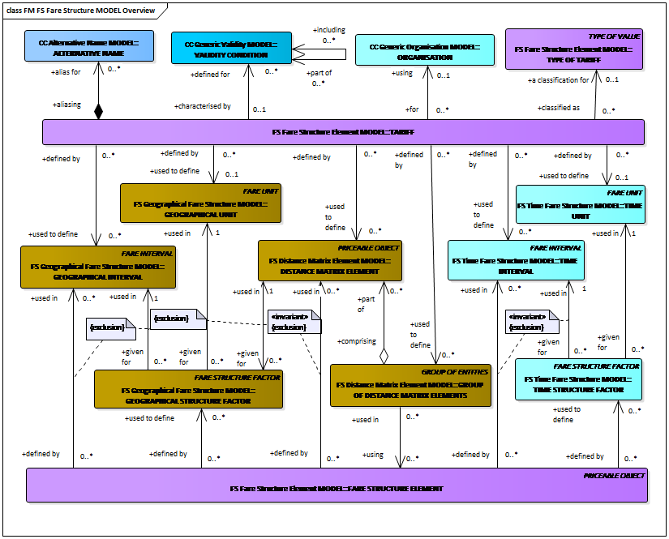  
A TARIFF is a particular instance of a fare structure that groups together the individual elements as a named group with common validity and other properties.

 

Access rights and fare structure

In terms of data model concepts, the description of access rights is organised in a hierarchy of three levels:

  - CONTROLLABLE ELEMENTs,
  - FARE STRUCTURE ELEMENTs (corresponding to one or more CONTROLLABLE ELEMENT).
  - VALIDABLE ELEMENTs (corresponding to one or more FARE STRUCTURE ELEMENT).

The basic component of a fare structure (FARE STRUCTURE ELEMENT) is defined as a sequence or set of CONTROLLABLE ELEMENTs to which rules for limitation of access rights and calculation of prices (fare structure) are applied.  
A CONTROLLABLE ELEMENT is the smallest controllable element of public transport consumption throughout which any particular VALIDITY PARAMETER ASSIGNMENT remains valid.

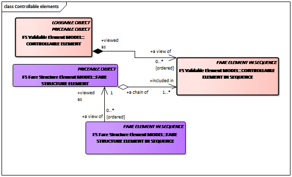  
Examples (see § 1.3) show the usefulness to ‘chain’ access rights related to different fare structures, as in a multimodal, multi-service environment combined (joint) fare products granting access to services to which access rules are determined by several organisational entities are often proposed to the public.. For example, a fare product may include the access to a car park, followed by the access to a museum, or a discount for travellers using a car park and then public transport. If the fare structure of these two components is different (e.g. flat fares for public transport and price based on duration of stay for car parking), they will be described by two different FARE STRUCTURE ELEMENTs. The discount is granted only when the validation process recognises that both have been consumed in sequence.

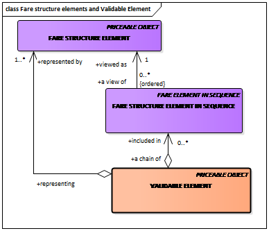  
A sequence or set of FARE STRUCTURE ELEMENTs, grouped together to be validated in one go is called a VALIDABLE ELEMENT (A FARE STRUCTURE ELEMENT, dedicated to being consumed as such, is identical to a VALIDABLE ELEMENT).  
A VALIDABLE ELEMENT may, for example, indicate the consumption rights of a PREASSIGNED FARE PRODUCT (specifying a particular trip).

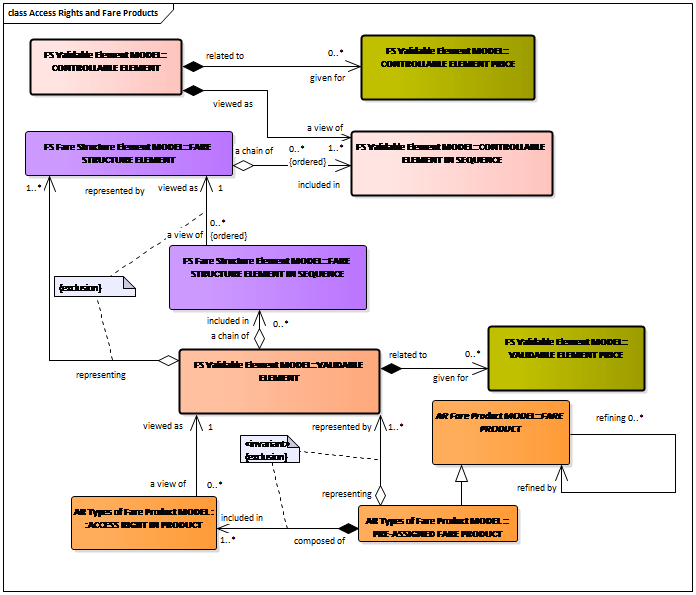  
A key point to grasp is that a VALIDABLE ELEMENT in effect represents the allowed set of choices (conform to the access right rules within a particular fare structure) from which a user may select for a particular step in the journey, rather than one particular single combination of such choices. Thus, continuing with our example, if the access rights are for zone A, or zone B, or a combination of the two (A+B), each with a different price, then the VALIDABLE ELEMENT may be specified using FARE STRUCTURE ELEMENTs that specify the various zone combinations which may be selected. This selection may be multidimensional – for example for a season pass there might both be a selection of zones, and a selection of time periods associated with a given VALIDABLE ELEMENT through the appropriate FARE STRUCTURE ELEMENTs. When a user comes to purchase a product (see later) a selection is made in each required dimension of the tariff structure.

Fare products

As already mentioned in §1.3 above, a FARE PRODUCT is an immaterial marketable element (access rights, discount rights, etc.), specific to a CHARGING MOMENT (i.e. the payment method and the account location: pre-payment with cancellation (throw-away), pre-payment with debit on a value card, pre-payment without consumption registration (pass), post-payment etc).  
So, the CHARGING MOMENT is a classification of FARE PRODUCTs according to the payment method and the account location. This means that to the “access right to the metro network” may correspond to three separate FARE PRODUCTs:

  - a pre-paid one: materialised e.g. by a throw-away ticket
  - a pre-paid one with a debit on a value card
  - a post-paid one: amount debited on a bank card.

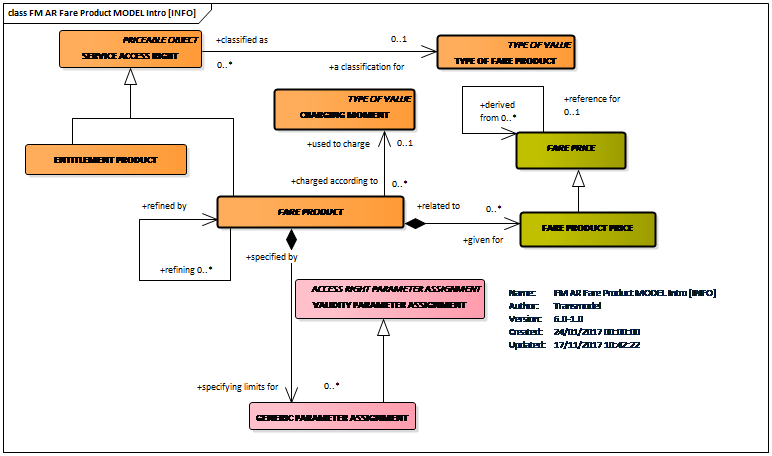  
Continuing with the example from earlier, the access right ‘3 hours parking followed by a trip on the bus or metro within 1 to 3 zones’ is an example of a sequence of 2 access rights originating from 2 different fare structures, used in a certain order (parking followed by public transport trip) and required to be validated together.

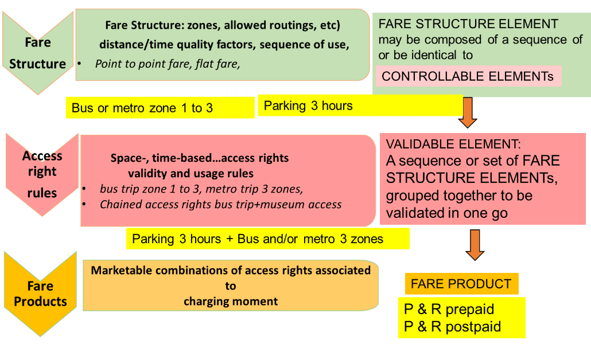  
This access right may be pre-paid or post-paid, i.e. may correspond to 2 different FARE PRODUCTs.  
To be noted, that the different access right elements are related to their PRICE determined through pricing algorithms (see also §6.4 below).  
A FARE PRODUCT may need another FARE PRODUCT to be used, for instance an ENTITLEMENT PRODUCT, defined as a precondition to access a service or to purchase a FARE PRODUCT issued by an organisation that may not be a PT operator (e.g. military card).

# Distance-based fare structure

The most common fare structure rules are space-based, or more precisely, distance-based. The three main types are respectively:

  -   -   - progressive (based on intervals), a GEOGRAPHICAL INTERVAL specifying access rights within the range of this interval: 0-5 km, 4-6 zones etc.;
          - graduated depending on a distance covered during the trip; the distance is computed using a certain unit, the most classical being the distance in kilometres, the number of fare sections (or zones) or the number of stop points. Such a graduation unit is described by the entity GEOGRAPHICAL UNIT;
          - using zones or sections; a TARIFF ZONE is a view of a ZONE, specifically defined for fare calculation; a FARE SECTION is another type of fare structure parameter: it is a subdivision of a JOURNEY PATTERN, consisting of consecutive SCHEDULED STOP POINTs in that JOURNEY PATTERN;

Some of these types may be combined together. The entity GEOGRAPHICAL STRUCTURE FACTOR makes it possible to combine two simple structures into a complex factor. It is identified by a GEOGRAPHICAL UNIT, describing the used graduation unit, and by either a GEOGRAPHICAL INTERVAL (specifying access rights for the FARE STRUCTURE ELEMENTs within the range of this interval: 0-5 km, 4-6 zones etc) or a DISTANCE MATRIX ELEMENT (a cell of an origin-destination matrix for TARIFF ZONEs or SCHEDULED STOP POINTs, expressing a fare distance for the corresponding trip: value in km, number of fare units etc.).

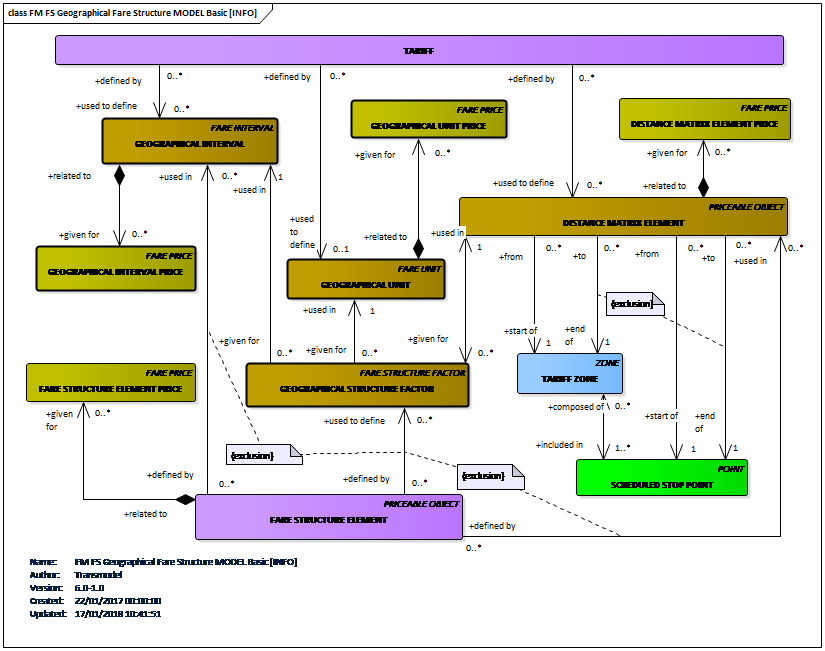

 

# Main components of a time-based tariff structure

The time-based fare structures are described in a similar way to the space-based structures. The entity TIME INTERVAL describes intervals of time (0-1 hour, 1-3 hours, etc.) during which a certain fare is applied to FARE STRUCTURE ELEMENTs. A graduated time-based structure will be defined using a specified TIME UNIT (e.g. days, hours or minutes).

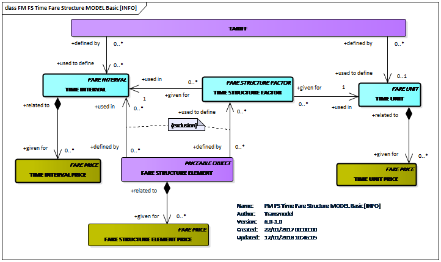

Both types of structures may be combined into TIME STRUCTURE FACTORs. This allows for instance to specify a fare per hour spent, which varies depending on the range of days spent.

# Modelling access right rules

To model a ‘fare’, Transmodel uses the concept of an ‘access right’ to a service rather than ‘pricing’ or ‘tarification’ rules. Transmodel distinguishes between:

  -   -   - ‘access rights’ to a service which are represented by a set of rules (determined by a range of parameters) and related to the fare structure and
          - ‘prices’ which are applied to the ‘access rights’.

This approach allows the combination of different rules and a flexible assignment of different parameters. 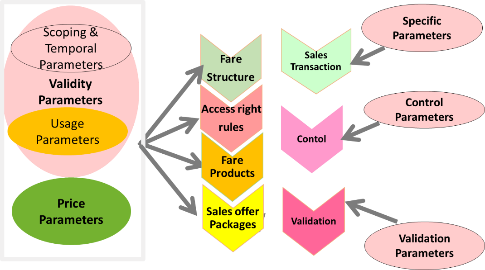 It is possible, for example to express the following rules (using the different types of parameters):

  -   -   - the access right is valid on all bus network LINEs except for LINE 278 and LINE 66’ or
          - the access right to zone 4 is not valid between 2 a.m. – 4 a.m.

Assigning and combining rights

Access rights are specified using an ACCESS RIGHT PARAMETER ASSIGNMENT, which allows specific access rights *to be associated with fare structure components using a variety of ‘validity parameters’*, each specifying which access rights may be consumed.  
Access right limitation rules may be complex and involve *several combinations of parameters and conditions.* These rules may be expressed as *logical propositions with logical operators (and, or, exclusive or)*. This means that different types of combinations of groups of parameters have to be taken into account and that the ACCESS RIGHT PARAMETER ASSIGNMENT is a *multiple (or composite) assignment*.

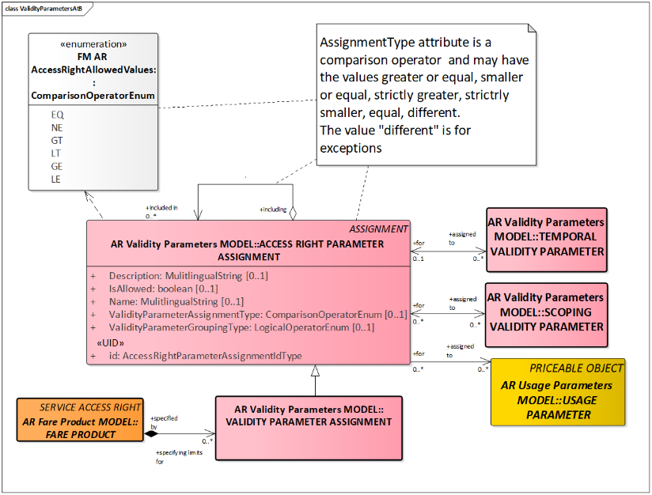

Different characteristics of access rights

Access right rules may concern different components of a fare structure (e.g. FARE STRUCTURE ELEMENT, DISTANCE MATRIX ELEMENT, GROUP OF DISTANCE MATRIX ELEMENTs), products (e.g. FARE PRODUCT, SALES OFFER PACKAGE) or other elements (e.g. VALIDABLE ELEMENT, or CONTROLLABLE ELEMENT) in order to specify the specific rights that are granted or need to be validated.

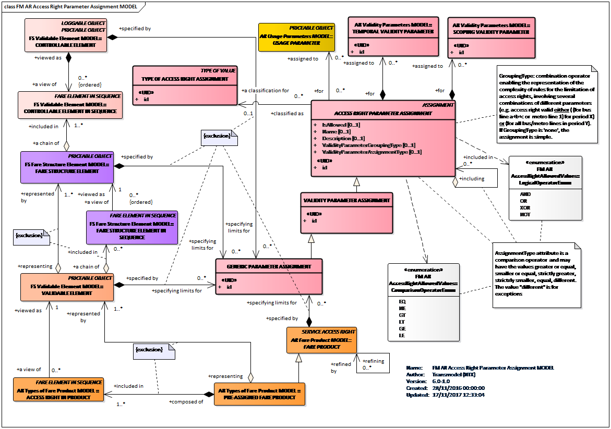  
The *validity parameters* that may be assigned with an ACCESS RIGHT PARAMETER ASSIGNMENT can be considered as being of two main categories:

  - TEMPORAL VALIDITY PARAMETERs reflecting temporal limitations, for example: DAY TYPE or OPERATING DAY on which the assignment applies, the TIMEBANDs during which the assignment applies, the VALIDITY CONDITION or AVAILABILITY CONDITION restricting the assignment.
  - SCOPING VALIDITY PARAMETERs, reflecting mainly spatial limitations, for example: which OPERATORs or GROUPs of OPERATORs, which VEHICLE MODEs and submodes, which LINEs, GROUPs OF LINEs or NETWORKs, which TARIFF ZONEs, FARE SECTIONs, which SCHEDULED STOP POINTs may be used, etc.

Further conditions on fare products

Fare products may also be subject to conditions as to eligibility (who may purchase a fare, adult child, senior, etc) or commercial terms (can it be exchanged, refunded, replaced etc) and other considerations.  
A USAGE PARAMETER is another type of parameter linked to the actual usage of the access rights (e.g. particular user profiles, luggage allowance, booking possibility, necessary to provide a particular entitlement, etc.).  
The figures below show how some of the parameters are instantiated, taking an example of the access right : ‘valid on 1 to 3 zones, for bus network x operated by B, with different price according to whether the user is an adult, child or a student, transfers are allowed up to 30 minutes’

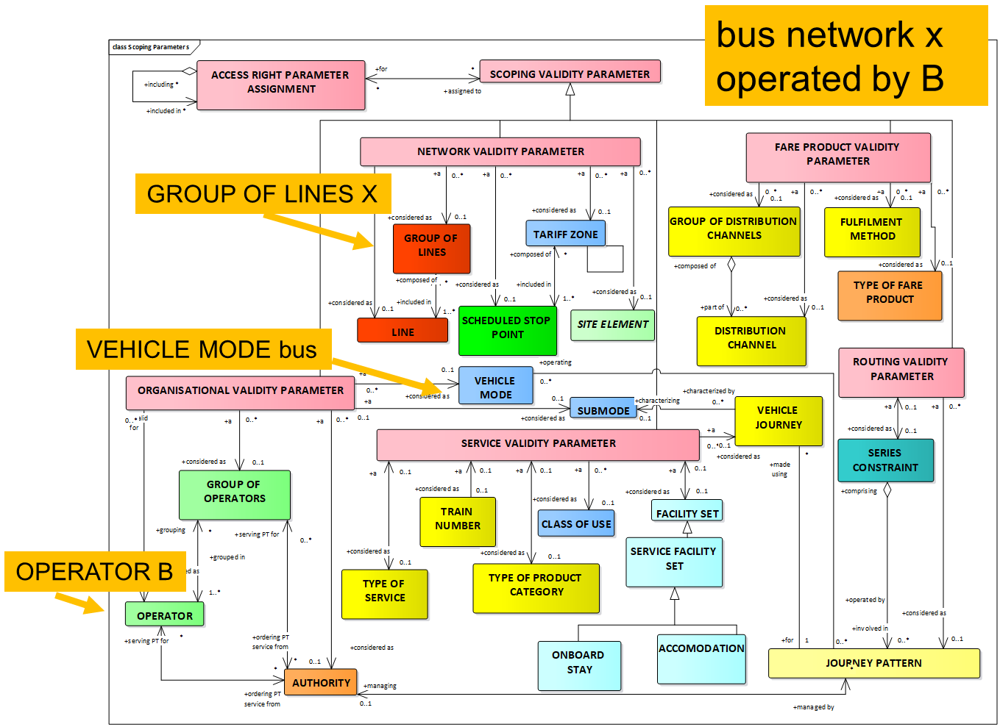

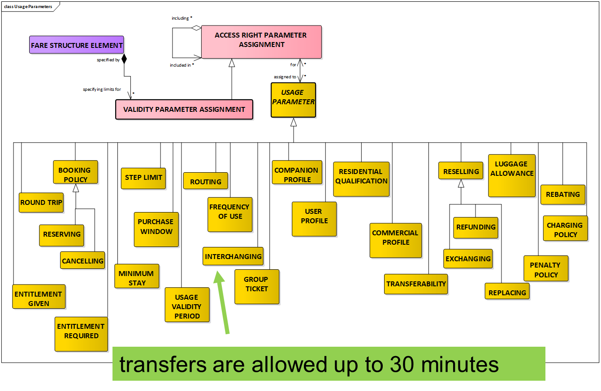

# Sales

What is actually sold during a sales transaction? A travel document? A fare product?

A distinction can be made between the following types of sales-related fare information:

  - sales offer: what is proposed to customers for sale,
  - travel specification; the travel choices the user wishes to make,
  - sales transaction: the record of the purchase event, including what was purchased (and how it was paid for).
  - customer purchase: the particulars of what was actually purchased and whether it has been consumed or not.

A SALES OFFER PACKAGE represents a package to be sold as a whole, consisting of one or several FARE PRODUCTs materialised thanks to one or several TRAVEL DOCUMENTs. The FARE PRODUCTs may be either directly attached to the TRAVEL DOCUMENTs, or may be reloadable on the TRAVEL DOCUMENTs.  
A SALES TRANSACTION is a record of a sale of a SALES OFFER PACKAGE, which is distributed by one or more DISTRIBUTION CHANNELs. The purchase may require the selection of specific tariff elements and usage fare parameters out of all those available in the product or products.  
The CUSTOMER PURCHASE PACKAGE is the result of an individual purchase of a SALES OFFER PACKAGE by a TRANSPORT CUSTOMER, giving access rights chosen from those offered by one or more FARE PRODUCTs in the offer, materialised as one or several TRAVEL DOCUMENTs.  
A TRAVEL DOCUMENT is a particular physical evidence to be held by a passenger, (ticket, card, etc..) allowing the determination of the right to travel or to consume joint-services. It may comprise just a token associated with an online account, or some form of representation of the access rights. Sometimes, the TRAVEL DOCUMENT may be used by the customer as means of payment (e.g. a smartcard with an electronic purse allowing the consumption of access rights). In some cases, especially with Account Based Ticketing, there is no proper TRAVEL DOCUMENT issued: the means of payment (e.g. a credit card) plays the role of a TRAVEL DOCUMENT during the consumption.  
The TYPE OF TRAVEL DOCUMENT specifies the nature of the TRAVEL DOCUMENT which can be created for a specific SALES OFFER PACKAGE. An instance of the TRAVEL DOCUMENT will be created when the SALES OFFER PACKAGE is purchased, its contents being represented by a CUSTOMER PURCHASE PACKAGE.

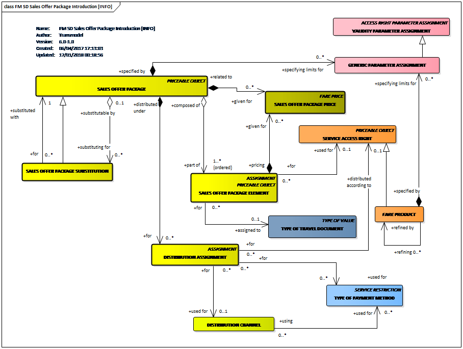

What information is needed to describe the sales transactions?

The Sales Transaction model is modularised into a number of sub-models:

  - The Fare Contract MODEL describes identified CUSTOMERs and their CUSTOMER ACCOUNTs and FARE CONTRACTs. The Customer Payment Means MODEL and the Customer Eligibility MODEL describe additional aspects of CUSTOMER ACCOUNTs.
  - The Retail MODEL identifies RETAIL CONSORTIUMs, ORGANISATIONs that sell products, and RETAIL DEVICEs used to sell products.
  - The Sales Transaction MODEL records sales of SALES OFFER PACKAGEs. TRAVEL SPECIFICATION ENTRYs describe each specific selection of theoretical fare elements for an individual SALES TRANSACTION.
  - The Sales Debit MODEL describes the different types of debit which may occur during the purchase and after sales of fare products (e.g. refund, exchange).
  - The SALES TRANSACTION FRAME model describes the elements used to group sales data for exchange, such as SALES TRANSACTIONs, CUSTOMER PURCHASE PACKAGEs, TRAVEL DOCUMENTs, etc.

An overview is presented below:

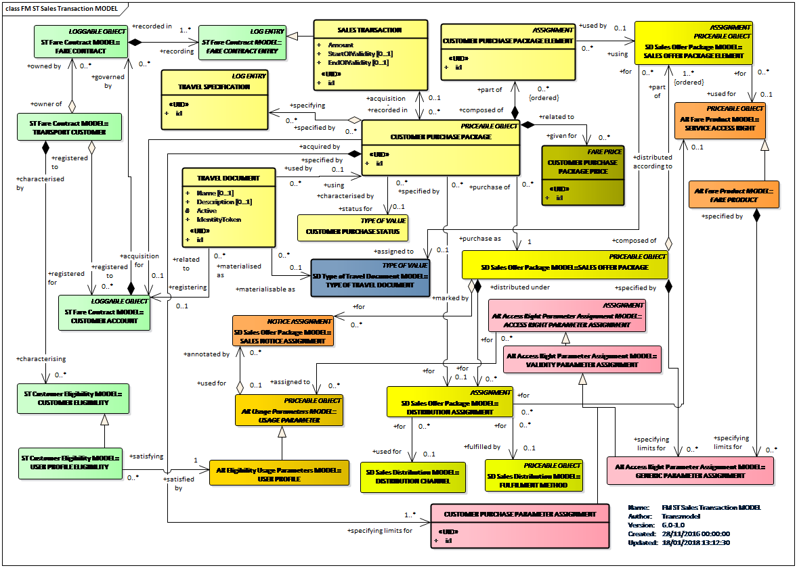

How are represented retail and security aspects?

Certain aspects of the retailing networks that sell fare products are relevant for control purposes, and also for the provision of passenger information. The groups of approved organisations who may sell products are represented as RETAIL ORGANISATIONs; these may be any of the specific types of organisation (OPERATOR, AUTHORITY, TRAVEL AGENT, etc.) found in the reference model, who fulfil a FARE PRODUCT RETAILER ROLE.  
A RETAIL CONSORTIUM is a legally incorporated ORGANISATION with two or more members that undertake the sale of certain products. It registers RETAIL DEVICEs able to sell FARE PRODUCTS and issue TRAVEL DOCUMENTs.  
The RETAIL CONSORTIUM maintains SECURITY LISTs of valid and invalid RETAIL, along with those of CUSTOMERs, CUSTOMER CONTRACTs and TRAVEL DOCUMENTs.

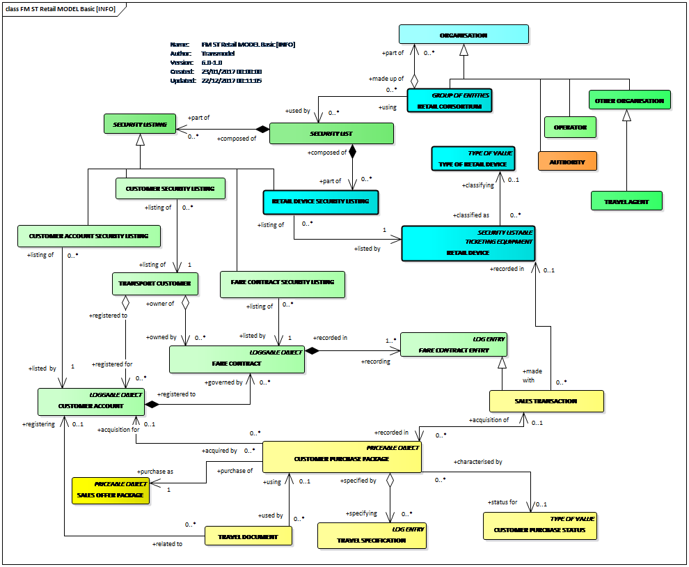

How to represent the prices of the fare elements?

The data model includes a set of pricing entities, which provide the factors necessary to calculate the price. Specific algorithms are responsible for applying the local price calculation rules to this basic data, but which are not themselves modelled in detail.  
Prices may thus either be distributed as a set of base prices and the pricing parameters, or as fully resolved derived prices for every required fare structure element and access right.  
The method used to derive a price from another price can be indicated on the price by a PRICING RULE, which can include a discount applied (DISCOUNTING RULE) and limits as to the minimum and maximum prices to be charged that are in effect (LIMITING RULE), as well as recording any tax applied.  
Any FARE PRICE may be calculated by PRICING RULEs, in particular discounts may be calculated using specific DISCOUNTING RULEs.

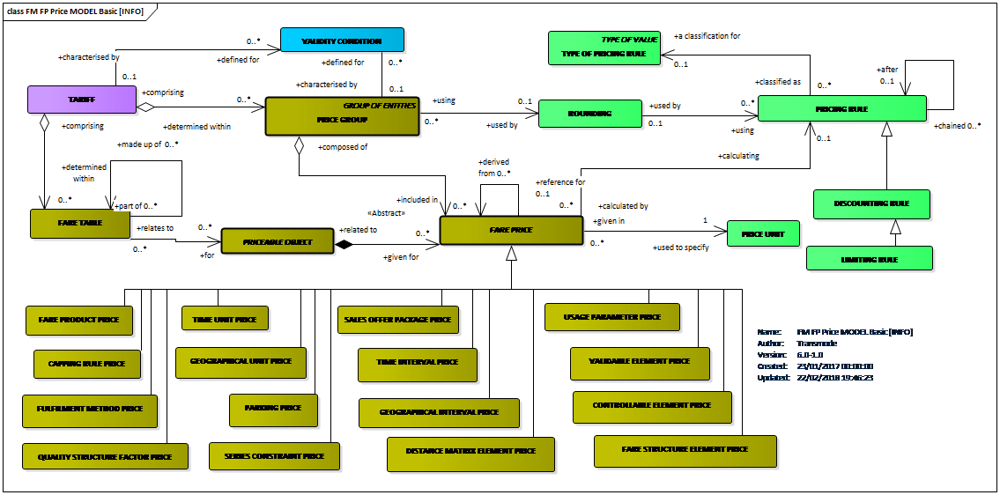

# Ticketing equipment

TICKETING EQUIPMENT (introduced in EN12896-2) is a specialization of PASSENGER EQUIPMENT for ticketing.

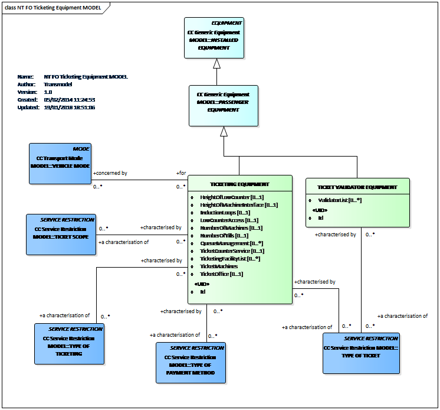 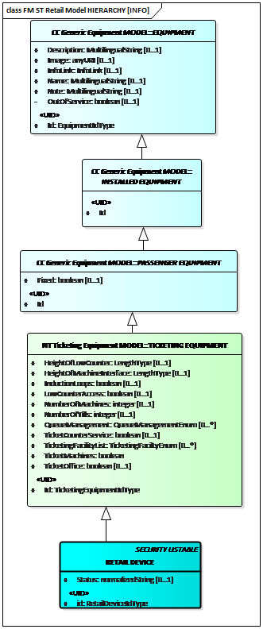

A RETAIL DEVICE is a specialisation of the TICKETING EQUIPMENT used to sell FARE PRODUCTs. Its identity can be used to record fulfilment and support security processes. A RETAIL DEVICE is also SECULITY LISTABLE, i.e. an entity capable of being placed on a SECURITY LIST.

# Control and Validation

What are the control / validation processes?

Control is the checking of a passenger’s entitlement to consume access rights, e.g. at the start or during a trip and involves checking that the customer has an appropriate ticket and marking it as used (‘cancellation’). Multiple controls may be made on a passenger during a trip.  
A control process is thus an elementary action of collecting data on the rights attached to the TRAVEL DOCUMENT being controlled and comparing it against equivalent parameters describing the actual inspection context (location, time, specific train, etc.) in order to validate it.  
Validation is the verification that an access right is valid, has been consumed and that this consumption was allowed. It uses the results of one or several consecutive controls and with media centric and account based ticketing systems, may trigger the charge to the customer for the trip.  
Validation is based on the comparison between the rights attached to a FARE PRODUCT stored on a TRAVEL DOCUMENT and the data collected through previous controls, characterising the actual situation. In the event that access rights are not valid, a penalty may be incurred by the traveller. In interoperable systems, validation is important for accounting between different networks.  
Possible consequences of these processes are:

  - Offence, registration on security lists, etc
  - Debit
  - Possibly marking of the travel document and/or contract
  - Preparation of data for registration in the back office

An overview of the different aspects and stages of the control/validation processes and main data concepts involved are presented below.

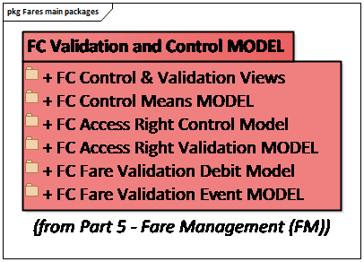

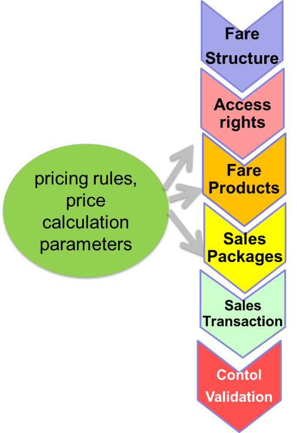

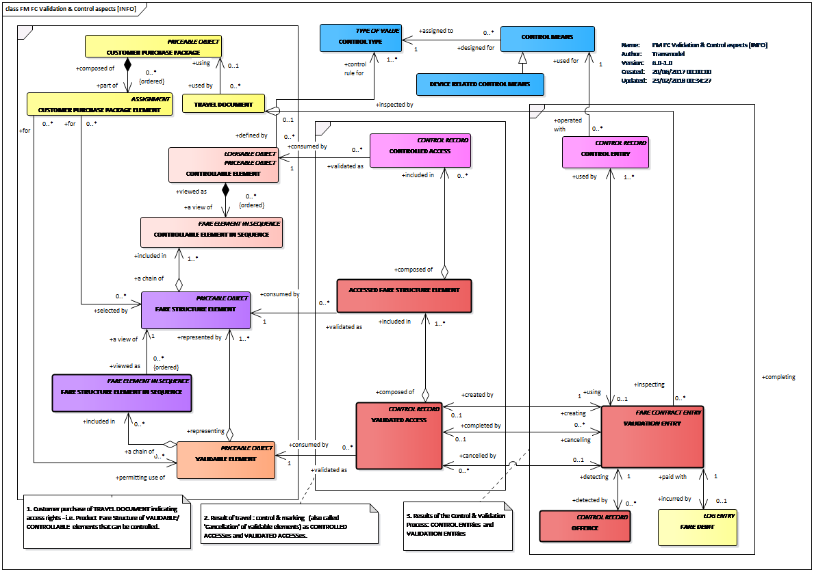

# Fare Management Events and Log Entries

Events and associated entries

The Generic Event model (introduced in EN12896-5, Annex B “Additional Common Concepts”) represents interactions with a system by an external actor. An EVENT represents such an interaction, occurring on an OPERATING DAY and usually recorded in the system, having some consequences on one or more ENTITIEs. EVENTs may be classified as TYPE OF EVENTs.  
The LOGGABLE OBJECT is a general-purpose mechanism allowing the recording of state of an object.  
When an EVENT happens to a LOGGABLE OBJECT it is recorded as a LOG ENTRY.  
A LOGGABLE OBJECT can have one or more timestamped LOG ENTRIES. LOG ENTRIES provide a detailed audit trail and may be processed to create summary statistics; they may be archived off- line.

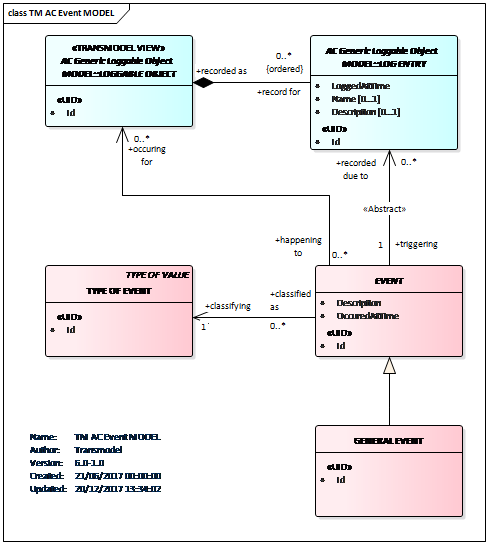

Fare Management Events

In the context of Fare Management, the EVENTs may be either initiated variously by passengers taking PASSENGER TRAVEL EVENTs, CUSTOMER RETAIL EVENTs, CUSTOMER ACCOUNT EVENTs or CUSTOMER FULFILMENT EVENTs, or be initiated by fare control and Account Based Ticketing systems, represented by ACCOUNT PROCESSING EVENTs.

Fare Management LOG ENTRies

LOG ENTRies record EVENTs as different actors interact with the system. Different LOG ENTRies are relevant to different ticketing technologies, as summarised below.

Fare Events and Log Entries: Account Processing Event Model

As shown in the Event Model, EVENTs trigger LOG ENTRies, for instance, as shown in the Account Processing Event Model below.

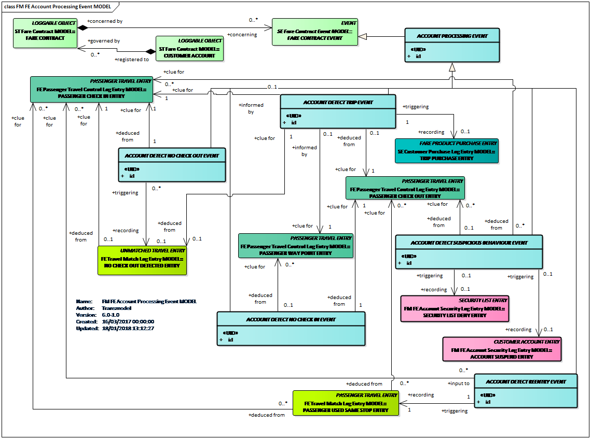  
Similar models describing in detail the link between the different fare management events and log entries are presented in EN12896-5. The diagram below describes the PASSENGER TRAVEL CONTROL EVENT and the associated LOG ENTRies.

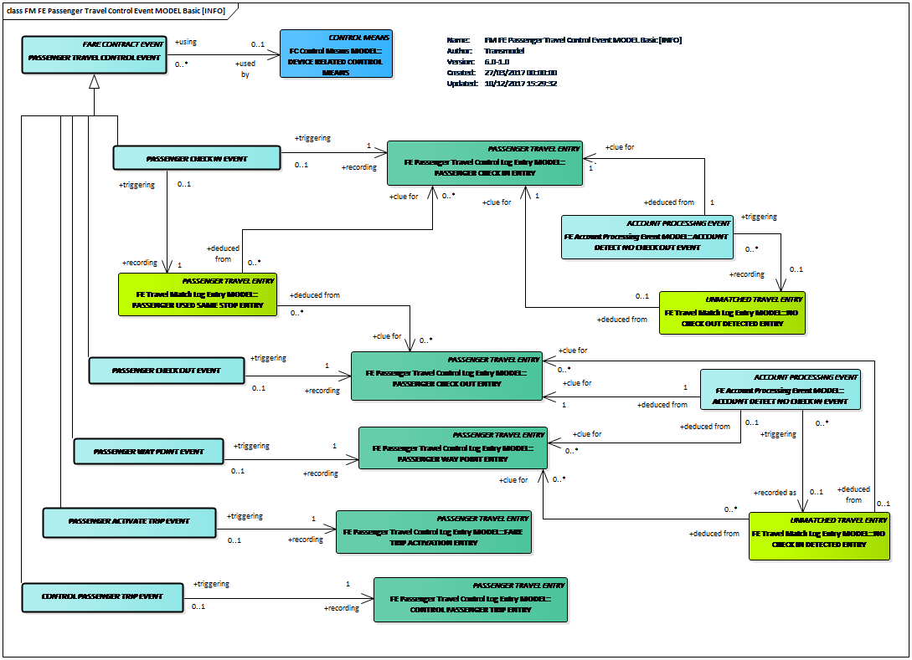

# Different roles of actors linked to the fare processes

To describe a fare process, a number of different roles are identified that may be associated with a given organisation. Some of these are relevant for services other than fares and ticketing, such as ACCOUNT PROVIDER ROLE, IDENTITY PROVIDER ROLE, MEDIA PROVIDER ROLE, MEDIUM APPLICATION OWNER ROLE, MEDIUM APPLICATION PROVIDER ROLE, PAYMENT PROVIDER ROLE, CUSTOMER SERVICE PROVDER ROLE. Others are specific to fares, such as FARE PRODUCT OWNER ROLE, FARE PRODUCT RETAILER ROLE, FARE PRODUCT DISTRIBUTOR ROLE, etc. Extended distribution for rail may also involve FARE PRODUCT ISSUER and FARE PRODUCT ATTRIBUTOR ROLEs. The ROLEs can be considered as specialisations of the general roles shown in the diagram below (EN12896-5, Annex B).

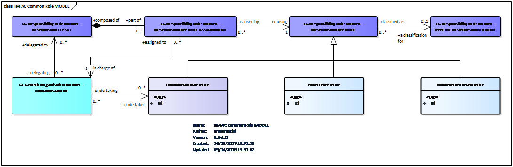The generic model representing the assignment of responsibilities to an ORGANISATION or an ORGANISATION PART is presented in EN12896-1. An overview of the *Management Roles* of an ORGANISATION is presented below.

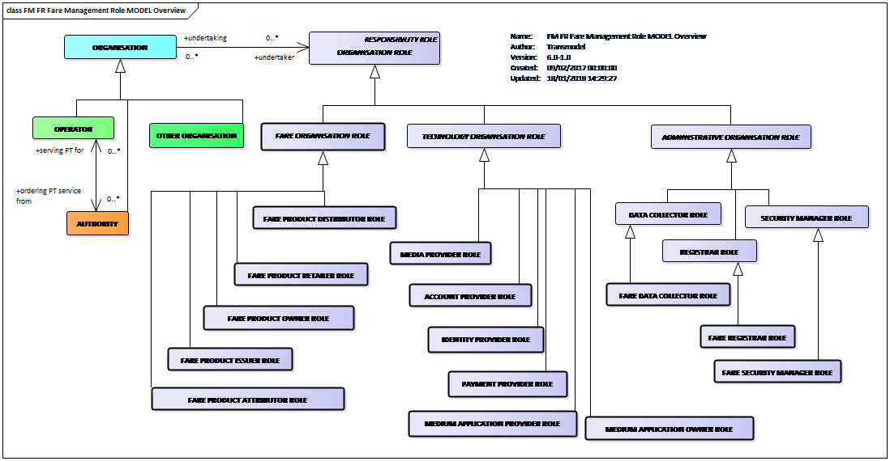The abstract class ORGANISATION ROLE, defined as a generic corporate role to provide or manage transport services, splits into concrete roles, among which into a range of roles related to fare management, as shown in the diagram below. Most of these roles have extensively been described by ISO 24014-1 (Integrated Fare Management) and by the Full Service Model (cf. EN12896-5, Bibliography). Transmodel takes over the semantics of these roles, although, in some cases uses own terminology (role names). Specific FARE ORGANISATION ROLEs are also defined *and related to the relevant concepts of the Fare Model.* An ORGANISATION may have the responsibility to provide any kind of travel related service, i.e. fulfil the TRAVEL ORGANISATION ROLE.

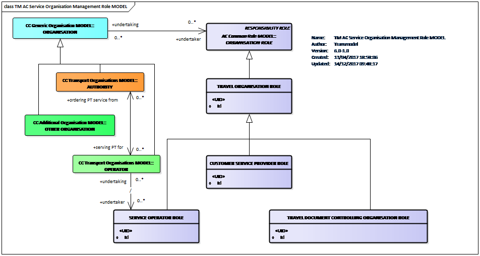The responsibility for the fare control process is shared between the SERVICE OPERATOR ROLE providing any automated barriers and other control equipment, and the TRAVEL DOCUMENT CONTROLLING ORGANISATION ROLE which undertakes control activities; the execution of inspection and other duties may be allocated to individual EMPLOYEEs performing a TRAVEL DOCUMENT CONTROLLER ROLE. The diagram below shows the link of these roles with the related data structures.

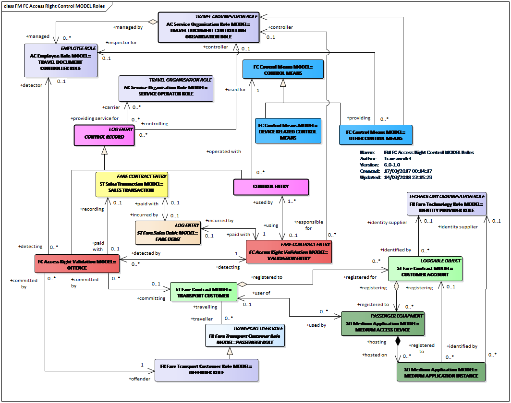
