*You can check the online version or download the pdf version [TUTORIAL-Part1-3: 2016](../../docs/assets/files/TUTORIAL-Part1-3-v0.2-1.pdf). Note that the pdf includes also other two tutorials also available in online version* *([Common](https://mockuptm.itforpt.be/index.php/common-concepts/) [Concepts EN12896 -1](https://mockuptm.itforpt.be/index.php/common-concepts/)* *and  [Timing Information and Vehicle Scheduling EN12896 – 3](https://mockuptm.itforpt.be/index.php/timing-information-tutorial/)).*

# Tutorial: Public Transport Network Topology

Is the road network taken into account?

The model of the infrastructure network is very basic and simple in Transmodel, made of INFRASTRUCTURE POINTs and LINKs. It is used to represent specific operational constraints (restrictions) for public transport operation resulting from the characteristics of the INFRASTRUCTURE POINTs and LINKs and of VEHICLE TYPEs.The spatial detailed organisation of the infrastructure itself is described by other models and the data is usually provided by GIS data sets.

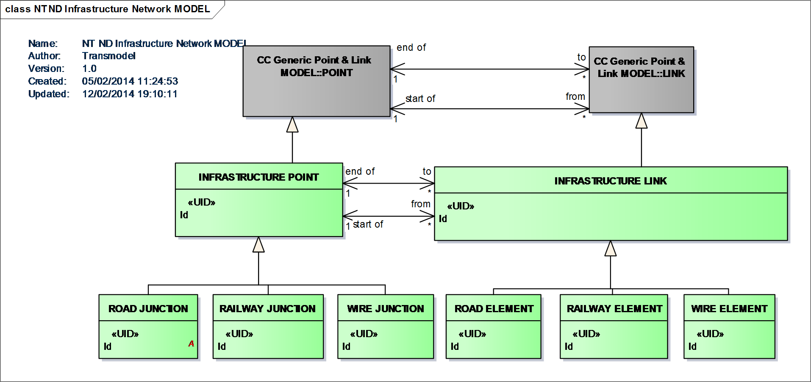

Infrastructure network Model

How to represent the restrictions due to physical constraints of the road network?

Restrictions, i.e. constraints resulting from the physical characteristics of the network are represented in Transmodel by a range of concepts: OVERTAKING POSSIBILITY, IMPOSSIBLE MANOEVRE, MEETING RESTRICTION, VEHICLE TYPE AT POINT. They may be relevant for the scheduling process, because vehicle journeys must be scheduled in a way to avoid such conflicting events.

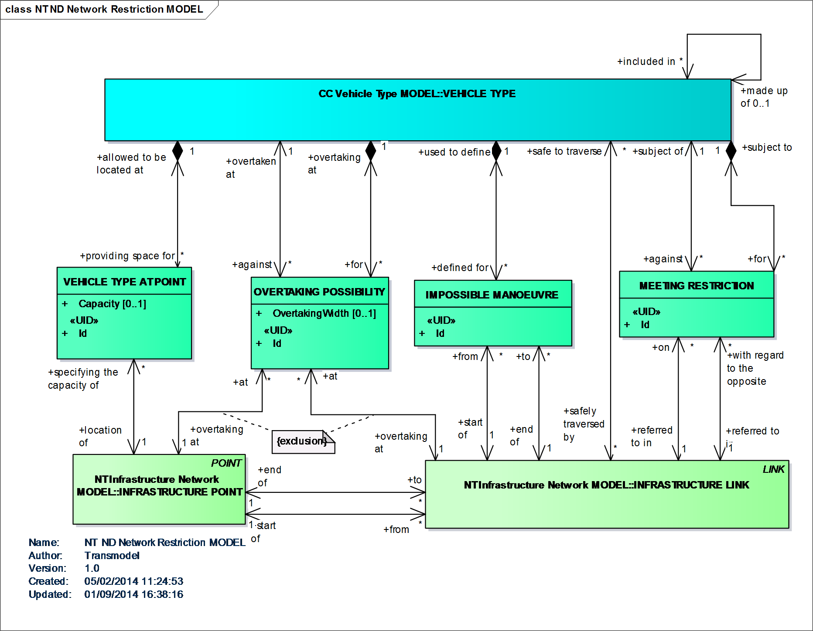

Network restrictions Model

What is an itinerary in Transmodel?

The term “itinerary” is ambiguous as different types of “itineraries” or “paths” may exist, depending on the purpose to be described: for passengers? for vehicles? along roads? along the rail network? a schematic view?  etc.

The ROUTE entity represents a conventional way of describing a path through the network, to be used by regular PT services (i.e. vehicles). A ROUTE is defined as an ordered list of located POINTs defining one single path through the road (or rail) network. A ROUTE may pass through the same POINT more than once.

ROUTE is a LINK SEQUENCE and must be built in a way that identifies a path without any ambiguity (Line & Route Model).

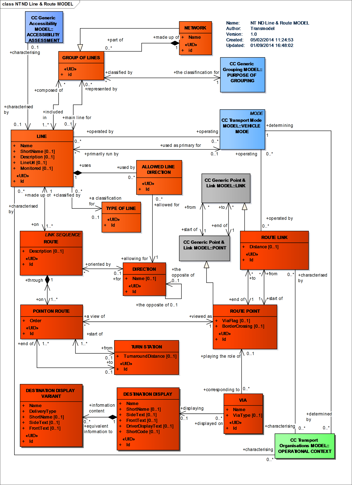

Line & Route Model

Other specialisations of a LINK SEQUENCE are used to define the work of vehicles: JOURNEY PATTERNs, SERVICE PATTERNs, TIMING PATTERNs (see All Journey Patterns Model).

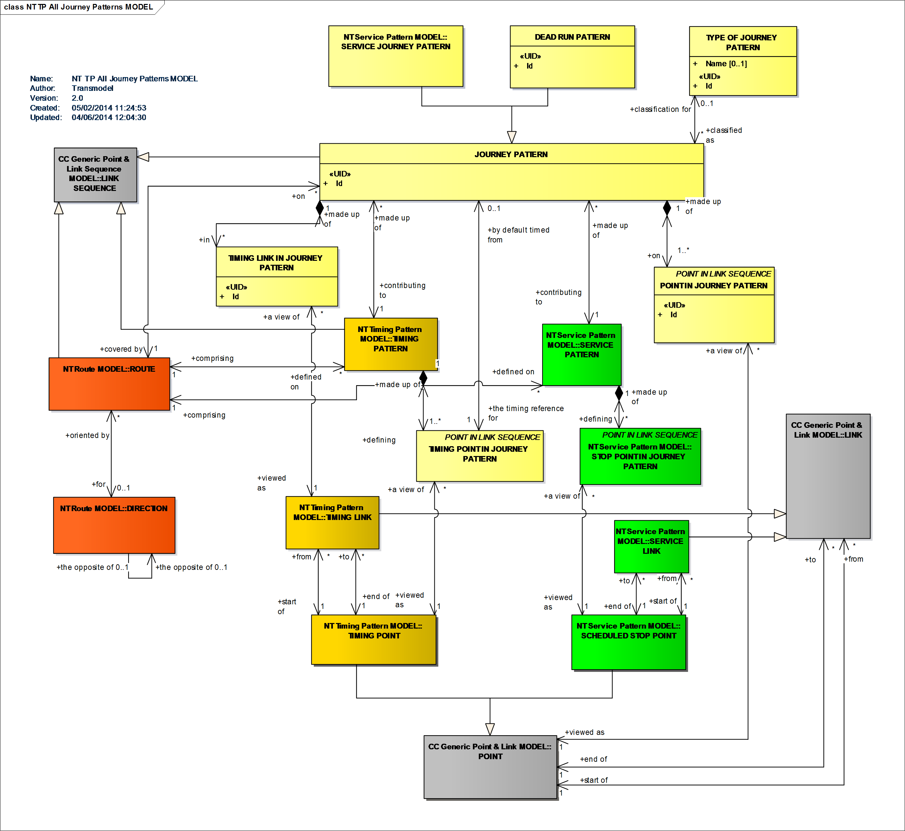

All Journey Patterns Model

Passenger “paths” are called NAVIGATION PATHs (Navigation Path Model).

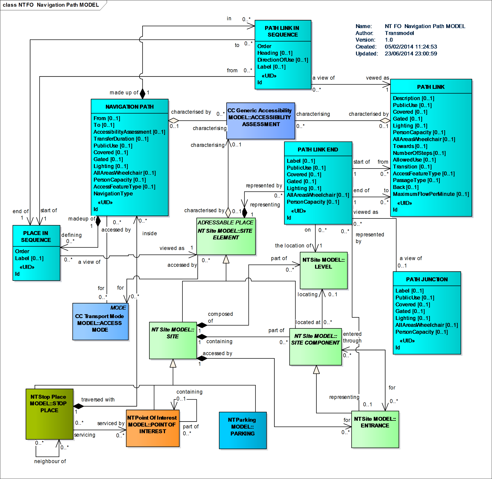

Navigation Path Model

What is a Line vs. a Route?

A ROUTE is a LINK SEQUENCE, defined by an ordered sequence of (two or more) POINTs ON ROUTE. A ROUTE may pass through the same ROUTE POINT more than once, as in the case of a loop.

Transmodel defines a LINE as a grouping of ROUTEs that is generally known to the public by a similar name or number. These ROUTEs are usually very similar to each other from the topological point of view, being variants of a core route with some deviations only on certain parts.

Are routing constraints taken into account?

In order to manage competition between operators or bus lines, PT authorities sometimes define ROUTING CONSTRAINTs, preventing passengers boarding or alighting from a vehicle under certain circumstances.

Several types of constraints are defined.  
Zone based constraints are defined by a ROUTING CONSTRAINT ZONE. The ZONE may be defined by its contained SCHEDULED STOP POINTS or by its boundary points. ZONEs are usually used to express constraints like “If you board in this ZONE, then you can’t alight in the same ZONE”, or “only alighting is permitted in this ZONE”. The constraint applies to all the POINTs IN JOURNEY PATTERN of specific LINEs included in the ZONE.  
A SERVICE EXCLUSION constraint expresses the fact that the service on a specific JOURNEY PATTERN (usually a flexible JOURNEY PATTERN) cannot operate when another (regular) service operates.  
TRANSFER RESTRICTIONs are constraints that can be applied on a CONNECTION or INTERCHANGE between two SCHEDULED STOP POINTs, preventing or forbidding the passenger to make a transfer there.

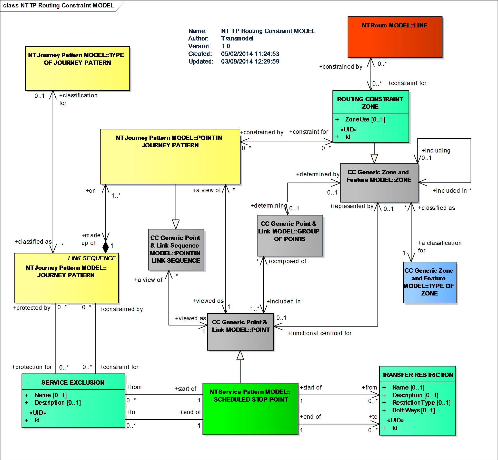

Routing constraints Model

Can I represent a flexible network?

Transmodel does not have a separate model specifically for Flexible Transport Schemes (FTS), but has extra properties that can be used to describe FTS systems: FLEXIBLE POINT (LINK)  PROPERTIES enabling the definition of a FLEXIBLE ROUTE and a FLEXIBLE LINE.  Different types of FTS are considered:    Virtual line service, Flexible service with main route, Corridor service (Flexible service without main route), Fixed stop area-wide flexible service, Free area-wide flexible service, Mixed types of flexible service (not at POINT level) (Flexible Network Model describing Flexible Points, Links, Zones, Routes and Lines). For example:

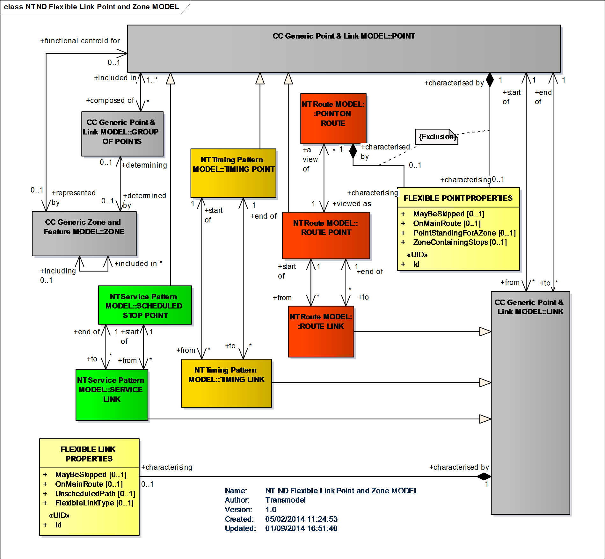

Flexible Link, Point and Zone Model

What is a Journey Pattern?

A JOURNEY PATTERN is an ordered list of SCHEDULED STOP POINTs and TIMING POINTs on a single ROUTE, describing the pattern of working for public transport vehicles. A JOURNEY PATTERN may pass through the same POINT more than once (Journey Pattern Model).

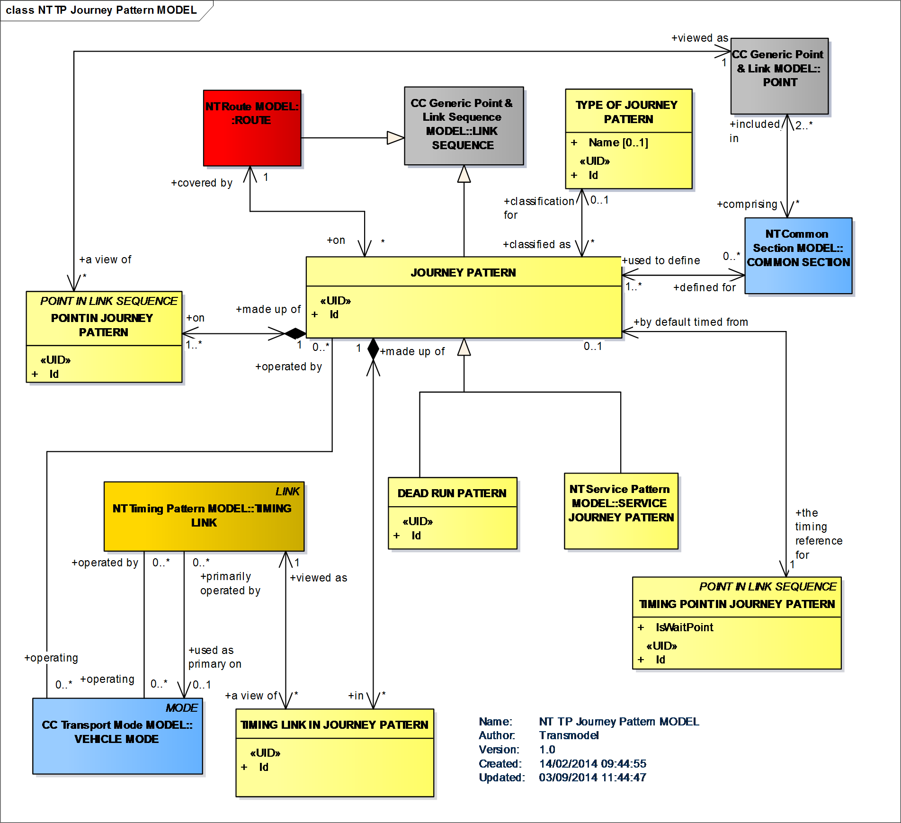

Journey Pattern Model

What is the passenger view of a Journey Pattern?

In the domain of Passenger Information SERVICE PATTERNs are of particular importance, i.e.  the specialisation of a JOURNEY PATTERN made up only of (scheduled) STOP POINTs IN JOURNEY PATTERN.

Another concept in this context is also relevant: the SERVICE JOURNEY PATTERN, defined as the JOURNEY PATTERN for a (passenger carrying) SERVICE JOURNEY (Service Pattern Model).

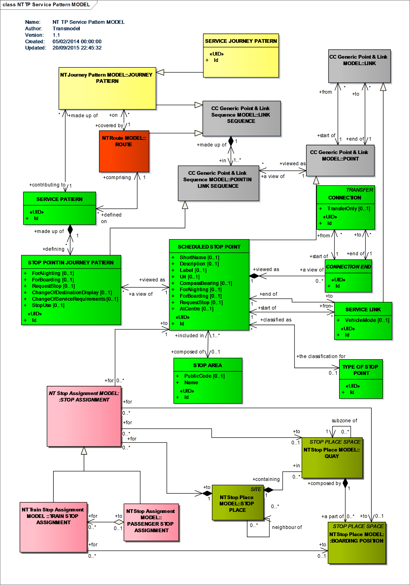

Service Pattern Model

Are elements dedicated to operations monitoring and control taken into account?

Several points, specifically dedicated to operations monitoring and control, are defined as specialisations of POINT: ACTIVATION POINT, BEACON POINT, GARAGE POINT, RELIEF POINT, PARKING POINT (Activation Model & Vehicle & Crew Point Model).

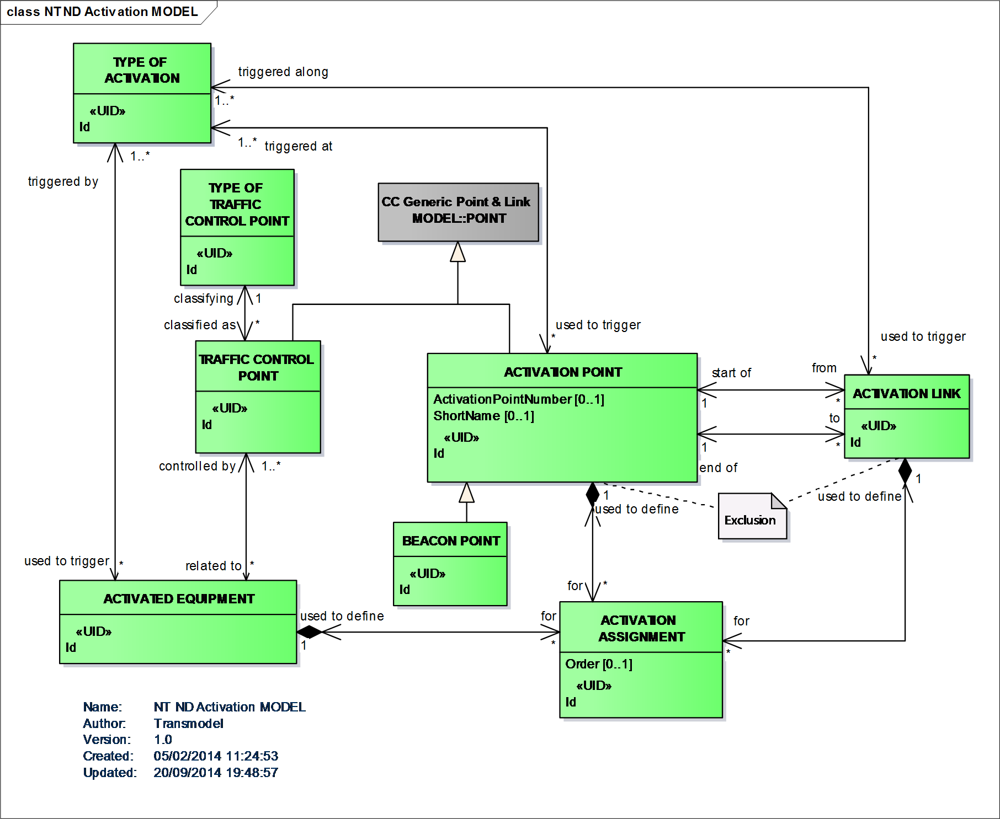

Activation Model

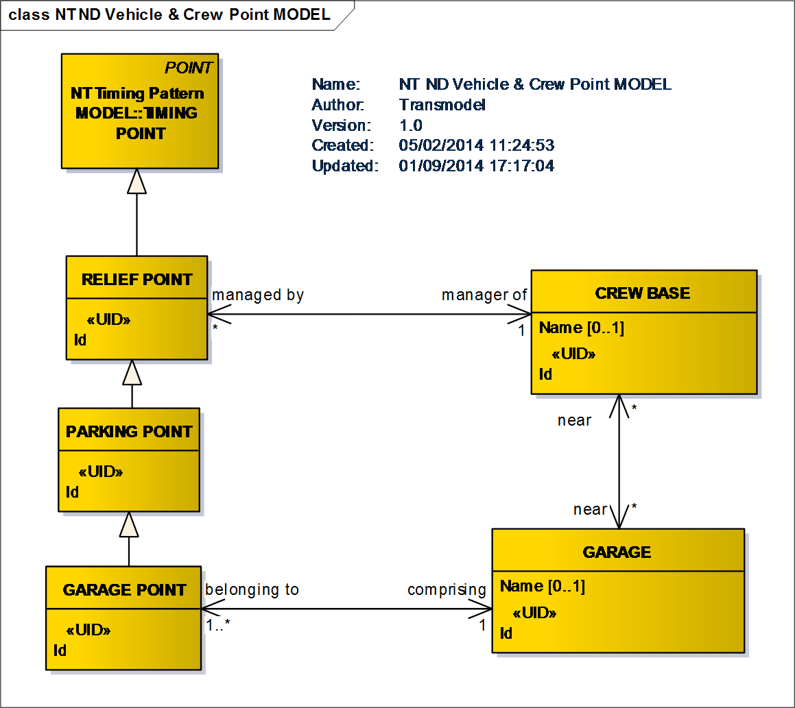

Vehicle & Crew Point Model

What is a Common Section?

A part of a public transport network where the ROUTEs of several JOURNEY PATTERNs are going in parallel and where the synchronisation of SERVICE JOURNEYs may be planned and controlled with respect to commonly used LINKs and SCHEDULED STOP POINTs. COMMON SECTIONs are defined arbitrarily and need not cover the total lengths of topologically bundled sections (Common Section Model).

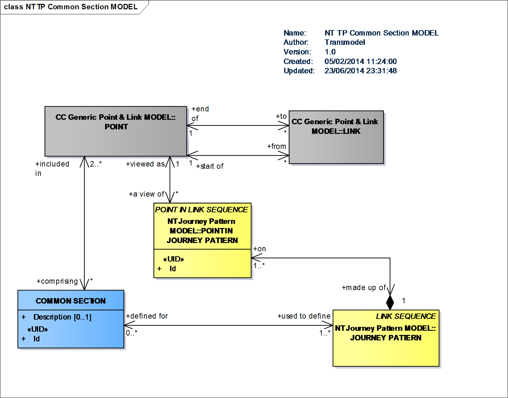

Common Section Model

How can I represent connections with Transmodel?

The physical (spatial) possibility for a passenger to change from one public transport vehicle to another to continue the trip, determined by two SCHEDULED STOP POINTs (Service Connection Model). CONNECTION is a passenger view of a transfer.

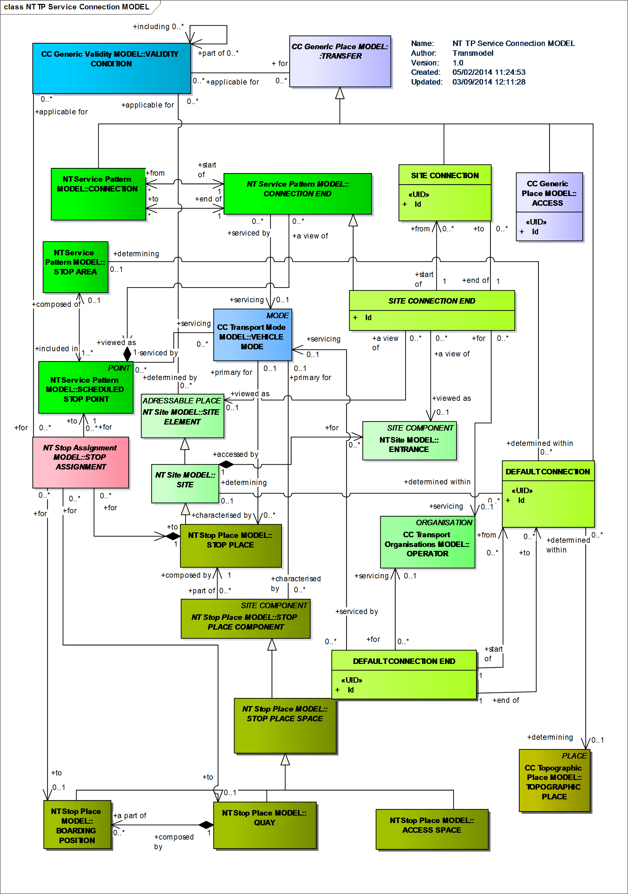

Service Connection Model

INTERCHANGE is an operational constraint for a transfer: it is defined as the scheduled possibility for transfer of passengers between two SERVICE JOURNEYs at the same or different SCHEDULED STOP POINTs (Interchange Model).

  
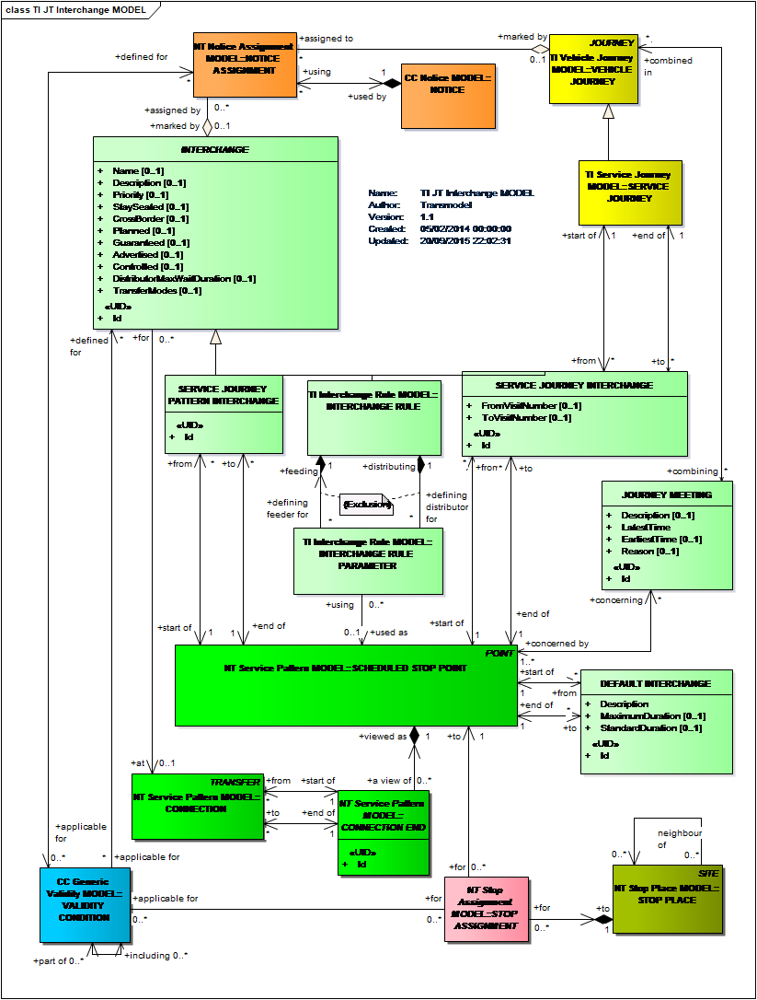

Interchange Model
