*You can check the online version or download the pdf version [TUTORIAL\_Part4: 2019.](../../docs/assets/files/TUTORIAL_Part4_v2.1-1.pdf)*

# Tutorial: Operations Monitoring and Control EN12896 – 4

The domain of operations monitoring and control concerns all activities related to the actual transportation process. It is also known as real-time control, or operations management.

The supply basis for each operating day is known as a production plan, composed of the planned work of each available resource (e.g. vehicles and drivers). It includes for instance all dated journeys planned on the considered day, including occasional services.

The transportation control process supposes a frequent detection of the operating resources (in particular vehicle identification and location tracking). Such collected information is compared to the planned data (e.g. work plan for a vehicle or a driver), thus providing a monitoring of these resources.

The monitored data is used for:

controlling the various resource assignments (e.g. vehicle assignment to a dated block);  
assisting drivers and controllers to respect the plan (e.g. schedule adherence, interchange control);  
alerting on possible disturbances (e.g. delay thresholds, incidents);  
helping the design of corrective control actions according to the service objectives and overall control strategy; the model describes a range of such control actions (e.g. departure lag);  
activation of various associated processes (e.g. traffic light priority, track switching);  
passenger information on the actual service (e.g. automatic display of the expected waiting time at stop points); and  
follow-up and quality statistics.

# Dated production components

What is the temporal context for the domain of Operations Management and Control?

The operational management of public transport is classically divided into two distinct phases:

  - “tactical planning” phase, consisting of designing and building a reference schedule and
  - a further phase of adapting the reference schedule to the real operating conditions, in a plan that is constantly updated during the OPERATING DAY. This phase is known as “real-time control” and called here Operations Management and Control.

Operations require an operational plan for each OPERATING DAY. Such dated plans are elaborated in anticipated time, on a short-term horizon (a few days or possibly a few weeks before the day of operations) and frequently updated. They are usually derived from tactical plans for DAY TYPEs. The latter are assigned to OPERATING DAYs, according to rules taking into account the characteristics of the considered calendar (SERVICE CALENDAR) and the PROPERTies OF DAY assigned to each OPERATING DAY (see also EN12896-1).

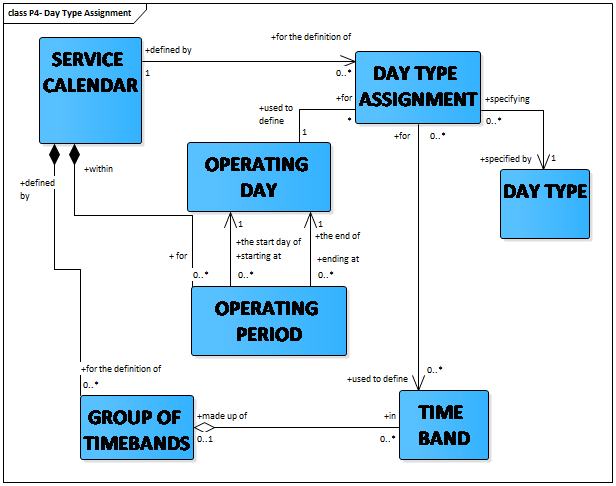

 

What are "dated journeys" and linked main "dated" elements?

Many reasons lead to modification of the operational plan in the short term: special events; changes in the road infrastructure; incidents; etc. Some VEHICLE JOURNEYs may be added or deleted, may use alternative or shortened ROUTEs and JOURNEY PATTERNs, occasional services may be added, etc. If these changes are only valid for one or a few days, the reference schedule for a DAY TYPE is not modified, but the changes are only stored for the appropriate OPERATING DAYs.  
DATED VEHICLE JOURNEY describes a vehicle journey planned for one specific OPERATING DAY.

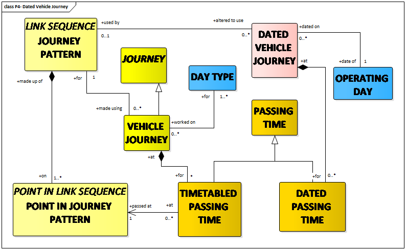  
NORMAL DATED VEHICLE JOURNEYs are based upon a VEHICLE JOURNEY, as produced for a DAY TYPE by the scheduling process.  
EXTRA DATED VEHICLE JOURNEYs may be created to complement a DATED VEHICLE JOURNEY that is already running.  
DATED SPECIAL SERVICEs are created following the same principles. Regular services will be derived from a SPECIAL SERVICE planned for a DAY TYPE.  
The changes made in the DATED VEHICLE JOURNEYs often generate changes in the BLOCKs planned for a DAY TYPE. Therefore, it is necessary to define DATED BLOCKs, which will be valid only on a specific OPERATING DAY.  
A DATED VEHICLE JOURNEY may be subdivided into DATED JOURNEY PARTs. DATED JOURNEY PARTs may be using planned JOURNEY or may be created ad-hoc. One situation when this is of interest is when coupling or un-coupling trains.  
DATED VEHICLE JOURNEY INTERCHANGE describes an INTERCHANGE between two DATED VEHICLE JOURNEYs.  
An overview of the dated production components is provided in EN12896-4.

Is there an example of situations where "dated journey parts" are particularly useful?

DATED JOURNEY PARTs are useful, for example, for the description of the coupling and uncoupling of trains.  
Two trains T1001 and T2002 may operate on the same or different OPERATING DAYs and serve some common stations. Coupling and uncoupling may occur, so there may be

  - VEHICLE JOURNEYs operated by train T1001 serving stations A – B – C
  - VEHICLE JOURNEYs operated by Train N°2002 serving stations A – B – D coupled with T1001 between A and B and then uncoupled in B.

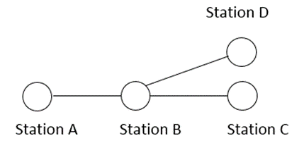  
Coupling and uncoupling and thus the components of the DATED VEHICLE JOURNEYs depends upon the OPERATING DAY.  
The concept of DATED JOURNEY PART is used to describe such situations.

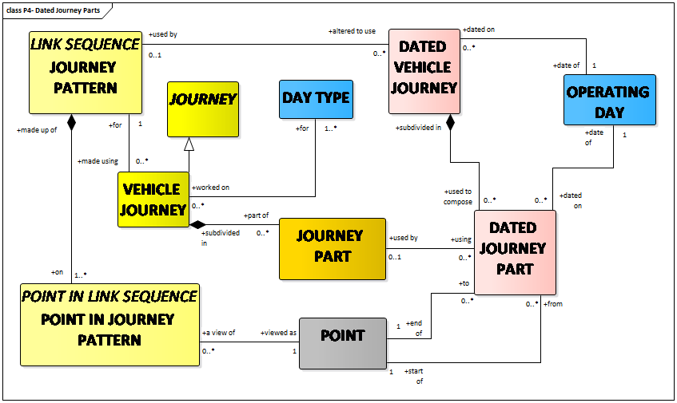

# Production plan

What information is composing a production plan?

The boundary between tactical planning and real-time control is, in most cases, fixed arbitrarily (e.g. at the beginning of the OPERATING DAY, two days in advance, etc).  
Such a limit is often marked by the freezing of a PRODUCTION PLAN which will be the reference for real-time control on a whole OPERATING DAY.  
Several VERSION FRAMEs may be combined in a PRODUCTION PLAN (e.g. three VEHICLE SCHEDULE FRAMEs covered by one DRIVER SCHEDULE FRAME).

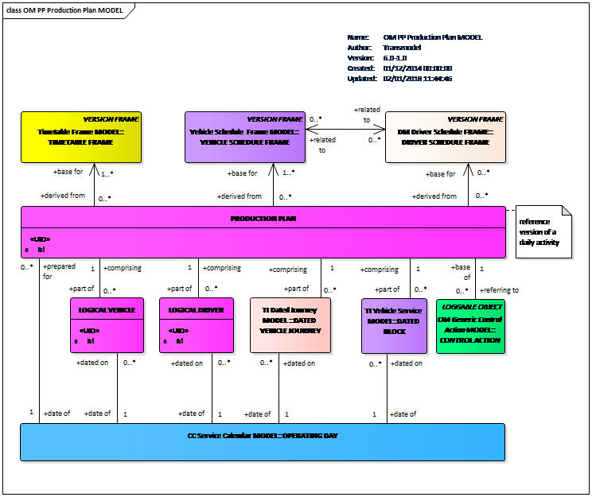

# Resource detection and monitoring

Why are detection and monitoring be considered separately?

It is important to distinguish between detection and monitoring, because a detected vehicle is not necessarily monitored if the available information is not sufficient to describe a monitored situation.  
The basic objective of on-line control and of the systems aimed at assisting AVM is to monitor vehicles in order to implement various actions (follow-up of the service, corrective control actions, activation of passenger information devices or traffic light priorities, etc.). The detection in itself is not really a concern for the reference data model but is a tool to allow the monitoring to be done.

What main data elements characterise the detection process?

The process of detection consists of recognising a vehicle and assigning some data collected by the detection devices to it.  
The detected data may be variable, according to the system capabilities, and multiple data of different types such as physical location, speed, direction, doors opened, occupancy etc. can be included in a VEHICLE DETECTING.  
Each kind of data can be separately registered as a VEHICLE DETECTING LOG ENTRY and marked with the appropriate TYPE OF VEHICLE DETECTING.  
VEHICLE DETECTING LOG ENTRY: a record of detected crude real time data that is recognized to be related with a certain VEHICLE.  
The most classical detected information is the vehicle location, which may be:

  - a POINT (e.g. the vehicle passes an ACTIVATION POINT, such as a beacon),
  - a LINK (rail systems often detect the presence of a train on an INFRASTRUCTURE LINK), or
  - another location, e.g. described by coordinates.

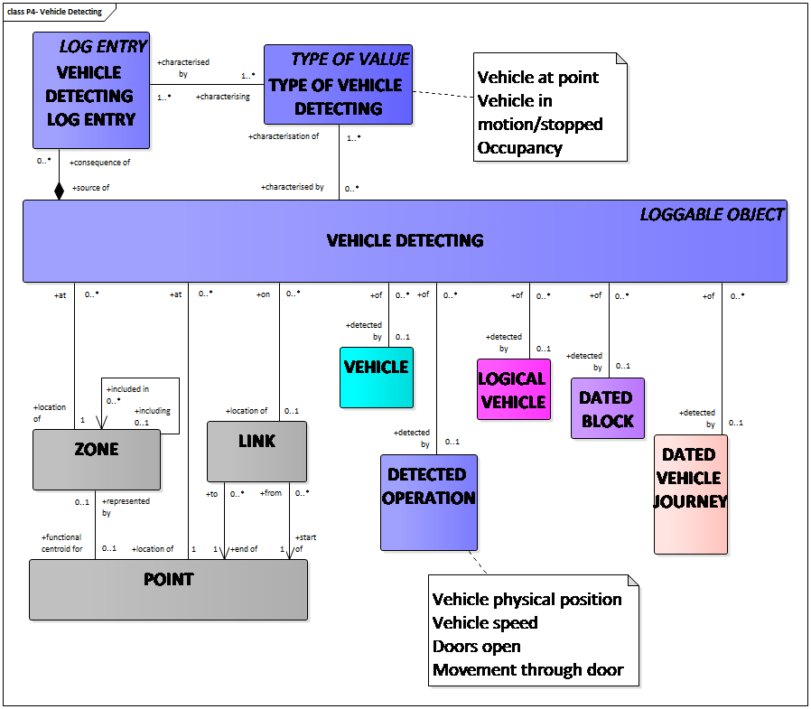

What main data elements characterise the vehicle monitoring process?

The vehicle monitoring consists of computing all available data, in particular the latest valid plan and the data collected through the detection process.  
VEHICLE MONITORING must be related to one LOGICAL VEHICLE. It is identified by this LOGICAL VEHICLE, and a ‘timestamp’ which describes the time of the monitored situation (at this point in time, the vehicle is recognised as operating this vehicle journey), rather than the time at which it is recorded.  
It is occurring either on a

  - MONITORED VEHICLE JOURNEY: a journey that is monitored as being operated by a LOGICAL VEHICLE; or on a
  - MONITORED SPECIAL SERVICE: a special service that is monitored as being operated by a LOGICAL VEHICLE.

TYPE OF VEHICLE MONITORING describes various types of monitored situations.  
A single VEHICLE MONITORING may also result in multiple, related VEHICLE MONITORING LOG ENTRies noting the observed passing time of a point and the calculation of estimated passing times at a number of later points for the same vehicle.

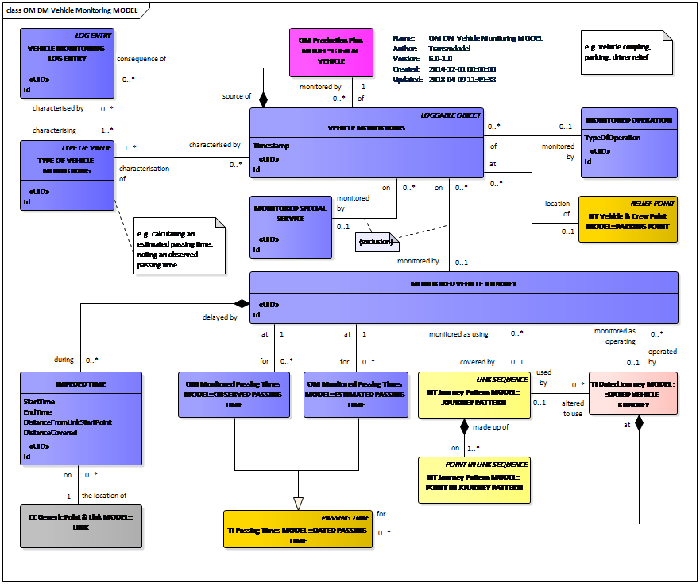

# Control actions

What is the scope of the control actions?

A CONTROL ACTION is an action resulting from a decision taken by the controller causing an amendment of the operation planned in the PRODUCTION PLAN.  
Thus, CONTROL ACTIONs may produce changes in the structure of the activities performed by different resources, e.g. modifications made on journeys cause modifications in the duration of a driver’s continuous work in the same vehicle.  
The CONTROL ACTION may be of different types:

  - COMPOSITE JOURNEY CONTROL ACTION affecting a set of DATED VEHICLE JOURNEYs with a correlated set of adjustments:
  - ELEMENTARY JOURNEY CONTROL ACTION, i.e. non-composite CONTROL ACTION affecting individual DATED VEHICLE JOURNEYs;
  - INTERCHANGE CONTROL ACTION affecting a DATED VEHICLE JOURNEY INTERCHANGE;
  - VEHICLE CONTROL ACTION affecting the LOGICAL VEHICLE;
  - DRIVER CONTROL ACTION affecting a LOGICAL DRIVER (described in EN12896-7).

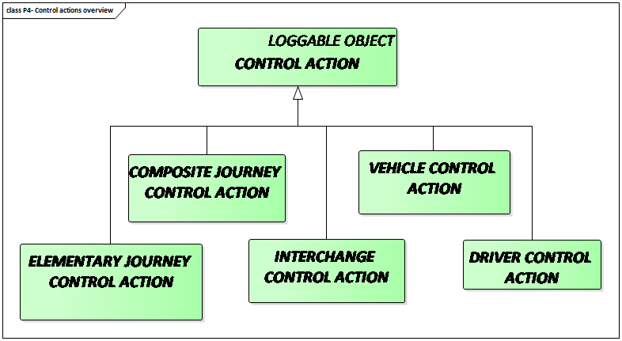

What types of elementary journey control actions are described?

JOURNEY CREATION action is an elementary action in which a completely new DATED VEHICLE JOURNEY is added to the latest valid plan. This action is often complemented by other actions (e.g. RESPACING).  
FLEXIBLE JOURNEY ACTIVATION control action consists to activate DATED VEHICLE JOURNEYs with booking pre-conditions.  
JOURNEY CANCELLATION action is an elementary action consisting of deleting a DATED VEHICLE JOURNEY from the latest valid plan. It is often complemented by other actions (e.g. RESPACING).

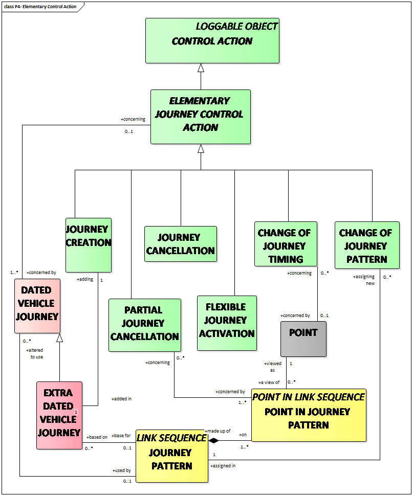  
PARTIAL JOURNEY CANCELLATION is similar to JOURNEY CANCELLATION, with the difference that the complete DATED VEHICLE JOURNEY is not cancelled, only part of it. It can be seen as deleting part of a DATED VEHICLE JOURNEY from the last ordered plan. It can also be viewed as assigning a JOURNEY PATTERN that is a subset of the original JOURNEY PATTERN to a DATED VEHICLE JOURNEY, and thus being a special case of CHANGE OF JOURNEY PATTERN highlighting the reduction of service aspect.  
CHANGE OF JOURNEY PATTERN action consists of assigning a different JOURNEY PATTERN (and the ROUTE supporting it) to a DATED VEHICLE JOURNEY from that which was originally planned. The modification may for instance consist of using an alternate ROUTE when some part of the normal ROUTE is blocked.  
CHANGE OF JOURNEY TIMING action consists of changing one or several characteristics of a DATED VEHICLE JOURNEY related to several timing aspects, such as departure time of the journey from the first POINT IN JOURNEY PATTERN (the most frequent case), departure time of the journey from an intermediate POINT IN JOURNEY PATTERN, TIME DEMAND TYPE assigned to the journey etc.

What types of composite journey control actions are described?

A COMPOSITE JOURNEY CONTROL ACTION consists in:

  - RESPACING consisting in respacing departure times at one POINT after a journey or a vehicle has been added or cancelled, in order to preserve the regularity of intervals.
  - RESORPTION consisting in progressively resorbing a delay on one DATED VEHICLE JOURNEY by rescheduling the departure times at one POINT of the following journeys. It is a way of maintaining regular intervals after a disturbance on a particular journey.
  - DEPARTURE EXCHANGE consisting in permuting at one POINT the departure times of two or several DATED VEHICLE JOURNEYs.
  - DEPARTURE LAG consisting in gradually shifting a set of departures at one POINT. It allows a change of the timetable without abrupt variations in the intervals.

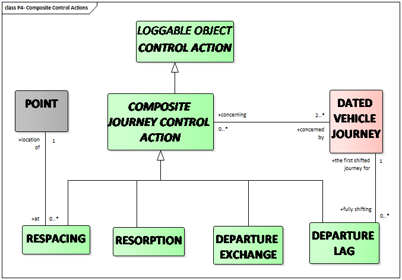

Interchange Control Actions

INTERCHANGE CONTROL ACTIONs are used when there is a need to make short-term changes to the current set of DATED VEHICLE JOURNEY INTERCHANGEs.

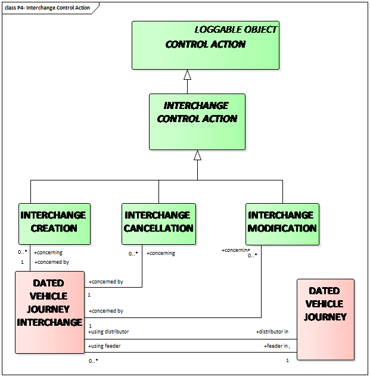  
A DATED VEHICLE JOURNEY INTERCHANGE specifies that a certain DATED VEHICLE JOURNEY (the distributor) should wait for another specified DATED VEHICLE JOURNEY (the feeder) to arrive before departing from a shared stop even if the feeder is somewhat delayed. There will be a specified limit for how long the distributor must wait at the most.

What types of vehicle control actions are described?

A VEHICLE CONTROL ACTION may be:

  - VEHICLE ASSIGNMENT: action consisting in the assignment, or the cancellation of an assignment, of a physical VEHICLE to a LOGICAL VEHICLE. This assignment may be overridden by a further assignment.
  - VEHICLE WORK ASSIGNMENT: action consisting in the assignment, or the cancellation of an assignment, of a LOGICAL VEHICLE to a planned work, represented as DATED BLOCKs or as DATED VEHICLE JOURNEYs. This assignment may be overridden by a further assignment.
  - LOGICAL VEHICLE CREATION: action consisting in creating a completely new LOGICAL VEHICLE (e.g. reinforcement or replacement resource). It is often accompanied by a VEHICLE WORK ASSIGNMENT, in order to assign a work plan to the new resource.
  - LOGICAL VEHICLE CANCELLATION: action consisting in removing a LOGICAL VEHICLE from the PRODUCTION PLAN. The work assigned to it (DATED BLOCKs and DATED VEHICLE JOURNEYs) may remain unassigned for a while.
  - CHANGE OF VEHICLE: action consisting in removing, at a certain point in time and space, all work assigned to a LOGICAL VEHICLE and assigning it to another LOGICAL VEHICLE. Any CHANGE OF VEHICLE is completed by the appropriate VEHICLE WORK ASSIGNMENT. A CHANGE OF VEHICLE is often accompanied by one or two VEHICLE ASSIGNMENTs, replacing also the physical vehicles.

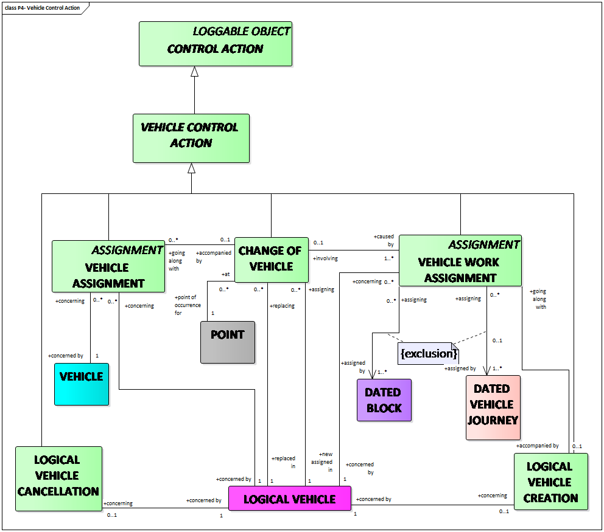

# Events and messages

What main event types are identified within an operating day?

Transmodel considers the concept of OPERATIONAL EVENT, a specialisation of the generic EVENT for the purpose of the monitoring and control operations.  
OPERATIONAL EVENT is defined as any event affecting the public transport operation (production follow-up, management of information or the technical functioning), occurring on an OPERATING DAY and recorded in the system. An OPERATIONAL EVENT is generally causing a CONTROL ACTION.

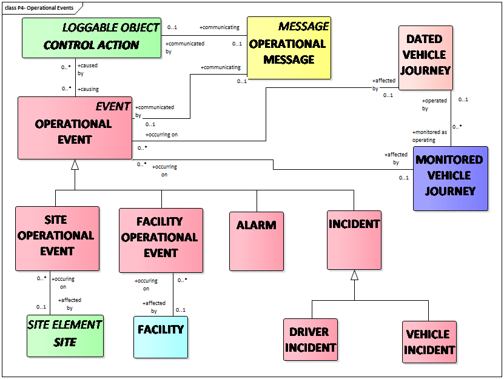  
The main subtypes of OPERATIONAL EVENTs are

  - ALARMs: alerting the staff in charge of operations control on a probable dysfunction: operational threshold exceeded (e.g. delay), emergency call, failure, etc;
  - INCIDENTs: unforeseen EVENTs influencing the operation of the network;
  - FACILITY OPERATIONAL EVENTs: OPERATIONAL EVENTs concerning a FACILITY;
  - SITE OPERATIONAL EVENTs: OPERATIONAL EVENTs applying to a SITE.

One or several OPERATIONAL EVENTs may be recorded as being the cause of one or several CONTROL ACTIONs.  
An OPERATIONAL EVENT may be the subject of an OPERATIONAL MESSAGE. An OPERATIONAL MESSAGE is defined as an information exchange between an EMPLOYEE (e.g. a controller), a LOGICAL DRIVER or a LOGICAL VEHICLE, used to inform about a CONTROL ACTION or an EVENT (see Operational Message Model in EN12896-4).

# Evolution of the transport situations

What is the description of events influencing the transport context?

SITUATION is defined as an incident or deviation affecting traffic or travel circumstances. It’s specialisation – PT SITUATION – is defined as an incident or deviation affecting the planned PT operation.  
RELATED SITUATIONs represent alternate or partial views of the same SITUATION.  
A detailed and structured description of causes and consequences regarding a situation, is necessary for passenger information purposes.

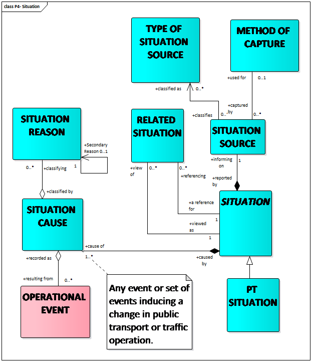  
SITUATION CAUSE (classified by SITUATION REASON) is an event or set of events inducing a change in public transport or traffic operation.  
The origin of the incident or deviation information is described in the SITUATION SOURCE.

How to describe the change of a transport context?

The part or parts of the public transport operation that are directly related to the PT SITUATION are represented by the PT SITUATION AFFECTED SCOPE.  
The PT SITUATION may be causing PT SITUATION CONSEQUENCEs, such as

  - DELAYs (description of deviations from the public transport timetable),
  - CASUALTIES (description of the number of persons that have been injured or died), or
  - EASEMENTs (description of temporary (fare) exceptions allowed because of disruptions),

which may also occur in a wider public transport scope as described by the PT SITUATION CONSEQUENCE SCOPE.  
For example, a bus line that is not directly affected by the incident may still be indirectly affected because stranded passengers might use this bus line instead of their intended bus line, leading to crowding. There could also be passengers that normally change from this bus line to a bus line directly involved in the incident that need to know about the problem so that they can revise their trip accordingly.

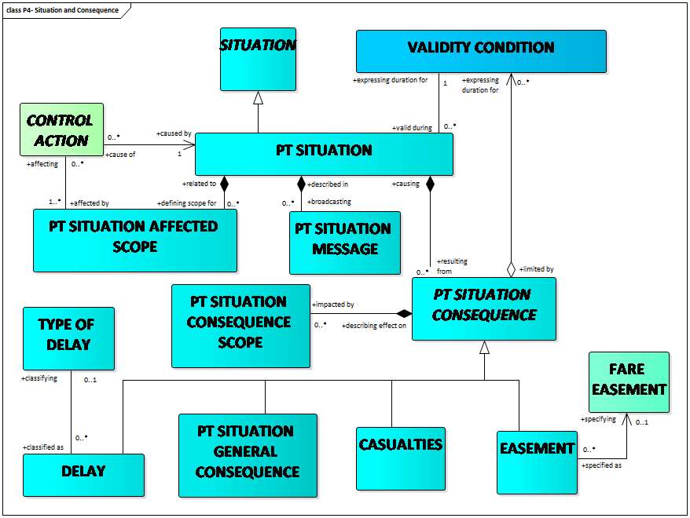  
The same structure of detailed situation, its causes and consequences, is used by SIRI Situation Exchange service (CEN/TS 15531-5:2016) and a similar structure is present in the DATEX II Situation Publication.

# Monitoring of facilities

What types of facilities may be monitored?

A MONITORED FACILITY represents a named amenity or capability where the state of availability is monitored.

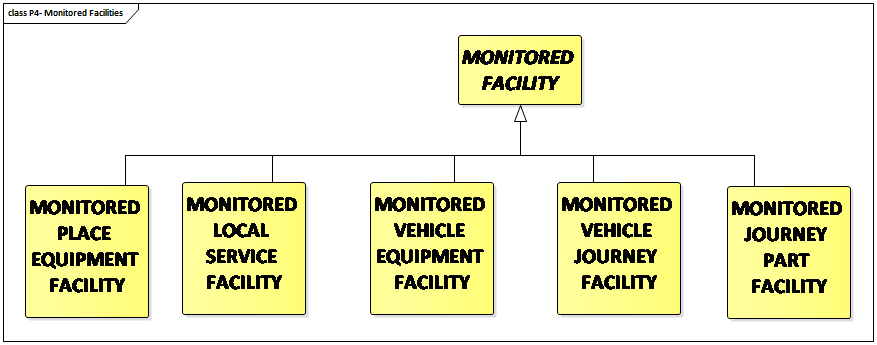  
Five different types of MONITORED FACILITies are identified:

  - A MONITORED PLACE EQUIPMENT FACILITY that is enabled by a PLACE EQUIPMENT such as an escalator or a lift;
  - A MONITORED LOCAL SERVICE FACILITY that is enabled by a LOCAL SERVICE such as porterage services at a station;
  - A MONITORED VEHICLE EQUIPMENT FACILITY that is enabled by an ACTUAL VEHICLE EQUIPMENT installed on board an individual vehicle such as a ramp or automatic doors;
  - A MONITORED VEHICLE JOURNEY FACILITY that relates to SERVICE FACILITY SETs such as “First Class Couchette with shower and 2 bunks” that are available for enhancing a VEHICLE JOURNEY; and
  - A MONITORED JOURNEY PART FACILITY that relates to SERVICE FACILITY SETs but that are available only on part of the VEHICLE JOURNEY.

It is of often of interest to assure that different facilities involved in public transport are currently available and/or whether a replacement facility is proposed.  
First, it is of interest to know what FACILITY MONITORING METHOD is used for the monitoring. FACILITY MONITORING METHOD describes the method and circumstances used to monitor a facility such as manual or automatic, what is the frequency of monitoring , etc.  
A FACILITY CONDITION describes a changed state of availability for a MONITORED FACILITY.  
A FACILITY STATUS categorizes the change to availability of the facility, such as being removed, unavailable or only partially available.  
A PLANNED REMEDY is a pre-prepared counter-measure to compensate a deviating FACILITY CONDITION, that could include utilizing an alternative FACILITY as a replacement.

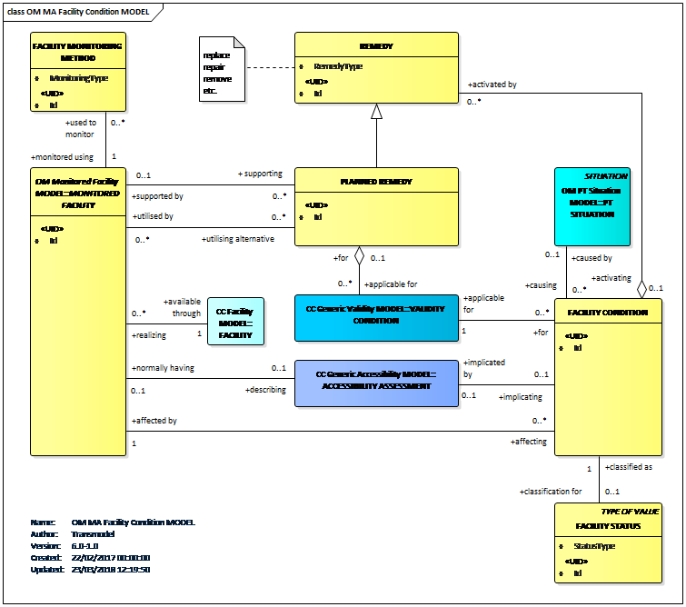  
A mechanism for exchanging information describing the current status of facilities is specified in CEN/TS 15531-5:2016.

Monitored facilites and equipment

An often asked question concerns the link between the facilities and the different types of equipment defined in Transmodel. The diagram below provides this link in the context of installed equipment, in particular at stops.

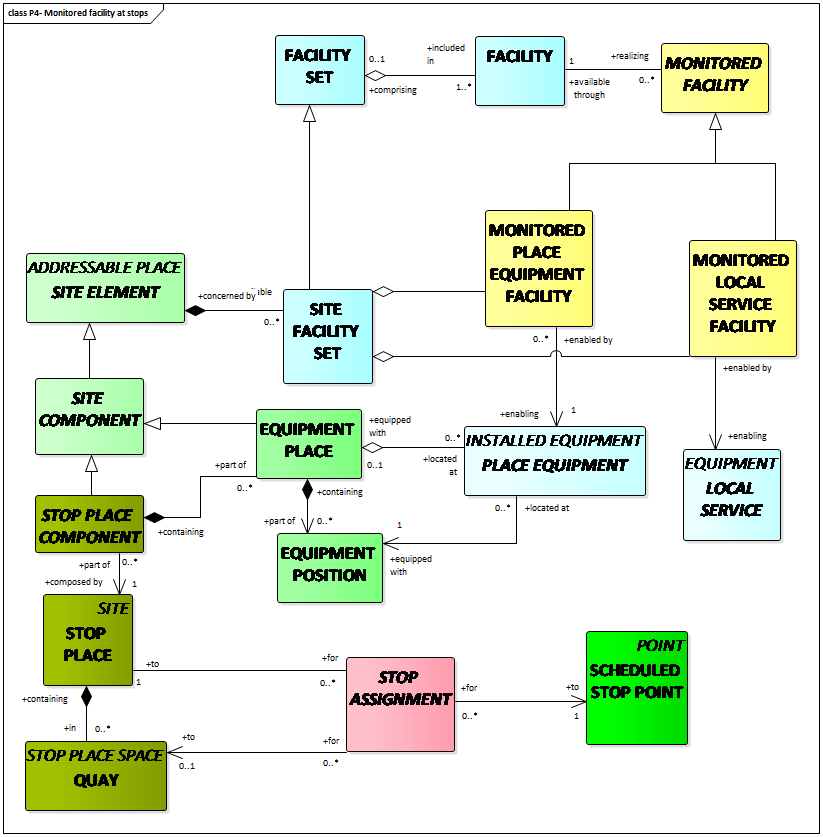  
A more complete overview is provided in the figure below.

# 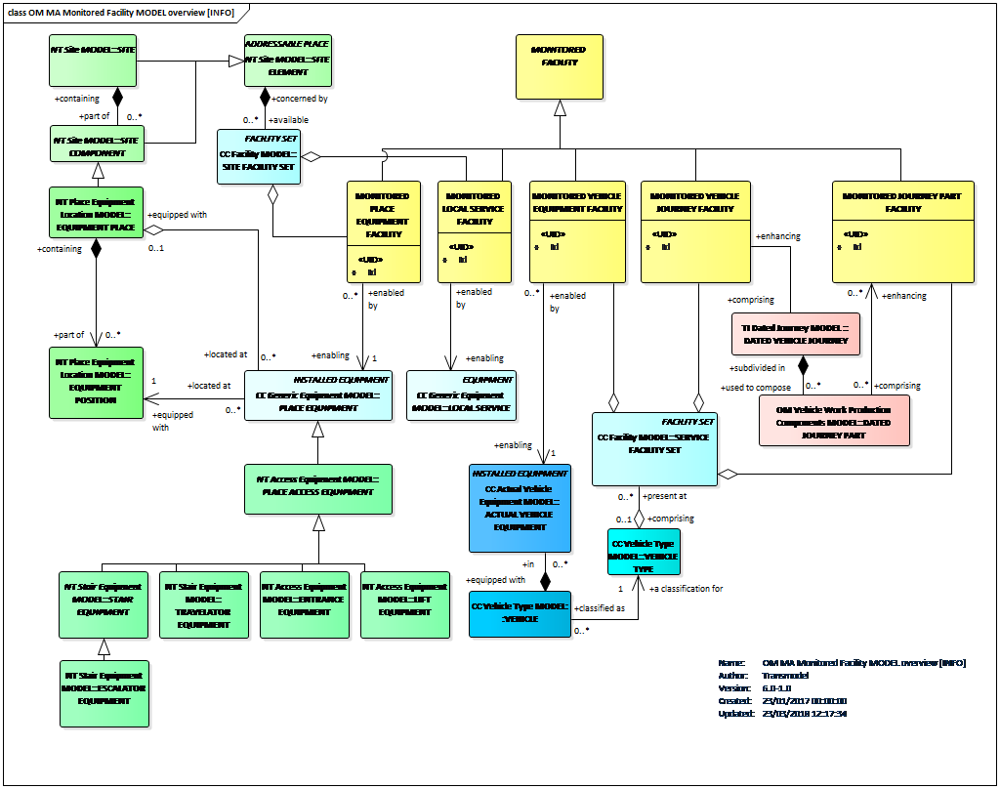
