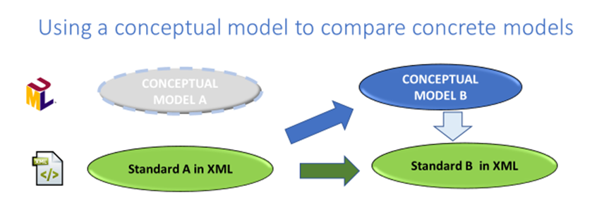

# Standards comparison

A detailed comparison between data models is defined as an oriented correspondence mapping (m) between a 'source' model S and a 'target model' T.

In the comparison method described in “Methodology for comparing data standards" *(link to paper to come)* the 'source' model is the Contributing Standard (marked by a 'S') and the 'target' model, the Reference Model (marked by a 'T').

A comparison of data standards is often lead in view of a conformance statement. Thus, the following steps are of importance:

## A. Determination of a Reference Standard

The comparison (mapping) of standards is preceded by an important step: the definition of the Reference Standard.

A Reference Standard is a specification of which the scope covers a particular data domain in a most comprehensive way. Other standards are Contributing Standards.

In other words: the scope of a Reference Standard is such that the standard is specifically designed to describe/publish data for a particular data domain D, whereas the scope of a Contributing Standard is such that this standard only refers to (uses) the data of D to better describe other concepts.

In many cases, Transmodel has to be considered as the Reference Standard Model.  

In some cases, the INSPIRE data model is recommended as the Reference Model (see <https://publications.jrc.ec.europa.eu/repository/handle/JRC118744>).

## B. Consideration of same levels of abstraction in the comparison

In comparing data standards (mapping of data standards), it is important to understand the level of abstraction being considered. Using higher-level modelling languages such as UML, etc, it is possible to model the intent of data models in an implementation independent manner, i.e., as a conceptual model.

Any comparison of standards must of course be aware at what level of abstraction the standards operate: **compare like with like**.

Where a concrete format does not have a formal conceptual model underpinning it, it can still be extremely useful to use a conceptual model (e.g., created by reverse engineering) to make the initial comparison, as it may give a clearer separation of concerns.

*Use of conceptual models for the comparison of different levels of abstraction*

Consider the conceptual model of the data standard to be compared with Transmodel. 

## C. Using a Mapping table

In order to be able to represent the correspondence in a simple way in the form of a Mapping Table, a Mapping Table template has been adopted. The header of the Mapping Table is as below.

\[table id=9 /\]

## Target elements = result of mapping

\[table id=10 /\]

*Mapping Table template (link to paper to come)*

In brief, there are the following different levels of comparison: 

  -   -   - A mapping (comparison) between two models. It may be carried out by using a variety of techniques, with an increasing level of precision.
          - An informal high-level mapping of terms and definitions.
          - An informal high- level-visualisation of comparative models (see level 1 conformance in [CONFORMITY](https://transmodel-cen.eu/index.php/conformity/))
          - A systematic Entity Mapping (Tabular and/or visual), including the relationships between them (see level 2 conformance in [CONFORMITY](https://transmodel-cen.eu/index.php/conformity/))
          - A systematic mapping of elements and all attributes, nested as appropriate as per the syntax of the target implementation format.
          - A full specification of every aspect (attributes, data types, lexical scope, etc) sufficient to develop a conversion tool ([example](../../docs/assets/files/2024-June_DATA4PT_GTFS-NeTEx-Mapping_vf.pdf) of the GTFS to NeTEx mapping)
