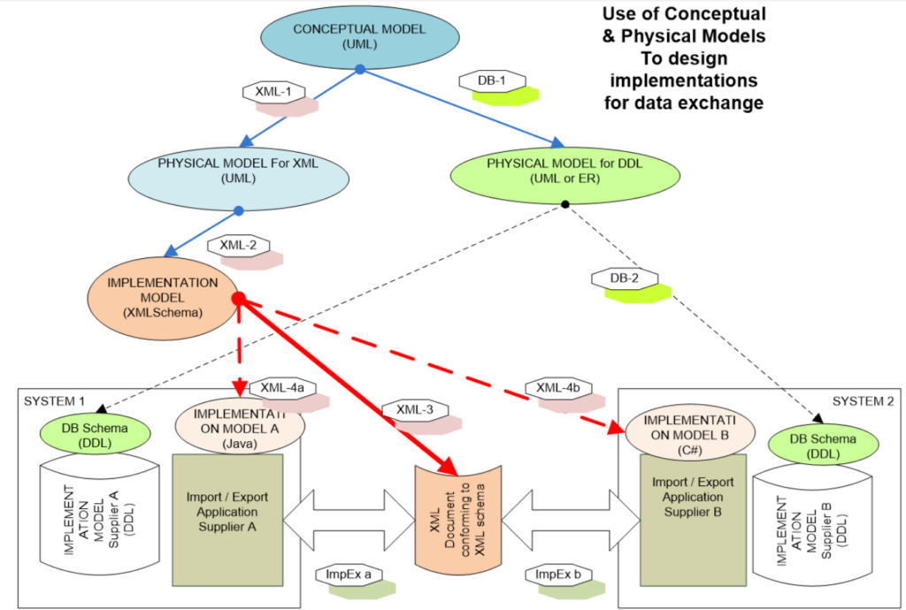
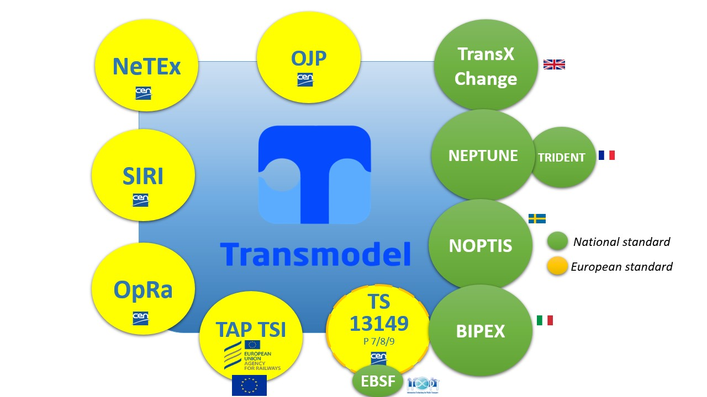

# Standard for implementation

## Link functions vs. data

The domain of Public Transport may be  described in terms of functions or functional areas. One of the problems related to the definition of a domain in terms of the functional areas is to be independent from the organisational aspects of Public Transport companies and from time aspects.

The functional areas defined in Transmodel can be understood as **objectives of the system being defined**.

Twenty eight (28) functional areas have been identified by Transmodel, as shown in the following table:

Not all functional areas have been studied during the development of Transmodel (shaded areas are outside the scope of Transmodel). For some of the studied functional areas the data necessary has been defined for **all functions** in such a functional area (Y). Some areas are only **partly covered** (P) by the data model, which means that **all** data are described for **some of the functions only**.

\[table id=2 /\]

*Table 1: Functional areas identified by Transmodel*

Transmodel documentation provides indications as regards the functional coverage of each functional area.

## Conceptual model vs. implementation

Transmodel describes the domain of public transport in terms of **data structures for a range of functional areas in an implementation-independent way**.

This means in particular, that Transmodel may be **implemented as** a data repository (data base, e. DDL schema) or used for the exchange of data (definition of a data exchange format, e.g. XML).  (See figure below, source NeTEx – 1).

In any case, for the design of a data base or of a data exchange format, if intended to be derived [from Transmodel](https://transmodel-cen.eu/index.php/from-transmodel-to-data-file/), the steps are as follows: 

  - Retrieval of a submodel A (in UML) from Transmodel corresponding to a particular functional objective 
  - Decision as to the choice of a particular target implementation type (e.g. XML)
  - Design of a physical model corresponding to A and dedicated to a target implementation type (UML for XML implementation) 
  - Development of an XML schema. 

Currently, the standard implementations target an XML data exchange format.  

A cross reference between the Transmodel Parts (representing clusters of functional areas) and the implementation standards NeTEx, SIRI, OJP, OpRa is summarized below. 

## Link Transmodel vs. derived standard implementations: Transmodel ecosystem 

The following table shows the interactions between Transmodel parts 1-10 (developed within SG4 of CEN TC278 WG3 ) and the Transmodel-based implementation standards developed as well within CEN TC278 WG3 subgroups (SG7 for SIRI, SG8 for OJP, SG9 for NeTEx, SG10 for OpRa). 

\[table id=6 /\]

*Table 2: The different parts of Transmodel and the linked standard*

This figure shows Transmodel as the basis for a family of interoperable data standards, including National Standards. And a basis for the development and implementation of national standards.

## SIRI

**SIRI is a CEN Technical Specification **that provides a European interface standard for exchanging information about the planned, current or projected performance of real-time public transport operations between different computer systems.

[Find out more](https://transmodel-cen.eu/index.php/siri/)

## NeTEx

**NeTEx is a CEN Technical Specification **for exchanging Public Transport schedules and related data. It is divided into several parts, each covering a functional subset of the CEN Transmodel for Public Transport Information:

[Find out more](https://transmodel-cen.eu/index.php/netex/)  

## OJP

**OJP is a CEN Technical Specifcation** which defines a schema for establishing an open API for Distributed Journey Planning that can be implemented by any local, regional or national journey planning system in order to exchange journey planning information with any other participating local, regional or national journey planning system. 

[Find out more](https://transmodel-cen.eu/index.php/ojp/)

## OpRa

**OpRa is an CEN initiative** with main focus on the identification of Public Transport raw data to be exchanged, gathered and stored in order to support Study and Control of Pubic Transpoprt Service.

[Find out more](https://transmodel-cen.eu/index.php/opra/) 

## Links between the Transmodel documents and the implementation standards

In this table you can find the different links between the Transmodel published documents and the published parts of the implementation standards in the Transmodel eco-system. Each published document is linked to an official standard that can be identified by his CEN number.

\[table id=1/\]

\[table id=8/\]

## Learn more

Explore our comprehensive wiki for detailed technical insights, national implementations, and FAQs.
