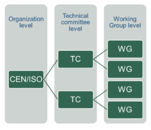
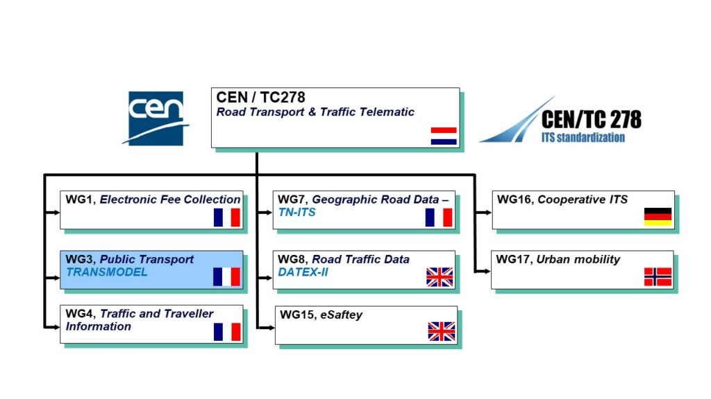
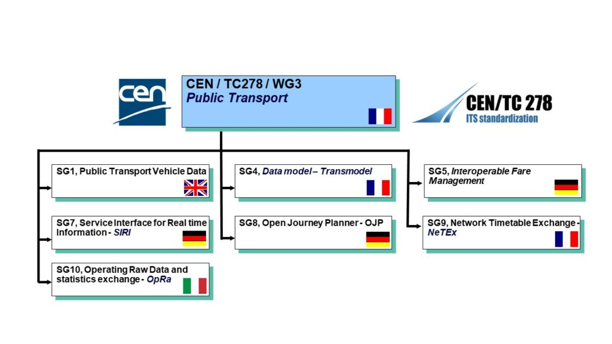
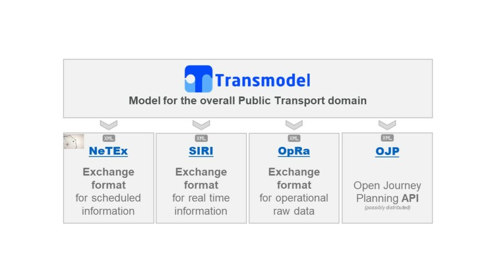
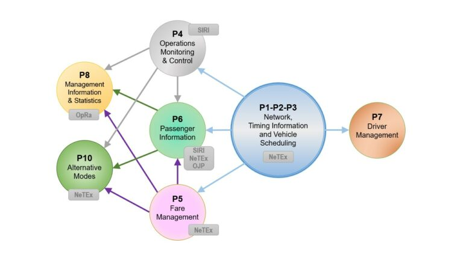

# Governance

Transmodel and the standards derived from it are developed under the aegis of **CEN** — the European Committee for Standardization (Comité Européen de Normalisation). This page explains what that means in practice, who does the work, and how new versions of the standards get from proposal to publication.

## CEN

CEN is one of three European Standardization Organizations, together with **[CENELEC](https://www.cencenelec.eu/)** and **ETSI**. All three are officially recognized by the European Union and by the European Free Trade Association (EFTA) as being responsible for developing and defining voluntary standards at European level.

CEN's work is organised into **Technical Committees (TCs)**, each covering a specific domain. Each TC splits into **Working Groups (WGs)**, and each Working Group into **Sub-Groups (SGs)**.

## Where Transmodel sits

Transmodel is developed by **CEN/TC 278**, the Technical Committee for Intelligent Transport Systems. Within TC 278, Public Transport is the responsibility of **Working Group 3 (WG3)**. WG3 splits into several sub-groups, one per standard.

The WG3 sub-groups are:

| Sub-group | Standard | Reference |
| --- | --- | --- |
| SG1 | Data Communication on Vehicles | CEN TS 13149 parts 7–11 |
| SG4 | **Transmodel** (the reference data model) | EN 12896 parts 1–10 |
| SG7 | **SIRI** — Service Interface for Real-time Information | CEN EN/TS 15531 parts 1–7 |
| SG8 | **OJP** — Open API for Distributed Journey Planning | CEN TS 17118 |
| SG9 | **NeTEx** — Network, Timetables and Fare Exchange | CEN TS 16614 parts 1–6 |
| SG10 | **OpRa** — Operational Raw Data and Statistics | CEN TR 17370 (TS in development) |

## How the standards relate

Transmodel is the conceptual model. Each of the exchange standards — NeTEx, SIRI, OpRa, OJP — sits on top of it as a concrete implementation for a specific purpose. The same sub-groups that maintain each exchange standard also coordinate with the Transmodel sub-group (SG4) to keep the concepts aligned.

Because they share a common conceptual model, changes at the Transmodel level can propagate cleanly through the exchange standards, and lessons learned in an exchange standard can feed back to refine the model.

## How a European Standard gets developed

The full CEN process is public and formal. In outline:

1. **Proposal.** Anyone can propose a work item, but proposals usually come through the national standardization bodies that make up CEN. In some cases the request comes from the European Commission or from another stakeholder.
2. **Assignment.** If enough CEN members are willing to work on it, the item is assigned to a Technical Committee. At the same time, "standstill" is enforced on all national work covering the same topic, so parallel national standards don't diverge from what's about to be agreed.
3. **National contributions.** Mirror committees at national level decide what each country contributes to the development. TCs also include observers — ISO/IEC members, the European Commission/EFTA, external European industry associations.
4. **Drafting.** Approved proposals move to the drafting stage, which is consensus-based inside the assigned committee.
5. **Public enquiry.** The finished draft goes out to public enquiry — open to all interested parties, not just committee members.
6. **Formal vote.** Votes and comments are evaluated. Depending on the outcome, the draft is either published as a European Standard, or worked on further and re-submitted.

Under **[Regulation (EU) No 1025/2012](https://eur-lex.europa.eu/legal-content/EN/TXT/?uri=CELEX:32012R1025)**, CEN, CENELEC and ETSI may also receive a formal request from the Commission to produce **harmonised standards** in support of EU legislation. This is how Transmodel and the related exchange standards became referenced in the MMTIS regulation — see [Legal context](legal-context.md).

## Where to read more

- **[CEN/CENELEC — how standards are developed](https://www.cencenelec.eu/european-standardization/european-standards/)** — the official process description.
- **[CEN/TC 278](https://www.itsstandards.eu/)** — TC 278's own site, with the current list of published standards and work items.
- **[Legal context](legal-context.md)** — how CEN standards fit into EU regulations that require their use.
