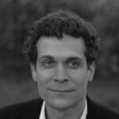
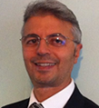
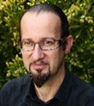
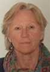
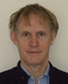
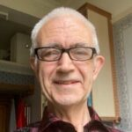
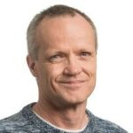
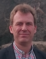

---
hide:
  - toc
  - navigation
---

<!--
  This file is generated from _team.yml by scripts/build_team_page.py.
  Do not edit this file directly — edit _team.yml and re-run the script
  (or push, and the GitHub Action regenerates it automatically).
-->

# Team

The people currently shaping Transmodel and the standards derived from it — data modellers, subgroup leaders, and active contributors across CEN working groups.

Use the filter below to see who works on each standard.

!!! note "Missing photos and standard assignments"
    A few profile photos (Andrej Tibaut and Sara Guerra de Oliveira) were not included in the site export and will be re-added when available.

    Standards-per-member is mostly filled in with placeholders — most members are marked *"to be confirmed"*. As we gather this info, the filter will become more useful.

## Standards contacts

Full contact information for each Subgroup — including GitHub, artefacts, and FAQ — will land here as the standards' own sections are filled in.

-   :material-graph-outline: **Transmodel (SG4)**

    ---

    Contact, GitHub links, FAQ and artefacts.

    [Go to Transmodel →](../standards/transmodel/index.md)

-   :material-calendar-clock: **NeTEx (SG9)**

    ---

    Contact, GitHub links, FAQ and artefacts.

    [Go to NeTEx →](../standards/netex/index.md)

-   :material-radio-tower: **SIRI (SG7)**

    ---

    Contact, GitHub links, FAQ and artefacts.

    [Go to SIRI →](../standards/siri/index.md)

-   :material-routes: **OJP (SG8)**

    ---

    Contact, GitHub links, FAQ and artefacts.

    [Go to OJP →](../standards/ojp/index.md)

-   :material-database-clock: **OpRa (SG10)**

    ---

    Contact, GitHub links, FAQ and artefacts.

    [Go to OpRa →](../standards/opra/index.md)

Filter by standard:
<button data-filter="all">All</button>
<button data-filter="transmodel">Transmodel (SG4)</button>
<button data-filter="netex">NeTEx (SG9)</button>
<button data-filter="siri">SIRI (SG7)</button>
<button data-filter="ojp">OJP (SG8)</button>
<button data-filter="opra">OpRa (SG10)</button>
<button data-filter="eudit">EUDIT</button>
<button data-filter="efip">EFIP</button>
<button data-filter="cyclinfra">CyclInfra</button>
<button data-filter="bt4pt">BT4PT</button>

### Claus Dohmen — Germany

SIRI Subgroup leader

**Standards:** SIRI

*(photo missing)*

### Edwin van den Belt — The Netherlands

**Standards:** EUDIT · tomp

{ width="150" }

### Emmanuel de Verdalle — France & ITxPT

WG3 and Transmodel Subgroup leader.

**Standards:** *to be confirmed*

{ width="150" }

### Fabrizio Arneodo — Italy

Data Modeller. OpRa Subgroup Leader.

**Standards:** *to be confirmed*

{ width="180" }

### Thibaut Barrére

(details to be added)

**Standards:** *to be confirmed*

*(photo missing)*

### Tu-Tho Thai — France

**Standards:** Transmodel · NeTEx · SIRI · CyclInfra · EUDIT · EFIP

{ width="150" }

### Christophe Duquesne — France

Data Modeller. NeTEx Subgroup Leader.

**Standards:** *to be confirmed*

{ width="180" }

### Kasia Bourée — France

Data Modeller. Transmodel Subgroup Leader.

**Standards:** *to be confirmed*

{ width="180" }

### Nicholas Knowles — UK

Data Modeller.

**Standards:** *to be confirmed*

{ width="180" }

### Andrej Tibaut — Slovenia

Data Modeller.

**Standards:** *to be confirmed*

*(photo missing)*

### Brede Dammen — Norway

**Standards:** Transmodel · NeTEx · SIRI

{ width="150" }

### David Glendining — UK & ITxPT

**Standards:** *to be confirmed*

{ width="150" }

### Einar Bjørkevoll — Norway

**Standards:** Transmodel · NeTEx · SIRI · OpRa · EUDIT · EFIP

{ width="150" }

### Espen Gromoll — Norway

**Standards:** *to be confirmed*

*(photo missing)*

### Gergely Nitsch — Hungary

**Standards:** Transmodel · OpRa

{ width="150" }

### Johan Hammar — Sweden

**Standards:** *to be confirmed*

{ width="150" }

### Kjell-Erik Eilertsen — Norway

**Standards:** *to be confirmed*

{ width="150" }

### Matthias Günter — Switzerland

**Standards:** Transmodel · NeTEx · SIRI · OJP

*(photo missing)*

### Roberto Caroccia — Italy

**Standards:** *to be confirmed*

*(photo missing)*

### Sara Guerra de Oliveira — Slovenia

**Standards:** NeTEx

*(photo missing)*

### Sonia Bourdelin — France

**Standards:** Transmodel

{ width="150" }

### Stefan Jugelt — European Railway Association (ERA)

**Standards:** NeTEx

{ width="150" }

### Ulf Bjersing — Sweden

Data Modeller.

**Standards:** *to be confirmed*

{ width="180" }

### Yves Amsler — UITP

**Standards:** *to be confirmed*

{ width="150" }

