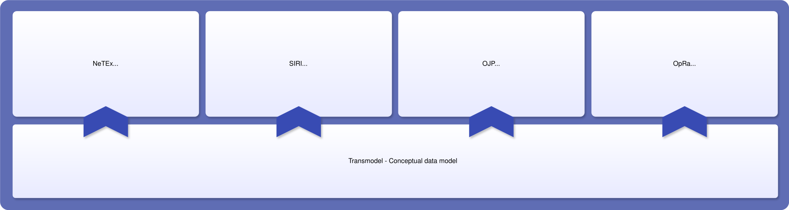
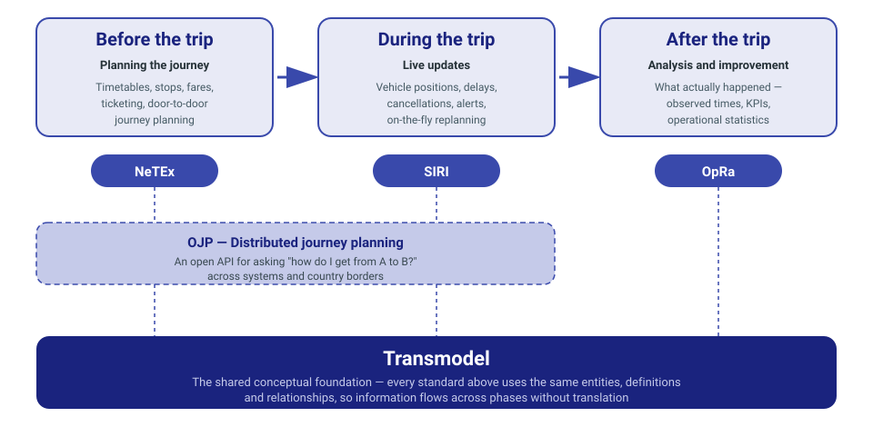

---
hide:
  - toc
  - navigation
---

# Transmodel Ecosystem

Public transport in Europe is delivered by hundreds of authorities and thousands of operators, spread across thirty-plus countries and served by dozens of vendors. Behind the scenes, they all work with the same underlying reality — routes, stops, schedules, fares, passenger journeys — but for a long time each system described that reality in its own way.

Data could move between systems only after custom translation, one integration at a time. Expensive to build. Brittle to maintain. Impossible to scale across borders. Cross-border journey planning, national access points, integrated ticketing — all held back by the same fragmentation.

**The Transmodel Ecosystem exists to fix that.** It is a family of five open European standards, maintained under CEN/TC 278 Working Group 3, that share a single reference vocabulary. Because every standard describes the same underlying concepts in the same way, information can flow between systems without translation — a *ServiceJourney* published in NeTEx is the same *ServiceJourney* referenced by SIRI.

!!! info "Under construction"
    This site is being built by a small team from across CEN, Entur and partner organisations to replace [transmodel-cen.eu](https://transmodel-cen.eu) and [data4pt.org/wiki](https://data4pt.org/wiki/Main_Page). Content will fill out as pages are washed and approved.

## The five standards and how they fit together

Together, these five standards let a passenger use public transport as if it were one connected service, even when their trip spans several operators or borders. Timetables and service information can be published once and appear across every travel app the region's passengers use. Whoever brings in a new system — an operator or a public transport authority for a region — can choose freely between suppliers, because any Transmodel-based system can work with any other. Operators and authorities can compare planned service to what actually happened, and improve based on real evidence. Everything a passenger sees — the journey planner, the departure board, the app on their phone — is powered by these five agreed standards.

-   :material-graph-outline: **Transmodel (SG4)**

    ---

    **The reference data model.** The shared vocabulary that every standard in this family uses.

    [Learn about Transmodel →](standards/transmodel/index.md)

-   :material-calendar-clock: **NeTEx (SG9)**

    ---

    **Scheduled data.** What the service looks like on paper: routes, stops, timetables, fares.

    [Learn about NeTEx →](standards/netex/index.md)

-   :material-radio-tower: **SIRI (SG7)**

    ---

    **Real-time data.** What the service looks like right now: where the vehicles are, delays, alerts.

    [Learn about SIRI →](standards/siri/index.md)

-   :material-routes: **OJP (SG8)**

    ---

    **Distributed journey planning.** How different journey planners talk to each other, across companies and borders.

    [Learn about OJP →](standards/ojp/index.md)

-   :material-database-clock: **OpRa (SG10)**

    ---

    **Observed and historical data.** What actually happened, once the day is over — the data behind reports and analysis.

    [Learn about OpRa →](standards/opra/index.md)

## A passenger's journey — and the standards behind each phase

Each standard covers a different phase in the life of a public transport trip. Together they span the full journey — from planning through live operation to after-the-fact analysis — all sharing the same underlying vocabulary through Transmodel.

## Why this ecosystem matters

- **Interoperability becomes the default**, not something built one integration at a time. Systems from different vendors, different agencies, different countries can exchange data because they refer to the same underlying concepts.
- **Cross-border passenger information becomes practical.** A journey planned in Norway can appear in a Dutch travel app without custom mapping at every hop.
- **The public sector can procure with confidence.** Tenders can require Transmodel-based standards without locking themselves in to any single vendor.
- **The ecosystem is designed to grow.** New use cases can be added without breaking what already works.

## On the way

-   :material-progress-clock: **In development**

    ---

    Three new standards — **EUDIT**, **CyclInfra** and **BT4PT** — and one new NeTEx profile — **EFIP** — are being defined to extend the ecosystem's coverage of digital ticketing, cycle infrastructure, business ticketing and European fare data.

## Go deeper

The Introduction tab covers the ecosystem as a whole — how the standards fit together, how to use them, how they're governed:

- [How the standards are linked](introduction/how-standards-are-linked.md) — the phases of a public transport service and which standard covers each.
- [How to use the standards](introduction/how-to-use-the-standards.md) — a high-level guide to where to start, what you need, and what you don't.
- [Governance](introduction/governance.md) — CEN, TC 278, WG3, and the process from proposal to published standard.
- [How to contribute](introduction/how-to-contribute.md) — paths for raising change requests, contributing to profiles, and joining working groups.
- [Legal context](introduction/legal-context.md) — how the standards connect to EU regulations (ITS Directive, MMTIS, TSI Telematics).
- [History](introduction/history.md) — how the ecosystem evolved.
- [NAPCORE](introduction/napcore.md) — the coordination programme connecting National Access Points across Europe.

For **team contacts**, see the [Contact](contact/team.md) tab.
