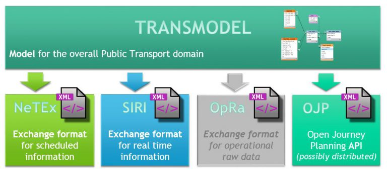

!!! warning "Raw, unwashed content"
    This page is in the review corpus — copied directly from the source site with only automatic conversion applied. It has not yet been edited for tone, structure, accuracy, or duplication. Do not treat as final.

# Existing implementation

Transmodel may be applied to any framework for information systems within the public transport industry, but there are three circumstances to which it is particularly suited:

  - **specification of an organisation’s ‘information architecture’**
  - **specification of a database**
  - **specification of a data exchange interface**

### **Specification of Information Architecture**  

An ‘information architecture’ refers to the overall structure of information used by an information system, which is used to determine:

  - the structure of data held in system databases
  - the structure of data exchanged across interfaces between systems

It may be used as a strategic guide to system planning and evolution, and as the basis for the specification and acquisition of individual systems.

An information architecture made up of independent modules with well-defined interfaces is easier to maintain. A malfunctioning module can be taken out of service or completely replaced without disrupting the rest of the system. This is particularly beneficial for on-line or safety critical systems. The modules can also be reconfigured more easily onto hardware located elsewhere on the network to fit in with changes in organisational arrangements for managing the business and data administration processes.

The information architecture itself should be evaluated from time to time to make sure that it is still meeting the needs of the organisation. Technological changes in communications and computing are continually bringing forward new opportunities for evolving the systems supporting the business.

### **Specification of a Database**  

At a more technical level, an organisation’s systems will have a collection of data in one or more databases, which may be associated with individual applications or may be common to many applications.

In either case, Transmodel can serve as a starting point for the definition of a database schema, which will be used for the physical implementation of databases. Whether applications access a common database built to this schema, or have their own databases and exchange data built to consistent schemas, the use of an overall reference data model assists integration.

Technical constraints (such as memory capacity restrictions of smart cards) may affect the detail and complexity of the data models that can be used in particular data storage devices. Transmodel does not itself specify a level of detail to adopt.

### **Specification of an Interface**  

Public transport organisations may require different applications to exchange data with each other. Also, public transport organisations may exchange data with other organisations. In either case, the reference data model can be used to help design the interfaces.

Again, technical constraints (such as bandwidth limitations of radio communications links) may affect the detail and complexity of the data models that can be used for particular interfaces. Transmodel does not itself specify a level of detail to adopt.

Transmodel, called the European Reference Data Model for public transport, is the basis for the design of the following EU standards:

## Example implementations

[Belgium](#) [France](#) [United Kingdom](#) [Germany](#) [Hungary](#) [Netherlands](#) [Norway](#) [Slovenia](#) [Spain](#) [Sweden](#) [Switzerland](#)

Example implementations from various countries can be found in the wiki.
