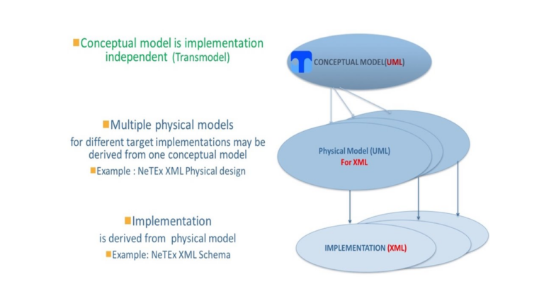
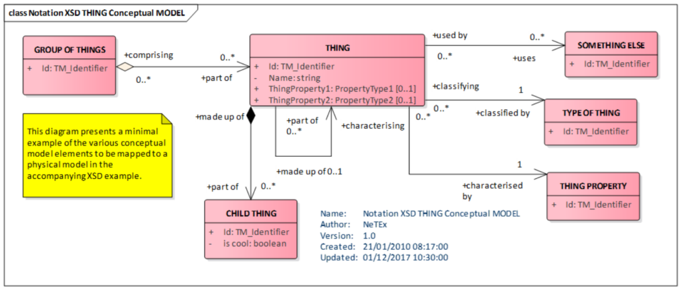
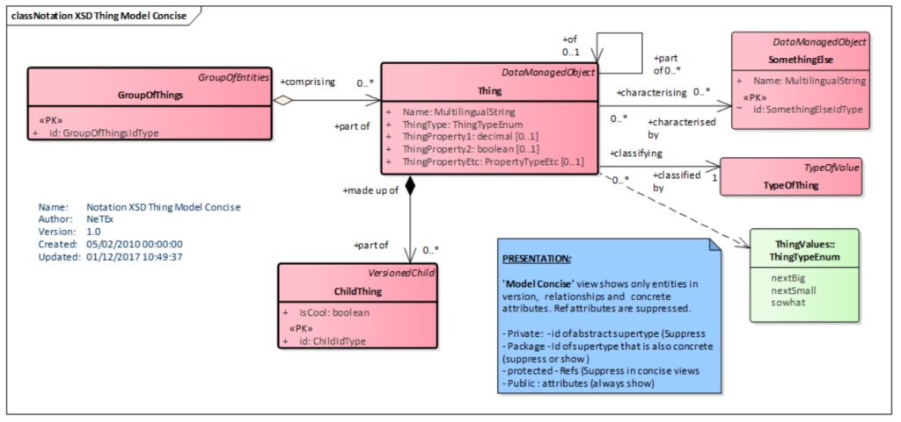
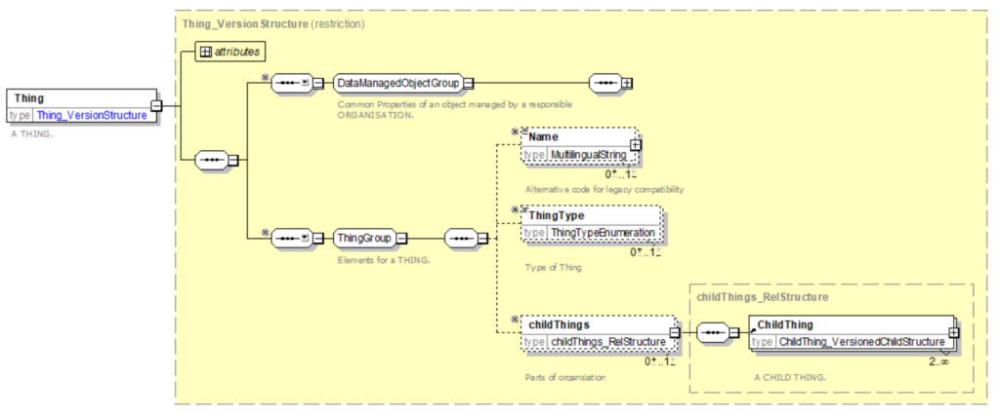

!!! warning "Raw, unwashed content"
    This page is in the review corpus — copied directly from the source site with only automatic conversion applied. It has not yet been edited for tone, structure, accuracy, or duplication. Do not treat as final.

# From Transmodel to data file

Models may exist at different levels of abstraction. 

  - **Conceptual Model** – A high level implementation neutral representation. A conceptual model describes the elements and relationships of a model independently of any specific implementation technology. It can be used to understand and relate different implementations using many different technologies and physical models. 

  - **Physical Model** – A design for implementing the Conceptual model using a specific technology. A physical model maps a conceptual model into a more detailed model that assumes a specific implementation technology, subject to particular constraints of that technology. In general a physical model will have more limited semantics than a conceptual model because of the constraints of the chosen implementation language and of the need to simplify the use of a rich conceptual model for any practical implementation. A physical model is still however not usually an executable or completely finalised representation, but rather a translation tool that shows how to go from a very high level technology-independent conceptual model to a concrete implementation in a specific language. 

  - **Implementation Model **– An implementation of the model in a specific language that supports declarative modelling constructs. An implementation model represents a physical model in the actual language constructs and types of an implementation language, such as a DDL (Data Definition Language) for a database or an XML (Extensible Markup Language)  schema for an exchange format. It is directly executable using tools or programs. NeTEx uses W3C XML schemas for this purpose, but in principle other languages could be chosen in future.

 

*From conceptual to physical model*

**From a data model in UML to a data exchange format in XML **

**UML** (Unified Modelling Language) provides a formalism to represent data structures. It may be used at conceptual or physical level.

**XML** (Extensible Markup Language) provides, using specific transformation rules, a serialisation of data initially defined in the conceptual/physical models.  In other words: the application of specific transformation rules to the physical model, provides an XML file dedicated to data exchanges (XML data exchange format).

The transformation rules are in detail described in the NeTEx-Part 1 document.

The following example (described in detail in NeTEx-Part 1) shows the dififierent steps:

  -   -   - a conceptual model, represented in UML (using Transmodel conventions),
          - a corresponding physical model and
          - a corresponding XML file.

**Conceptual level **

The THING conceptual model: an entity called THING may be classified by TYPE OF THING and grouped with GROUP of THINGs. Each THING can be made up of one or more CHILD THINGs. A THING can be associated with many SOMETHING ELSEs. The entities together make up a THING conceptual model.

**Physical level**

The THING physical model is obtained as follows:

  -   -   - the names of the entities are spelled in line with XML naming conventions: ‘THING’ becomes ‘Thing’, ‘SOMETHING ELSE’ becomes ‘**SomethingElse**’, ‘TYPE OF THING’ becomes ‘**TypeOfThing**’.
          - all model Elements are made specializations of the **DataManagedObject** or other more specific supertype. For example, **TypeOfThing** is a specialisation of **TypeOfValue**; **GroupOfThings** is a specialisation of **GroupOfEntities**

NB.Several types of presentations of a UML model may be provided. The figure below is called "Thing Model Concise" without visualising all details, showing for example only the name of the parent classes in the upper right corner (without showing their attributes).

**Implementation level**

XSD language (XML Schema Definition Language) is the current standard schema language for all XML documents and data. XSD specifies how to formally describe the elements in an Extensible Markup Language (XML) document.

Below the initial THING model is represented using the **XSD formalism.**

The rules for the transformation to get an XML file (for example how to represent relationships, inheritance, etc) are described in detail in the NeTEx-Part 1 documentation.

The following **XML fragment** shows a sample instance of a **Thing** (i.e. an object of the class Thing) containing two **ChildThing** instances and classified with a **TypeOfThing** instance. It has a parent ‘*abc:43262*’ and is associated with three other instances of **SomethingElse** elements.

\<Thing id="abc:3456" version="001"\> 

\<Name lang="en"\>Lunch\</Thing\> 

\<ThingType\>nextBig\</ThingType\> 

\<TypeOfThingRef ref=”abc:Val01” version=”any”/\> 

 \<ParentThingRef ref=”abc:43262” version=”any”/\> 

\<ThingProperty2\>bar\</ThingProperty2\> 

\<children\> 

\<ChildThing id="abc:34561"\> 

\<IsCool\>true\</IsCool\> 

\</ChildThing\> 

\<ChildThing id=" abc: 34562"\> 

\<IsCool\>false\</IsCool\> 

\</ChildThing\> 

\</children\> 

 \<somethingsElse\> 

\<SomethingElse ref="abc:66561" \> 

\<SomethingElse ref="abc:68752" \> 

\<SomethingElse ref="abc:21756" \> 

\</somethingsElse \> 

\</Thing\> 

\<TypeOfThing id=" abc:Val01" version="any"\> 

\<Name lang="en"\>Good Thing\</Thing\>
