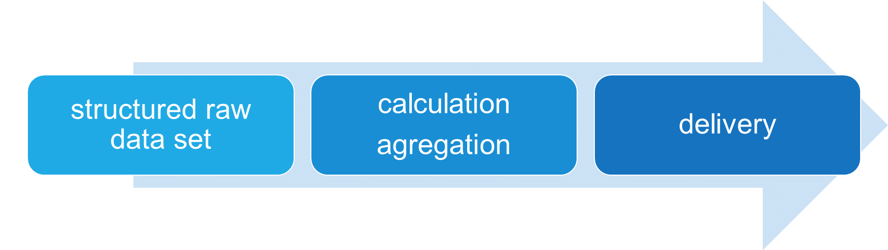
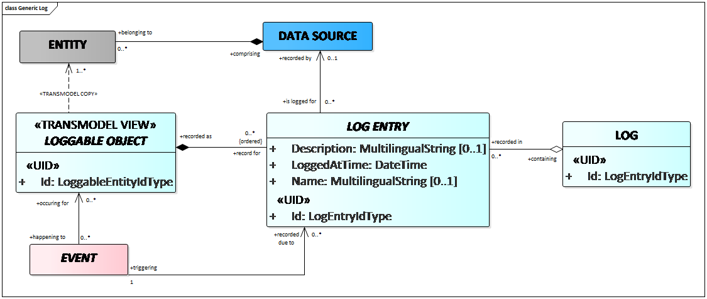
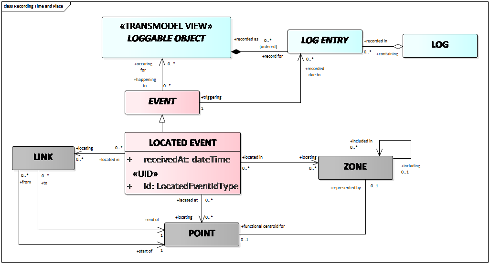
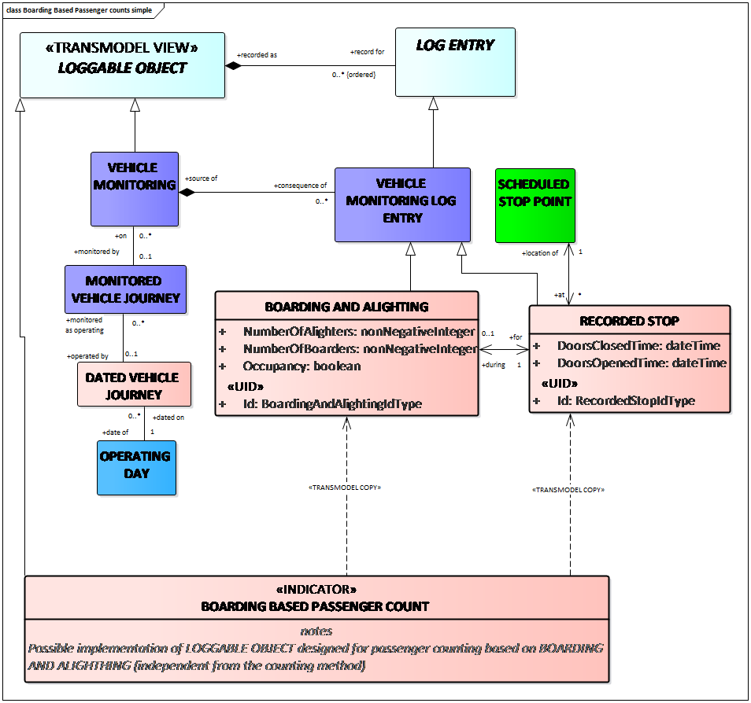
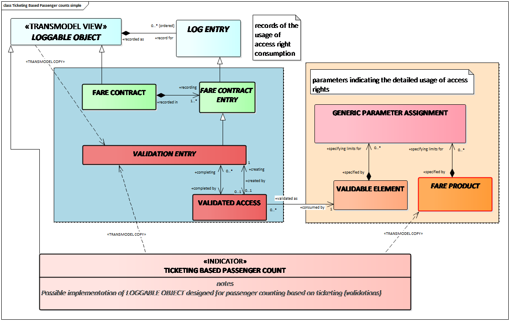
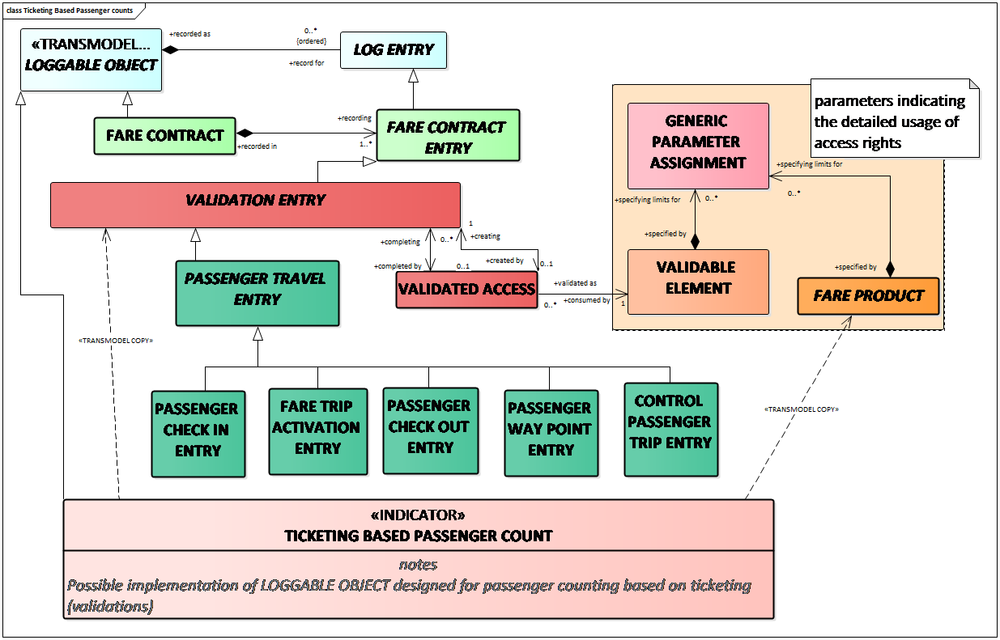
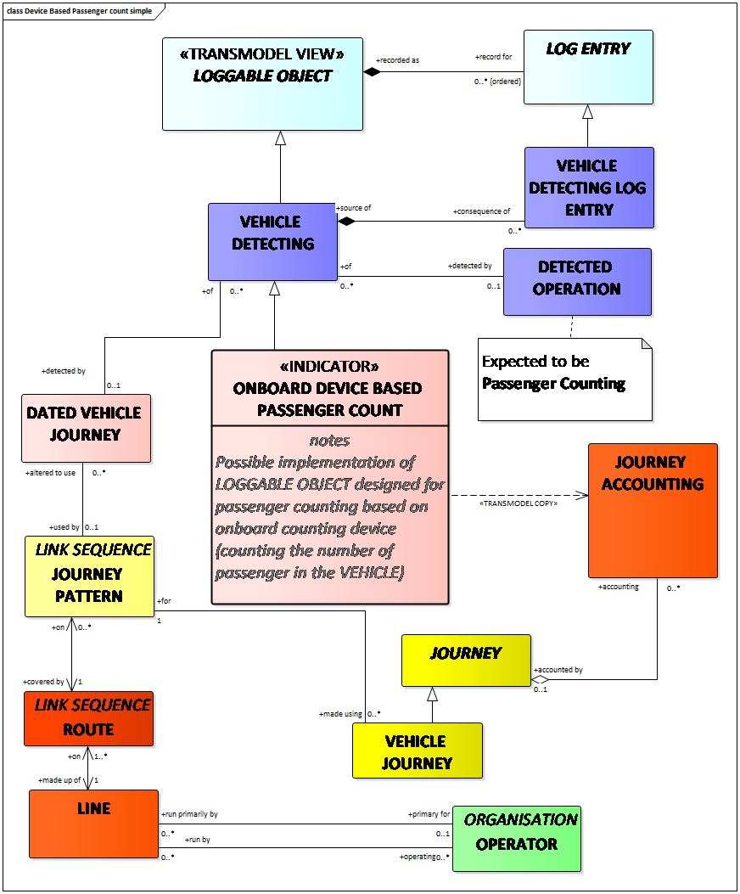

!!! warning "Raw, unwashed content"
    This page is in the review corpus — copied directly from the source site with only automatic conversion applied. It has not yet been edited for tone, structure, accuracy, or duplication. Do not treat as final.

*You can check the online version or download the pdf* [*TUTORIAL\_Part8. *](../../assets/files/TUTORIAL_Part8_v2.1-1.pdf)

# Management Information and Statistics EN12896 – 8

The data model part supporting management information and statistics provides some additional data descriptions which may be needed apart from the information elements already included in the scheduling, operations management and control, passenger information and fare management sub-models. Statistical information may of course be provided for any object of interest that is included in the company’s specific data model and for which information is recorded in a database, whether for the company management or for other organisational units.

However, some additional information needs and sources are necessary, which cannot be derived from the model parts mentioned above and are specifically related to the evaluation of the operational process, especially to the evaluation of the current timetable and the comparison between the scheduled performance and actual performance. These include:

  -   -   - events and recordings describing the actual course of vehicle journeys and the resulting service performance;
          - the actual status of the planned and advertised interchanges and the resulting service quality;
          - recordings of the actual use of the service offer, i.e. actual passenger rides and trips.

# What is the purpose of the Management Information and Statistics data model ?

The “Public Transport Reference Data Model– Part 8: Management Information and Statistics” describes how to structure data which refers either

  -   -   - to the planning stages (e.g. timetables, run times, driver rosters etc.) and/or
          - to the daily actual production,

and which is registered for different purposes, in particular to build *indicators*.  
An *indicator* is a set of data (calculated or measured) which may be either qualitative or quantitative and may be used to provide information on the status or on the quality of a service or a function.  
A calculation process that generates the indicators is characterised by:

  -   -   - a formula describing the method to calculate indicators that are based on other indicators and/or on a set of raw data,
          - an aggregation frame describing a data structure within which the data values are grouped and used for a formula to provide an indicator,
          - the granularity determining the smallest unit(s) in a calculation process which generates indicator(s).

This process may be schematically presented as follows:

  
Example of indicator calculation: calculation of the length of a tram network by operator.  
Input (raw data set): length of the projection of ROUTE LINKs (see EN 12896-2) on the infrastructure;  
Aggregation frame: set of ROUTE LINKs that make up the tram network;  
Granularity: grouping by operator;  
Formula: calculates the sums of the length of each item in the aggregation frame;  
Calculator: executes the formula for each operator;  
Indicator (delivery): set of total lengths of the network (by operator).  
Transmodel defines data semantics and structures of the raw data used to provide indicators.

# Indicators vs. Transmodel data structures

The OpRa group (Operating Raw Data and Statistics, CEN TC278 WG3 SG10) developed a technical report (CEN TR 17370) presenting different types of Use Cases which describe processes to calculate or derive indicators out of raw data.

The following Use Cases and related indicators (listed in the OpRa Technical Report) are covered by the data models provided by Transmodel:

**Service dimensions**: information needed to evaluate the dimension of the service in terms of number of lines, journeys, available seats, etc;

**Commercial speed**: information needed to evaluate the commercial speed of the fleet;

**Service spatial coverage**: information relevant to the characteristics of the service offer in terms of spatial coverage of the territory where the service is performed;

**Service temporal coverage**: information relevant to the characteristics of the service offer in terms of temporal coverage of the territory where the service is performed;

**Service interchange nodes**: information relevant to the characteristics of the service offer to evaluate the interchanges at specific PLACEs;

**O/D zones connections**:  information relevant to the characteristics of the service demand to evaluate connections among different ZONEs;

**O/D matrix**: information relevant to the characteristics of the service demand to evaluate movement of passengers among different ZONEs;

**O/D zones moving cause**: information relevant to the characteristics of the service demand needed to evaluate movement causes of passengers among different ZONEs (School, work, etc);

**Demand dimensions**: information relevant to the characteristics of the service demand to evaluate the number of passengers that use the public transport service;

**Load factor**: information relevant to the characteristics of the service demand to evaluate the load of VEHICLEs;

**Service performed distance**: information needed to calculate the performed distance.

 

# Is there any particular mechanism to represent raw data log?

Raw data is captured and may be registered. In this context Transmodel uses the concepts: ENTITY, LOGGABLE OBJECT, LOG ENTRY and LOG. The concept of ENTITY is introduced in EN12896-1. It represents any data instance to be managed in an operational version management system. When several data sources coexist, an ENTITY has to be related to a given DATA SOURCE in which it is defined. A LOGGABLE OBJECT is an entity for which LOG ENTRies may be made. It is considered as a TRANSMODEL VIEW, i.e. it represents selected properties of one or more ENTITIEs being monitored/observed for significant events and changes of state. The LOG ENTRY pattern records a change of state or a transaction against a LOGGABLE OBJECT. The LOG ENTRies are triggered by EVENTs and may be grouped together in any kind of storage to form a LOG. EVENTs may affect the existence (e.g. creation or activation or deactivation) or state of an ENTITY (e.g. modification). The state changes of the ENTITY can be recorded as specialisations of LOG ENTRY.

 When an EVENT has spatial attributes, it becomes a LOCATED EVENT and has geographical attributes that can refer to:

  - the ZONE in which the LOCATED EVENT is located,
  - the POINT where the LOCATED EVENT occurs,
  - the LINK on which the LOCATD EVENT is located.

 

# Examples of data records described in Transmodel

Transmodel presents explicitly several cases of ‘raw data logs’, i.e. data structures that take into account records of data. In this context, data models use concepts introduced in other Transmodel parts, in particular in EN 12896- 4 to 6.

Records of service & vehicle performance events: record of events related to the performance of vehicle journeys, in particular service journeys, on each day of their operation;

**Recorded passing times**: record of the actual passing time of a vehicle (as OBSERVED PASSING TIME). It refers to a given MONITORED VEHICLE JOURNEY and is recorded at a particular POINT);

**Recorded stops**: record when a vehicle actually stops at a SCHEDULED STOP POINT and opens the doors to allow passengers to board or alight;

**Record of boarding and alighting**: record of the number of alighting and boarding passengers at a defined SCHEDULED STOP POINT;

**Recording of impeded time**: record of situations and time where the vehicle is not moving, due to congestion for instance;

**Status of planned interchanges**: record of INTERCHANGE STATUS data;

**Records of disturbances**: any disturbance affecting operations may be recorded in the entity OPERATIONAL EVENT. The main types of OPERATIONAL EVENTs are ALARMs (these may either be logged manually or recorded automatically when a system detects a threshold is exceeded) and INCIDENTs (often recorded in a logbook);

**Recorded passenger trips**: record of the actual consumption of the transport services by travellers (regardless of the means used to collect this information).

# Indicators and raw data needed

General

The different Use Cases are determining particular indicators, however, the methods to calculate/derive an indicator may differ, in particular, they may rely on different equipment or on different raw data sets. As a consequence, for the same indicator, different data structures may be needed, depending on the context and the method chosen.  
Transmodel discusses two examples of Use Cases to show how the generic LOGGABLE OBJECT model relates to the data structure underpinning the process of indicator calculation:

  - Actual journey performance,
  - Actual service demand.

The ‘actual service demand’ example is presented below. This Use Case corresponds to the OpRa Use Case ‘demand dimensions’ and provides the indicator ***passenger counts***.  
Transmodel describes the following situations:

  - passenger counts based on boarding and alighting counts,
  - passenger counts based on counting devices,
  - passenger counts based on access control.

In each situation, a different set of data is needed and therefore 3 different data models are proposed.

Passenger counts calculation based on boarding an alighting

BOARDING BASED PASSENGER COUNT indicator calculation may rely on a simple process:  
at each SCHEDULED STOP POINT

  - the number of boarding passengers is added to and
  - the number of alighting passengers subtracted

from the total number of passengers in the VEHICLE operating a particular DATED VEHICLE JOURNEY.  
The process of vehicle monitoring consists of collecting all available data related to a vehicle carrying out a MONITORED VEHICLE JOURNEY. It is explained in EN12896-4 that various types of situations may be monitored: the position of a vehicle on the network, vehicle stopping, passengers alighting, etc  
Any monitored data is recorded through a VEHICLE MONITORING activity. Instances of this entity are called VEHICLE MONITORING LOG ENTRies (see EN12896-4).

  
VEHICLE MONITORING may consist of the observation of:

  - RECORDED STOP: the actual stopping time of the VEHICLEs at SCHEDULED STOP POINTs
  - BOARDING AND ALIGHTING: the numbers of passengers boarding and alighting at a SCHEDULED STOP POINT during a RECORDED STOP.

Further aggregations of BOARDING BASED PASSENGER COUNT are possible: per LINE, per OPERATOR, etc.

Passenger counts calculation based on access control

Passenger counts may be based on the counts of “validations” based on the concept of VALIDATION ENTRY and FARE PRODUCT parameters (see EN12896-5).  
VALIDATION ENTRY represents the result of the comparison between one or several control results and the theoretical access right controlled.  
The access right controlled is present on the validated travel document, which represents the consumed FARE PRODUCT.

  
The recorded VALIDATION ENTRies may be of several types, for instance:

  - PASSENGER CHECK IN/OUT ENTRY, representing the recording the check in/out of a passenger at a barrier or validation point at the start/end of a journey;
  - FARE TRIP ACTIVATION ENTRY, recording the initiation of the consumption of access rights by a passenger making a trip, for example by means of marking a TRAVEL DOCUMENT using a ticket validator machine;
  - PASSENGER WAY POINT ENTRY, recording a passenger checking in at a way point while in a trip so as to indicate travel by a specific itinerary;
  - CONTROL PASSENGER TRIP ENTRY:, recording the control of the consumption of access rights by the inspection of a TRAVEL DOCUMENT by a TRAVEL DOCUMENT CONTROLLER. May include marking (cancellation) of the TRAVEL DOCUMENT.

Passenger counts based on counting devices

The ONBOARD DEVICE BASED PASSENGER COUNT is an indicator that specialises the VEHICLE DETECTING (see EN12896-4) and connects it to the JOURNEY ACCOUNTING (using the relations through the DATED VEHICLE JOURNEY and JOURNEY).  
The relation to the LINE and to the OPERATING DAY is displayed to illustrate the possibility of filtering this indicator per LINE or per OPERATING PERIOD.

# What use Cases are beyond the scope of Transmodel V6?

The following Use Cases defined by OpRa are not covered by the data structures of Transmodel:

**Fleet dimensions**: this function considers all the information to calculate the dimension of the fleet (number and type of vehicles, etc.);

**Service safety**: this function considers all the information to evaluate the safety of the PT service in terms of accidents occurred, etc;

**Service pollution emissions**: this function considers all the information to evaluate environment impacts due to the emission of pollutants;

**Service incoming funds**: this function considers all the information to calculate the economy aspects of the PT service (public funds, revenues from sold tickets, etc.);

**Service costs**: this function considers all the information to calculate expenses to maintain and to sustain the PT Service;

**PT organisation dimensions**: this function considers all the information to calculate the characteristics of a PT organisation (such as number of employees, etc.).
