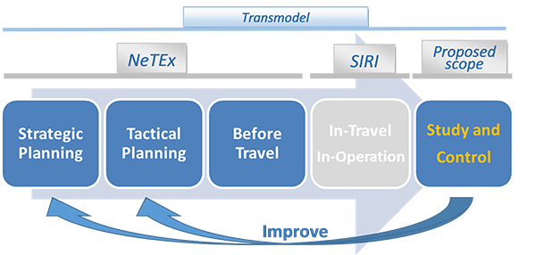
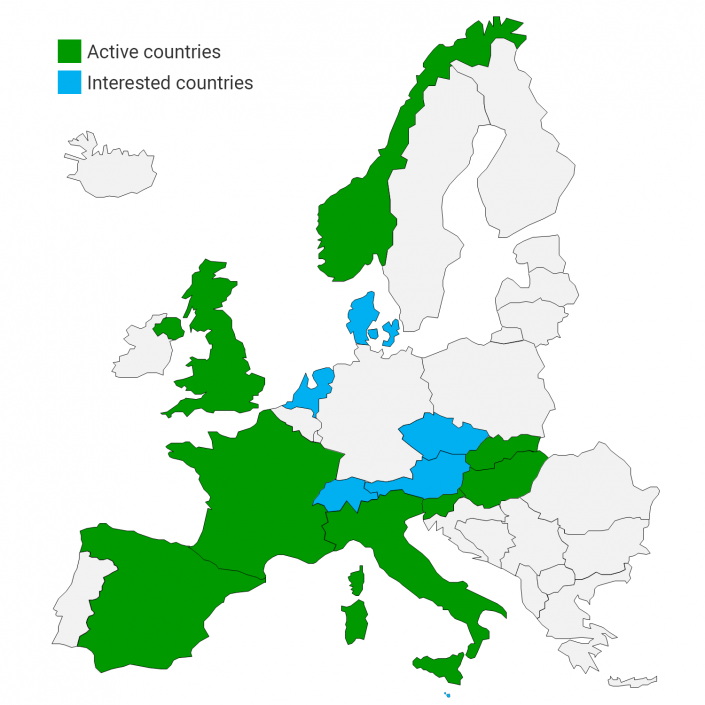

!!! warning "Raw, unwashed content"
    This page is in the review corpus — copied directly from the source site with only automatic conversion applied. It has not yet been edited for tone, structure, accuracy, or duplication. Do not treat as final.

## What is OpRa?

OpRa is a CEN initiative with main focus on the identification of Public Transport raw data to be exchanged, gathered and stored in order to support Study and Control of Public Transport Service.

The work consists in the production of a CEN Technical Report, to document the results of the performed analysis, in order to precisely define the scope of the following Technical Specification (TS) or European Norm (EN) definition work.

Particular attention on raw data identification is focused on actual and measured information, i.e. information which cannot be changed anymore in the future.

## Overview

This information is mainly an output of the Transmodel (TRM) domains

  - Part 4: “*Operations monitoring & control*”;
  - Part 8: “*Management Information and statistics*“ focused on raw data for indicators calculation.

It will describe the recorded reality of operation, like delays and cancelled vehicle journeys, etc. either through individual measurements at a given sampling interval or in an aggregate ways (statistics).

OpRa work scope is coherent with those covered by NeTEx, SIRI and Transmodel as depicted in the following picture:

In this perspective, a deep study of Public Transport Service is performed with Information exchanges with stakeholders (mainly authorities, operators and system providers) to clearly identify the needs and define Use Cases.

## How is OpRa used?

The work consists in the production of a Technical Report, to document the results of the performed analysis, in order to precisely define the scope of the following Technical Specification (TS) or European Norm (EN) definition work.

OpRa will mainly focus on the identification of actual and measured information, i.e. information which cannot be changed anymore in the future.

This information is mainly an output of the Transmodel (TRM) domains

  - “Operations monitoring & control”;
  - Management Information and statistics“ (raw data for indicators calculation).

It will describe the recorded reality of operation, like delays and cancelled vehicle journeys, etc. either through individual measurements at a given sampling interval or in an aggregate way (statistics).

  - Strategic Planning: definition of network elements (lines, stops), main service parameters (vehicles sizes, operation intervals, service intervals for important time demand types), and guaranteed interchanges are planned (NeTEx, TRM).
  - Tactical Planning: operators plan their resource usage (vehicles, rolling stock, personnel), with detailed timetables for each resource unit (NeTEx, TRM).
  - Before Travel: all planned networks and timetables are published. Passengers and other type of clients may plan their use of the offered transportation services via printed and electronic media, and make their reservations as needed (NeTEx, TRM).
  - In-Travel: The transportation service is conducted. Real-time information exchange is available while this takes place and may be recorded (SIRI, TRM).
  - Study and control: in this stage, operators and authorities review the history of actual operations, which may lead to improvements through operational changes, or an optimization of strategic and tactical planning (OpRa, TRM).

### Learn more about local implementations

[Country](https://transmodel-cen.eu/index.php/netex/) [Country](https://transmodel-cen.eu/index.php/netex/) [Country](https://transmodel-cen.eu/index.php/netex/) [Country](https://transmodel-cen.eu/index.php/netex/)

### Open-source tools

Lorem ipsum dolor sit amet, consectetur adipiscing elit. Nullam consectetur tincidunt varius. Morbi scelerisque nibh et magna lacinia, a volutpat nibh volutpat. Nam finibus et nulla id molestie. Aenean vulputate, lacus ac semper lacinia, magna dui elementum urna, id sodales ligula eros eget dui.

[Tool 1](https://greenlight.itxpt.eu/) [Tool 2](https://github.com/entur/antu) [Tool 3](https://enroute.mobi/fr/chouette/)
