!!! warning "Raw, unwashed content"
    This page is in the review corpus — copied directly from the source site with only automatic conversion applied. It has not yet been edited for tone, structure, accuracy, or duplication. Do not treat as final.

*You can check the online version or download the pdf * [*TUTORIAL\_Part6.*](../../assets/files/TUTORIAL_Part6_v2.2-1.pdf)

# Passenger Information EN12896 – 6

The reference data model covering the domain of Passenger Information not only describes the data needed for applications providing passengers with relevant information on planned and actual services, but also the data resulting from the planning and control processes which may result in service modifications which also may be of interest to the public. Consequently, the passenger information data model includes data components which go far beyond the ‘static’ planned timetable, the main source for classical timetable information (but one that does not take into account dynamic and operational issues).

These additional concepts include:

  -   -   - passenger information facilities and their utilisation for passenger queries;
          - detailed descriptions of all the conceptual components of a passenger trip, as possibly needed by an interactive passenger information system when answering a passenger query;
          - basic definitions of run times and wait times needed to calculate trip duration;
          - planned, predicted, and actual passing times of journeys at individual stops;
          - service modifications decided by the schedulers or the control staff, resulting in changes of the vehicle journeys and blocks, compared to the original plan.

All types of passenger information use various elements of the topological network definition (such as the lines) and of the journeys which form the service offer (including run and wait times, and other fundamental definitions). Geographical information may also be provided in some cases, if corresponding application systems are available. Specific types of passenger queries may be related to fares, where the relevant information elements are included in the fare management sub-model of the reference data model (EN12896-5).

Thus, the information basis for passenger information systems is widely spread over the whole reference data model, and so this nominal ”passenger information” data model covers only those elements and are not explicitly included in, other parts of the model. It includes views that can be derived from the data in other parts of the reference mode, most notably a trip itinerary model representing an extract of service journey and interchange data covering a specific trip at a specific time.

# Provision of information to passengers

Information for passengers can be communicated to the passengers using a wide variety of equipment, such as:

  -   -   - printed material such as leaflets at stops, information booklets, etc.;
          - passive terminals, such as displays at stop points or onboard vehicles, delivering information on planned or actual service, e.g. information on the arrival times;
          - interactive terminals, delivering information on request regarding planned or actual service, such as home internet terminals, personal mobile devices, an information desk terminal operated by the staff, etc.

In spite of this variety of media and techniques, some common data features are relevant as common characteristics of the provided information, in particular:

  -   -   - spatial information,
          - line and destination information,
          - general annotation information provided as footnotes.

Although there are a number of different types of passenger information, it is timetable information that is of principal interest, both in the form of general timetables and personalised trip plans.

Transmodel provides a generic model for a query and response delivery with which to deliver data from a model to client applications. Detailed models for specific queries/responses, conforming to the generic query/response model and showing which reference model elements are relevant for different types of functional query, are described in an informative annex.

Trip planning queries are of primary importance for interactive information, and the contents of the information delivered by such queries is modelled in particular by the Passenger Trip Model.

# Static and dynamic information presented to the public

Spatial Information

#### **Public transport network vs. infrastructure network**

The network is often represented on a background map, which describes the area served by public transport (e.g. city map). It is also common to show a projection of various parts of a PASSENGER TRIP on a map.  
The map with its layers or spatial features is typically provided separately by a map server that integrates and renders geographical information system (GIS) data.  
Transmodel provides a general mechanism to model the correspondence between different layers of spatial information, called a PROJECTION (for more information on PROJECTIONs see EN12896-2).  
*In order to display the PT layer data onto the map layer a projection as a sequence of spatial coordinates must be provided to the application.* This can be done, for instance, by LINK PROJECTION of the ROUTE LINKs on INFRASTRUCTURE LINKs.

#### **Schematic representation of the public transport network**

A very simple representation of a PT network consists in drawing a schematic description of each SERVICE PATTERN on a straight line, with all SCHEDULED STOP POINTs marked on that line at the same distance from each other. This is a *purely topological representation of a JOURNEY PATTERN (or a SERVICE PATTERN) as an ordered sequence of points.*  
Some additional information may be added to this simple representation, e.g. LINEs with which an interchange is proposed at particular SCHEDULED STOP POINTs may be indicated or FARE SECTIONs.  
If the LINE includes more than two ROUTEs, in particular when there are diverging branches, other linear forms are necessary. A SCHEMATIC MAP (See EN12896-1) can be used to provide a coloured line-based representation, including branches.

Line and destination information

Most of the lines of a network will have an advertised destination, generally known to the passengers and displayed on the vehicle (i.e. on the headsign) and also used in the information material. This destination is not necessarily the name of the final destination (e.g. the name of the last POINT IN JOURNEY PATTERN). Such headings may be described consistently by the entity DESTINATION DISPLAY (see Line & Route MODEL, EN12896-2), which may also have different variants for use in different contexts and media (DELIVERY VARIANT).

Footnotes and other notices

The entity NOTICE allows human readable text annotations describing exceptions and other arbitrary conditions to be provided for informational purposes as attachments for a LINE, a JOURNEY PATTERN, SERVICE JOURNEY, FARE PRODUCT, etc. The information may be usable for passenger or driver information.

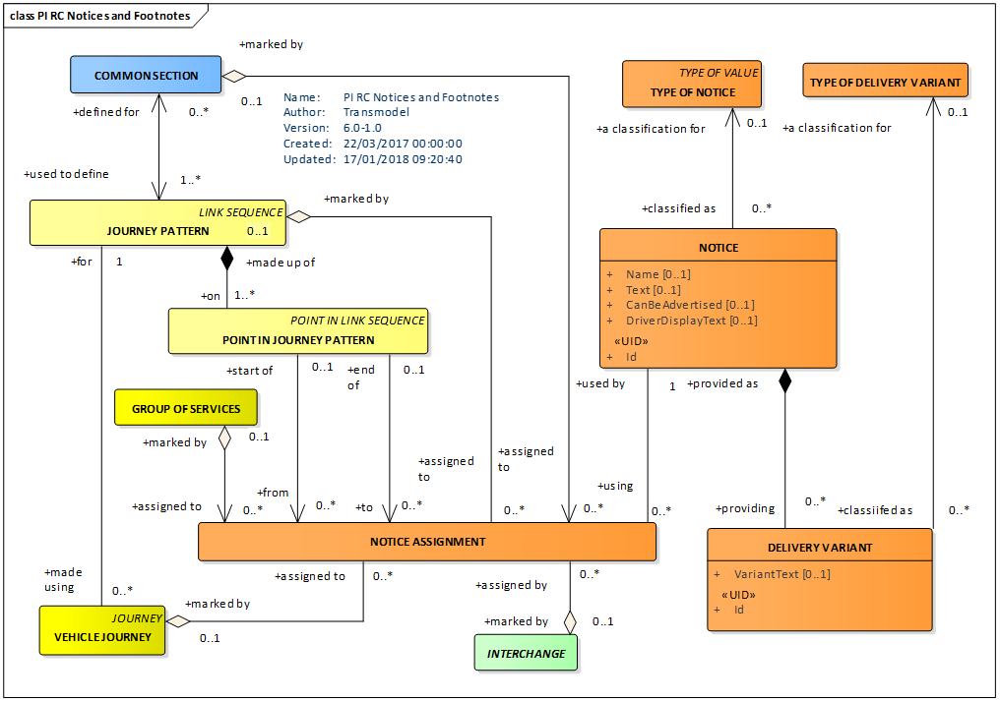

Timetable information

A timetable is an end product of the scheduling process. It gives the scheduled PASSING TIME (in general, departure times) for all VEHICLE JOURNEYs, on all SCHEDULED STOP POINTs, for one or possibly several DAY TYPEs.  
Although the ‘timetable’ is a very well-known and important concept, it is not described in the data model as an inherent entity, because it contains only derived data; a TIMETABLE FRAME represents such an assembly and can be used to organise journeys into named sets with a particular validity that can be rendered in tabular form. The process of computing timetable information (in particular the passing times) is described in detail in EN12896-3. The GROUP OF JOURNEYs element can be used to create subsets of journeys with similar properties (e.g. same direction, service pattern, etc) to guide the efficient rendering of a timetable into a tabular format.

#### **Passing times**

Any theoretical PASSING TIME at a point may be derived from the underlying scheduling information. However, in real implementations, this data will often be pre-calculated and stored.  
The PASSING TIMEs that are the results of the scheduling process for publishing in a timetable are called TIMETABLED PASSING TIMEs (see EN12896-3).  
The PASSING TIMEs that are computed on a specific OPERATING DAY are called DATED PASSING TIME. This entity has several subtypes, described in EN12896-3:

  - TARGET PASSING TIME, the latest official plan for a DATED VEHICLE JOURNEY, on a POINT IN JOURNEY PATTERN;
  - ESTIMATED PASSING TIME, a forecast for a MONITORED VEHICLE JOURNEY, on a POINT IN JOURNEY PATTERN;
  - OBSERVED PASSING TIME, recorded for a MONITORED VEHICLE JOURNEY, on a particular POINT.

#### **Calls**

When organising data for efficient exchange and presentation to the passenger, it is sometime useful to rearrange it in views that may be denormalised, or that may include additional derived data.  
In particular a CALL, defined as a view that brings together data relating to the individual visit to a POINT IN JOURNEY PATTERN in a VEHICLE JOURNEY assembles information held variously on a POINT IN JOURNEY PATTERN and related entities, grouping planned estimated and observed arrival times and departure times in convenient CALL PARTs, and referencing ancillary information such as the DESTINATION DISPLAY and NOTICEs for the POINT IN PATTERN (for further details see EN 12896-3).

#### **Frequency-based services**

Where services are very frequent (typically less than every 10 minutes) it is often the practice not to publish specific passing times for the stops on a timetable, but rather simply to indicate a frequency of service (for example, “every 5-8 minutes”). This may be represented by a TEMPLATE SERVICE JOURNEY which gives the service pattern that is followed, and a FREQUENCY GROUP that gives the expected intervals – see EN12896-3.

# Trip Description Models

Passenger trip planning

Modern computer-aided travel tools assist potential travellers in preparing their trips, particularly in answering specific TRIP REQUESTs. Such a trip planning function identifies the origin and destination places of an intended trip and proposes one or several TRIP solutions.  
The Trip Description Models describe the trips and fares that passengers may make on transport networks, in particular public transport, but possibly also including legs made by car, cycle, walking, ride sharing or other private modes.

Trips, trip reasons and related components

A **TRIP** is defined as a part of a TRIP PATTERN describing the movement of a passenger from one PLACE of any sort to another. A TRIP may consist of one or more consecutive LEGs having some common characteristics.  
A **TRIP PATTERN** describes complete spatial movement of a passenger from an origin PLACE to a destination PLACE, using public transport vehicles and other modes, including possibly walking and non-public transport legs, done for a specific TRIP REASON.  
A TRIP PATTERN may consist of one or more consecutive TRIPs.

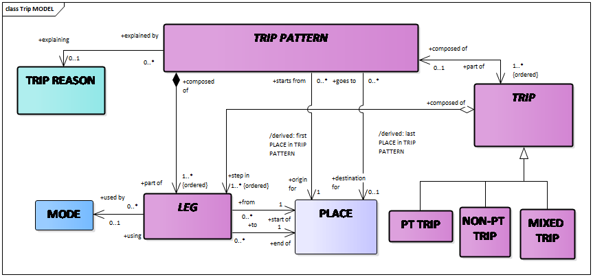  
A LEG is the principal component of a TRIP PATTERN.  
Each LEG describes a movement of a user *in a single vehicle, or using a single other mode* such as walking, cycling, or driving. LEGs may be of different types (PT RIDE LEG, ACCESS LEG, PT CONNECTION LEG, OTHER LEG, etc.) depending upon the mode of transport used to make them. In particular:

  - A PT RIDE LEG is that part of a passenger trip taken on a single PT vehicle, from one SCHEDULED STOP POINT to another. A PT RIDE LEG is carried out on only one JOURNEY PATTERN;
  - An ACCESS LEG describes a non-public transport LEG made between an arbitrary origin or destination PLACE and a SCHEDULED STOP POINT, when accessing public transport.
  - A PT CONNECTION LEG describes details of the interchange made from one SERVICE JOURNEY to another over a CONNECTION between two SCHEDULED STOP POINTs.
  - An OTHER LEG can be used to describe a leg on another mode of transport (for example by car) making up a trip, from an origin PLACE to a destination PLACE. The origin and destination may be a SCHEDULED STOP PLACE or some other type of place such as an ADDRESSABLE PLACE, POINT OF INTEREST, etc.

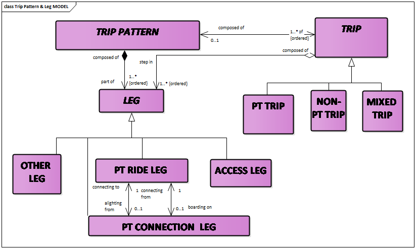  
The overall Trip Model is as follows:

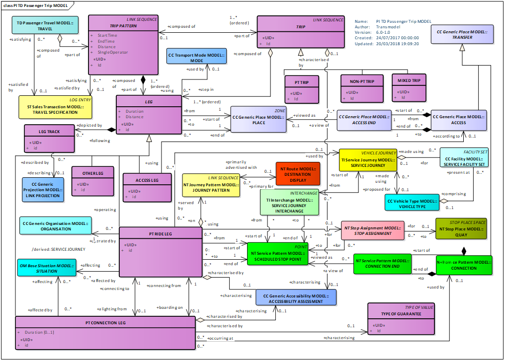

A **PT CONNECTION LEG** is a part of a TRIP PATTERN corresponding to the movement of a passenger transferring from one SERVICE JOURNEY to another, made over a CONNECTION from one SCHEDULED STOP POINT to another, and possibly following a specific NAVIGATION PATH (a designated path between two places, see EN12896-2).  
The PT CONNECTION LEG may be characterised by the type of guarantee offered for a given connection.  
PATH GUIDANCEs can be used to provide step by step instructions for following the path through the PT CONNECTION LEG, if necessary, referring to signage modelled as part of the SITE description, as well as headings, turn instructions and level changes computed from the path.

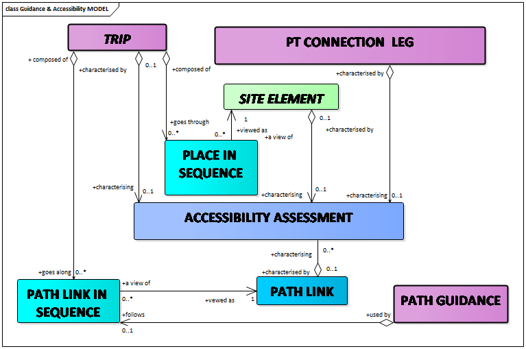  
PATH LINK IN SEQUENCE is a step of a NAVIGATION PATH indicating traversal of a particular PATH LINK as part of a recommended route (for more details see Site Model, Path & Navigation Path Model provided in EN 12896-2).

Motivation for travel

A passenger TRIP may be a part of a wider pattern of **TRAVEL**, made for different reasons. For example, a passenger might make a trip to deliver their children to school, then another to proceed to work. The wider pattern can be captured as a TRAVEL, a set of trips for a given TRAVELLING ENTITY, made for a specific TRIP REASON.  
A TRAVEL may also be used to assemble a collection of alternative TRIP PATTERNs that all satisfy the same TRAVEL SPECIFICATION, so as to present a selection of alternative routes to a customer.  
Data from multiple TRAVEL instances can be summarised as a TRAVEL FLOW for statistical purposes.

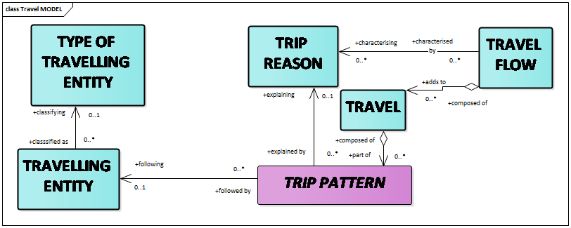  
Some examples of simple travel specifications:

1.  Simple trip from one bus stop to another  
    TRIP PATTERN \[TRIP REASON= go to work\] is composed of a PT TRIP composed of one PT RIDE LEG \[MODE = bus\]
2.  Walk to a bus stop, catch the bus, walk to the shop  
    TRIP PATTERN \[TRIP REASON= go shopping\] is composed of a PT TRIP composed of an ACCESS LEG \[MODE = walk\] followed by a PT RIDE LEG \[MODE = bus\], followed by an ACCESS LEG \[MODE = walk\].
3.  Walk to the station, catch the train, cross town in a taxi, take the second train, walk to the meeting centre may be represented by a TRIP PATTERN \[TRIP REASON= business trip\] composed of:  
    a PT TRIP composed of an ACCESS LEG \[MODE = walk\], a PT RIDE LEG \[MODE = rail\], an ACCESS LEG \[MODE = walk\]  
    a NON-PT TRIP composed of an OTHER LEG \[MODE = taxi\]  
    a PT TRIP composed of an ACCESS LEG \[MODE = walk\], a PT RIDE LEG \[MODE = rail\], an ACCESS LEG \[MODE = walk\].

Trip duration

The **TRIP DURATION** Model specifies how long a trip will take. It provides additional information for the Passenger Trip Model.  
A mean PASSENGER RUN TIME can be specified for the time to travel each leg of a PT TRIP, and a MEAN PASSENGER WAIT TIME can be specified for the average wait time at each stop. These can be used to compute an overall travel time.  
Where a specific VEHICLE JOURNEY is cited an exact time can be calculated from the PASSING TIMES.  
Several concepts in the diagram below are presented and discussed in detail in EN 12896-3.

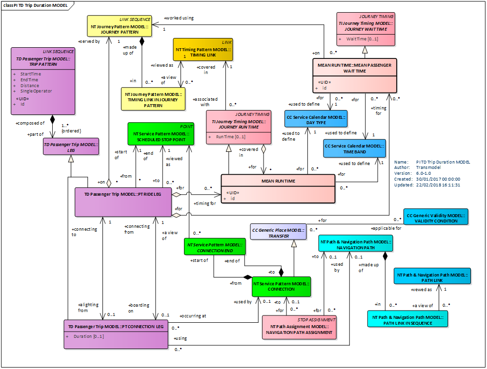

Monitored Trip

It may be useful to monitor the actual status of the service in real-time against the planned TRIP in order to be able to inform the passenger of any delays.  
TRIP PATTERN MONITORING is the action of monitoring a passenger movement in real-time to provide progress information for a passenger.  
A MONITORED TRIP describes the monitoring of an individual planned TRIP. It is made up of MONITORED LEGs; each MONITORED LEG can relate a specific PT RIDE LEG to a specific MONITORED VEHICLE JOURNEY in order to derive progress information.  
Observed and estimated PASSING TIMEs may be represented for the user as MONITORED LEG CALLs for each stop of interest on the journey. The MONITORED LEG CALLs may have separate MONITORED LEG PARTs for the arrival (MONITORED LEG ARRIVAL) and departure (MONITORED LEG DEPARTURE) steps.  
MONITORED TRIP may itself be part of a sequence of trips constituting a MONITORED TRIP PATTERN.

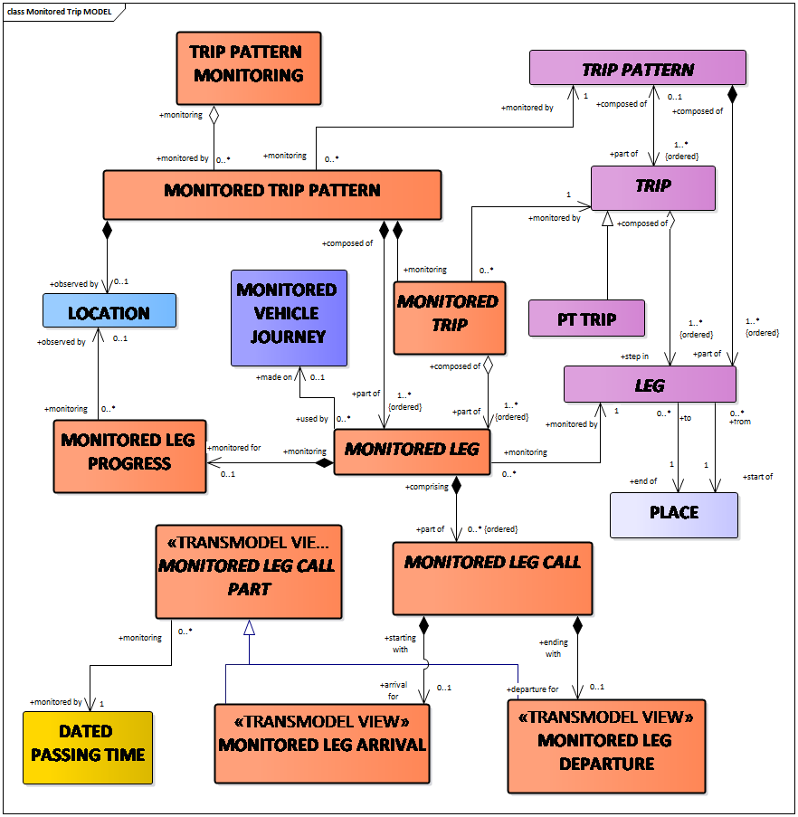

MONITORED LEG PROGRESS provides the relative progress of a passenger along a LEG (current distance along a LEG, time at which LEG started or /ended, etc).

Passenger trips and associated fares

To describe the fares available for a trip, the Passenger Fare Offer Model includes a PT FARE OFFER, defining an available fare for a specific PT RIDE LEG in a PT TRIP or for the whole PT TRIP, or for the whole TRIP PATTERN. The fare may be restricted to particular products and conditions as described by SPECIFIC PARAMETER ASSIGNMENTS, related to the OFFERED TRAVEL SPECIFICATION (a set of parameters giving details of the intended consumption of access rights (e.g. origin and destination of a travel, class of travel, etc.)).  
The diagram below reminds several concepts defined and discussed in EN12896-5, in particular:

  - TARIFF representing a particular instance of a fare structure;
  - VALIDABLE ELEMENT: a sequence or set of FARE STRUCTURE ELEMENTs, grouped together to be validated in one go;
  - FARE PRODUCT: an immaterial marketable element (access rights, discount rights, etc.), classified by the payment method and the account location: pre-payment with cancellation (throw-away), pre-payment with debit on a value card, pre-payment without consumption registration (pass), post-payment etc.;
  - SALES OFFER PACKAGE: a package offered for sale as a whole, consisting of one or several FARE PRODUCTs.

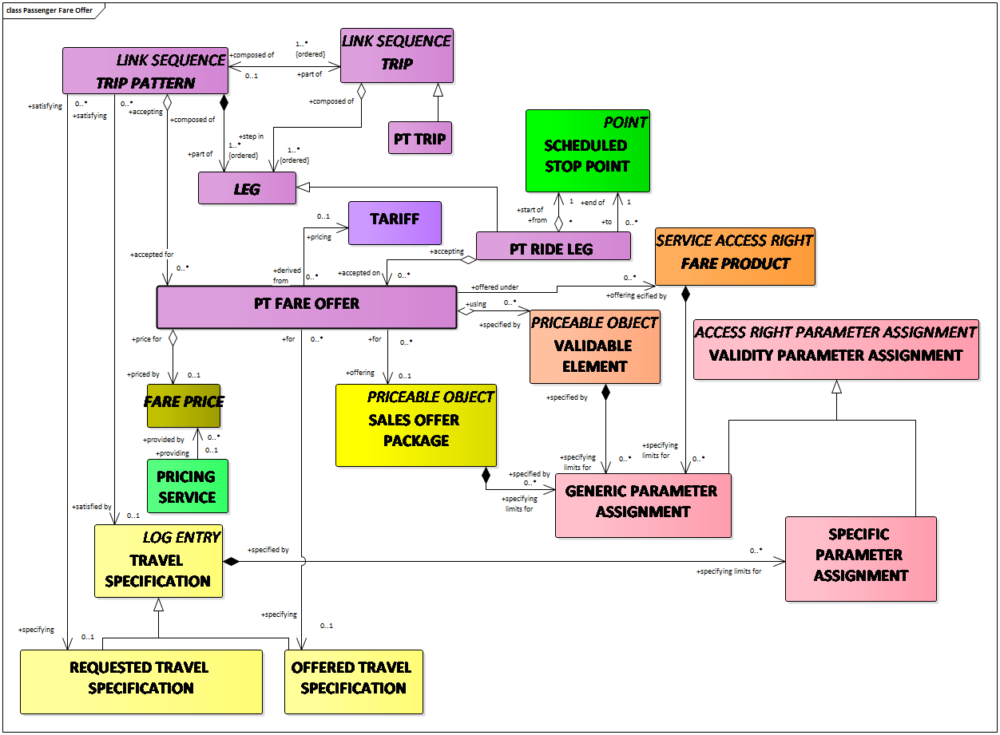

A **PT FARE OFFER** describes a FARE PRODUCT and its PRICE available for a particular PT TRIP or PT RIDE LEG.  
For further explanations of the concepts related to the fares see EN12896-5.

# Passenger information equipment

Delivery of passenger information through any form of device is described by the entity PASSENGER INFORMATION EQUIPMENT (a generic class of information device), which may be passive (for example a printed timetable), active (for example a display), or interactive (for example a kiosk terminal supporting trip planning). A LOGICAL DISPLAY is a set of data that can be assembled for assignment to a physical PASSENGER INFORMATION EQUIPMENT or to a logical channel such as web or media.

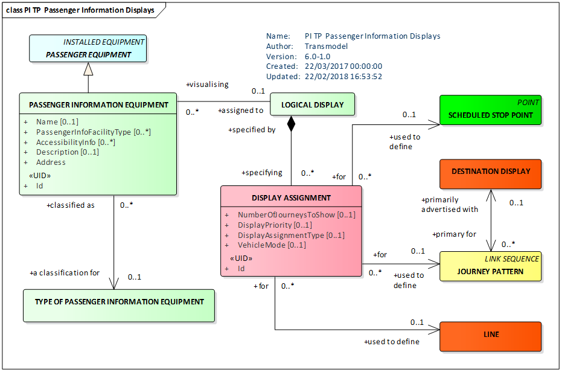

For more detailed discussion see EN12896-2.

# Passenger Information requests

The Query Model uses a common framework comprising an abstract query made up of a request/response pair. It describes common query constructs used by all the different query types and provides an abstract template which can be populated by specific requests.

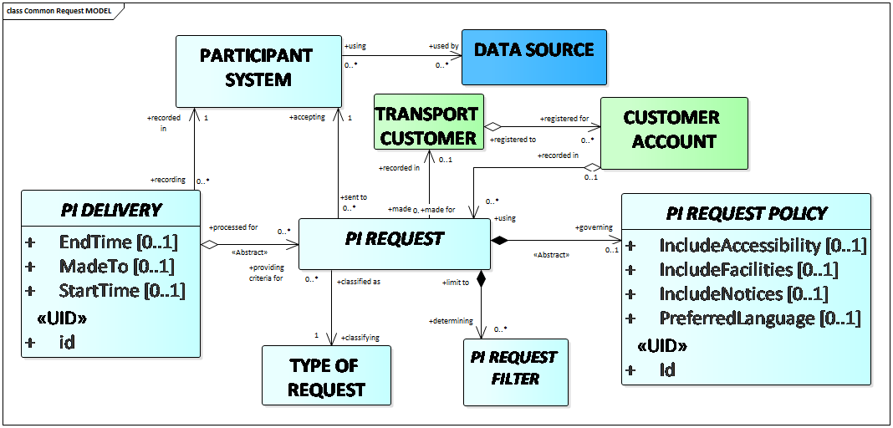

An Informative part of EN 12896-6 provides examples of Passenger Information (PI) REQUEST Models and indicate how the Transmodel data elements relate to APIs and web services that deliver transport data to the end user, for example journey planners, fare engines, etc. The models give guidance as to which Transmodel elements are relevant for typical passenger information queries, and to identify useful query criteria.  
The figure below presents different types of PI REQUESTs and PI DELIVERies considered (see the Informative Annex E of EN 12896-6).  
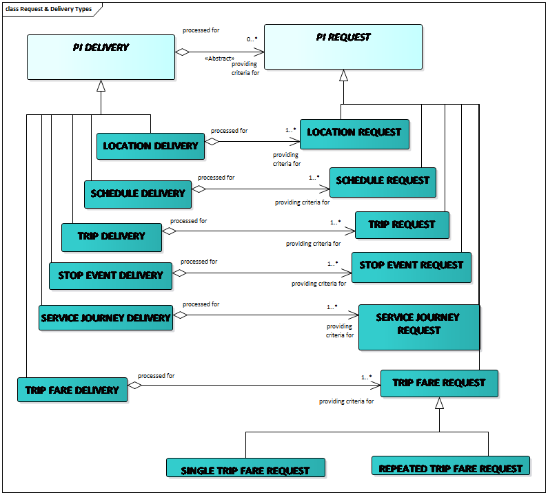

A TRIP REQUEST is used to request trip plans from a journey planning engine. The Trip Request can be used both for single-trips and for multi-point trips that go via several way points.  
Transmodel gives an indicative set of parameters commonly found in trip planners, but others are possible and might be added to the filters to select or bias the results.  
Below is an example of a Trip Query Model and the associated TRIP DELIVERY providing as result one or more TRIP PATTERNs.

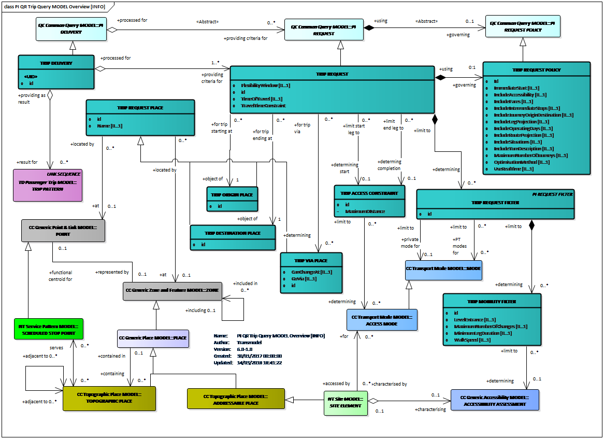

Annex D of EN12896-6 provides a table with (approximate) equivalences between:

  -   -   - the SIRI (Service Interface for Real-time Information, EN 15531 series) functional services
          - the OADJP (Open API for Distributed Journey Planning, CEN/TS 17118:2017) functional services

and the Transmodel Request model.
