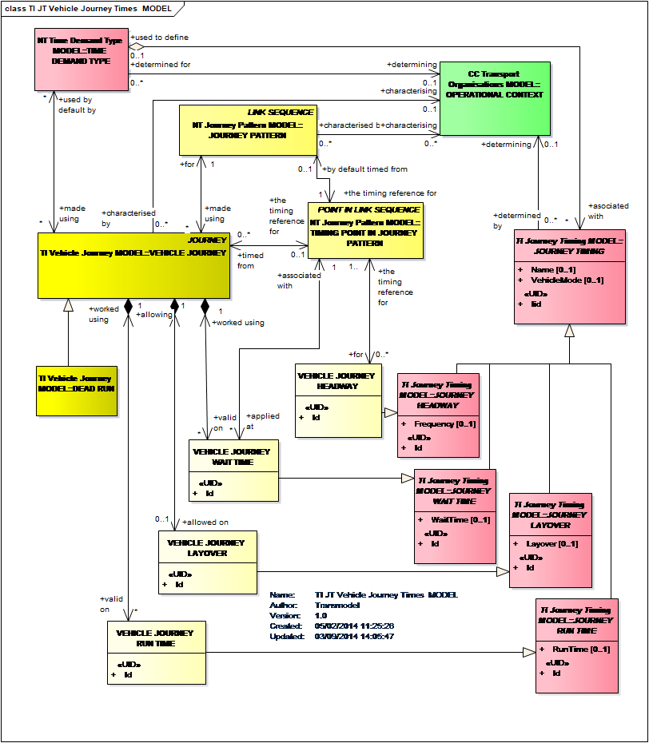

!!! warning "Raw, unwashed content"
    This page is in the review corpus — copied directly from the source site with only automatic conversion applied. It has not yet been edited for tone, structure, accuracy, or duplication. Do not treat as final.

*You can check the online version or download the pdf version [TUTORIAL-Part1-3: 2016](../../assets/files/TUTORIAL-Part1-3-v0.2-1.pdf). Note that the pdf includes also other two tutorials also available in online version* *([Common Concepts EN12896 -1](https://mockuptm.itforpt.be/index.php/common-concepts/)* *and [Public Transport Network EN12896 – 2](https://mockuptm.itforpt.be/index.php/network-description-tutorial/) ).*

# Tutorial: Timing information

How are the time-related aspects of a public transport network taken into account?

One of the main principles of Transmodel is to clearly distinguish the space-related concepts from the time-related concepts. The Reference Data model covers, on one hand, the topological aspects of the Public Transport Network and, on the other hand, time-related aspects.

The time-related concepts are presented in the Service Calendar Model (Part 1 – Common Concepts), Time Demand Type Model  (Part 2 – Tactical Planning Components)  and numerous timing information models (Part 3 – Timing Information and Vehicle Scheduling).

The Service Calendar Model is presented on the following diagram:

Time Demand Type Model is presented on the following diagram:

One of the many timing information models is Vehicle Journey Times Model:

See also FAQ “How does Transmodel define timetables?”, which explains how are timetable information integrated into Timetable Frame Model.

What are the main Tactical Planning Components?

The Tactical Planning Components Model provides reusable information about transport planning, such as spatial description of journey patterns and service patterns. Reusable journey patterns and service patterns are independent of actual operating times in scheduled journeys.

In most transport networks the scheduled journeys follow the same patterns of movement and the Tactical Planning Components Model allows these to be described as reusable components in their own right.

The elements defined in the Tactical Planning Components Model are subsequently used in the Journey Timing  Model  & Vehicle Journey Times Model to specify actual VEHICLE JOURNEYs at particular times (Vehicle Journey Model).

Two main tactical planning models are Journey Pattern Model and Service Pattern Model:

How does Transmodel define timetables?

Transmodel as a generic model mainly considers elementary data concepts. A timetable is an aggregated data. Transmodel considers all elements available to design a timetable. These are represented in the Timetable Frame Model, the main concept being the VEHICLE JOUNEY and its timing.

<https://mockuptm.itforpt.be/wp-content/uploads/EA185.png>

What is a journey in Transmodel?

A VEHICLE JOURNEY is the planned movement of a public transport vehicle on a DAY TYPE from the start point to the end point of a JOURNEY PATTERN on a specified ROUTE (Vehicle Journey Model).

Transmodel considers a journey as a purely time-related concept:  its attributes are times (Departure Time, Journey Duration). A VEHICLE JOURNEY is only linked to the topological object JOURNEY PATTERN.

The work of the vehicles necessary to provide the service offer advertised to the public consists of SERVICE JOURNEYs . DEAD RUNs are  unproductive VEHICLE JOURNEYs necessary to transfer vehicles where they are needed, mainly from the depot into service and vice versa (Service Journey Model).

Vehicle Journey Model and Service Journey Model are presented here:

Does Transmodel describe journey coupling and splitting?

Transmodel considers different concepts (Coupled Journey Model):  
a COUPLED JOURNEY: A complete journey operated by a coupled train, composed of two or more VEHICLE JOURNEYs remaining coupled together all along a JOURNEY PATTERN. A COUPLED JOURNEY may be viewed as a single VEHICLE JOURNEY.  
JOURNEY PARTs:A part of a VEHICLE JOURNEY created according to a specific functional purpose, for instance in situations when vehicle coupling or separating occurs.  
A JOURNEY PART COUPLE: two JOURNEY PARTs of different VEHICLE JOURNEYs served simultaneously by a train set up by coupling their single vehicles.  

How is journey timing considered in Transmodel?

Basically the following situations are possible:  
Representation of journey timing as PASSING TIMEs (at specific points) derived from the  run times (times taken to traverse TIMING LINKs within the JOURNEY PATTERN related to the VEHICLE JOURNEY)  
Consideration of  DEFAULT  run time : the default time taken by a vehicle to traverse a TIMING LINK for a specified TIME DEMAND TYPE (Time Demand Times Model)  
Consideration of  JOURNEY PATTERN RUN TIME: the time taken to traverse a TIMING LINK in a particular JOURNEY PATTERN, for a specified TIME DEMAND TYPE. (Journey Pattern Times Model)  
Consideration of specific run times for each particular VEHICLE JOURNEY (Vehicle Journey Times Model)  
Representation of a  special behaviour of journeys  
frequency based services (services runing with a regular interval  (every 10 min,  for example)  
rhythmical services (runs all xxh10, xxh25 and xxh45, for example)

The diagram shows Journey Passing Times Model:

Vehicle Journey Times Model

Are passing times at stops defined?

Strictly speaking Transmodel differentiates space-related concepts from time-related concepts.  So the PASSING TIMES are linked to vehicle journeys.

Two main types of PASSING TIMEs do exist:  a set of TIMETABLED PASSING TIMEs  is  linked to a VEHICLE JOURNEY  and a set of DATED PASSING TIMEs is linked to a DATED VEHICLE JOURNEY.

Several  considerations have then to be undertaken, to calculate the timing of a journey, based on a reference TIMING POINT belonging to the covered JOURNEY PATTERN where a ‘departure time’ is specified for the journey at this point, then run and wait times for the different TIMING LINKS (possibly depending on the TIME DEMAND TYPE) have to be considered to determine the PASSING TIMEs at TIMING POINTs . The PASSING TIMEs at stops which are not TIMING POINTs may be determined by interpolation.

Are Demand Responsive Services taken into account?

Transmodel considers flexibility of services through the assignment of FLEXIBLE SERVICE PROPERTIES  to VEHICLE JOURNEYs (Flexible Service Model).

How does Transmodel represent scheduled interchanges?

INTERCHANGE is the scheduled possibility for transfer of passengers between two SERVICE JOURNEYs at the same or different SCHEDULED STOP POINTs (Interchange Model).

INTERCHANGE RULES describe conditions for considering JOURNEYs to meet or not to meet, specified indirectly: by a particular MODE, DIRECTION or LINE. Such conditions may alternatively  be specified directly, indicating the corresponding services. In this case they are either a SERVICE JOURNEY PATTERN INTERCHANGE or a SERVICE JOURNEY INTERCHANGE.

INTERCHANGE has to be differentiated from the concept of CONNECTION. Scheduled INTERCHANGEs represent  operational time constraints for journeys to meet . CONNECTION represent the spatial possibility for a passenger to change from one public transport vehicle to another to continue the trip.

How is the tactical planning of operations related to the plans for a particular day?

The tactical planning operations (linked to DAY TYPEs rather than to particular OPERATING DAYs) designs a PRODUCTION PLAN, which is a VERSION associating the production components for a specific OPERATING DAY. Data issued from reference plans for DAY TYPEs are implemented as dated objects for this specific OPERATING DAY. They are then modified according to specific requirements for this day or unexpected changes. A specific VERSION of this plan is frozen as a reference for production for the day in question.

See the Service Calendar Frame Model in the FAQ “How are the time-related aspects of a public transport network taken into account?” for more information about DAY TYPEs.
