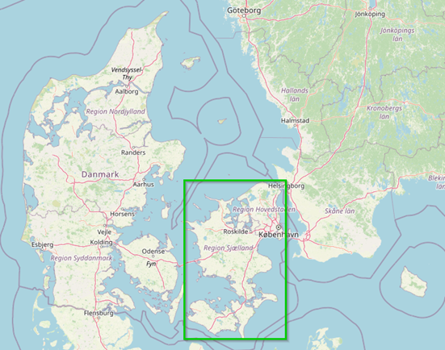
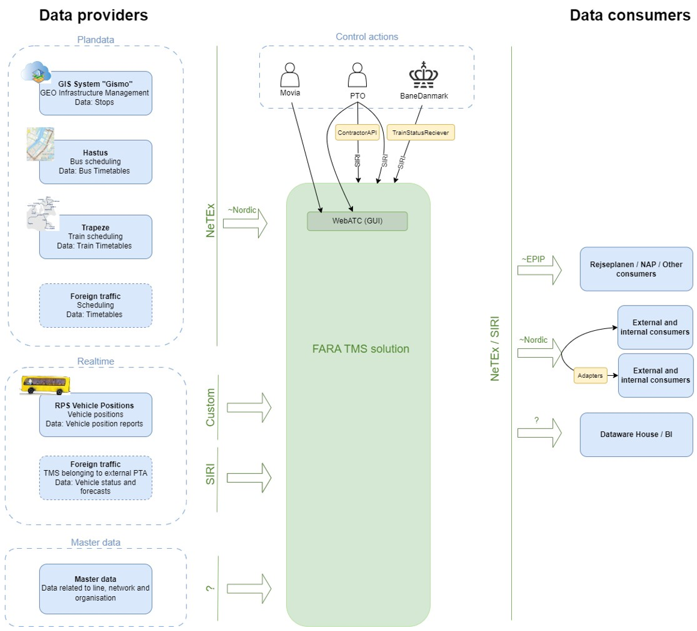

!!! warning "Raw, unwashed content"
    This page is in the review corpus — copied directly from the source site with only automatic conversion applied. It has not yet been edited for tone, structure, accuracy, or duplication. Do not treat as final.

## Overview in the National Level

### NeTEx and SIRI profiles

In Denmark, EU profiles for NeTEx and SIRI has been adopted. The implementation follows the European standards to ensure compatibility and data quality for journey planning and real-time information services.

Guidance on the national requirements and best practices is available in Danish through Trafikstyrelsen, the [Danish Civil Aviation and Railway Authority](https://www.trafikstyrelsen.dk/arbejdsomraader/kollektiv-trafik/statistik-og-data/krav-til-udstilling-af-data-til-rejseplanlaegning), who is responsible for the implementation of NeTEx, SIRI and NAP on national level. For guidance in English, you can reach out to eudata@trafikstyrelsen.dk.

## Use cases

In Denmark two main stakeholders implement NeTEx and SIRI currently:

1.  **Movia**. It is the PTA for buses and (certain) local trains in Greater Copenhagen. Other PTAs in this area are DSB (regional trains and S-trains) and Metro (Copenhagen metro and a tram line under construction).
2.  **Rejsekort & Rejseplan A/S**. It is the company behind the national travel planner and electronic ticketing system in Denmark, which unites all regions and different transport operators into a common system.

### Description

#### Rejsekort & Rejseplan

Rejsekort & Rejseplan A/S have used the NeTEx and SIRI standards nationwide, providing comprehensive coverage of the entire public transport network.

The architecture implemented by Rejsekort & Rejseplan A/S relies on centralized data exports from subcontractors IVU Traffic Technologies and HaCon, which supply the necessary data to Rejsekort and Rejseplan. These systems use the NeTEx and SIRI profiles to ensure high compatibility and data consistency. This architecture allows for the effective aggregation of transport data across various operators and regions, supporting both journey planning and real-time passenger information services.

#### Movia

Movia is using NeTEx and SIRI as the main interfaces around a new ‘Traffic Management System’ TMS. The delivery of the TMS was tendered and the contract was awarded FARA in 2023 and is expected to be in operation in 2025.

The system will handle all PT bus and local train traffic within Greater Copenhagen and Sealand:

  - Number of ServiceJourneys on a workday: \~20 000
  - Number of Calls on a workday: \~700 000
  - Number of concurrent journeys in rush hour: \~1 000
  - Number of active stops (Quays): \~17 000

### Architecture

#### Movia

The TMS will consume stops and schedules in NeTEx-format. We use a profile based on the [Nordic Profile](https://enturas.atlassian.net/wiki/spaces/PUBLIC/pages/728891481/Nordic+NeTEx+Profile) with minor adaptions.

The system will expose NeTEx as well as SIRI data. NeTEx will be exposed using the Nordic-based profile as well as EPIP. 

### Use cases

Currently, there are no active users of NeTEx and SIRI. The national travel planner already provides comprehensive and well-functioning services across the country, and the introduction of these standards has not been able to contribute to any improvement.

### Outcome

Movia is currently using a system based on NOPTIS interfaces. The choice of NeTEx/SIRI for the new system was driven by the fact that NOPTIS is only supported by few suppliers – NeTEx/SIRI are supported by EU, has status as CEN/TS, and are widely supported. We believe that the choice of NeTEx/SIRI has opened the competition with lower price as a result. Moreover, Movia expects that with NeTEx/SIRI, it will be easier to integrate new consumers in the future.

As of now, no significant benefits from the implementation of NeTEx and SIRI have been observed in Denmark.

The largest Danish public transport authority is in the process of implementing NeTEx and SIRI, which may create new opportunities for enhanced data exchange and service improvements in the future. The full potential of these standards, however, has yet to be realized in Denmark.
