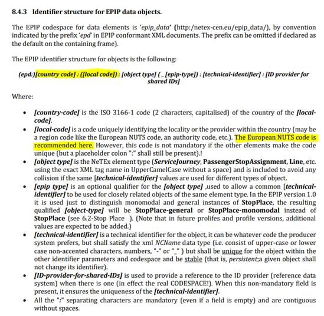
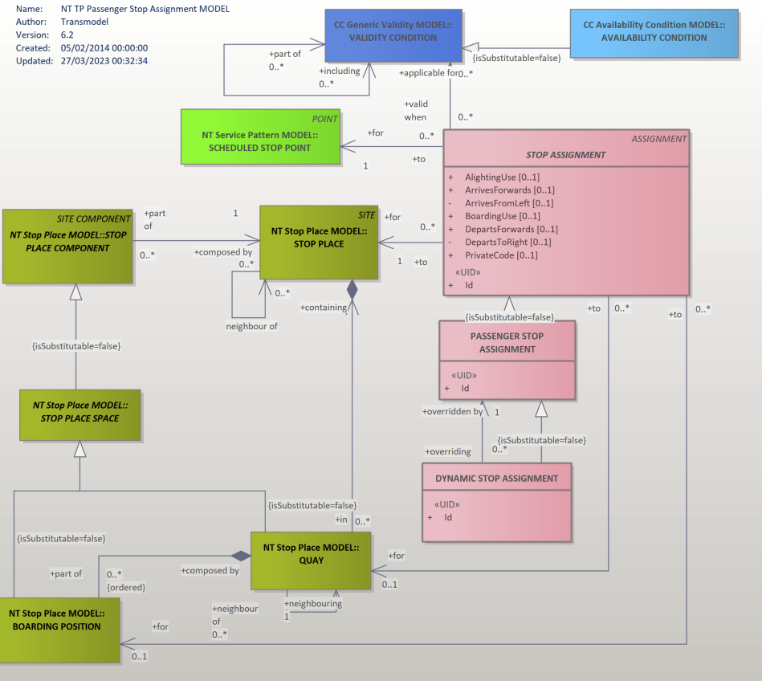
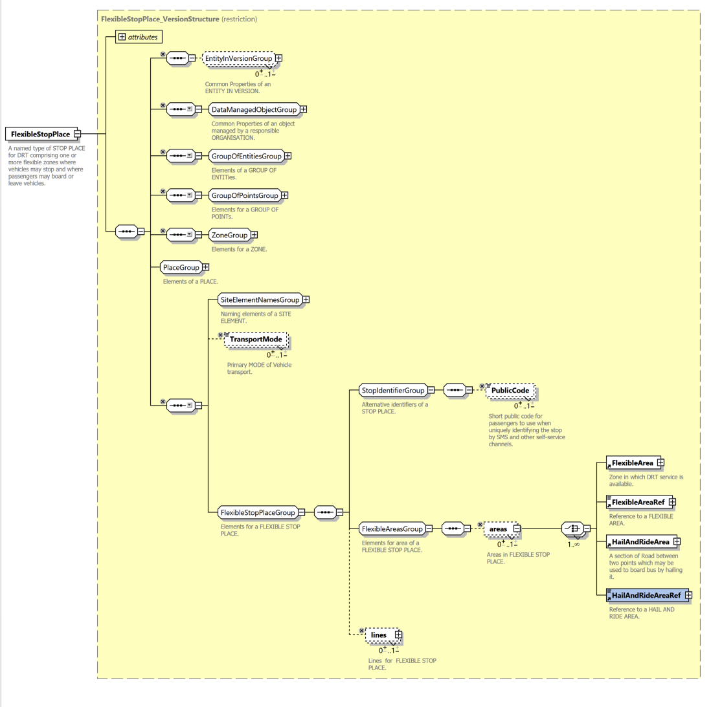
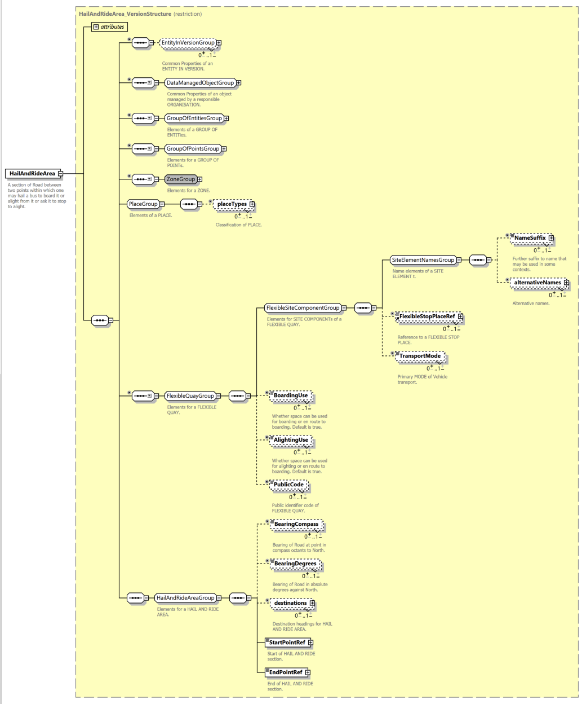
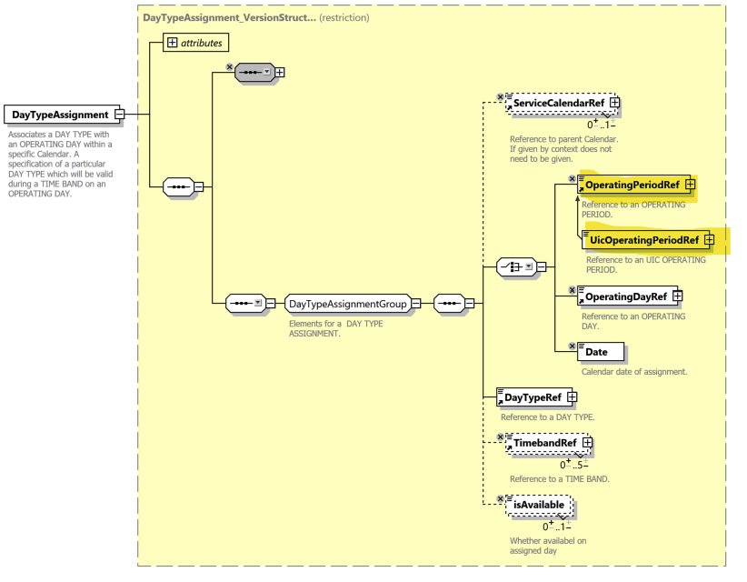

!!! warning "Raw, unwashed content"
    This page is in the review corpus — copied directly from the source site with only automatic conversion applied. It has not yet been edited for tone, structure, accuracy, or duplication. Do not treat as final.

## How do you create C\# classes from the NeTEx XSD?

It is possible to create C\# classes in different ways.

There are many tools out there, but for instance, you could use the Microsoft xsd.exe tool or the mganss/XMLSchemaClassGenerator tool available on Github at <https://github.com/mganss/XmlSchemaClassGenerator>

Currently there are some issues if you try to use the official NeTEx XSD as a starting point with either of these tools.

However, the above-mentioned tools work fine if you use them together with an adapted set of XSD-files available from Data4PT. The file set is designed to be compatible with the official NeTEx XSD and to cover many important use cases. It does however not cover all use cases possible with the official schema. There is an interactive graphical presentation of the adapted and reduced XSD available at <https://data4pt.org/NeTEx/GraphicKit/Documention_of_reduced_XSD.html>

If you wish to try out this reduced XSD, you can download it at <https://data4pt.org/NeTEx/GraphicKit/XSD_reduced.zip>

The work steps if you are using the Microsoft tool are:

Get the zipped XSD. Extract the ZIP to a folder. Make sure that you have a recent version of the xsd.exe. It is part of the .NET Framework Developer Pack and can be downloaded from <https://dotnet.microsoft.com/download/dotnet-framework> Install the developer pack. The xsd.exe will be placed in a folder with a path similar to C:\\Program Files (x86)\\Microsoft SDKs\\Windows\\v10.0A\\bin\\NETFX 4.8 Tools Open a command prompt in the same folder as where the NeTEx\_publication\_reduced-NoConstraint.xsd resides. Execute the following command (you may have to adapt the path to xsd.exe): "C:\\Program Files (x86)\\Microsoft SDKs\\Windows\\v10.0A\\bin\\NETFX 4.8 Tools\\xsd.exe"/c/language:C\# gml\_combo\_v3\_2\_1\_simplified.xsd NeTEx\_publication\_reduced-NoConstraint.xsd The work steps if you are using the MGANSS tool are:

  - Get the zipped XSD. Extract the ZIP to a folder.
  - Download and extract the binary from <https://github.com/mganss/XmlSchemaClassGenerator/releases> to a separate folder e.g. C:\\MGANSS.
  - Open a command prompt in the same folder as where the NeTEx\_publication\_reduced-NoConstraint.xsd resides.
  - Execute the following command (you may have to adapt the path to the exe):

C:\\MGANSS\\XmlSchemaClassGenerator.Console.exe NeTEx\_publication\_reduced-NoConstraint.xsd -n <http://www.opengis.net/gml/3.2=gml-v>

\--[DATA4PT Team](User:Anasfou "wikilink") ([talk](User_talk:Anasfou "wikilink")) 19:41, 19 May 2022 (CEST)

## Is it possible to get access to the fares/schedule data?

Yes, the part 3 of NeTEx is fully dedicated to fares and works for all modes of public transport (bus, trains, trams, flexible modes, etc.).

There is a set of white papers describing NeTEx (http://netex-cen.eu/?page\_id=14) and one is dedicated to fares: <http://netex-cen.eu/wp-content/uploads/2015/12/10.NeTEx-Fare-WhitePaper_1.04.pdf>

Fares can be quite big topic and people defining them have a lot of imagination. This resulted in NeTex Part 3 being quite big and it is strongly advised to use only a small subset of it which is relevant to your needs. This what we call a Profile. France, Nordic countries, and UK have a fares national profiles. Information about current national profiles is about existing profiles is available [here](https://data4pt.org/w/index.php?title=NeTEX#Published_profiles). A minimum European profile is currently under specification with the support of DATA4PT and it is planned to be delivered to CEN processes by end of June 2024.

\--[DATA4PT Team](User:Anasfou "wikilink") ([talk](User_talk:Anasfou "wikilink")) 10:28, 06 November 2023 (CEST)

## Is it correct to include the data category VehicleType in the TimetableFrame as in the NX-PI-01\_LU\_NAP\_LINE\_AVL-AVL-91\_20210113.xml EPIP example file?

This example file is available for download under <https://data4pt-project.eu/knowledge-database/guidelines/>, it includes the data category VehicleType. Yes, the European Passenger Information Profile, CEN/TS 16614-4:2020,(EPIP) states that the data category VehicleType can be provided in the TimetableFrame. See table 131 – TypeOfFrame: EU\_PI\_TIMETABLE in the documentation.

\--[DATA4PT Team](User:Anasfou "wikilink") ([talk](User_talk:Anasfou "wikilink")) 19:50, 19 May 2022 (CEST)

## Are there other possibilities where to define the vehicle type?

Yes, the European Passenger Information Profile, CEN/TS 16614-4:2020,(EPIP) actually also allows, as an option, that the data category VehicleType is instead provided in the ResourceFrame. See table Table 127 – TypeOfFrame: EU\_PI\_COMMON in the documentation. This second option is now (2021-02-24) also supported in the set of XSD-files available for download from the project website.

\--[DATA4PT Team](User:Anasfou "wikilink") ([talk](User_talk:Anasfou "wikilink")) 19:50, 19 May 2022 (CEST)

## How to manage translations with "MultilingualString" in NeTex?

There are a lot of MultilingualString in NeTEx. All implementions use them. It may be slightly different depending on the language (Java, C/C++, Ruby, Go, Python, etc.) and also on the use case (e.g. there are translations available to be used).

Furthermore, for translations, AlternativeTexts are expected to be used (they do contain MultilingualString but also some more information as presented in the following schema).

<https://data4pt.org/w/images/2/2a/MultilingualString.png>

Also note that an object can have multiple names (not translations but different possible naming): in such case AlternativeNames should be considered.

An xml example (EPIP example file), where MultilingualString attributes (lang) are used is available in the DATA4PT knowledge database.

To check your data sets, you may use EPIP adapted XML-schema. The graphic documentation of the EPIP NeTEx XSD, including MultilingualString description is available here .

Generally, NeTEx example files can be found in the main github repository , while also other databases with examples are available, (e.g. from ENTUR).

\--[DATA4PT Team](User:Anasfou "wikilink") ([talk](User_talk:Anasfou "wikilink")) 19:57, 19 May 2022 (CEST)

## When I try to generate java classes, Ι have a duplication class error. Is it necessary to have those 2 types: vehicleJourneyStopAssignmentsInFrame\_RelStructure and VehicleJourneyStopAssignmentsInFrame\_RelStructure?

It should be only one branch vehicleJourneyStopAssignmentsInFrame\_RelStructure. Maybe the second is in a "dead file". Please check <https://github.com/NeTEx-CEN/NeTEx/blob/master/xsd/netex_part_2/part2_journeyTimes/netex_vehicleJourney_version.xsd>).

In general, regarding java classes, you may check ENTUR recommendations available here <https://github.com/entur/netex-java-model>.

\--[DATA4PT Team](User:Anasfou "wikilink") ([talk](User_talk:Anasfou "wikilink")) 20:03, 19 May 2022 (CEST)

## How to use "keylist" to express secondary identifiers for network?

The element *keylist* and child element *KeyValue* is the right way to add secondary identifiers for a network. The *keylist* element should be positioned before *PrivateCode*. For example:

` `<Network version="any" changed="2022-06-10T09:30:36Z" id="FR1:Network:1045:LOC">  
`    `<keyList>  
`      `<KeyValue typeOfKey="ALTERNATE_IDENTIFIER">  
`        `<Key>`NETWORK_SAE`</Key>  
`        `<Value>`456`</Value>  
`      `</KeyValue>  
`    `</keyList>  
`    `<PrivateCode>`123`</PrivateCode>  
` `</Network>

\--[DATA4PT Team](User:Anasfou "wikilink") ([talk](User_talk:Anasfou "wikilink")) 18:47, 11 June 2022 (CEST)

## Is there a way to express in NeTEx and/or SIRI that the information of provided occupancy level of a public transport vehicle is based on a prognosis (e.g. historical data) or real-time measured data?

SIRI VM (vehicle monitoring service) and SIRI SM (stop monitoring) already today allow a simple enumeration describing the general Occupancy level for a monitored Vehicle Journey. In the coming SIRI version (currently under voting process): - the enumeration value set will be extended and additional values added. Some additional constructions on Call level will also be added. - SIRI Estimated Timetable (ET) will be extended with the possibility to exchange passenger count and occupancy information per Call. This will include recorded information as well as estimated values for coming Calls. The XSD itself is already fully finalised and usable from here <https://github.com/SIRI-CEN/SIRI>

Also, you can find a very relevant document about " Vehicle Occupancy Data" from RTIG (UK trade body for public transport technology stakeholders) here : <https://www.rtig.org.uk/system/files/documents/RTIGT039-1.1%20Providing%20Vehicle%20Occupancy%20Data%20-%20Data%20Interfaces.pdf> It includes detailed references to SIRI and NeTEx data structures : - The NeTEx format includes PassengerCapacity as part of the VehicleType and has a structure that allows for detail - including seated and standing capacities, to be handled - The Occupancy field in SIRI is one of the optional properties of ProgressInfo of a MonitoredVehicleJourney. This element can be used in both SIRI-SM and SIRI-VM services. - There is, in addition, an Occupancy field in the EstimatedCall structure of the SIRI-ET service. If this is populated it represents a predicted passenger load. If the corresponding field is filled in a MonitoredVehicleJourney, this should be used in preference - as it reflects the actual current passenger occupancy value.

\--[DATA4PT Team](User:Anasfou "wikilink") ([talk](User_talk:Anasfou "wikilink")) 12:40, 03 August 2022 (CEST)

## How different levels of stops of complex stations are expressed in NeTEx EPIP?

To describe different levels of stops in complex stations, the XSD is adapted as follows:

<xsd:complexType name="levels_RelStructure">

`   `<xsd:sequence>  
`       `<xsd:element ref="Level" maxOccurs="unbounded"/>  
`   `</xsd:sequence>  
`   `<xsd:attributeGroup ref="ModificationSetAttributeGroup"/>

</xsd:complexType>

The updated XSD is available <https://data4pt.org/w/index.php?title=NeTEX#NeTEx_EPIP>. --[DATA4PT Team](User:Anasfou "wikilink") ([talk](User_talk:Anasfou "wikilink")) 13:32, 3 August 2022 (CEST)

## How to differentiate a basic JourneyPattern from one that takes into account re-routings due to planned deviations?

For planned deviations, another version of JourneyPattern needs to be described having different validity conditions than the regular JourneyPattern. For deviations that occur the same day of the operation, SIRI Estimated Timetable (ET) can be used, and for deviations known some days before the operational day, SIRI Production Timetable (PT) can be used.

Moreover, there is today no element in the XSD that states if a JourneyPattern is "normal" or "diversion". This means that you would probably need to analyse the timetable over a longer period of time and compare how often different JourneyPatterns (or versions of a certain JourneyPattern) are actually used on a certain Direction to find which is the "normal" one.

\--[DATA4PT Team](User:Anasfou "wikilink") ([talk](User_talk:Anasfou "wikilink")) 19:16, 9 September 2022 (CEST)

## Where can I find the UML model for NeTEX?

The UML of NeTEx is available <https://www.netex-cen.eu/model/conceptual/part1/index.htm>. NeTEx is based on data model Transmodel, of which the UML is available in Enterprise Architect file <https://www.transmodel-cen.eu/model/>. This version corresponds to the CEN v6.0 release c2018, with revisions from 2021. For more information regarding the data model (Transmodel) please check here <https://www.transmodel-cen.eu/downloads/>. Updates on the Transmodel UML are expected in the coming period.

\--[DATA4PT Team](User:Anasfou "wikilink") ([talk](User_talk:Anasfou "wikilink")) 16:08, 22 September 2022 (CEST)

## Where can I find information about how and when NeTEx is going to be able to store data about: taxi services, rent of vehicles (with or without driver), parking areas (the classical one, for private cars etc.), low emission zones in cities?

TRANSMODEL Part 10 and NeTEx Part 5 (Alternative Modes API) are relevant to the referred functional scope except of low emission zones. In particular, NeTEx Part 5, covers all alternative modes: Vehicle Sharing (any kind of vehicle, car, bike, scooter etc.), Vehicle Pooling (any kind of vehicle, car, van etc.), Transport Network Companies, Renting, Taxis.

NeTEx also includes mobilityServiceConstraintZones that can be applied to any public transport and new mode services and be a restriction for certain types of vehicles. However this needs to be connected to some services, since NeTEx and Transmodel are not describing the private vehicle use (except for carpooling where there is a public offer on the private vehicle). So, there is no explicit description of Low Emission Zones, where the limitation is triggered by a pollution level. Possible enhancement can be considered.

NeTEx Part 5 (CEN/TS 16614-5) is complementary to the previous parts (1/2/3/4). It is fully aligned with the new Transmodel Part 10, being the underlaying data model. Transmodel extension published as CEN TS 17413:2019. The conversion of CEN TS 17413:2019 into an EN is going to be the Transmodel -Part 10. General information about NeTEx Part 5 is available here <http://netex-cen.eu/wp-content/uploads/2021/03/NeTEx-extension-for-New-Modes-Detailed-Scope-v04.pdf>. The specifications are also now published by CEN.

Besides the CEN documentation, the users (IT suppliers/operators, in general developers etc.) can have access to the technical artefacts (XSD) through the publicly available repository in GitHub (check <https://data4pt.org/w/index.php?title=NeTEX#NeTEx_Part_5_for_New_Modes>). In addition, there is an available mapping-comparison with GBFS, the bike sharing data format from Mobility Data <https://data4pt.org/w/index.php?title=NeTEX#Canonical_mapping_with_GBFS>.

Since NeTEx is about scheduled data (including location of parking places, capacity etc.), is complemented by SIRI for realtime data. Therefore, SIRI has also been extended (recently voted) to cover new modes (vehicles availability, parking places availability etc.). This extension is in SIRI Part 4 (Facility Monitoring). In particular for parking, there is a comprehensive description in NeTEx. France for example has already a dedicated profile for parking – the documentation in french is available here <http://www.normes-donnees-tc.org/wp-content/uploads/2021/10/NF_Profil-NeTEx-pour-les-ParkingsF-v1.2a.pdf> ).

\--[DATA4PT Team](User:Anasfou "wikilink") ([talk](User_talk:Anasfou "wikilink")) 16:28, 22 September 2022 (CEST)

## How to manage codespaces in NeTEx where unique identifiers are needed?

In NeTEx a rule to code IDs is included to ease uniqueness (Europe wide) and stability of IDs.

For example in Italy, they applied this rule, using NUTS code for country-code and local-code.

<ServiceCalendarFrame id="epd:IT:ITC1:ServiceCalendarFrame_EU_PI_CALENDAR:scf" version="any"> <TypeOfFrameRef versionRef="any" ref="epip:EU_PI_CALENDAR"/> <ServiceCalendar id="IT:ITC1:ServiceCalendar:C01" version="any"> <dayTypes> <DayType id="IT:ITC1:DayType:5:dt:A" version="any">

Any other rule can be accepted provided that IDs are unique and stable. Using operator's code inside an ID is not suggested as the Operator can change. With the NeTEx recommended rule, even if the Operator changes, the ID will have to remain the same, ignoring that change. Also the Operator code may not be a good choice for the uniqueness of shared lines or shared stops.

\--[DATA4PT Team](User:Anasfou "wikilink") ([talk](User_talk:Anasfou "wikilink")) 10:04, 05 October 2022 (CEST)

## How to describe two similar stops sequences when the one has a boarding and alighting information and the other has not?

One ROUTE is enough, it can cover two different JOURNEY PATTERNS if the vehicle will traverse the same physical path in both cases. The relation between ROUTE POINT and SCHEDULED STOP POINT is formally through projection.

\--[DATA4PT Team](User:Anasfou "wikilink") ([talk](User_talk:Anasfou "wikilink")) 11:12, 2 November 2022 (CET)

## Should "RouteLink" have a unique identifier?

Each unique RouteLink should have a unique identifier (id-attribute). Note that a RouteLink over time may be altered and still retain its original identifier, but each modification should have a different version-attribute.

At the same time it is OK to refer to the same RouteLink in relation to different Lines, if those Lines include a shared physical path for some part of the respective routes. This applies also if the Lines are provided in separate files.

\--[DATA4PT Team](User:Anasfou "wikilink") ([talk](User_talk:Anasfou "wikilink")) 15:44, 12 January 2023 (CET)

## What is the difference between stopAreas, Quays, stopPlaces?

A STOP AREA is "A group of SCHEDULED STOP POINTs close to each other." so it definitely does not correspond to the quays and stopPlaces of the IFOPT base.

Having a scheduledStopPoint belonging a a single journeyPattern, however this does go via the StopPointInJourneyPattern which is allowing multiple reuse of the same scheduledStopPoint. A scheduledStopPoint can be assigned to StopPlace or Quays thanks to the PassengerStopAssignment. 

\--[DATA4PT Team](User:Anasfou "wikilink") ([talk](User_talk:Anasfou "wikilink")) 11:50, 3 May 2023 (CET)

## How to model a transport ticket that costs 6 euros on the 1st day and 3 euros for each additional day?

This is a typical case of pricing of a SALES OFFER PACKAGEs: several such packages may exist composed of 1, 2,…n elements and a specific price is provided according to the number of the SALES OFFER PACKAGE ELEMENTS in the SALES OFFER PACKAGE.

So for this particular example: The PRICE of the SALES OFFER PACKAGE composed of one SALES OFFER PACKAGE ELEMENT is 6 euros. The price of the SALES OFFER PACKAGE composed of 2…n SALES OFFER PACKAGE ELEMENTs is 6 + (n-1)\*3 euros.

You may consider a PREASSIGNED FARE PRODUCT (e.g. a day pass) which is provided by one or more SALES OFFER PACKAGE ELEMENTs. Access rights may correspond to a PREASSIGNED FARE PRODUCT but also other types of access right might be granted by a SALES OFFER PACKAGE ELEMENT.

Moreover, the definition of TimeIntervals is related to the description of the time-related fare structure elements (for example the use of the network during 1 hour would represent a SALES OFFER PACKAGE ELEMENT A - 1 hour pass, the use of the network during 5 hours represent a SALES OFFER PACKAGE ELEMENT B - 5 hours pass). In the present example, the fare structure elements are identical (use of the network during one day several times). So only the pricing differs according to the number of products purchased. TimeInterval will be rather suitable to the pricing of a single trip (DayOffset are only there because some long distance trips can exceed the day).

\--[DATA4PT Team](User:Anasfou "wikilink") ([talk](User_talk:Anasfou "wikilink")) 11:13, 1 September 2023 (CET)

## How to model "hail and ride" section?

Hail and ride usually is modelled by using a FlexibleStopPlace that can refer to HailAndRide areas as shown in the UML diagrams below. Hail and Ride is described in CEN TS 16614-1. Examples can be found in [NeTEx-CEN GitHub](https://github.com/NeTEx-CEN/NeTEx/tree/master/examples) like this [one](https://github.com/NeTEx-CEN/NeTEx/blob/master/examples/functions/timetable/Netex_01.4_Bus_SimpleTimetable_WithConnection.xml).

\--[DATA4PT Team](User:Anasfou "wikilink") ([talk](User_talk:Anasfou "wikilink")) 16:40, 17 October 2023 (CET)

## How to start implementing NeTEx Part 5 for new modes (vehicle sharing, rental, taxis etc.)?

Simple steps for new users/implementers of NeTEx Part 5:

1\) Watch the introduction webinar for NeTEx Part 5, available on [DATA4PT website](https://data4pt-project.eu/knowledge-database/training-material/) under the title “DATA4PT webinar 24 November 2022: NeTEx and SIRI standards for new modes” (direct link to the [video](https://www.youtube.com/watch?v=F_lK1mfKgbk) and presentation of the [webinar](https://data4pt-project.eu/wp-content/uploads/2022/12/DATA4PT-NeTEx-validation-tool-webinar_Presentation.pdf)).

2\) Read the pdf – official CEN documentation CEN/TS 16614-5 (where also some examples are given). The document can be bought from any national standardization body.

3\) Use XML editor (there are commercial tools or free tools - a short list is available by [DATA4PT wiki](https://data4pt.org/w/index.php?title=NeTEX#Software_.26_tools_.F0.9F.A7.B0)), to check the [XSD for Part 5](https://github.com/NeTEx-CEN/NeTEx/tree/master/xsd/netex_part_5) and check the [examples](https://github.com/NeTEx-CEN/NeTEx/tree/master/examples/functions/newModes) from [Github NeTEx repository](https://github.com/NeTEx-CEN/NeTEx/tree/master).

4\) Create your own .xml examples based on the XSD and the examples available in GitHub. If the user has no technical background, then IT tool provider is needed to support him/her following the same steps. A general list of tools is available in [DATA4PT wiki.](https://data4pt.org/w/index.php?title=NeTEX#Software_.26_tools_.F0.9F.A7.B0)

5\) Validate the example with the XML editor and the Greenlight validator. The latter is the tool that provides feedback both on errors that concern the NeTEx XSD but also the content (plausibility checks).

6\) Use the [DATA4PT helpdesk](https://data4pt-project.eu/requests-requirements/) for more technical guidance.

Finally, a useful material for small operators that they use already GBFS is:

\-the canonical mapping between GBFS and NeTEx/SIRI to get their head around the fields/attributes they need at a quick glance

\- the .xml example that is GBFS-based from the NeTEx GitHub repo.

Relevant material is available [here](https://data4pt.org/w/index.php?title=NeTEX#NeTEx_part_5_for_.F0.9F.86.95_modes)

\--[DATA4PT Team](User:Anasfou "wikilink") ([talk](User_talk:Anasfou "wikilink")) 10:45, 6 November 2023 (CET)

## How to implement DayTypeAssignment in NeTEx? Using OperatingPeriodRef or UicOperatingPeriodRef?

Both "OperatingPeriodRef" and "UicOperatingPeriodRef" are in the same substitutionGroup named OperatingPeriods, therefore both options may be used without impacting the interoperability of the file. UicOperatingPeriodRef is probably cleaner to reference a UicOperatingPeriod.In NeTEx EPIP (European Passenger Information Profile) UicOperatingPeriod is mandatory (providing the ValidDayBits is mandatory). 

\--[DATA4PT Team](User:Anasfou "wikilink") ([talk](User_talk:Anasfou "wikilink")) 12:18, 16 February 2024 (CET)

## Does a scheduledStopPoint ID need to be unique per public transport Line?

A scheduledStopPoint ID does not need to be unique per Line. In situations where several Lines use the exact same stop point they may refer to this same stop point using the same scheduledStopPoint ID. If there is a unique ID for the exact same stop that can be used globally it is also ideal from interoperability point of view.

More precisely, based on NeTEx terminology, a LINE is defined as "A group of ROUTEs which is generally known to the public by a similar name or number." A ROUTE is defined as "An ordered list of located POINTs defining one single path through the road (or rail) network. A ROUTE may pass through the same POINT more than once." JOURNEY PATTERN, defined as "An ordered list of SCHEDULED STOP POINTs and TIMING POINTs on a single ROUTE, describing the pattern of working for public transport vehicles. A JOURNEY PATTERN may pass through the same POINT more than once. The first point of a JOURNEY PATTERN is the origin. The last point is the destination."

In order not to make confusion, when parsing the XML input, the data user needs to sufficiently preserving awareness of the context in which the scheduledStopPoint ID is being used. With a correct awareness of the context, the ID can be augmented, for example via a composite ID made up of Line plus stop IDs. This would make different occurrences of the same stop have different IDs, without breaking the NeTEx rules.

\--[DATA4PT Team](User:Anasfou "wikilink") ([talk](User_talk:Anasfou "wikilink")) 17:38, 25 March 2024 (CET)

## Can NeTEx handle frequency-based services?

Frequency based serves are typically specified as operating at a given interval, rather than particular times. From a passenger point of view multiple journeys will typically be presented as a single journey running at an approximate interval, for example “every six to 10 minutes”. NeTEx uses TEMPLATE VEHICLE journeys to describe such journeys. From an operational point of view there will still need to be specific service journeys scheduled to fulfil the required frequency of service and NeTEx can also include these to support real time journeys.

## Can I have different journey timings for different times of day?

Part 2 of NeTEx includes reusable components for constructing timetables of journeys from reusable components, NeTEx separates the concerns of where the timing of a PT route takes place (The TIMING PATTERN made up of TIMING POINTs and TIMING LINKs) from the actual timing values (which are held separately as RUN TIMEs and WAIT TIMEs). Different sets of timing values belong to different TIME DEMAND TYPEs (Peak, off peak, late night, etc) can be used with the same TIMING PATTERN to generate accurate timetables for journeys at different times of day.

## Can NeTEx describe zone-based fares?

NeTEx can be used to describe zone-based fare systems of any topology ranging from a simple patchwork (adjacent zones) to the complex, (honeycomb, doughnut) etc). The TARIFF ZONE allows zones to be associated with stops and stations. Mixed zonal and stage systems are also possible. Fare pricing may be a flat fare system per zone, or   zone to zone using a (DISTANCE MATRIX ELEMENT), or be differentially priced for particular sequences of zones (using FARE STRUCTURE ELEMENTs in SEQUENCE).

## Can I restrict certain products to certain classes of user?

Among the many different usage conditions that can be specified for NeTEx fare products are restrictions on the type of user – child, senior, student, disabled, etc using a USER PROFILE that may be given precise eligibility criteria (e.g. on age, membership, domicile, etc). A GROUP PROFILE allows the number and makeup of groups to be specified; it can also be used to specify companion criteria for disabled users and other special cases.

## Can I specify time-based constraints on travel?

Some fare products only allow travel at particular times – such constraints can be expressed using USAGE PARAMETERs.  Others only allow travel for a particular duration; FARE STRUCTURE ELEMENTs with TIME STUCTURE FACTORs can be used to describe the different durations. Furthermore, sometimes journey time is related to journey length, so for example a longer time is allowed for a two-zone trip than a one zone trip; all this can be precisely specified in NeTEx.

Temporal conditions may also apply to the purchase or refund of tickets, likewise, expressed as USAGE PARAMETERs attached to fare products.

As well as the routine examples given above, NeTEx can also handle more complex cases.  For example, in the periphery of a large city, off peak times may start at different times in each station since by the time a journey to the centre starting from the station ends, the peak period will have ended.

## Does NeTEx support dynamic/yield managed pricing?

For long-distance travel, especially on-rail, there is increasing use of yield managed fares with dynamic pricing, provided by web services. Note that such applications increase rather than decrease the need for standards such as NeTEx as such applications nonetheless require a machine-readable definition of the access rights fare structure and usage conditions that apply to the products for which prices are supplied. Furthermore, the search parameters used to find the best fare for a user (such as age, possession of rail cards, fulfilment method etc) need to correspond to the properties of the fare product. The NeTEx Part3 specification and UML model includes an annex showing a sample fare query which shows all the NeTEx model elements relevant for constructing a Fare API.

## Can NeTEx define products for modern e-card based ticketing?

Yes. Electronic payment cards such as OV Chipkart (NL), Oyster (London region), Navigo (Paris region) Sube T (Madrid), BIP Card (Turin) are becoming increasingly common and etc transport operators are able to devise increasingly sophisticate products. For example,, Oyster has fares that adjust according to consumption, capping the cost of trips made in a day to that of a day pass. NeTEx is able to describe the fare structures and scope and conditions for such complex products, as well as to supporting a record of consumption for account-based products. (A NeTEx SALES TRANSACTION records an individual PRODUCT SALE).

As products on cards are physical invisible to the user, the ability to create user readable representations become increasingly important – such applications require a machine-readable format with corresponding human readable rendering, such as is available through NeTEx.

## Does NeTEx support Flexible and Demand Responsive Travel?

Yes, unlike classical route and timetable standards, NeTEx is also designed to support FTS (Flexible Transport Service) and DRT (Demand Responsive Transport). DRT and FTS often cover similar services; FTS being more generic since flexibility may not be directly linked to the demand, but may be related to some operating needs or cost optimisations.

The flexibility can be applied to the line, route and stop structure (areas, corridors, hail and ride, etc.) or to their scheduling (dynamic and/or demand responsive passing times, with all necessary booking arrangements and contact details).

## Can I create applications to run in different national Languages?

Yes, NeTEx includes full support for internationalisation. All text elements may be created in multiple languages so that place names and other names and descriptions can be provided in one or more languages. Other aspects important for multiregional use are parameterized such as time zones, currency, etc. and the Calendar functions allow conditions based on different national holidays to be described.

## Can I have different versions of data for the same element extant at the same time?

Yes, every NeTEx data element can be versioned, and multiple versions can coexist. Coherent sets of data are assembled for exchange using a ‘version frame’, which itself has a version and knows the version of the elements in it. There are specific types of version frame for different types of data that are commonly exchanged together (SERVICE, TIMETABLE, FARE etc).

## Can I create Network maps with NeTEx?

Yes, one of the additional capabilities of NeTEx is the ability to define and exchange the full topology of a network as presented in simplified view to a user (often with presentational attributes such as colour), with non-directional network segments, loops etc, while also retaining a projection onto the actual underlying stops and route. This allows automatic creation of interactive map applications.

  - The LINE element names the line and sets basic properties

<!-- end list -->

  - The LINE NETWORK and LINE SECTION elements can be used to describe the topology

<!-- end list -->

  - The ROUTE, ROUTELINK, and ROUTE POINT elements can be used to define the directional elements of the underlying line

<!-- end list -->

  - The SCHEDULED STOP POINT can be used to define the stops of a line.

All these objects can have their own geographic positions and geometry or/and be projected onto a custom drawn map using a SCHEMATIC MAP element.

## I have my own classification for Stops/ Lines / etc. Can NeTEx handle this?

Yes, NeTEx allows arbitrary user defined code classifications for elements using the TYPE OF STOP, TYPE OF LINE and other ‘Type of Entity’ elements that. In addition, NeTEx, to encourage standardised use, also provides fixed enumerations of many commonly found classifications of specific elements, including types of equipment, on-board facilities, etc. The ‘Key Value’ extension mechanism allows Also allows additional user defined attributes to be added, which can include classifier.
