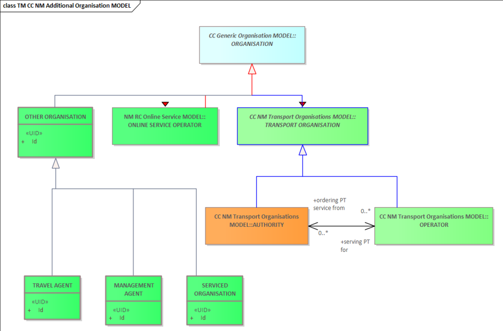
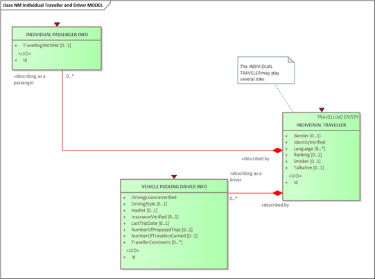
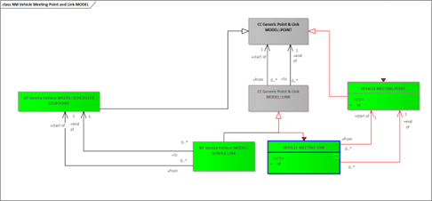
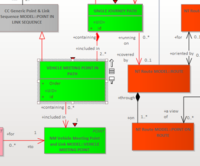
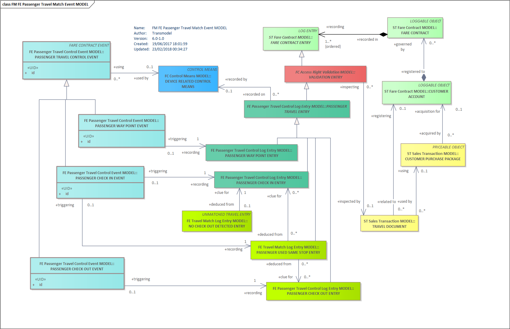

!!! warning "Raw, unwashed content"
    This page is in the review corpus — copied directly from the source site with only automatic conversion applied. It has not yet been edited for tone, structure, accuracy, or duplication. Do not treat as final.

## Conceptual modelling – separating concerns & identifying analogies

### ORGANISATION DAY TYPE

#### **What is it really used for and why is it modeled so complex?**

Transmodel provides the concept of DAY TYPE defined as a type of day characterised by one or more properties which affect public transport operation. For example: weekday in school holidays.

This concept is intended to be used by organisations (in particular operators) in charge of the planning of public transport services.

Transmodel provides the following types of organisations:

A TRANSPORT ORGNISATION is providing transport services related to particular modes of operation.

Other types of organisations exist, in particular **SERVICED ORGANISATIONs** which are public or private organisations **for which public transport services are provided** on specific days, e.g. a school, university or works.

ORGANISATION DAY TYPE is a DAY TYPE that is defined **in terms of operation or not operation** of a referenced SERVICED ORGANISATION (specific DAY TYPE).

This concept is used to describe a reality proper to an organisation **serviced by public transport.**

Example:  

PT services are defined for DAY TYPES Monday, Tuesday, Wedenesday, Thursday, Friday. Some schools in France are closed on Wedensdays, so the service is not required on Wednesdays.

In this case we have ORGANISATION DAY TYPEs:

·       Monday-Tuesday-Thursday-Friday characterised by 'isServiceDay' = true  and

·       Wednesday charactrised by ' isServiceDay '= false. 

The additional attribute 'isServiceDay' is present in NeTEx.

### INDIVIDUAL PASSENGER INFO

#### **Why is INDIVIDUAL PASSENGER INFO not just a structure within INDIVIDUAL TRAVELLER?**

An INDIVIDUAL TRAVELLER may be a driver (e.g. in car pooling) **or** a passenger .

Therefore we have both: INDIVIDUAL PASSENGER INFO and VEHICLE POOLING DRIVER INFO.

Here, the roles of an INDIVIDUAL TRAVELLER are separated  and the attributes reflect **the main requirements/characteristics related to each role.**

NB: the list of attributes reflects the MAIN characteristics allowing to describe the semantics of a concept – NeTEx provides in may cases some more properties.

### VEHICLE MEETING LINK

#### **Some conceptual explanation would be nice (and better description).**

Transmodel provides data structures for conventional modes of operation. Some basic concepts are VEHICLE JOURNEY, SERVICE PATTERN, SCHEDULED STOP POINT, SERVICE LINK, etc

As regards alternative mode of operation, similar concepts do exist:

·      The SINGLE JOURNEY hast to be seen at the same functional  level as a VEHICLE JOURNEY, but without the associated DAY TYPE/CALENDAR (only associated to a OPERTING DAY).

·      The SINGLE JOURNEY PATH is at the same level as the SERVICE PATTERN: the SERVICE PATTERN is a sequence of  SCHEDULED STOP POINT, and the SINGLE JOURNEY PATH is a sequence of VEHICLE MEETING POINTS.

·      Both SINGLE JOURNEY PATH and SERVICE PATTERN are related to a schematic itinerary:  a ROUTE.

·      The SERVICE LINK (link between tso SCHEDLED STOP POINTS) has to be seen at the same functional level as a VEHICLE MEETING LINK (link between two VEHICLE MEETING POINTs).

The functional similarity of the VEHICLE MEETING LINK with a SERVICE LINK for a CONVENTIONAL MODE OF OPERATION means:  **it is a link along which no pick-up/drop-off operation can take place.**

### VEHICLE MEETING POINT IN PATH

#### Is it modeled right?

#### POINT IN SERVICE PATTERN can also be each intermediate point, which is not a VEHICLE MEETING POINT. It is not 2 but an infinite amount of those in the SINGLE JOURNEY according to the diagram.

SINGLE JOURNEY PATH is an ordered list of **VEHICLE MEETING POINTs** on a single ROUTE, describing the pattern of working for an ALTERNATIVE MODE service.

A SINGLE JOURNEY PATH may pass through the same POINT more than once. The first point of a SINGLE JOURNEY PATH is the origin. The last point is the destination.

**VEHICLE MEETING POINT IN PATH is a VEHICLE MEETING POINT with an order** on the SINGLE JOURNEY PATH.

Two or more (2..\* ) **VEHICLE MEETING POINTs describe a** SINGLE JOURNEY PATH.

## Modelling SITE, PARKING, their components vs. EQUIPMENT

### PARKING & PARKING ENTRANCE FOR VEHICLE

#### **The barrier type of a PARKING would be important as well. Also how the payment is to be done. Should this be modelled? The barrier type (at ENTRANCE) should be mentioned. Shouldn't it?**

The ENTRANCE is a physical object (with dimensions) providing entrance/exit to/from a SITE (here PARKING) which may be marked by a barrier (or a door).

A barrier/door is an equipment. So the type of barrier would be related to the concept of 'Barrier' (non present in Transmodel) **and not the the concept of entrance** (which is not considered an equipment).

### PARKING EXIT

**Is there a reason that PARKING EXIT was not modelled?**

PARKING is a SITE with an ENTRANCE defined as follows: a physical **entrance or exit to/from a SITE**. May be ***(marked by)*** a door, barrier, gate or other recognizable point of access.

### PARKING RENTAL STATUS

#### **A parking for bike/e-bike: Should it be modeled as two PARKING?**

If it is a single parking, no: if it’s 2 zone in a single PARKING, then just define 2 PARKING AREAS, if they share the same PARKING AREA then just put both **eCycle** and **cycle** in **ParkingVehicleTypes** (in NeTEx).

### TAXI STAND

#### **How to model simple drop-off points for TAXI? Only allowed to get people out of the taxi? Should perhaps mentioned, if this is a simple VEHICLE MEETING POINT.**

When a place is fully or partially dedicated to taxi pick-up & drop-off, the best is to use a **TAXI STAND** (that can be stand alone on included in a wider site, like a STOP PLACE or a POINT OF INTEREST).

When it comes to be an «unformal» pick-up & drop-off point, then **VEHICLE MEETING POINT** ist he best way to go. Through the VEHICLE MEETING POINT ASSIGNMENT, it can be assigned to any SITE COMPONENT, or just freely defiend with geographic coordinates.

## Fares & ticketing

### TICKET SCOPE

#### **I do not understand the definition. What ist he element for?**

TICKET SCOPE is the broad geographic validity if the ticket: local, national, international.

It describes service restrictions, for example for ticket vending machines which may be dedicated to a type of ticket.

### TOUCH ON/OFF TRANSACTIONS

#### **Where I could find the "touch on" and "touch off" transactions component in the Transmodel? Are there captured in Transmodel?**

In Transmodel, there are ticketing components that are modelled such as FM FE Passenger Travel Match Event MODEL.

The diagram below includes, for instance,

  - PASSENGER CHECK IN ENTRY (recording PASSENGER CHECK IN EVENT) and
  - PASSENGER CHECK OUT ENTRY (recording PASSENGER CHECK OUT EVENT).

This UML diagram is included in Transmodel Part 5 which deals with Fare management.

It represents several events which are triggering the corresponding log entries.

NB. for describing the technical behaviour of a relevant device (for example the needed duration of the contact between the card and the equipment, the maximum distance between them, etc.), the scope is probably related to the smart card standards.

## Equipment

### VEHICLE CHARGING EQUIPMENT

#### **Description of FreeCharging unclear if the Equipment is free to be used or free of charge. Perhaps also an attribute for working/out of service?**

FreeRecharging = free of charge.

NB. For any Equipment, NeTEx provides an attribute 'OutOfService' (but which does not describe the status variations of the equipment in real time…)
