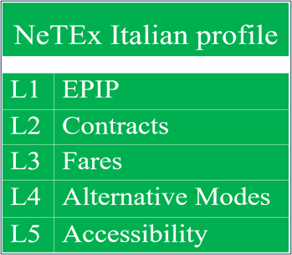
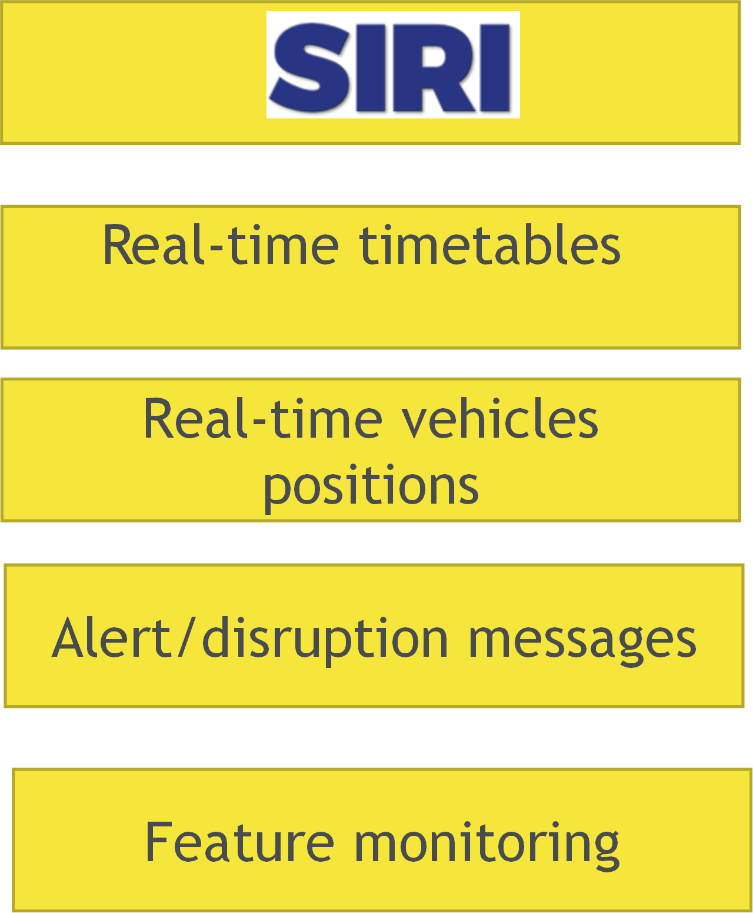
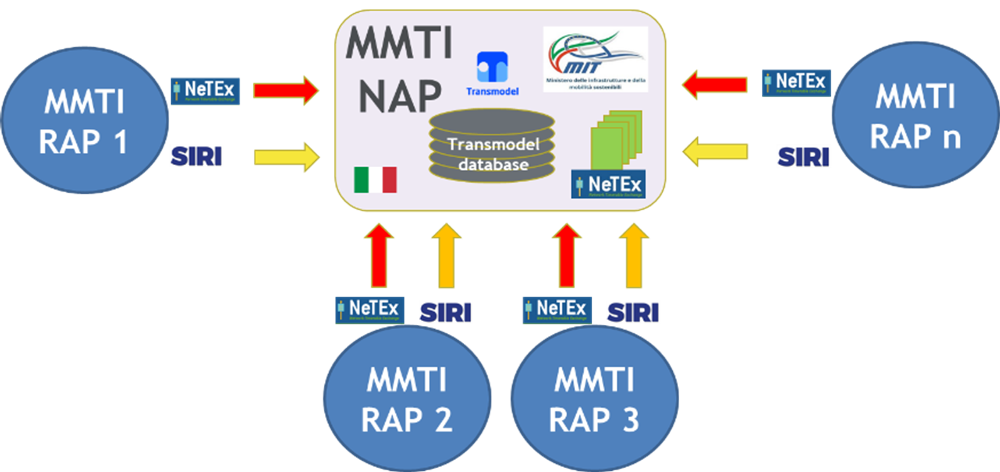
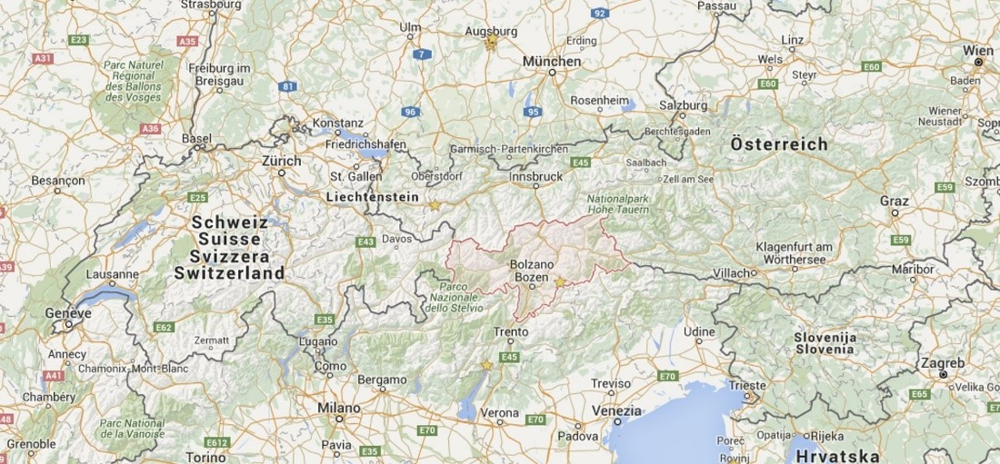
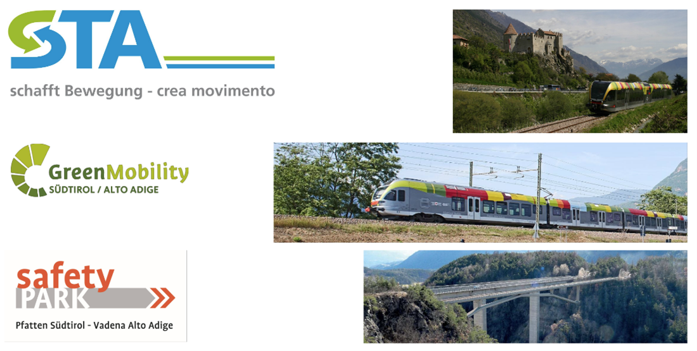
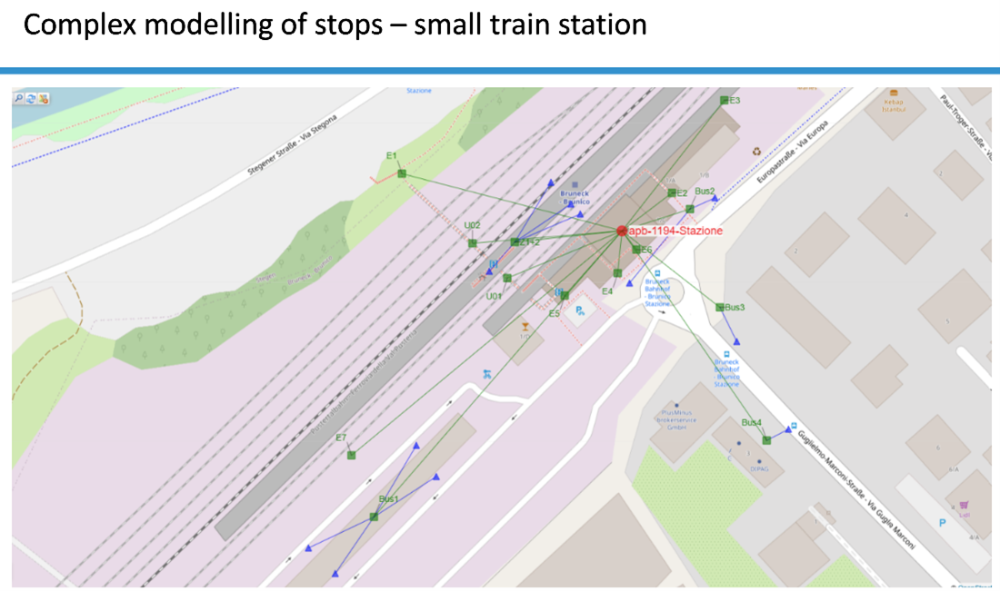
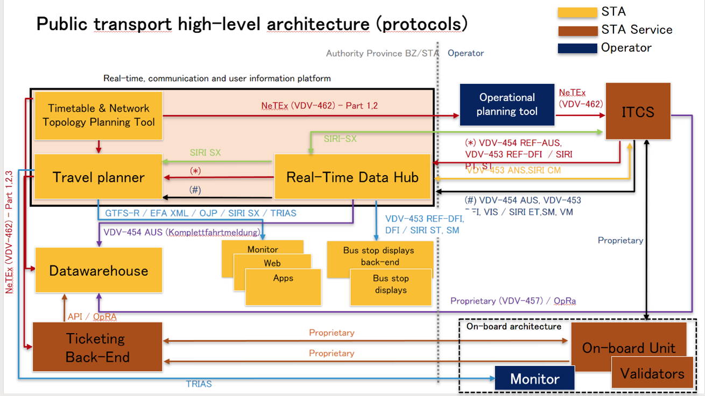
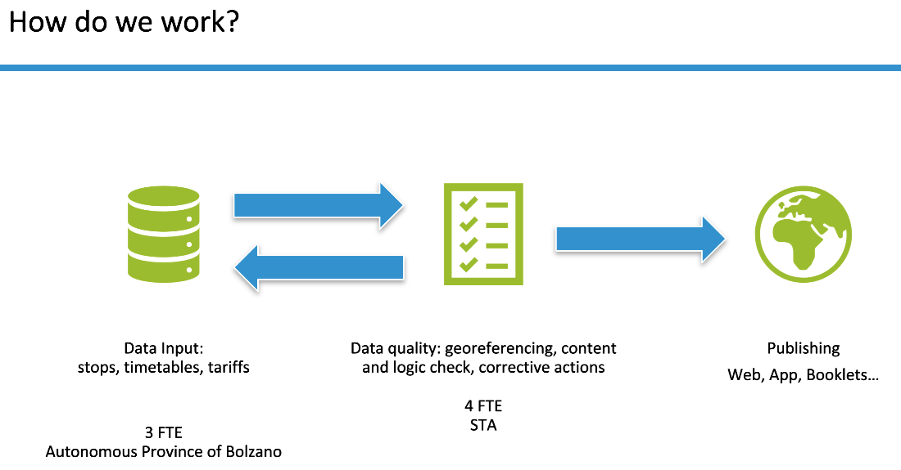

!!! warning "Raw, unwashed content"
    This page is in the review corpus — copied directly from the source site with only automatic conversion applied. It has not yet been edited for tone, structure, accuracy, or duplication. Do not treat as final.

# Overview in the National Level

### Italian NeTEx Profile

For the exchange of Public Transport (PT) data with Italian National Access Point (NAP), a NeTEx Profile has been defined among the affected stakeholders.

The profile is a subset of the standard; it has been defined selecting the needed concepts (entities and associated attributes) for specific use cases or set of use cases and complemented by rules defined to restrict possibilities of divergent interpretations of open parts of the standard.

The Italian NeTEx profile is structured in 5 levels, with the minimum objective of being able to have a protocol useful to transport of all the data categories required by the Del. Reg. 1926. It is currently used by stakeholders, few of them implemented the whole stack. 

#### Passenger Information Profile (Level 1)

For the level 1 of the Italian NeTEx Profile, European Passenger Information Profile (EPIP) has been adopted as defined in the CEN Technical Specification CEN/TS 16614-4:2021.

Typical Passenger *Information’s* Use Cases are:

  - provision of operativity calendars and timetables
  - provision of network topology and routes
  - provision of transport operators
  - provision of access nodes to stop places

Main data categories exchanged are:

  - Network topology:
      - Stop
      - Access nodes to the transport network
      - Node geometry

<!-- end list -->

  - Timetables
  - Validity calendars
  - Lines
  - Transport Operators

#### Contracts profile (Level 2)

For Contracts, Use Cases are:

  - provision of Contract / Journey Accounting (with operator roles)
  - provision of Stop Points Facilities (ticketing, accessibility, safety, etc.)
  - provision of Vehicles Equipment (lift/ramps, wheelchair, etc.)

The level 2 of the Italian NeTEx Profile is defined upon the first level of European Passenger Information Profile (EPIP).

Main data categories exchanged are:

  - Vehicle equipment (BUS, Trams, Trains):
      - Characteristics (chassis, serial number, carriages, etc.)
      - Capacity (no. of seats)
      - Installed devices
      - Services on board (WiFi, etc.)
  - Parking:
      - PK in structure
      - Park\&Ride
  - Service contracts

#### Fare (Level 3)

This level contains the structures to exchange data relevant tariffs and Fare products.

Main data categories exchanged are:

  - Points of sale (TPL):
      - Tickets for scheduled transport/on request
      - Parking tickets
      - Ticket offices
      - Digital sales platforms
  - Tariffs (TPL):
      - Fare zones/bands/stops (O/D matrices, etc.)
      - Standard fare structures (point-to-point, fixed, etc.)
  - Classes of passengers (adults, children, students, elderly, disabled, etc.)
  - Standard and special pricing products (offers, etc.)

#### Alternative Modes (Level 4)

This level deals with data relevant to sharing and micromobility.

Main data categories exchanged are:

  - Network topology:
      - Operational area of ​​the service
      - Sharing stations
      - TAXI stations
      - Electric charging stations
  - Parking: Secure parking spaces for bicycles
  - Booking (sharing): Digital platforms
  - Points of sale (sharing): Digital sales platforms
  - Tariffs (sharing): Pricing structure

#### Accessibility (Level 5)

With this level of NeTEx profile is possible to exchange data relevant accessibility of PT Service. For the level 5 of the Italian NeTEx Profile, European Passenger Information Accessibility Profile (EPIAP) has been adopted as defined in the CEN Technical Specification CEN/TS 16614-6:2024.

Main data categories exchanged are:

  - Accessibility of the transport network:
      - Access nodes
      - Internal routes in interchanges (e.g. elevators, escalators)
  - Existence of user assistance services

### Italian SIRI Profile

For the exchange of Public Transport (PT) dynamic data with Italian National Access Point (NAP), a SIRI Profile has been defined among the affected stakeholders. 

The Italian SIRI Profile has been defined, basically EPIP-RT has been adopted. It includes following have been selected:

  - **SIRI-ET**: Estimated Timetable service: this function is defined by siri\_estimatedTimetable\_service.xsd and transfers vehicle passing times at stops already reached. In SIRI “2.1” for each stopping points, boarding and alighting passengers number are recorded.
  - **SIRI-VM**: Vehicle Monitoring service: this function is defined by siri\_vehicleMonitoring\_service.xsd and transfers real-time vehicle positions and/or stop point arrival/passing times with forecasts on next stopping points.
  - **SIRI-SX**: Situation Exchange service: this function is defined by siri\_situationExchange\_service.xsd and transfers events affecting regular PT service.
  - **SIRI-FM**: Facility Monitoring service: exchange real-time status of facilities at a stop (lifts, escalators, etc.)

### NAP MMTIS

The Italian NeTEx profile is used to exchange with the NAP MMTIS (National Access Point Multi-Modal Travel Information Services) the transport information collected at regional level through collectors named RAP (Regional Access Points) and National Transport Operators. The following figure shows the architecture of this implementation:  National architecture design and implementation has been completed, it foresees the creation of an intermediate level between PTOs and NAP, called Regional Access Point (RAP), that will be one for each Italian region and will be managed by local PTAs or mobility agencies.

Implementation of this technical architecture implies also formalization through the signature of specific MOU, of relationships and responsibilities concerning data gathering and exchange of all stakeholders: PTOs, PTAs, Agencies and System Integrators

# Use cases

## Bolzano, STA (Südtiroler Transportstrukturen)

STA (Südtiroler Transportstrukturen), is the in-house company working on behalf of the Public Transport Authority in Bolzano.

STA is positioned in a unique location, is part of Italy but very close to Austria and the majority of the people speaks German. This means that the travel information STA offers (such as bus stop names) has to be multilingual. Therefore, there were needing a standard which allows them to exchange this kind of information considering the multilingual data. NeTEx provided this opportunity.

 

### System Architecture

STA opted to implement NeTEx and SIRI ‘natively’, meaning there is no conversion between the production of the data and NeTEx data files from another exchange data format. Considering the complex modelling that is needed to represent the physical environment of public transport, the complete standards NeTEx and SIRI were decided as more suitable. Based on the new architecture, NeTEx - SIRI, and other relevant standards, are implemented for the exchange of planned and real time data between back end systems (like operational planning tool ticketing system, travel planner and others. This architecture and the introduction of those standards is seen as the sustainable solution that can accommodate future developments on for example MaaS and integrated ticketing systems.  

### Implementation

In particular this architecture was chosen to support also "LinkingAlps", one of the EU projects in which it is developed a decentralised network of travel information services. This network will be created by interlinking existing regional or national journey planner services from all neighbour countries, with focus on multimodal transport (public transport, railways, new modes) through a standardised exchange service. In this context, the exchange of complete and interoperable datasets is key.

### Outcome

To be completed.
