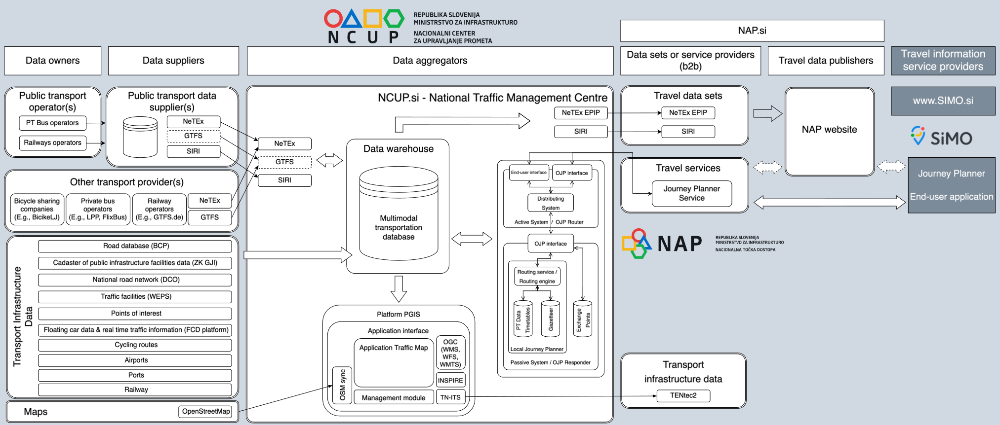

!!! warning "Raw, unwashed content"
    This page is in the review corpus — copied directly from the source site with only automatic conversion applied. It has not yet been edited for tone, structure, accuracy, or duplication. Do not treat as final.

## Overview in the National Level

Adoption and implementation of standards for digital mobility ecosystems in Slovenia is driven by the requirements of the EU Delegated Regulations for the provision of multi-modal travel information (DU 2017/1926 and DU 2024/490) and the established technical specifications to ensure the efficient exchange of data between data owners, data suppliers, data aggregators, mobility data publishers and travel information service providers. National Access Point (NAP, nap.si) serves as a technical platform aimed to obtain, analyse, process, manage and publish data for end users and product developers at the NAP.

The governance of the NAP is responsibility of the National Traffic Management Centre (NCUP, ncup.si), as part of the Ministry of Infrastructure.

As part of the national NCUP-2 project Transmodel based technical standards NeTEx and SIRI are implemented.

## Use cases

Under the coordination of the NCUP following national developments are related to this report:

1.  Establishment of IT services for the implementation of the NeTEx National Profile
2.  Implementation of dynamic multimodal data according to the SIRI standard specification
3.  Slovenian Multimodal Journey Planner: SiMO

### Description

All projects mentioned in this report have national (Slovenian) coverage. The NAP integrates all relevant data in terms of transport infrastructure (roads, rail, seaway) and service providers (public transport operators, mobility data service providers) with all modalities nationwide. Recent developments also emphasize standardized data collection for private modes like cycling and alternative modes like car-pooling where NeTEx, SIRI and DATEXII are being identified as best candidates.

### Architecture

The IT architecture of the above mentioned projects 1, 2 and 3 can be can be summarised in the following data pipeline (see the diagram on Figure 1) It shows the flow of multimodal mobility data from data owners that can use intermediary data suppliers providing input for NCUP as the main data aggregator. The aggregated data is then prepared for utilization at NAP. The NAP data can be further processed by different travel and mobility information services providers. 

### Use cases

In the section the three projects related to NeTEx, SIRI and OJP are described

#### National NeTEx profile

In July 2021 the Slovenian National Profile for NeTEx v 1.0 was specified based on the standardised NeTEx EPIP (SIST-TS CEN/TS 16614-4:2020, NeTEx - Part 4: Passenger Information European Profile). In August 2024 preparation of the Slovenian National Profile for NeTEx v 2.0 started. Requirements for the task are to upgrade the profile by checking its compliance with the EU Delegated Regulations for the provision of multi-modal travel information (DU 2017/1926 and DU 2024/490).

#### SIRI implementation

In 2023, the SIRI implementation from 2020 was upgraded. The SIRI web service is installed within the NCUP's digital mobility ecosystem. The web service module for preparation of the SIRI files was upgraded to add static timetable data (from NeTEx) to the dynamic vehicle location data that operate within the national integrated public transport system (IJPP). The SIRI web service retrieves the references of the following NeTEx timetable objects: LineRef, PublishedLineName, VehicleJourneyRef, VehicleJourneyName, JourneyPatternRef, JourneyPatternName, RouteRef, OperatorRef, JourneyParts.

The current situation after the implementation of the project in 2023 is shown in Figure 1, where it can be seen that the SIRI modules have been installed throughout the entire information pipeline, from the data owners and suppliers (for the time being the IJPP system), to the data aggregator NCUP, and the national access point NAP.si.

#### SIMO.si

The Slovenian Multimodal Journey Planner (SiMO - Slovenian mobility, simo.si, Figure 1) is a national solution for improved sustainable travel choices based on reliable and accurate data.

Managed by the NCUP, and supported by data from our NAP, SiMO offers comprehensive route planning that integrates various modes of transport – personal, scheduled, and demand-based – into a single, user-friendly platform. SiMO eliminates fragmented information by gathering all travel options in one service, enabling users to explore, compare, and better plan their journeys. Accurate schedules, real-time updates on routes, equipment and accessibility information improve the travel experience, with delays, disruption and exceptional circumstances being reported to users, as incidents, roadworks or severe weather warnings.

### Outcome

The Transmodel family of standardised technical specifications (NeTEx, SIRI, OJP) is well used in the Slovenian multimodal services reality. The initial implementations started in 2020 and are now being upgraded to latest requirements in the EU Delegated regulations. Until the end of 2024 the developments are expected to improve the multimodal mobility services experience in Slovenia.

Additionally, synergies with other ITS projects are created, such as implementation of the C-ITS (benefiting from SIRI), Traffic GIS (benefiting from NeTEx), etc.
