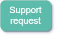

!!! warning "Raw, unwashed content"
    This page is in the review corpus — copied directly from the source site with only automatic conversion applied. It has not yet been edited for tone, structure, accuracy, or duplication. Do not treat as final.

One of the main objectives of the DATA4PT project is to support entities with the implementation of data models NeTEx, Transmodel, and SIRI. By doing this, DATA4PT aims to enhance the interoperability of information travel services in the public transport sector.

### Who can ask for support?

Everybody with an interest into public transport, data and travel information services is welcome to submit a request for support. DATA4PT provides support to entities responsible for National Access Points (NAP) when implementing multimodal travel information services (MMTIS) according to EU data standards. We also support public transport authorities, operators, data producers and data consumers, and the IT industry.

### How can I ask for support?

Simple: you can submit your technical request or requirement below. The DATA4PT technical Expert Team will process any incoming request and reply through appropriate channels, depending on the issue’s nature. If development is required, we will contact you to discuss a solution.

  -   
    
