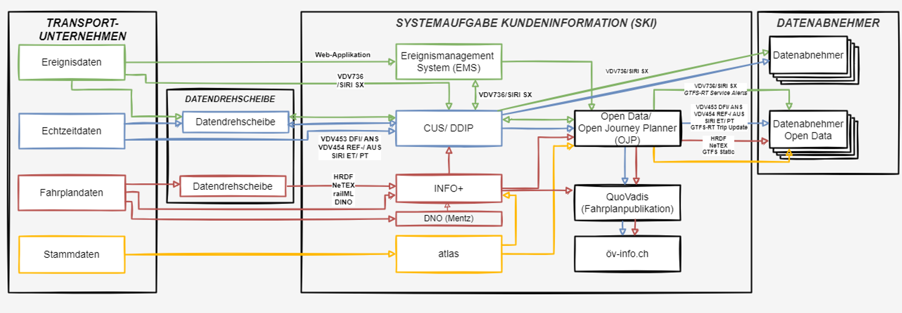

!!! warning "Raw, unwashed content"
    This page is in the review corpus — copied directly from the source site with only automatic conversion applied. It has not yet been edited for tone, structure, accuracy, or duplication. Do not treat as final.

## Overview in the National Level

In Switzerland, the [Federal Office of Transportation](https://www.bav.admin.ch/en/the-fot) (FOT) provides the Swiss National Access Point (NAP) called “[opentransportdata.swiss](https://opentransportdata.swiss/en/)”. Additionally, a national, open, non-discriminatory trip planner has been made available named after its interface standard “Open Journey Planner” (OJP-System). A demo is available [here](https://opentdatach.github.io/ojp-demo-app/search).

It is important to note that the published data covers primarily conventional public transport. The goal is to extend to other forms of transport, too. All road related data is handled by the [Federal Roads Office in Switzerland](https://www.astra.admin.ch/astra/en/home.html) (FEDRO), while all geographical and topological information is gathered by the Federal Office of Topography ([swisstopo](https://www.swisstopo.admin.ch/en)). On this page we focus on the FOT related data.

Via [opentransportdata.swiss](https://opentransportdata.swiss/en/) and OJP, Switzerland provides the following data standards for Switzerland:

<table>
<tbody>
<tr class="odd">
<td>
Timetables
</td>
<td>
<a href="https://www.oev-info.ch/sites/default/files/2024-05/NeTEx_Core-Realisation_Guide_TP_Suisse-v1.00.pdf">NeTEx – Swiss Profile</a>

<a href="https://www.oev-info.ch/sites/default/files/2024-04/gtfs_profil_switzerland_version_0_16_en.pdf">GTFS – Swiss Profile</a>

<a href="https://www.oev-info.ch/sites/default/files/2023-07/hrdf_2_0_5_e.pdf">HRDF – Swiss Profile</a>
</td>
</tr>
<tr class="even">
<td>
On demand
</td>
<td>
<a href="https://www.oev-info.ch/sites/default/files/2024-07/Fachkonzept%20On-Demand_v2.1_en.pdf">NeTEx</a>

<a href="https://www.oev-info.ch/sites/default/files/2024-04/gtfs_profil_switzerland_version_0_16_en.pdf">GTFS Flex</a>
</td>
</tr>
<tr class="odd">
<td>
Realtime data
</td>
<td>
<a href="https://www.oev-info.ch/sites/default/files/2023-04/siri_realisation-guide_pt_ch_v0.9.0.pdf">SIRI-ET/PT – Swiss Profile</a>

<a href="https://www.oev-info.ch/sites/default/files/2024-04/gtfs_profil_switzerland_version_0_16_en.pdf">GTFS Realtime – Swiss Profile</a>
</td>
</tr>
<tr class="even">
<td>
Events
</td>
<td>
<a href="https://www.oev-info.ch/sites/default/files/2024-07/realization_guide_siri-sx_oev_schweiz_v1.0.pdf">SIRI-SX – Swiss Profile</a>

<a href="https://www.oev-info.ch/sites/default/files/2024-04/gtfs_profil_switzerland_version_0_16_en.pdf">GTFS Service Alerts</a>
</td>
</tr>
<tr class="odd">
<td>
Routing
</td>
<td>
OJP 1.0 – Swiss Profile (<a href="https://www.oev-info.ch/sites/default/files/2023-05/open_journey_planner_ojp_de_v1_eng.pdf">Documentation</a>, <a href="https://opentransportdata.swiss/en/cookbook/open-journey-planner-ojp/">API</a>)

OJP 2.0 – Swiss Profile (Documentation: Work In Progress, <a href="https://opentransportdata.swiss/en/cookbook/open-journey-planner-ojp/">API</a>)
</td>
</tr>
<tr class="even">
<td>
Fares
</td>
<td>
OJP-Fare – <a href="https://opentransportdata.swiss/en/cookbook/open-journey-planner-ojp/ojp-fare/">Swiss Profile</a>
</td>
</tr>
</tbody>
</table>

## Use cases

### Description

  - NeTEx is not yet broadly used by Swiss (public) transport operators. The provided export is primarily used by the neighboring countries and their larger transport operators (e.g., SNCF in France). The reason being its complexity (you need experts to understand and apply it) and multiplicity (substitution classes and similar constructs make simple adaptations difficult). Data exchange for timetables is mostly done by HRDF.
  - SIRI-SX is being actively used to represent disruptions, while SIRI-ET and -PT have only recently been introduced and are not widely adapted (currently, mainly VDV 454 and 453 are used).
  - The GTFS standards are used most by small and medium-sized mobility providers.
  - Alongside the use of the routing service, the OJP standard is being increasingly adapted by transport operators, especially with the introduction of OJP 2.0.

### Architecture

The following figure provides an overview of the public transport data being centrally provided and processed for the various previously introduced data categories.

Short translation:

  - Ereignisdaten = event data
  - Echtzeitdaten = realtime data
  - Fahrplandaten = timetable data
  - Stammdaten = master data
  - Datendrehscheibe = data exchange hub

### Use cases

The provided data is used for all public transport customer information systems in Switzerland.

Furthermore, a set of showcases created with the opentransportdata.swiss data can be found [here](https://data.opentransportdata.swiss/showcase):

### Outcome

The easier the standards are to use and to adapt, the more they are accepted and used by transport operators and mobility service providers.
