# Key concepts

!!! warning "Under expert review"
    This page was carried over from the legacy Transmodel-CEN site and hasn't been quality-checked by the standardization experts yet. Some interpretations here — particularly around **Separation of Concerns** — are the subject of ongoing discussion in the community. Treat the material as informative but not authoritative until the extended group has reviewed it.

Transmodel is a conceptual data model describing in terms of data structures (entities and relationships between them) the domain of Public Transport. 

It may be used for several [purposes](../../introduction/index.md), in particular to specify a data base or data exchange formats that enable the sharing and provision of accurate and interoperable public transport information across organisation- and system-boundaries. 

When writing laws and regulations, procuring technical systems or integrating technical systems, it is a huge advantage to have access to a precise language. 

Transmodel is a semantic model. This means that not only concepts/data elements are provided (i.e. their naming and definition), but also the relationships between concepts (i.e. data structures). This means that not only language elements are fixed but also that it constitutes an unambiguous input to design implementations, e.g. data exchange formats. 

In the same fashion that we have been able to agree on symbols on road signs that are the same or similar across many countries. We have in Transmodel a foundation for a common language for public transport. 

## Transmodel – making travel easy

The traveller needs consistent, complete and correct real time information about his or her trip. This applies before, during and after they travel.

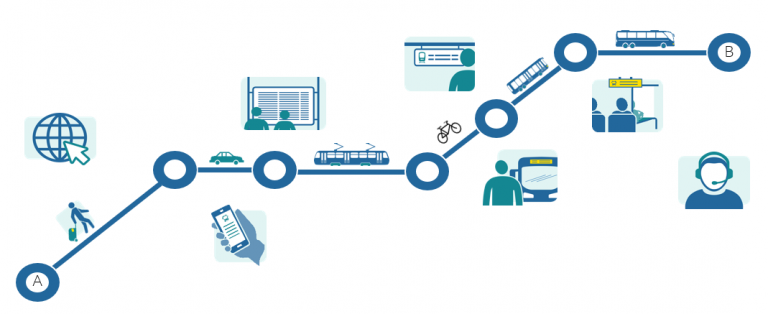

There are many organisations, companies and IT systems involved in the provision of public transport and related areas that must interact to make both the services themselves and information about them possible. In addition to the explicit passenger information, other information must be handled to monitor, manage and optimise the operation of public transport.

\
But how can we ensure a robust and efficient exchange of information between the involved systems? A first requirement is that the involved parties understand each other.

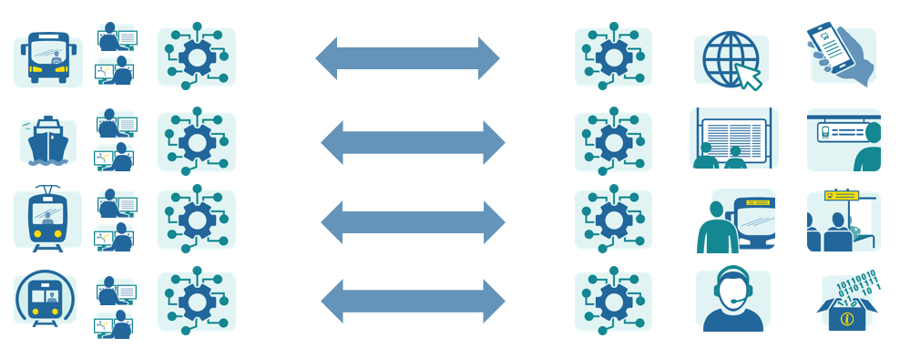

*Figure 2: Many systems must interact and share information*

Historically different companies and organisations developed their own terminology which resulted in confusion and misunderstanding when trying to interact with other actors.

One example to illustrate this, is the need to clearly separate the description of the movement of a person, from the movement of a vehicle in public transport. Transmodel has a definite standpoint on this as is described by the series of pictures below.

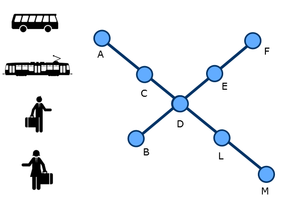

*Figure 3: People and vehicles moving through a city*

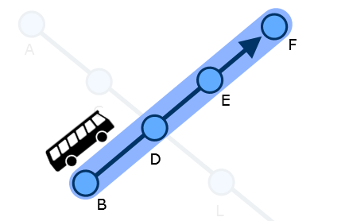

*Figure 4: A service journey with a bus going from B to F*

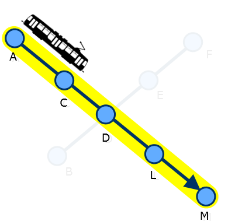

*Figure 5: A service journey with a tram going from A to M*

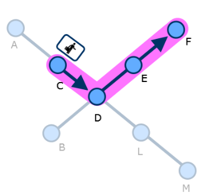

*Figure 6: A PT trip with a person going from C to F. The person rides the tram between C and D and the bus between D and F*

According to Transmodel, a service journey is related to the movement of the vehicle, while a PT trip is related the movement of the person. A typical misunderstanding occurs if persons talking to each other do not have a common understanding of what a certain word means.

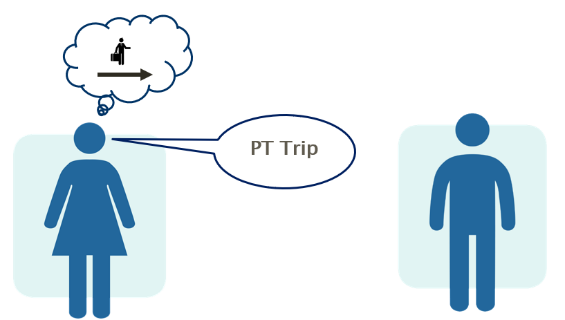

*Figure 7: Trying to convey the concept of a person’s movement*

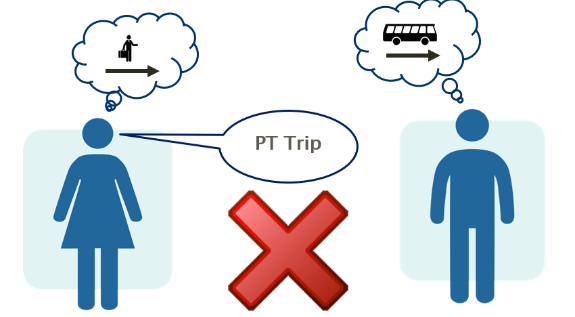

*Figure 8: Failing to convey the message if there are different interpretations of what the word trip means.*

On the other hand, if involved persons rely on Transmodel terminology, such misunderstandings can be avoided.

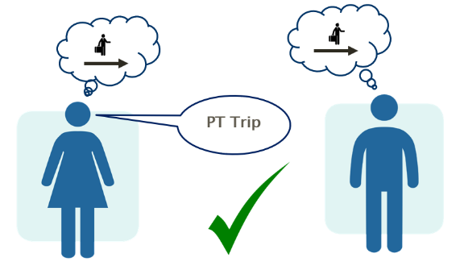    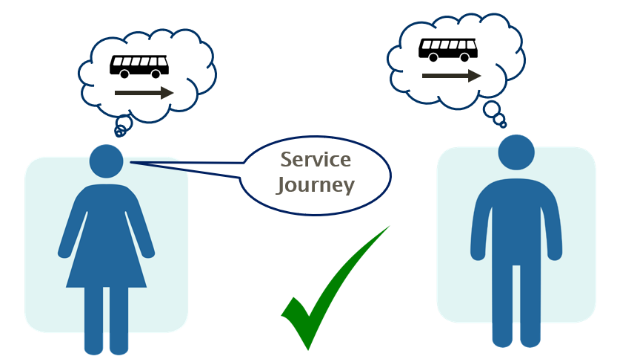

*Figure 9: Common understanding when using Transmodel terminology*

In addition to providing a long list of defined terms, Transmodel also describes a conceptual model of how these terms relate to each other.

## Transmodel – a nomenclature for public transport

Transmodel provides matching definitions, structures and semantics for PT data allowing the design of coherent, precise and efficient data exchange across domains.

## Transmodel - Bridging the gap between the conventional public transport and alternative modes

From version 6.1 on, Transmodel, additional concepts have been added to simplify the bridging between **conventional public transport** (e.g. which relies on a schedule, a predefined network) and [**alternative modes**](https://transmodel-cen.eu/). It is possible to describe trips and travel that also includes all kinds of modes, for example trips composed of trip legs by bus followed by trip legs by a shared car or by car pooling. It is also possible to describe the guidance of travellers about how to find the means of transport (e.g. stop places or car pooling locations) when starting a trip or interchanging.

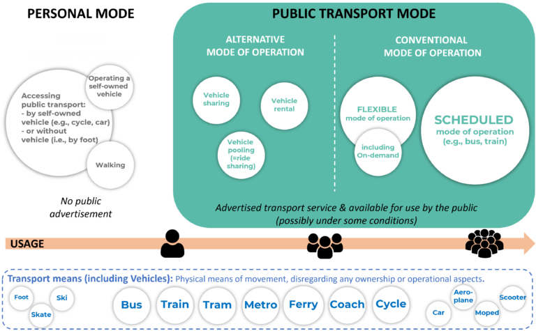

## **Transmodel – Building systems of systems and the principal of separation of concerns**

To succeed with combined mobility or MaaS it is crucial that the different technical systems involved can be seamlessly combined while retaining the respective systems' level of detail in their respective areas.

Transmodel is designed to allow for a separation of concerns so that different systems can work independently with different parts of the operation while at the same time allowing their information to be combined and presented unambiguously. Less advanced systems can coexist with more advanced systems.

For example, one system might describe the accessibility for different parts of a station, while other systems might describe different journeys that stop at the station.

## Transmodel – Some basic concepts

**Public Transport involves different transport modes using means **such as bus, train, tram, metro, car, cycle, scooter, foot, skis, etc. Typically, buses are restricted to follow roads while trains, trams and metro follow tracks.

Travellers will board or alight from these different types of vehicles at stop places of different kinds. A stop place can be described according to its accessibility, what services are available, etc.

In public transport, you will normally board and alight at a bus stop, at the edge of a platform, through a gate or at a pier, but for a timetable the physical nature of the stop doesn’t actually matter; it is just the place the service stops to collect passengers. These alighting and boarding points are generally represented as scheduled stop points in the planning software. (A scheduled stop point will of course be associated with a physical stop place or even a specific quay (platform) or boarding point within it).

*Figure 11: Scheduled stop point*

In the planning software it is possible to define a pattern of working for a public transport vehicle by listing a sequence of **scheduled stop points**. This is called a **journey pattern**.

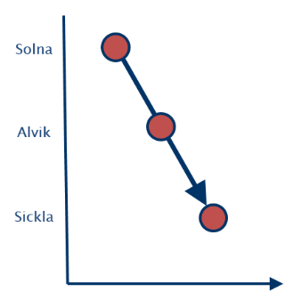

*Figure 12: Journey pattern*

There is a separate **journey pattern** for each direction. For example, one **journey pattern** when going from Solna to Sickla and another going from Sickla to Solna. A **vehicle **may operate by simply going back and forth between the two termini and thus alternate between these two **journey patterns**. A **journey pattern** may thus be used many times each day. There could also be other **journey patterns** representing different variations of the basic patterns.

A **vehicle journey** describes one movement of a public transport **vehicle **from the start point to the end point of a **journey pattern** on an **operating day**. A **vehicle** **journey **starts at a certain time. A certain **vehicle journey **can be worked only once per day.

A **vehicle journey** that is meant to carry passengers is called a **service journey**.

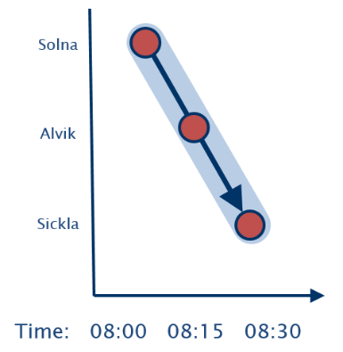

*Figure 13: Vehicle Journey of type Service Journey*

A dead run is on the other hand a vehicle journey where passengers are not allowed on-board. One example is the movement from the depot to the first stop of the first service journey in the morning.

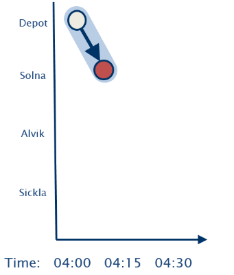

*Figure 14: Vehicle Journey of type Dead Run*

The working of a vehicle from when it leaves the depot to when it returns can be described by a block.

A block typically starts with a dead run from the depot followed by a number of service journeys and finally a dead run back to the depot. A block describes the work for a vehicle on a day or part of a day.

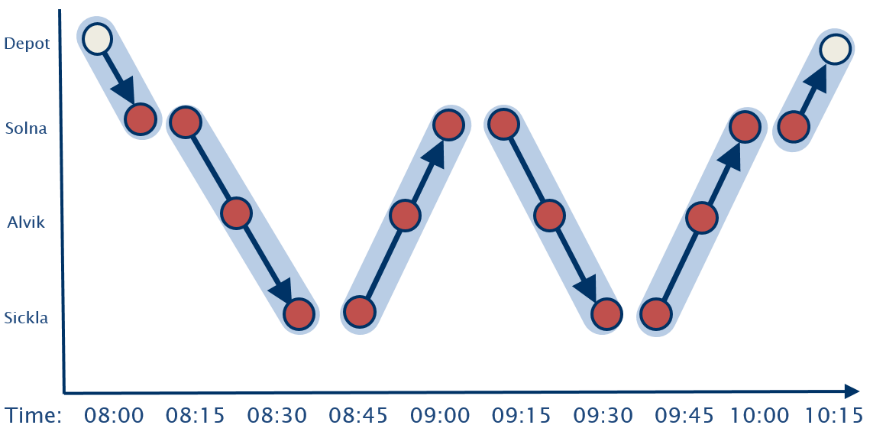

*Figure 15: Block*

Similarly, a duty describes the work for a driver on a day.

The above descriptions are simplified to convey the basic message, the documentation of the standard provides more details. To exemplify this, a somewhat deeper description of duty follows below.

A duty consists of periods when the driver is working without a break, such a period is called a stretch.

During a **stretch** the driver could be driving different **vehicles** or doing some other type of activity. Each such activity is called a **spell**.** **The driver can also have shorter pauses in between journeys or be resting during a break.

Sometimes a duty is split into two separate duty parts with a several hours long period in between. The driver is not under the operator’s responsibility during that period.

*Figure 16: Duty*

Typically, the driver works different **duties** on different dates. The process of deciding what a driver shall do on different dates is called rostering.

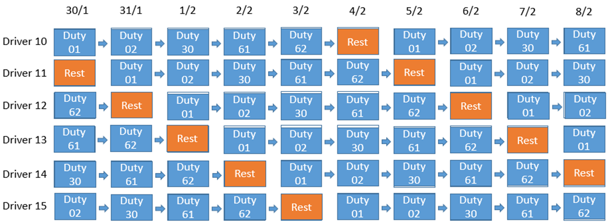

*Figure 17: Example of rostering*

## Transmodel – Production perspective vs passenger perspective

There are many aspects to public transport. From one point of view, the production perspective, it is very important to emphasize optimal usage of vehicles and drivers. From another point of view, the travellers’ perspective, it is the travel opportunities that are in focus.

When building systems catering for different users it is an advantage that Transmodel is organized in such a way that is easy to separate these aspects.

Some examples of production centric aspects are managing blocks, duties, vehicles and drivers. Examples of traveller-centric aspects are trips, rides and interchanges.

Additionally, there are of course a large number of aspects that are shared.

## Transmodel – Layered solutions and separating maintenance

Transmodel promotes the notion of the separation of concerns as mentioned previously. Different systems and organisations can be allocated responsibility for different types and scopes of information and maintain their respective information independently. The resulting information coming from different sources can then be combined into a unified view. As the information is structured according to Transmodel, it is readily integrated and can be used for many different purposes by different systems.

Systems relating to certain external information use references pointing to information maintained in the relevant system instead of repeating the same information. Different types of information can be maintained with different update cycles.

One example of how this concept can be applied is the route.

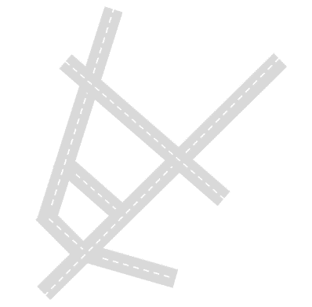

*Figure 18: Infrastructure – road network*

A route describes a path to be used by regular public transport services.

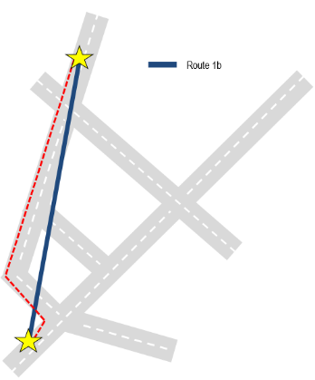

*Figure 19: Route represented by blue line, and deduced physical path on road network represented as dotted red line*

In relation to a road network a route is defined by a start point and an end point and possible one or more intermediate route points. From this the physical path through the road network can be deduced by a technique called projection. It may be necessary to add a few intermediate *via* route points to clarify the intended physical path.

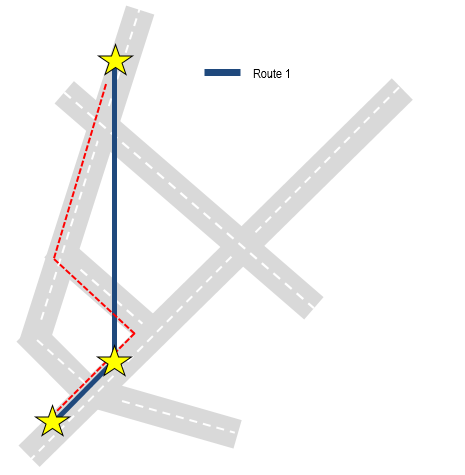

*Figure 20: Adding an intermediate Route Point alters deduced physical path*

The next step is to define the points where it is possible to board and alight at a bus stop, a platform a gate or a pier. This point is generally represented as a scheduled stop point in the planning software.

There may be some other software that describes the physical aspects of this point. This can include information of exact location, available equipment and accessibility aspects.

In the planning software it is possible to define a pattern of working for a vehicle moving from one end point to the other end point by listing a sequence of scheduled stop points. This is called a journey pattern.

## Transmodel – Separating out temporal concerns

When does a service run? At what times is a particular fare available? Another good example of the separation of concerns in Transmodel is the handling of the days of operation and the availability of time dependent services.

A day type describes a logical type of day independent of any specific calendar date. For example, *working day*, *weekend*, *national holiday* etc. It can be precisely characterised in terms of specific days of the week or other criteria such as *school day* or *market day*. The day type can be used to specify when a service journey, fare product or other time dependent concept is available in a manner that is easy to understand and also independent of any actual calendar. Timetables and fare products thus become reusable concepts that can be applied within any given time period simply by resolving the day types against a calendar that describes to which dates different day typ**es** apply. Thus, for example, if January 5, 2019 is marked as a *working day* in that calendar, services with a day type of *working day* apply.

When it comes to implementing systems, the separating of concerns has two particular advantages. Firstly, it increases reusability, as components are highly modular and may be used to provide the same function in different contexts uniformly and without additional overhead (as say, day types above can be used both for timetables and fares). Secondly it makes it easier to evolve systems because specific function is concentrated in specific components and modules and can be changed without unwanted side effects.

## Transmodel – Fares: Using new abstractions to achieve general solutions

Quite often, a proper separation of concerns requires the invention of novel abstractions that serve to simplify or to generalise the solution. The introduction of new software abstractions can be extremely powerful and make hitherto difficult problems tractable. A classic example from the history of personal computers was how the usability of computers was revolutionised by the invention of the virtual concepts that make up a graphic user interface – windows, icons, menus, cursor focus, mouse pointer events, etc. New components can enable new, more understandable solutions.

Within Transmodel, the Tariff and Fare models provide a case in point where such an approach has been critical for achieving a general solution. Transmodel formulates a general-purpose Fare Management model that is capable of describing a very wide variety of tariff structures and fare conditions and fare products for any mode of transport, including complex price structures and complex usage conditions.

The tariff components make use of the same existing network concepts that are used in timetables, such as scheduled stop points, service journeys, etc... while also adding additional concepts. For example, for a point-to-point fare, the allowed transition between an origin and destination point is defined as a destination matrix element. If the tariff depends on distance or stages consumed, a set of unit intervals may be defined as geographical unit intervals. Fare products can be associated with a type of travel document (i.e. ticket media such as paper or smartcard) in a sales offer package that can be purchased by the user.

A further separation of concern is that Transmodel completely segregates the notion of price from that which is being priced.

## Transmodel – Version management

When exchanging data sets repeatedly between systems, it is important to be able to determine the validity and relevance of successive versions of the data as they evolve over time.

Transmodel provides concepts for advanced versioning mechanisms that allow data to be changed over time while retaining identifiers that are stable over time for the involved objects.

Objects can also be grouped into coherent bundles – version frames – which simplifies the process of applying multiple changes as one transaction.

For example, a version frame may relate to all service journeys on a specific line or all scheduled stop points in a specific municipality.
