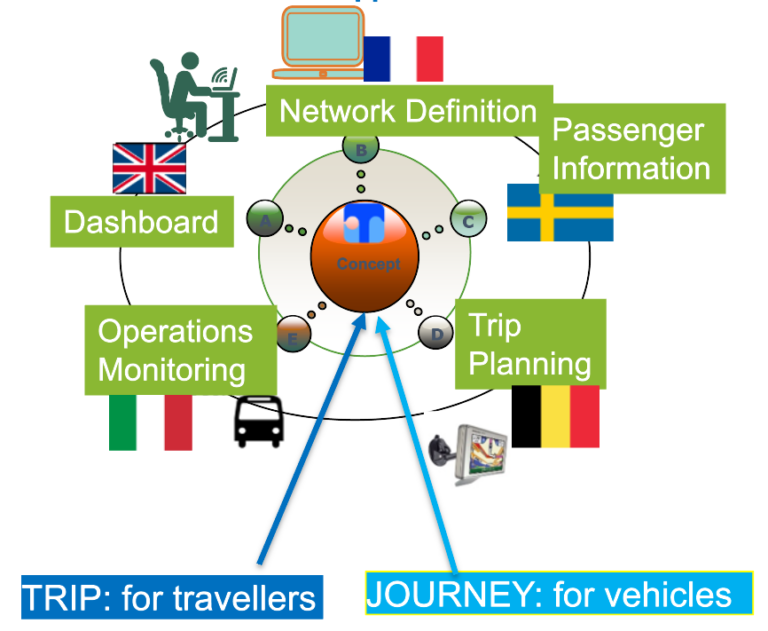
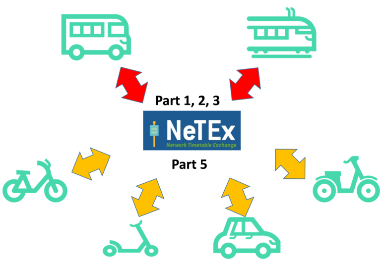
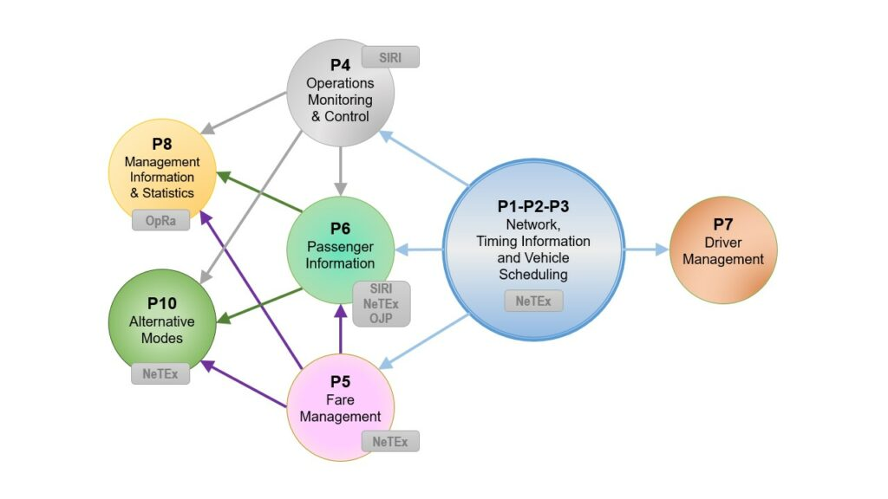

# Transmodel (SG4)

Transmodel is the European reference data model for public transport. It gives everyone in the ecosystem — authorities, operators, journey planners, information systems — a common way to describe the same things, so that data can flow between them without custom translation each time.

If you build software that exchanges timetables, fares, stops or real-time updates, Transmodel is the vocabulary the other party is using. If you set policy or plan services, Transmodel is what makes it possible for those services to appear on any travel app across Europe.

For a walkthrough of Transmodel's core concepts with illustrations — vehicle vs. passenger, journey patterns, day types, separation of concerns — see [Key concepts](concepts.md).

!!! note "Transmodel is conceptual, not an exchange format"
    Transmodel doesn't have direct implementations. It's a *conceptual* data model — it defines concepts and relationships, not files or APIs. The systems and services you can actually connect to are built on the standards derived from Transmodel: **NeTEx**, **SIRI**, **OJP**, **OpRa**. See [How it relates to NeTEx, SIRI, OJP and OpRa](#how-it-relates-to-netex-siri-ojp-and-opra) below, and [Who builds on Transmodel](#who-builds-on-transmodel) further down.

## What Transmodel is

Transmodel is the short name for the European Standard **EN 12896 — Public Transport Reference Data Model**. As a conceptual data model, it specifies:

- **Entities** — the things public transport is made of (Line, Route, Journey, StopPlace, Operator, DayType, and many more).
- **Definitions** — what each entity means, precisely and unambiguously.
- **Attributes** — the properties each entity carries.
- **Relationships** — how the entities connect to each other.

Because every Transmodel-based system agrees on the same entities with the same meaning, a *ServiceJourney* on one system means the same thing as a *ServiceJourney* on another. This is what "semantic interoperability" means in practice, and it's the whole point.

## What it covers

Transmodel is designed for the whole public transport domain — not just buses, not just rail, not just one country.

"Public transport" here means services advertised and available for use by the general public, using any means of transport. Transmodel describes coverage in terms of **modes of operation** rather than by vehicle type, and version 6.2 of the standard defines three:

- **Conventional mode of operation** — scheduled and/or flexible services offered publicly. This includes normal fixed timetables and scheduled services with some flexibility (for example demand-responsive services layered on a fixed network).
- **Alternative mode of operation** — publicly advertised operations that don't follow a fixed schedule at all, such as vehicle sharing, rental and pooling.
- **Personal mode of operation** — private transport, out of scope.

!!! note "Version 6.2 scope"
    EN 12896 v6.2 is dedicated to conventional and alternative modes of operation. Personal modes are noted for completeness but are not modelled.

## A European norm

Transmodel has been recognised as a European standard since 2009. It is published in ten parts under the reference number **EN 12896 Part 1** through **Part 10**. Being a norm means it isn't a proposal or a suggestion — it's the agreed reference that member states, standardisation bodies, and system suppliers align to.

See [Legal Context](../../introduction/legal-context.md) for how Transmodel connects to EU regulations.

## Sub-domains covered

Transmodel splits the public transport world into functional data domains, each addressed by one part of the standard:

| Part | Domain |
| --- | --- |
| Part 1 | Common Concepts (shared across all other parts) |
| Part 2 | Public transport network — routes, lines, journey patterns, stops, parking |
| Part 3 | Timing information and vehicle scheduling |
| Part 4 | Operations monitoring and control |
| Part 5 | Fare management |
| Part 6 | Passenger information (planned and real-time) |
| Part 7 | Driver management — scheduling, rostering, personnel disposition |
| Part 8 | Management information and statistics |
| Part 9 | Didactic and informative documentation |
| Part 10 | Alternative modes — vehicle sharing, pooling, rental, taxi |

## How it relates to NeTEx, SIRI, OJP and OpRa

Transmodel itself is a *conceptual* model — it defines *what* the concepts are and *how they relate*. It does not, on its own, prescribe how to exchange the data between systems. That job belongs to the four **implementation standards** derived from it:

- **[NeTEx](../netex/index.md)** — the XML format for exchanging *scheduled* data (network, stops, timetables, calendars, fares, vehicle scheduling).
- **SIRI** — the XML format for exchanging *real-time* data (vehicle positions, delays, service alerts, facility availability).
- **OJP** — the API for *distributed journey planning*.
- **OpRa** — the format for *historical / observed* operational data.

All four are Transmodel-based: they use its entities, its definitions, and its relationships. If you work with any of them, you are working with Transmodel underneath.

## Who builds on Transmodel

Transmodel isn't something you install or connect to directly — but it's the foundation under a very large number of European public transport systems, indirectly used every time someone works with one of the standards derived from it.

**Directly:** the four exchange standards themselves — NeTEx, SIRI, OJP, OpRa — are the primary Transmodel adopters. Every implementation of any of them uses Transmodel entities.

**Indirectly:** all the countries, authorities, operators, and vendors using those exchange standards. This includes the National Access Points across the EU member states operating under the MMTIS regulation, plus many operators and vendors outside that regulatory framework.

**Concrete adoption inventory:** as pages are washed and the site fills out, this section will point to a list of known adopters — countries, national access points, major operators, and system vendors — along with which parts of Transmodel their implementation covers. For now, see each of the four exchange standards' Implementations pages for country-level detail.

## Further reading

Ecosystem-level context (shared across the standards):

- **[Introduction](../../introduction/index.md)** — the ecosystem's story and why it exists.
- **[Governance](../../introduction/governance.md)** — who maintains Transmodel and how decisions are made.
- **[Legal context](../../introduction/legal-context.md)** — how Transmodel connects to EU regulations and directives.
